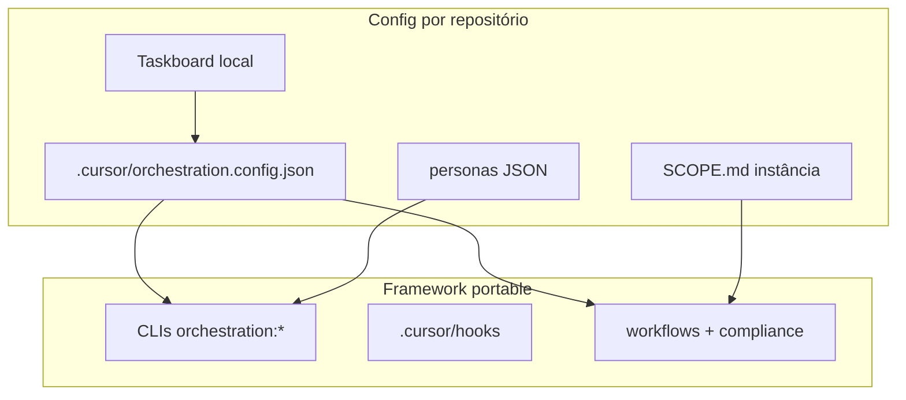

# Design agnóstico — framework de orquestração Cursor

O sistema de orquestração é **reutilizável em qualquer repositório**. O código do framework é portable; cada projeto fornece um overlay de configuração.

## Camadas

| Camada | Local | Responsabilidade |
| --- | --- | --- |
| **Framework** | `.cursor/orchestration/`, hooks, CLIs | Pipeline G0–G7, dialogue, hire, compliance, workflows |
| **Config do projeto** | `.cursor/orchestration.config.json` ou env | Prefixo de issues, roots de código, OKF, roster |
| **Personas** | JSON referenciado por `personasFile` | Template mínimo + overlay do projeto |
| **SCOPE** | `.cursor/orchestration/SCOPE.md` (por instância) | Fronteira equipe Cursor vs domínio do produto |

## Princípios

1. **Framework portable** — copiar `.cursor/orchestration/` para outro repo sem editar hardcodes.
2. **Config por repo** — `orchestration.config.json` define `issuePrefix`, `codeRoots`, `knowledgeRoot`, etc.
3. **Prefixo configurável** — default framework `ISSUE`; cada projeto define seu prefixo (ex.: anxionOS → `ANX`). Use `{{ISSUE_PREFIX}}` na documentação genérica.
4. **OKF opcional** — `knowledgeRoot` default `brain/`; projetos sem OKF apontam para `docs/` ou vazio.
5. **SCOPE por projeto** — o framework é agnóstico; cada instância documenta o que é equipe Cursor vs produto.

## Schema — `orchestration.config.json`

```json
{
  "projectName": "string",
  "issuePrefix": "ISSUE",
  "taskboardProject": "my-project",
  "knowledgeRoot": "docs/",
  "codeRoots": ["src/"],
  "scopeDoc": "SCOPE.md",
  "defaultCTO": "orchestrator",
  "personasFile": ".cursor/orchestration-runtime/personas.local.json"
}
```

### Overrides por ambiente

| Variável | Efeito |
| --- | --- |
| `ORCHESTRATION_ISSUE_PREFIX` | Substitui `issuePrefix` |
| `TASKBOARD_PROJECT_NAME` | Substitui `taskboardProject` |

## Loader

`agent-config/load-config.mjs` exporta:

- `loadOrchestrationConfig()`
- `getIssuePrefix()`, `getCodeRoots()`, `getKnowledgeRoot()`
- `buildIssueIdRegex()` — dialogue (permite `-VALIDATION`, `-TEST`)
- `buildStrictIssueIdRegex()` — taskboard/hire (apenas número)
- `isValidIssueId()`, `formatIssueIdHint()`

## Arquivos já refatorados (padrão para o restante)

| Arquivo | Uso do config |
| --- | --- |
| `agent-dialogue/protocol.mjs` | Regex de `issueId` |
| `agent-hire/registry.mjs` | `assertIssueId` |
| `agent-autonomy/lib.mjs` | `ISSUE_ID_RE` |
| `agent-compliance/compliance-lib.mjs` | `SCOPE` path, mensagens |
| `agent-proactive/cto-evidence.mjs` | `codeRoots`, `knowledgeRoot` |
| `agent-dialogue/personas.mjs` | `personasFile` |

Demais CLIs podem importar `load-config.mjs` conforme necessário — não duplicar regex `ANX`.

## Diagrama



## Camada global

Além do design agnóstico por repo, o framework suporta **instalação global** — uma cópia em `~/.cursor/orchestration` serve todos os workspaces Cursor.

| Camada | Local | Responsabilidade |
| --- | --- | --- |
| **Global** | `~/.cursor/orchestration/` (`ORCHESTRATION_HOME`) | CLIs, compliance, dialogue, hire, templates, `bin/orchestration.mjs` |
| **Projeto** | `.cursor/orchestration.config.json` | Prefixo, codeRoots, knowledgeRoot, personasFile |
| **Runtime** | `.cursor/orchestration-runtime/dialogue/`, `workflows/`, etc. | Estado por projeto (nunca global) |

### Resolução de paths (`load-config.mjs`)

1. `frameworkRoot` = `ORCHESTRATION_HOME` → cópia local `.cursor/orchestration` (dev) → `~/.cursor/orchestration` (global instalado)
2. `projectRoot` = git root ou diretório com `.cursor/orchestration.config.json`
3. Merge: `templates/orchestration.config.defaults.json` + config do projeto

### Princípio Karpathy

**Uma cópia global, config fina por projeto** — sem duplicar o framework em cada repo.

Instalação e `init`: [GLOBAL-INSTALL.md](./GLOBAL-INSTALL.md).

## Tooling por instância

[TOOLING-INTEGRATION.md](./TOOLING-INTEGRATION.md) · [tooling-mandatory.mdc](../rules/tooling-mandatory.mdc). Incluir ao instalar framework global.

## Bootstrap

Ver [templates/README-BOOTSTRAP.md](./templates/README-BOOTSTRAP.md).

## Instância anxionOS

- Config: [`.cursor/orchestration.config.json`](../../.cursor/orchestration.config.json)
- Roster: [`examples/project-anxionos/roster.anxionos.json`](./examples/project-anxionos/roster.anxionos.json)
- Prefixo: `ANX` (inalterado para compatibilidade)
