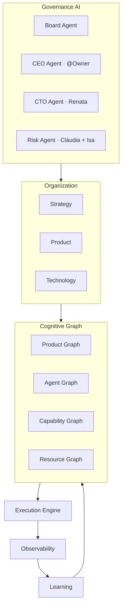
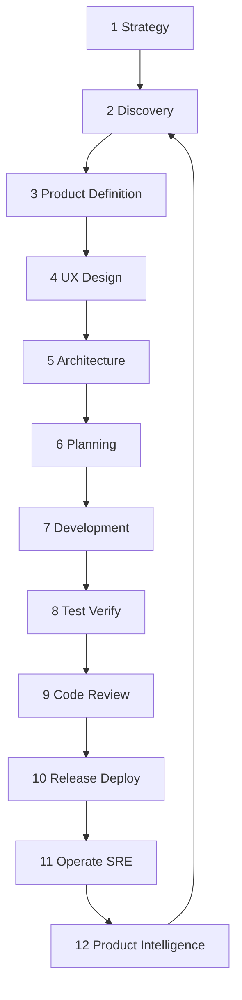
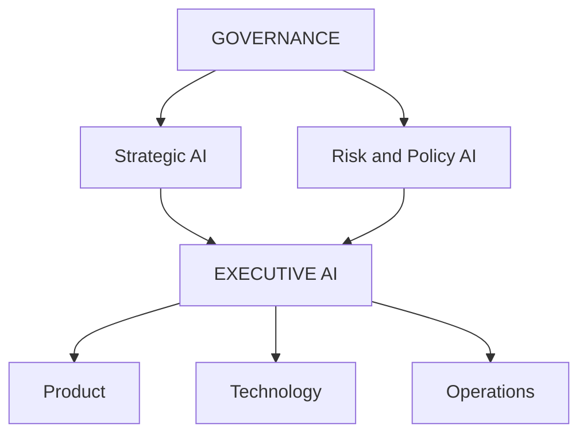
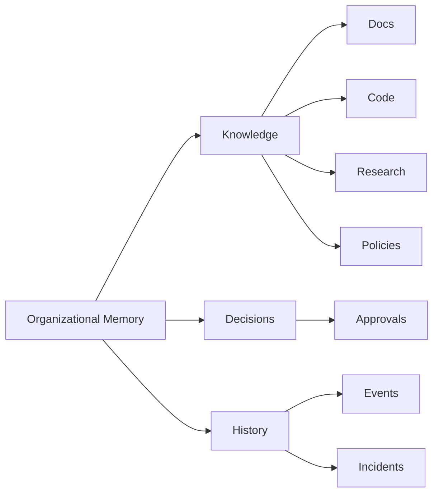
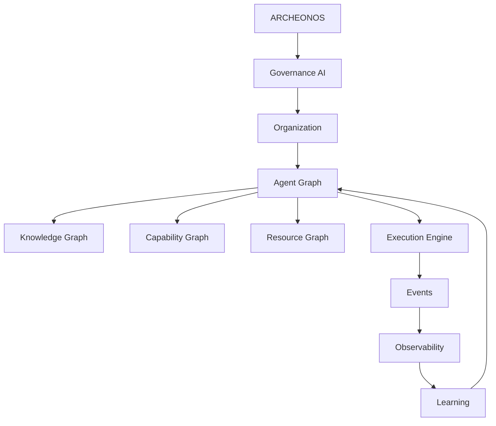
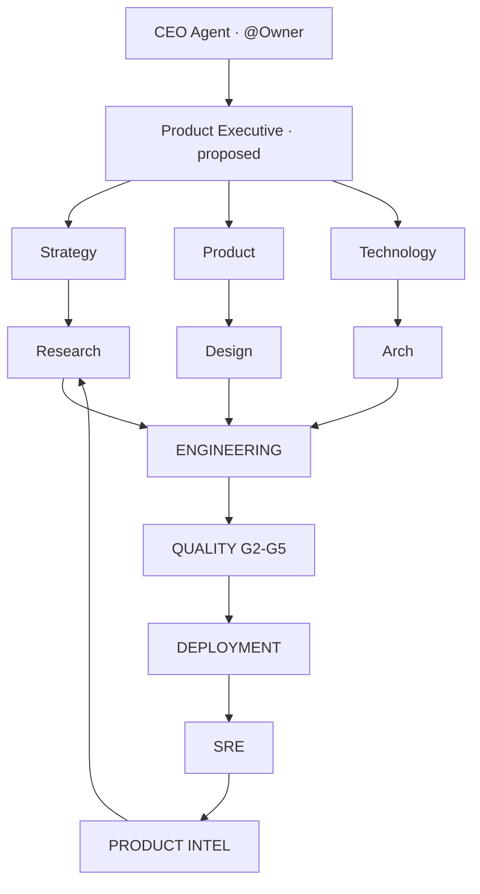

# AI Product Company Engine — ArcheonOS / anxionOS

> **Escopo:** modelo canônico da **empresa de software cognitiva** que o framework Cursor orquestra. Complementa [PRODUCT-COMPANY-MODEL.md](./PRODUCT-COMPANY-MODEL.md) (mapeamento operacional) e [PRODUCT-GRAPH-SCHEMA.md](./PRODUCT-GRAPH-SCHEMA.md) (schema de nós).
>
> **Não confundir** com runtime institucional do produto (`backend/modules/agents/`). Ver [SCOPE.md](./SCOPE.md).
>
> **Fase:** P0 — documentação e CLI de rastreamento; implementação de módulos = slices `ANX-*` no produto.

**Relacionados:** [AUTHORITY-LEVELS.md](./AUTHORITY-LEVELS.md) · [DECISION-ENGINE-FRAMEWORK.md](./DECISION-ENGINE-FRAMEWORK.md) · [AGENT-GRAPH-SCHEMA.md](./AGENT-GRAPH-SCHEMA.md) · [HIERARCHY.md](./HIERARCHY.md) · [PIPELINE.md](./PIPELINE.md) · [OPENKNOWLEDGE-BRAIN.md](./OPENKNOWLEDGE-BRAIN.md)

**CLI:** `npm run orchestration:phase -- company status --issue ANX-N` · `npm run orchestration:phase -- company table` (alias: `pc`)

**Issue framework:** ANX-250 · **Hooks CLI:** ANX-269

**Brain (local OKF):** `brain/notes/anxionos-ai-product-company-index.md` · status @Owner: `brain/notes/anxionos-ai-product-company-status.md` · greenlight: `brain/notes/anxionos-owner-greenlight-package-adr0005.md`

---

## Visão

Não criamos apenas “agentes que fazem etapas”. Criamos uma **AI Product Company Engine**: cada produto é uma **organização virtual** cujos agentes compartilham o mesmo **Graph** como sistema operacional cognitivo.



**Princípio radical:** o Graph não é um banco de dados — é o **estado cognitivo da empresa**. Guarda *o que existe, como se relaciona, quem é responsável, por que existe, o que depende dele, quem pode modificá-lo, o que aconteceu antes e quais consequências uma mudança pode produzir.*

---

## Ciclo completo (12 etapas)



| Código | Slug | Nome | Gate lifecycle | Pipeline G0–G7 |
| --- | --- | --- | --- | --- |
| PC1 | `strategy` | Estratégia e visão | G-B / pré-P0 | — |
| PC2 | `discovery` | Discovery | P1 · G-D | — |
| PC3 | `product-definition` | Product Definition | P1→P2 | — |
| PC4 | `ux-design` | UX / Design | G-UX (proposed) | — |
| PC5 | `architecture` | Technical Architecture | P2 · G-A | — |
| PC6 | `planning` | Planning / Breakdown | P3 · G-P | — |
| PC7 | `development` | Development | P4 | G0, G1 |
| PC8 | `test-verify` | Testing / Verification | P4 | G3 |
| PC9 | `code-review` | Code Review | P4 | G2, G4, G5 |
| PC10 | `release-deploy` | Release / Deployment | P5, P6 | G6, G7 |
| PC11 | `operate-sre` | Production / Operations | P7 | — |
| PC12 | `product-intelligence` | Product Intelligence | pós-P7 loop | — |

**Preservação:** etapas 7–9 **não substituem** [PIPELINE.md](./PIPELINE.md). G0–G7 permanecem a autoridade de entrega.

---

## 1. Estratégia e visão

**Objetivo:** decidir *o que vale a pena construir e por quê*.

| Agente | Status Cursor | Persona / cobertura |
| --- | --- | --- |
| CEO Agent | covered | @Owner |
| Chief Product Agent | proposed | — |
| Market Intelligence Agent | proposed | Helena parcial |
| Customer Intelligence Agent | proposed | — |
| Business Strategy Agent | proposed | — |
| Risk Agent | partial | Cláudia + Isa |
| Portfolio Agent | partial | Renata + taskboard |

**Outputs:**

```text
Vision → Business Opportunity → Strategic Objective → Product Opportunity
```

**OKF:** `brain/project-docs/proposals/`, notas de estratégia.

---

## 2. Discovery

**Pergunta central:** *Qual problema devemos resolver?*

| Agente | Status |
| --- | --- |
| Product Discovery Agent | proposed |
| User Research Agent | proposed |
| UX Research Agent | proposed |
| Market Research Agent | partial · Helena |
| Data Analyst Agent | proposed |
| Competitive Intelligence Agent | partial · Helena |
| Problem Analyst Agent | partial · Marcus |
| Trend Analyst Agent | partial · Helena |

**Analisam:** usuários, mercado, concorrentes, dados, feedback, tendências, tecnologia, regulação.

**Outputs:** Problem Definition, User Personas, JTBD, Pain Points, Opportunity Map.

---

## 3. Product Definition

**Objetivo:** decidir exatamente *o que será construído*.

| Agente | Status |
| --- | --- |
| Product Manager Agent | proposed |
| Product Strategist Agent | proposed |
| Requirements Agent | partial · `write-a-spec` + OKF |
| Business Analyst Agent | proposed |
| Domain Expert Agent | partial · Marcus + specs |
| Product Economist Agent | proposed |

**Outputs:** Product Vision, Strategy, PRD, Requirements, Use Cases, User Stories, Acceptance Criteria, KPIs, North Star Metric.

### Product Graph (núcleo)

O produto **não é apenas documentos** — é um grafo de nós:

```text
Company → Product → Problem → User → Requirement → Feature
  → Capability → Service → Code → Test → Deployment → Monitor
```

Schema: [PRODUCT-GRAPH-SCHEMA.md](./PRODUCT-GRAPH-SCHEMA.md).

---

## 4. UX / Design

**Objetivo:** experiência antes do código.

| Agente | Status |
| --- | --- |
| UX Research Agent | proposed |
| UX Architect Agent | proposed |
| Product Designer Agent | proposed |
| UI Designer Agent | partial · Camila (P07) |
| Design System Agent | partial · `docs/design-system/` |
| Interaction Designer Agent | proposed |
| Accessibility Agent | partial · Camila + `a11y-architect` |
| Content Designer Agent | partial · André |
| Design Critic Agent | partial · Paulo G1 UI |

**Outputs:** User Flows, IA, Wireframes, Prototype, UI, Design System, Interaction Specs, A11y Rules.

**Ciclo:** Design → Critique → Simulation → User Testing → Redesign.

---

## 5. Technical Architecture

**Objetivo:** transformar produto em sistema.

| Agente | Status |
| --- | --- |
| CTO Agent | covered · Renata |
| Software Architect Agent | covered · Marcus |
| Solution Architect Agent | partial · Marcus + `code-architect` |
| Distributed Systems Agent | proposed |
| Database Architect Agent | partial · Lucas + `database-reviewer` |
| Security Architect Agent | partial · Isa |
| AI Architect Agent | proposed |
| Infrastructure Architect Agent | partial · Rafael |
| API Architect Agent | partial · Lucas / Diego |
| Data Architect Agent | proposed |
| **Graph Architect Agent** | partial · Marcus + módulo `graph` |

**Outputs:** System/Component/Service/DB/API/Event/Security/AI/Infrastructure Architecture + ADRs + Archify.

**Graph Architect** responsável por: Entity, Relationship, Dependency, Agent, Knowledge, Execution, Permission, Financial graphs (proposed P3).

---

## 6. Planning / Engineering Breakdown

**Objetivo:** arquitetura → trabalho executável.

| Agente | Status |
| --- | --- |
| Engineering Manager Agent | partial · Renata |
| Technical Project Manager Agent | partial · Renata + taskboard |
| Technical Lead Agent | partial · executores Level C |
| Planner Agent | partial · `orchestrate-work` |
| Dependency Analyst Agent | proposed |
| Estimation Agent | proposed |
| Resource Planner Agent | proposed |

**Transformação:**

```text
PRD → Architecture → Epics → Features → Tasks → Subtasks → Implementation Units
```

**Cada tarefa `ANX-*` deve ter:** Owner Agent, Dependencies, Inputs, Outputs, Acceptance Criteria, Tests, Risk, Priority, Status.

**Dual-board:** produto → Dashi `ANX-*`; framework → Cursor goals ([TASKBOARD-ROUTING.md](./TASKBOARD-ROUTING.md)).

---

## 7. Development

**Objetivo:** implementação verificável — **não** um único Developer Agent.

```text
Engineering Director (Renata)
├── Backend Team (Lucas + Marina)
├── Frontend Team (Camila + Paulo)
├── Data Team (proposed)
├── AI Team (proposed)
└── Platform Team (Rafael + Bia)
```

**Pipeline:** G0 → G1 (executor + crítico 1:1) dentro de P4.

---

## 8. Testing / Verification

**Princípio:** quem escreve código **não** aprova o próprio código.

| Agente | Status |
| --- | --- |
| QA Agent | covered · Edu G3 |
| Test Architect Agent | partial · Edu |
| Unit / Integration / E2E Test Agent | partial · hires |
| Performance Test Agent | proposed |
| Security Test Agent | partial · Isa G4 |
| Chaos Test Agent | partial · Thiago G5 |
| Regression Test Agent | partial · Edu |
| Accessibility Test Agent | partial |
| AI Evaluation Agent | proposed |

**Pipeline:** Code → Static Analysis → Unit → Integration → E2E → Security → Performance → Regression → Approval.

---

## 9. Code Review

Camada **independente** do autor.

| Agente | Status |
| --- | --- |
| Code Reviewer | covered · Fernanda G2 |
| Security Reviewer | covered · Isa G4 |
| Architecture Reviewer | partial · Fernanda + Marcus |
| Performance Reviewer | proposed |
| Reliability Reviewer | proposed |
| Maintainability Reviewer | partial · Fernanda |
| Decision Agent | partial · Fernanda `verdict` |

**Resultado:** APPROVED · CHANGES_REQUIRED · REJECTED.

---

## 10. Release / Deployment

| Agente | Status |
| --- | --- |
| Release Manager Agent | partial · Renata + Ju |
| DevOps Agent | partial · Rafael |
| SRE Agent | partial · Rafael |
| Infrastructure Agent | partial · Rafael |
| Deployment Agent | proposed |
| Configuration Agent | proposed |
| Migration Agent | proposed |
| Rollback Agent | proposed |

**Pipeline:** Development → Staging → Validation → Canary → Production (feature flags, blue/green, rollback, health checks, observability).

---

## 11. Production / Operations

| Agente | Status |
| --- | --- |
| SRE Agent | proposed |
| Observability Agent | proposed |
| Incident Response Agent | proposed |
| Performance Agent | proposed |
| Cost Optimization Agent | proposed |
| Security Operations Agent | partial · Isa |
| Reliability Agent | proposed |
| Capacity Planning Agent | proposed |

**Monitoram:** CPU, memory, latency, errors, p95/p99, traffic, DB, queues, events, APIs, security, costs, business KPIs.

**Loop operacional:** Detect → Diagnose → Mitigate → Fix → Deploy → Verify.

---

## 12. Product Intelligence / Evolution

O ciclo **não termina** em produção.

```text
Users → Behavior → Telemetry → Analytics → Insights
  → New Opportunities → Product Changes → Discovery
```

| Agente | Status |
| --- | --- |
| Product Analytics Agent | proposed |
| Growth Agent | proposed |
| Customer Success Agent | proposed |
| Feedback Agent | proposed |
| Experimentation Agent | proposed |
| A/B Testing Agent | proposed |
| Optimization Agent | proposed |
| Innovation Agent | proposed |
| Product Strategist | proposed |

**Aresta grafo:** `Monitor` → `FEEDS_BACK` → `Problem` ([PRODUCT-GRAPH-SCHEMA.md](./PRODUCT-GRAPH-SCHEMA.md)).

---

## 13. Governance — cérebro acima dos agentes



| Agente | Status | Cobertura |
| --- | --- | --- |
| Board Agent | proposed | — |
| CEO Agent | covered | @Owner |
| Chief Strategy Agent | proposed | — |
| Chief Product Agent | proposed | — |
| CTO Agent | covered | Renata |
| CISO Agent | partial | Isa |
| CFO Agent | proposed | — |
| Legal/Compliance Agent | proposed | — |
| Risk Agent | partial | Cláudia + Isa |
| Governance Agent | partial | Cláudia |

**Função:** decidir, supervisionar, arbitrar, impor políticas — **não** executar tarefas normais.

**Regra Cursor:** tipo `decision` no dialogue = exclusivo Renata; G7 exceção → @Owner ([CTO-ACCEPTANCE.md](./CTO-ACCEPTANCE.md)).

---

## 14. Níveis de autoridade

Ver [AUTHORITY-LEVELS.md](./AUTHORITY-LEVELS.md).

| Level | Papel | Exemplos de capability |
| --- | --- | --- |
| L0 | Worker | `write_code`, `run_test`, `analyze_data`, `create_document` |
| L1 | Specialist | decisões técnicas na especialidade |
| L2 | Manager | coordena agentes (PM, EM) |
| L3 | Director | coordena departamentos |
| L4 | Executive | CTO, CPO, CFO, COO |
| L5 | CEO | coordena organização |
| L6 | Owner / Human | veto, exceções, orçamento |

**Mapeamento Cursor:** Level C executores = L0–L1; Level B leads = L1–L2; núcleo Renata/Cláudia = L4–L5; @Owner = L6.

---

## 15. Decision Engine

Ver [DECISION-ENGINE-FRAMEWORK.md](./DECISION-ENGINE-FRAMEWORK.md) e contrato `backend/packages/contracts/src/decisions/` (ANX-265).

```text
Decision
├── proposer
├── evidence
├── alternatives
├── expected_outcome
├── risk / cost / confidence (P1+)
├── affected_entities
├── required_authority (L0–L6)
├── approvals
└── execution
```

**Regra:** agente **nunca** executa mudança de alto impacto sem `DecisionRecord` + autoridade suficiente.

---

## 16. Knowledge System — memória organizacional



**Fonte canônica Cursor:** `brain/` via OpenKnowledge MCP — **não** memória isolada por agente.

**Supermemory:** recall cross-sessão; **não** substitui OKF institucional.

---

## 17. Agent Graph

Ver [AGENT-GRAPH-SCHEMA.md](./AGENT-GRAPH-SCHEMA.md) e registry `brain/notes/agent-graph-registry.md`.

```text
Agent
├── belongs_to → Department
├── reports_to → Agent
├── manages → Agent
├── knows → Knowledge
├── can_execute → Capability
├── can_access → Resource
├── depends_on → Agent
├── communicates_with → Agent
├── created → Artifact
├── approved → Decision
└── responsible_for → Objective
```

**Query dinâmica:** Problem → Required Capability → Agents with capability → Availability → Authority → Past performance → Best agent.

---

## 18. Dynamic Team Formation

Equipes **não são permanentes** — montadas por projeto/capability.

```text
PROJECT: Payment System
├── Product Agent (proposed)
├── Architecture Agent (Marcus consult)
├── Security Agent (Isa)
└── Engineering
    ├── Backend Agent (Lucas)
    ├── Database Agent (proposed)
    └── API Agent (Diego)
         └── QA (Edu)
```

**Ao concluir:** `Team dissolved` — agentes permanecem; equipe é efêmera.

**Cursor P0:** `orchestration:hire` on-demand + `dismiss` com evidência ([HIRE-DELEGATION.md](./HIRE-DELEGATION.md)).

---

## 19. Agent Performance

Métricas por agente (P2+ proposed):

| Métrica | Uso |
| --- | --- |
| Tasks completed | throughput |
| Success rate | qualidade |
| Average latency | velocidade |
| Rework rate | precisão |
| Defect rate | qualidade |
| Cost/task | eficiência |
| Human escalations | autonomia |

**Reputation dimensions:** technical quality, reliability, accuracy, speed, cost efficiency, decision quality, collaboration.

**Seleção de candidato:** score por capability + performance + availability (proposed P2).

**OKF:** `brain/notes/anxionos-agent-performance-graph.md`

---

## 20. Agent Learning Loop

```text
Task → Decision → Execution → Result → Evaluation → Feedback → Learning → Future decisions
```

**Cursor:** `npm run orchestration:brain -- reflect` após CHANGES_REQUIRED ([OPENKNOWLEDGE-BRAIN.md](./OPENKNOWLEDGE-BRAIN.md)).

**OKF:** `brain/notes/anxionos-agent-learning-loop.md`

---

## 21. Experimentation Engine

```text
Hypothesis → Experiment → Control → Treatment → Measurement
  → Statistical Analysis → Decision
```

Agentes: Experiment Designer, Statistician, Data Scientist, A/B Testing, Causal Inference, Experiment Reviewer (todos proposed).

Aplica a produto, infra, IA e organização.

**OKF:** `brain/notes/anxionos-experimentation-engine.md` (ANX-281)

---

## 22. Incident Management

```text
Incident → Detection → Triage → Diagnosis → Mitigation → Fix
  → QA → Deployment → Verification → Postmortem
```

**Postmortem alimenta grafo:**

```text
Incident → Root Cause → System Component → Responsible Team
  → Preventive Action → New Requirement → Product/Engineering
```

**Skill:** `write-a-postmortem` · módulo produto `incidents` (proposed).

**OKF:** `brain/notes/anxionos-incident-management-graph.md` (ANX-281)

---

## 23. Continuous Architecture

Sistema observa traffic, costs, latency, failures, dependencies, security, usage.

```text
Architecture → Telemetry → Analysis → Proposal → Simulation
  → Approval → Migration → Verification
```

**Cursor P0:** Marcus consult + ADR; projeção P3 no módulo `graph`.

**OKF:** `brain/notes/anxionos-continuous-architecture-loop.md` · design worker: `brain/project-docs/specs/006-product-agent-graph/projection-worker-p2-design.md`

---

## 24. Self-Healing

```text
System → Detect anomaly → Understand cause → Generate remediation
  → Evaluate risk → Execute → Verify
```

Exemplo: Redis latency ↑ → connection exhaustion → pool config → canary → p99 improves → rollout.

**Status:** proposed P1 — runbooks em [SELF-HEALING-RUNBOOKS.md](./SELF-HEALING-RUNBOOKS.md) · OKF `brain/notes/anxionos-self-healing-runbooks.md` (ANX-273).

---

## 25. Self-Development

Objetivo final: a empresa desenvolve **novas capacidades para si mesma**.

```text
Problem → Research → Requirement → Design → Architecture → Plan
  → Code → Test → Review → Deploy → Monitor → Learn
```

**Status:** proposed — requer Decision Engine + Graph + gates maduros.

**OKF:** `brain/notes/anxionos-self-development-loop.md` (ANX-281)

---

## 26. ArcheonOS — Graph como sistema operacional



### 30 módulos propostos (ArcheonOS)

| # | Módulo | Baseline anxionOS (23) | Status |
| --- | --- | --- | --- |
| 01 | Governance | `governance` | partial |
| 02 | Organization | `organizations` | covered |
| 03 | Agents | `agents` | partial |
| 04 | Agent Teams | — | proposed |
| 05 | Capabilities | — | proposed |
| 06 | Models | — | proposed |
| 07 | Connections | `connections` + `adapter-gateway` | partial |
| 08 | Knowledge | OKF `brain/` + agents | partial |
| 09 | Graph | `graph` | partial |
| 10 | Products | — | proposed |
| 11 | Projects | taskboard + issues | partial |
| 12 | Tasks | taskboard | covered |
| 13 | Engineering | executores Cursor | covered |
| 14 | Code | repo + graphify | covered |
| 15 | Testing | QA + testes | covered |
| 16 | Security | security-lead G4 | covered |
| 17 | Deployments | infra | partial |
| 18 | Infrastructure | infra module | partial |
| 19 | Observability | `observability` package | partial |
| 20 | Incidents | — | proposed |
| 21 | Experiments | — | proposed |
| 22 | Analytics | — | proposed |
| 23 | Decisions | `decisions` + contracts | partial |
| 24 | Approvals | governance grants | partial |
| 25 | Policies | orchestration Z0–Z19 | covered |
| 26 | Audit | `audit` | partial |
| 27 | Memory | brain + Supermemory | partial |
| 28 | Learning | brain reflect | partial |
| 29 | Marketplace | — | proposed |
| 30 | Integrations | connections | partial |

**Connections** = camada transversal: modelos, APIs, ferramentas, MCPs, provedores, engines externos descobertos via grafo.

Detalhe 30→23: `brain/notes/anxionos-product-company-module-alignment.md`.

---

## Queries cognitivas (exemplos)

### "Por que essa feature existe?"

```text
Feature → Requirement → User Problem → Research → Business Objective → KPI
```

### "Quem é responsável?"

```text
Feature → Service → Team → Agent → Manager → Department
```

### "Blast radius deste serviço?"

```text
Service → APIs → Features → Agents → Tests → Databases → Deployments → Users
```

Oráculos P0: OKF search + `graphify path` + code-review-graph MCP.

---

## Organização virtual (visão Owner)



**P0:** documentar apenas — não instanciar CEO/PE como personas separadas de @Owner/Renata.

---

## Rollout

| Fase | Entregável |
| --- | --- |
| **P0** (atual) | Este doc, schemas, Archify, CLI `orchestration:phase pc`, registry agentes |
| **P1** | Hire templates UX/PM; gates G-UX; Decision Engine runtime |
| **P2** | Performance scoring; dynamic teams |
| **P3** | Projeção Neo4j Product + Agent Graph |

Plano: `brain/project-docs/plans/ai-product-company-execution-plan.md`.

---

**Autor:** framework executor · **Status:** P0 spec · **Última atualização:** 2026-09-10
