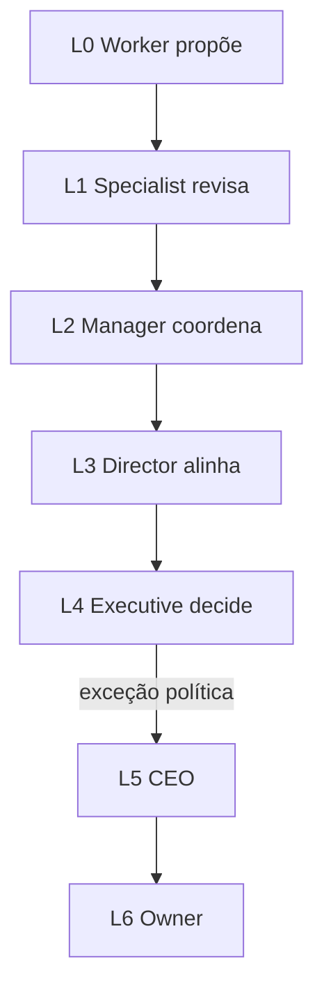

# Níveis de autoridade — AI Product Company Engine

> **Escopo:** política de **quem pode decidir o quê** na organização virtual. Complementa [HIERARCHY.md](./HIERARCHY.md) (níveis A/B/C Cursor) e [DECISION-ENGINE-FRAMEWORK.md](./DECISION-ENGINE-FRAMEWORK.md).
>
> **Contrato produto:** `requiredAuthority` em `DecisionRecord` usa L0–L6 ([ANX-265](../../backend/packages/contracts/src/decisions/decision-record.ts)).

**Relacionados:** [AI-PRODUCT-COMPANY-ENGINE.md](./AI-PRODUCT-COMPANY-ENGINE.md) §14 · [CTO-ACCEPTANCE.md](./CTO-ACCEPTANCE.md)

---

## Princípio

Nenhum agente executa mudança além de sua autoridade. Decisões escalam: Worker → Specialist → Manager → Director → Executive → CEO → Owner.

---

## Tabela L0–L6

| Level | Nome | Pode | Não pode |
| --- | --- | --- | --- |
| **L0** | Worker | Executar tarefas atribuídas: `write_code`, `run_test`, `analyze_data`, `create_document` | Aprovar releases, alterar política, contratar leads |
| **L1** | Specialist | Decisões técnicas na especialidade (schema local, padrão de módulo, fix de bug) | Cross-domain sem consult; G2+ formal |
| **L2** | Manager | Coordenar agentes; priorizar backlog do time; hire workers on-demand | Contratar Level B; `decision` G7 |
| **L3** | Director | Coordenar departamentos; alinhar multi-gate | Política global; override de Executive |
| **L4** | Executive | Decisões estratégicas de domínio (CTO, CPO, CFO, COO) | Veto Owner; mudanças irreversíveis de capital |
| **L5** | CEO | Coordenar organização inteira; aceite G7 rotina | Exceções que exigem Owner por política |
| **L6** | Owner / Human | Veto final, orçamento, exceções G7, greenlight P4+ | — |

---

## Mapeamento Cursor ↔ L0–L6

| Persona / nível Cursor | Authority level | Notas |
| --- | --- | --- |
| Executores Level C | L0–L1 | Implementam; crítico pareado valida G1 |
| Críticos Level C | L1 | `verdict` G1 no domínio do par |
| Leads Level B (Fernanda, Edu, Isa, Thiago, Ju, André) | L1–L2 | `verdict` G2–G5 |
| Marcus (`architect`) | L1 consult | ADR consult; não implementa |
| Renata (`orchestrator`) | L4–L5 | G7 rotina, `decision`, hire override |
| Cláudia (`cto-critic`) | L4 audit | Challenge; não `decision` |
| @Owner | L6 | Aceite G7 exceção |

---

## Exemplos de `requiredAuthority`

| Decisão | Level mínimo |
| --- | --- |
| Refatorar handler em módulo owned | L0 (executor) + G1 crítico |
| Mudar contrato público cross-module | L1 specialist + G2 |
| Nova dependência major | L2 manager + G2 |
| ADR arquitetural material | L3 director (Marcus consult) + Owner se conflito ADR |
| Migrar banco de dados | L4 CTO + evidência Decision Engine |
| Deploy produção | L4 CTO aceite G7 rotina; L6 se política exige |
| Mudança de modelo de negócio | L5 CEO → L6 Owner |

---

## Escalação

**CLI:** `npm run orchestration:who -- --persona <slug> --can-i "<ação>"`

---

**Issue:** ANX-250 · **Status:** P0 proposed
