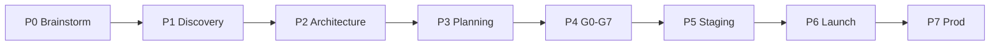

# Runbook — Brainstorm → Produção

Passo a passo operacional para levar uma ideia vazia até deploy em produção. Complementa [LIFECYCLE.md](./LIFECYCLE.md).

> **Escopo:** equipe Cursor apenas. Ver [SCOPE.md](./SCOPE.md).

---

## Pré-requisitos globais

```bash
npm run taskboard:ensure    # abortar se falhar
npm run orchestration:phase -- status --issue ANX-N
```

---

## P0 — Brainstorm (G-B)

| # | Ação | Comando / artefato |
| --- | --- | --- |
| 1 | Contratar research se necessário | `npm run orchestration:hire -- --by-persona orchestrator --persona researcher --issue ANX-N --reason "spike P0" --evidence "LIFECYCLE.md P0"` |
| 2 | Publicar research no dialogue | `npm run orchestration:speak -- --persona researcher --type research --issue ANX-N --body "…"` |
| 3 | Nota em brain/ | OpenKnowledge MCP + skill `frame-a-proposal` |
| 4 | Share opções + go/no-go | `npm run orchestration:broadcast -- --from-persona researcher --type share --issue ANX-N --body "…"` |
| 5 | Transição | `npm run orchestration:phase -- set --issue ANX-N --phase P1` (se go) |

**Saída:** problem statement, ≥2 opções, decisão go/no-go.

---

## P1 — Discovery (G-D)

| # | Ação | Comando / artefato |
| --- | --- | --- |
| 1 | Escrever spec draft | `brain/project-docs/specs/` via OKF · skill `write-a-spec` |
| 2 | Listar candidatos ADR | `brain/project-docs/decisions/` com `status: proposed` |
| 3 | Marcus consult | `npm run orchestration:speak -- --persona architect --type consult --issue ANX-N --body "…"` |
| 4 | Renata valida escopo | Dialogue `decision` |
| 5 | Transição | `npm run orchestration:phase -- set --issue ANX-N --phase P2` |

**Saída:** design doc / PRD draft, ADR candidates.

---

## P2 — Architecture (G-A)

| # | Ação | Comando / artefato |
| --- | --- | --- |
| 1 | Validar diagramas | `npm run archify:validate` |
| 2 | Marcus @consult boundaries | [workflow-architect.md](./workflows/workflow-architect.md) |
| 3 | Aceitar ADR | OKF `status: accepted` |
| 4 | Atualizar specs Archify | `.archify/specs/` |
| 5 | Transição | `npm run orchestration:phase -- set --issue ANX-N --phase P3` |

**Saída:** ADR accepted, Archify specs, module map.

---

## P3 — Planning (G-P)

| # | Ação | Comando / artefato |
| --- | --- | --- |
| 1 | Buscar duplicatas | `npm run taskboard:list` |
| 2 | Criar issues ANX-* | `node scripts/taskboard.mjs create --title "…" --status todo` |
| 3 | Pacotes delegação | `.cursor/orchestration/delegation-queue/ANX-N.md` |
| 4 | Handoff executor + crítico | `npm run orchestration:broadcast -- --from-persona orchestrator --type handoff --issue ANX-N --body "…"` |
| 5 | Transição por issue | `npm run orchestration:phase -- set --issue ANX-N --phase P4` |

**Saída:** issues no board, delegation packages.

---

## P4 — Development (G0–G7)

**Usar runbook existente:** [E2E-RUNBOOK.md](./E2E-RUNBOOK.md)

```bash
npm run orchestration:phase -- gate P4 --issue ANX-N
npm run orchestration:compliance -- --pre-work --issue ANX-N --persona backend-executor
npm run orchestration:workflow -- next --persona backend-executor --issue ANX-N
```

| Gate | Referência |
| --- | --- |
| G0 | Pacote contexto + claim |
| G1 | Executor + crítico PASS |
| G2–G5 | Code Review, QA, Security, Red Team |
| G6 | Agregação mesmo digest |
| G7 | `npm run orchestration:cto-accept -- --issue ANX-N` |

Após G7 ACCEPT: `npm run orchestration:phase -- set --issue ANX-N --phase P5`

---

## P5 — Staging (G-S)

| # | Ação | Responsável |
| --- | --- | --- |
| 1 | Deploy staging | Edu (`infra-executor`) |
| 2 | Smoke + integração | Camila (`qa-lead`) |
| 3 | Security review staging | Isa (`security-lead`) |
| 4 | Evidências no dialogue | `status` com URLs e comandos |
| 5 | Transição | `npm run orchestration:phase -- set --issue ANX-N --phase P6` |

---

## P6 — Launch Review (G-L)

| # | Ação | Responsável |
| --- | --- | --- |
| 1 | Launch checklist | Renata + template abaixo |
| 2 | Rollback plan | Ju + Renata |
| 3 | Owner sign-off (exceções) | `@Owner` no dialogue |
| 4 | Decisão | `npm run orchestration:cto-decide -- --issue ANX-N` |
| 5 | Transição | `npm run orchestration:phase -- set --issue ANX-N --phase P7` |

### Launch checklist (mínimo)

- [ ] Todos os gates G0–G7 PASS para o slice
- [ ] Staging validado (P5)
- [ ] Rollback testado ou documentado
- [ ] Observabilidade configurada
- [ ] Comunicação stakeholders (se aplicável)
- [ ] Feature flags / dark launch (se aplicável)

---

## P7 — Production (G-Prod)

| # | Ação | Responsável |
| --- | --- | --- |
| 1 | Deploy produção | Ju (`infra-executor`) |
| 2 | Monitorar SLOs 24–48h | Renata + Edu |
| 3 | Postmortem se incidente | skill `write-a-postmortem` |
| 4 | Done no board | Aceite Owner explícito |

---

## Fluxo resumido



---

## anxionOS — onde estamos

| Fase | Estado | Próximo passo |
| --- | --- | --- |
| P0–P2 | ✅ Feito | Novas capabilities reiniciam em P0 ou P1 conforme escopo |
| P3–P4 | ✅ Ativo | ANX-134 G1, wave P02 |
| P5–P7 | ⏳ | Após primeiro slice deployável |
