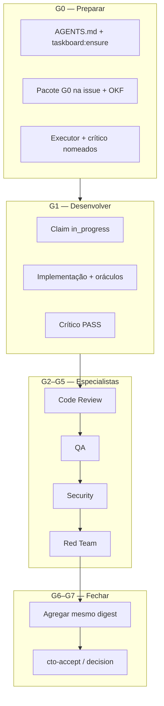
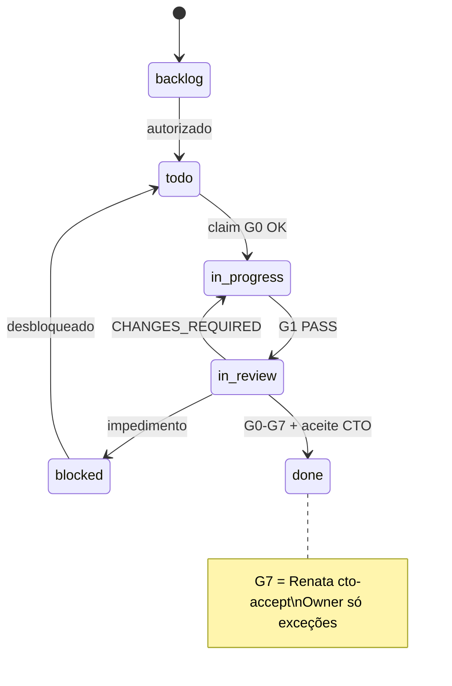
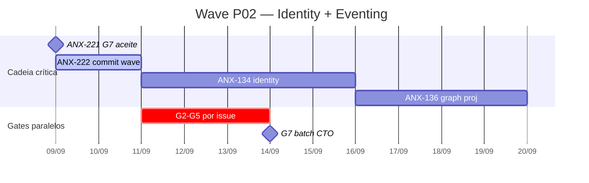
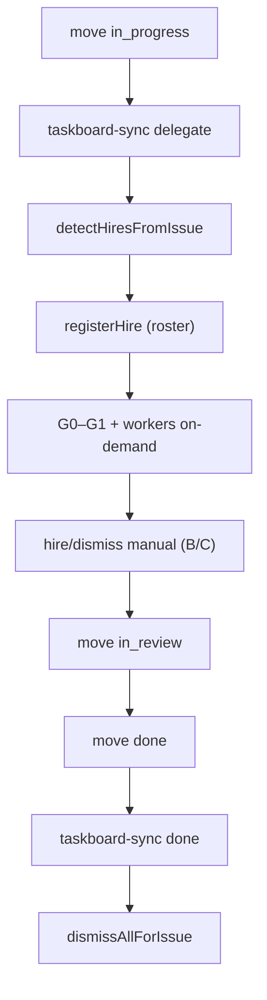

# Workflow Coletivo — Pipeline G0–G7

Fluxo **canônico** que conecta os 18 workflows individuais em [workflows/](./workflows/). Alinha [PIPELINE.md](./PIPELINE.md), [LIFECYCLE.md](./LIFECYCLE.md) (P0–P7) e [AGENTS.md](../../AGENTS.md).

**G7:** aceite pelo **CTO (Renata)** com evidências — ver [CTO-AUTHORITY.md](./CTO-AUTHORITY.md) · [CTO-ACCEPTANCE.md](./CTO-ACCEPTANCE.md). Owner só em exceções.

---

## Visão geral

Cada persona permanente executa seu **workflow individual** (`workflows/workflow-{slug}.md`), que compõe este pipeline coletivo. Level C monitora taskboard, dialogue, hire-log e JSON de estado on-demand ([LEVEL-C-MONITORING.md](./LEVEL-C-MONITORING.md)).



---

## Estados da issue (board)



**\`in_review\` ≠ aprovado.**

---

## Cronograma wave (gantt)



Ver [VISUAL-DOCUMENTATION.md](./VISUAL-DOCUMENTATION.md).

---

## Ciclo de vida P0–P7 (macro)

Projetos novos começam em **P0** (brainstorm). **P4** embute o pipeline G0–G7 abaixo. Ver [LIFECYCLE.md](./LIFECYCLE.md) e [BRAINSTORM-TO-PROD-RUNBOOK.md](./BRAINSTORM-TO-PROD-RUNBOOK.md).

```bash
npm run orchestration:phase -- status --issue ANX-N
npm run orchestration:phase -- next --from brainstorm
```

---

## Como workflows individuais plugam

| Nível | Personas | Gate(s) | Workflow | Papel no coletivo |
| --- | --- | --- | --- | --- |
| A | \`orchestrator\`, \`architect\` | G0, G6–G7 | [workflow-orchestrator.md](./workflows/workflow-orchestrator.md) | Despacho, monitor, aceite G7 |
| B | gate leads, Ju, André | G2–G6 | \`workflow-*-lead.md\` | Revisão independente por gate |
| C | executores + críticos | G0–G1 | \`workflow-*-executor/critic.md\` | Entrega + challenge 1:1 |
| On-demand | \`researcher\`, workers | spikes / subtasks | [workflow-researcher.md](./workflows/workflow-researcher.md) | Contratados por B/C |

**CLI por persona:**

```bash
npm run orchestration:workflow -- status --persona backend-executor --issue ANX-N
npm run orchestration:workflow -- next --persona backend-executor --issue ANX-N
npm run orchestration:workflow -- monitor --level C
```

---

## Handoff mínimo entre gates

| De → Para | Conteúdo obrigatório | Interaction |
| --- | --- | --- |
| Orquestrador → Executor+Crítico | Pacote G0, issue, critérios | \`handoff\` |
| Executor → Crítico | Diff, oráculos, checklist zero tolerância | \`handoff\` |
| Crítico → G2 | Verdict PASS + evidências | \`verdict\` → \`handoff\` |
| G2–G5 → próximo gate | Parecer + digest | \`verdict\` / \`handoff\` |
| G6 → G7 | Pareceres consolidados, PR, riscos | \`handoff\` |
| Renata → done | \`decision\` + \`cto-accept --apply\` | \`decision\` |

Detalhes: [INTERACTIONS.md](./INTERACTIONS.md) · [NO-SILENT-WORK.md](./NO-SILENT-WORK.md)

---

## Ciclo hire / dismiss

Contratação on-demand segue [HIRE-DELEGATION.md](./HIRE-DELEGATION.md). O claim no board pode disparar auto-hire via `scripts/taskboard.mjs` → `agent-hire/taskboard-sync.mjs`.



Hire manual e dismiss por evidência: [HIRE-DELEGATION.md](./HIRE-DELEGATION.md).

---

## Revalidação e impasse

- Qualquer alteração **invalida** PASS anteriores — repetir gates afetados.
- Após **3 ciclos** sem convergência → \`escalate\` para Renata; ADR/conflito → Owner.
- Board offline → **abortar** (\`taskboard:ensure\` ≠ 0).

---

## Links

| Documento | Uso |
| --- | --- |
| [workflows/README.md](./workflows/README.md) | Índice dos 18 workflows |
| [LEVEL-C-MONITORING.md](./LEVEL-C-MONITORING.md) | Monitoramento on-demand Level C |
| [agent-workflow/README.md](./agent-workflow/README.md) | CLI state / decision-tree |
| [HIERARCHY.md](./HIERARCHY.md) · [HIRE-DELEGATION.md](./HIRE-DELEGATION.md) | Hire B/C |
| [WORKFLOWS.md](./WORKFLOWS.md) | Fluxos legados por fase (referência) |
