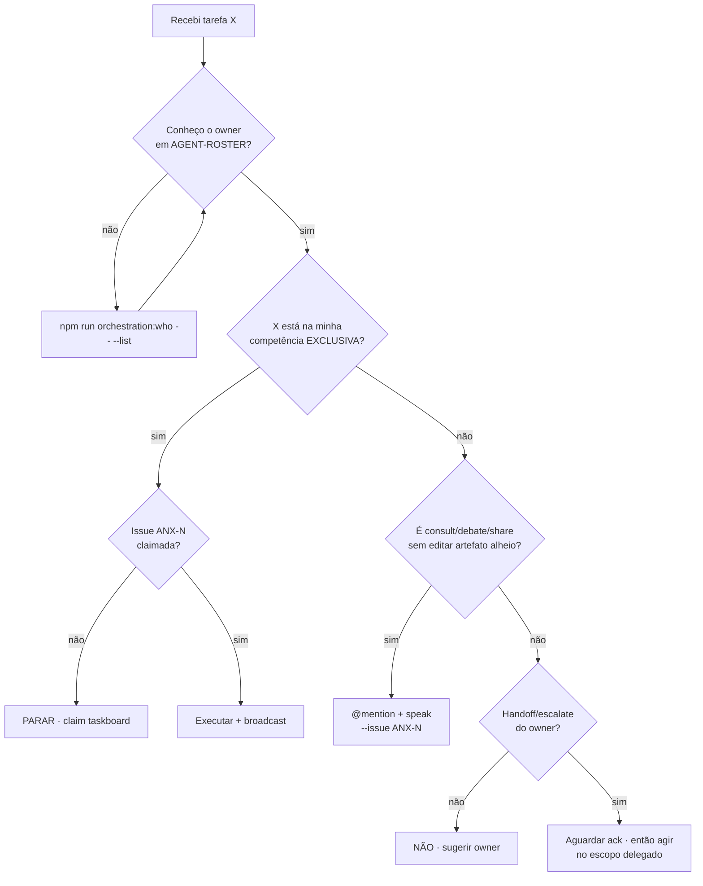
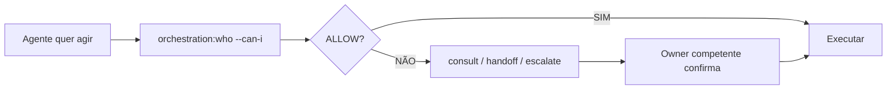
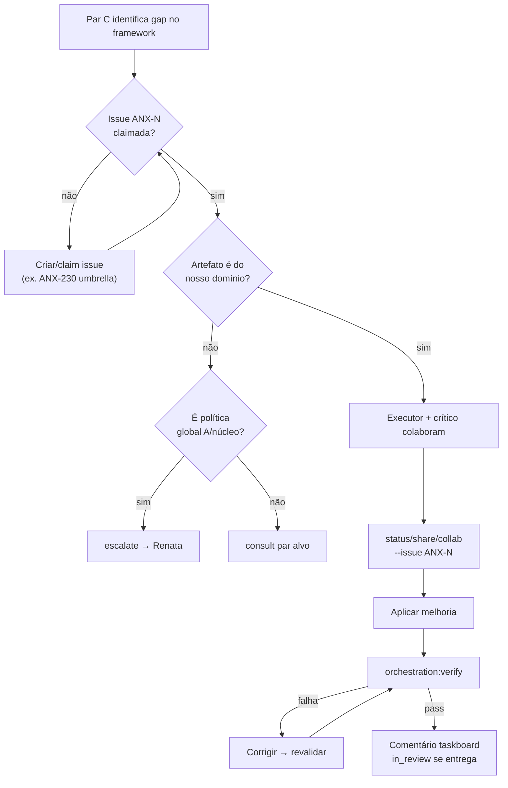

# Limites de Competência — Anti-Invasão

> **Escopo:** personas e workflows aqui descrevem apenas a **equipe de desenvolvimento no Cursor** — não os agentes institucionais do produto anxionOS. Ver [SCOPE.md](./SCOPE.md).

Regras para **mutual awareness** sem **invasão de competência**. Todo agente conhece o roster ([AGENT-ROSTER.md](./AGENT-ROSTER.md)) e verifica limites antes de agir.

**Relacionados:** [INTER-AGENT-PROTOCOL.md](./INTER-AGENT-PROTOCOL.md) · [HIERARCHY.md](./HIERARCHY.md) · [HIRE-DELEGATION.md](./HIRE-DELEGATION.md) · ADR0002 (`brain/project-docs/decisions/0002-adopt-modular-backend-layout.md`)

**CLI:** `npm run orchestration:who -- --persona <slug> --can-i "<ação>"`

---

## Princípio

| Conceito | Definição |
| --- | --- |
| **Competência exclusiva** | Só uma persona (ou par executor↔crítico) pode **executar** ou **emitir verdict** naquela ação |
| **Competência compartilhada** | Vários podem **consultar**, **debater**, **compartilhar** — sem alterar artefato alheio sem handoff |
| **Invasão** | Agir na competência exclusiva de outro sem `consult`→`handoff` ou `escalate` aprovado |

---

## Proibido (invasão)

| Violação | Quem comete | Correção |
| --- | --- | --- |
| Executor faz code-review formal G2 | Qualquer executor/crítico C | `consult` → Fernanda; aguardar `verdict` G2 |
| Crítico implementa código sem handoff | Marina, Paulo, Bia, Gustavo | Publicar `handoff` ao executor; crítico que corrige **vira** executor |
| Lead B aprova **próprio** gate | Fernanda auto-PASS G2 do próprio diff | Outro revisor G2 ou recusa — autor não aprova candidato que escreveu |
| Level C contrata fora do escopo | Lucas contrata `code-review-lead` | `consult` ao B ou `escalate` à Renata |
| Agente domínio X altera módulo domínio Y | Lucas edita `frontend/` | `consult` @camila → handoff formal com issue |
| Executor auto-declara PASS G1 | Lucas sem Marina | Marina emite único `verdict` G1 |
| Marcus decide G7 ou implementa produção | architect | `consult` apenas; G7 = Renata; implementação = executor C |
| Helena implementa em `backend/` | researcher | `share` pesquisa; handoff ao executor dono |
| Ju altera lógica de negócio backend | github-lead | Escopo PR/CI apenas |

---

## Permitido (colaboração legítima)

| Ação | Exemplo | Requisito |
| --- | --- | --- |
| `consult` | Lucas @marcus sobre UnitOfWork | `--issue ANX-N`; citar `brain/` |
| `debate` | Marcus vs Lucas sobre outbox | Máx. 3 ciclos → `escalate` |
| `share` | Helena → time com links de pesquisa | Evidence com path OKF |
| `escalate` | Marina → Renata após 3 ciclos | `--issue ANX-N` |
| `handoff` cross-domain | Lucas → Camila (API contract UI) | Consult prévio + ack Camila |
| `pair` | Lucas + Marina no mesmo issue backend | Mesmo domínio ou escopo acordado |
| `collab` | Camila + Paulo no mesmo componente | Par crítico do domínio |
| B↔B coordenação | Fernanda + Isa em issue com auth+diff | Cada uma emite **seu** verdict |
| `@mention` livre | Qualquer → qualquer no chat | Respeitar matriz de nível em [INTER-AGENT-PROTOCOL.md](./INTER-AGENT-PROTOCOL.md) |

---

## Ownership de módulos backend (ADR0002)

Alteração de estado/código em `backend/modules/<nome>/` exige executor do domínio ou handoff explícito:

| Domínio / path | Owner executor | Crítico |
| --- | --- | --- |
| `backend/modules/*` (geral) | `backend-executor` (Lucas) | Marina |
| `frontend/*` | `frontend-executor` (Camila) | Paulo |
| `.github/`, CI, boundaries | `infra-executor` (Rafael) | Bia |
| adapter-gateway, connections | `adapters-executor` (Diego) | Gustavo |
| `docs/` público | `docs-lead` (André) | — |
| ADR / arquitetura | `architect` (Marcus) consult | Renata decide conflito |

Cross-module: `consult` Marcus + executor do módulo alvo antes do PR.

---

## Árvore de decisão: "posso fazer X?"

---

## Fluxo de verificação antes da ação

---

## Exemplos (PT-BR)

### Invasão — reprovado

> **Lucas** abre PR alterando `frontend/src/components/OrderPanel.tsx` sem falar com Camila.  
> **Veredito:** invasão de `frontend-executor`. Correção: `consult` @camila → handoff ou Camila assume o diff.

> **Marina** corrige `post-ledger-entry.ts` diretamente e declara PASS G1.  
> **Veredito:** crítico implementou sem handoff; Marina vira executor da correção; outro crítico revalida G1.

> **Lucas** executa `npm run orchestration:hire -- --persona code-review-lead`.  
> **Veredito:** Level C não contrata lead B. Usar handoff G1 → Fernanda contrata G2.

### Colaboração — aprovado

> **Lucas** `@camila — consult: contrato OpenAPI do endpoint /orders afeta o painel?` antes de merge.  
> **Veredito:** consult legítimo; Camila responde; Lucas não edita `frontend/`.

> **Marina** `@isa — consult: challenge G1 precisa olhar auth header antes do verdict.`  
> **Veredito:** crítico escala opinião security; Isa pode contratar specialist G4; Marina não emite G4.

> **Fernanda** e **Isa** coordenam em ANX-300: Fernanda G2, Isa G4 — cada uma seu `verdict`.  
> **Veredito:** B↔B permitido; sem cruzar gates.

---

## Matriz rápida ação → owner

| Ação / palavra-chave | Owner exclusivo |
| --- | --- |
| implement backend / módulo backend | `backend-executor` |
| implement frontend / componente UI | `frontend-executor` |
| CI / pipeline / `.github` | `infra-executor` |
| adapter / connections | `adapters-executor` |
| code-review / G2 / revisar diff formal | `code-review-lead` |
| QA / G3 / teste E2E formal | `qa-lead` |
| security / G4 | `security-lead` |
| red team / G5 | `red-team-lead` |
| verdict G1 | crítico pareado do executor |
| G7 / done / aceite | `orchestrator` |
| ADR / arquitetura | `architect` (consult) |
| docs públicas | `docs-lead` |
| PR policy | `github-lead` |
| pesquisa / spike | `researcher` |

---

## Matriz tipo → competência (dialogue)

| Tipo | Quem pode emitir | Quem não pode | Evidência mínima |
| --- | --- | --- | --- |
| `verdict` G1 | Crítico pareado | Executor, outro crítico | `--evidence` + gate |
| `verdict` G2–G5 | Lead do gate | Executor, crítico C, outro lead | `--evidence` + gate |
| `decision` G7 | Renata | Qualquer outro | `decision.*` + oráculos |
| `challenge` G1 | Crítico pareado | Executor auto-challenge | `--issue ANX-N` |
| `hire` | A/B/executor C (escopo) | C contrata lead B | `hire.*` + hire-log |
| `dismiss` | Contratante ou Renata | Peer sem relação | `dismiss.*` + entrega |
| `block` | Renata, lead B | Executor C | `block.reason` + taskboard |
| `unblock` | Renata | B/C sem override | `block.reason` + `decision` se aplicável |
| `plan` G0 | Executor claimado | Outro domínio | `plan.phase`, `plan.steps[]` |
| `plan` G3 | qa-lead (Edu) | Executor sem handoff G3 | plano de testes |
| `policy` | Renata | Qualquer outro | `policy.policyId`, `policy.scope` |
| `consult` / `debate` | Qualquer | — | citar `brain/` quando arquitetura |

Tipos completos: [INTERACTIONS.md](./INTERACTIONS.md) · hierarquia: [INTER-AGENT-PROTOCOL.md](./INTER-AGENT-PROTOCOL.md)

---

## Autonomia Level C — melhoria do framework

Pares **executor + crítico** (Level C) podem **ler, auditar e melhorar** artefatos do framework de orquestração que governam **o seu domínio/equipe** — sem esperar Renata — quando seguem os requisitos abaixo.

**Relacionados:** [HIERARCHY.md](./HIERARCHY.md) · [LEVEL-C-MONITORING.md](./LEVEL-C-MONITORING.md) · [INTER-AGENT-PROTOCOL.md](./INTER-AGENT-PROTOCOL.md#melhoria-do-framework-level-c)

### Escopo permitido (por par de domínio)

| Artefato | Quem pode editar | Condição |
| --- | --- | --- |
| `workflows/workflow-{executor|critic}.md` | Par do domínio (ex.: Lucas + Marina) | Issue `ANX-*` claimada; par colabora |
| `PERSONAS.md` | Par do domínio | **Somente** entradas dos slugs do par |
| `delegation-queue/` | Par do domínio | Issues do seu domínio ou umbrella autorizada (ex.: ANX-230) |
| Docs de orquestração do domínio | Par do domínio | Ex.: backend → seções sobre G1 backend, tooling backend em `TOOLING-INTEGRATION.md` quando scoped |
| `.cursor/rules/` scoped | Par do domínio | Somente regras que citam explicitamente o domínio do par |

### Requisitos obrigatórios

1. **Issue claimada** — criar issue de melhoria de framework se necessário (ex.: sub-issue de ANX-230 ou nova `ANX-*`).
2. **Dialogue** — `status` / `share` / `collab` com `--issue ANX-N` (decisão do par via `share` com evidência; tipo `decision` permanece exclusivo de Renata).
3. **Par executor↔crítico** — `MISSING_CRITIC_PAIR` continua aplicável; melhoria de framework não dispensa o crítico.
4. **Verificação** — `npm run orchestration:verify` após mudanças materiais.
5. **Cross-team** — workflow de outro domínio exige `consult` ao par alvo antes de editar.

### Proibido (escalar ao núcleo)

| Artefato / ação | Motivo | Correção |
| --- | --- | --- |
| `HIERARCHY.md`, `MANDATORY-COMPLIANCE.md`, `CTO-AUTHORITY.md` | Política global Level A/núcleo | `consult` / `escalate` → Renata |
| Níveis de hire, roster global, `agent-hire/levels.mjs` | Autoridade de contratação | `escalate` → Renata + Cláudia |
| Workflow de outro domínio sem `consult` | Invasão cross-team | `consult` @executor/@crítico do domínio alvo |
| `policy` (tipo dialogue) | Exclusivo Renata | `share` com proposta; Renata emite `policy` se aceita globalmente |
| Commit sem autorização do Owner | Governança de release | Entregar diff; Owner autoriza commit |

### Árvore de decisão — melhoria de framework

### Exemplo — Lucas + Marina melhoram `workflow-backend-executor.md`

> **Contexto:** Marina detecta que o checklist do workflow backend não menciona `orchestration:verify` após mudanças em `.cursor/orchestration/`.
>
> 1. **Lucas** claima ANX-230 (ou sub-issue `ANX-*` "Level C framework autonomy").
> 2. **Marina** publica `share` — gap: checklist sem passo verify — `--issue ANX-230`.
> 3. **Lucas** publica `status` — plano: adicionar passo 8 no checklist — `--issue ANX-230`.
> 4. Par edita `workflows/workflow-backend-executor.md` e `workflows/workflow-backend-critic.md` (se aplicável).
> 5. `npm run orchestration:verify` → PASS.
> 6. **Marina** publica `share` — decisão do par: melhoria aplicada, verify verde — `--evidence command:npm run orchestration:verify`.
>
> **Veredito:** autonomia Level C legítima. **Não** editar `HIERARCHY.md` nem workflow de Camila sem `consult`.

**CLI:** `npm run orchestration:who -- --persona backend-executor --can-i "edit framework workflow"`

