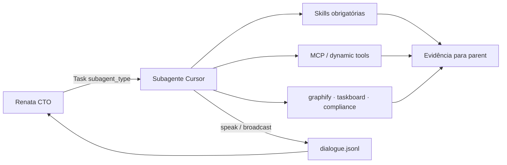

# Integração — agentes nativos Cursor + orquestração

Política operacional: a orquestração anxionOS **usa os subagentes nativos do Cursor** (`Task`) e cada agente **deve consumir skills, tools, MCP e plugins** disponíveis no workspace — não improvisar fluxos paralelos fora do Cursor.

**Relacionados:** [DELEGATION.md](./DELEGATION.md) · [HIRE-DELEGATION.md](./HIRE-DELEGATION.md) · [SKILLS-TOOLS-MCP-REGISTRY.md](./SKILLS-TOOLS-MCP-REGISTRY.md) · [TOOLING-INTEGRATION.md](./TOOLING-INTEGRATION.md) · [templates/SUBAGENT-DELEGATION-PACKAGE.md](./templates/SUBAGENT-DELEGATION-PACKAGE.md) · regra [cursor-agents-orchestration.mdc](../rules/cursor-agents-orchestration.mdc)

---

## Princípio

| Camada | Responsabilidade |
| --- | --- |
| **Personas (Renata, Lucas, …)** | Governança, dialogue, gates G0–G7, claims `ANX-*` |
| **Cursor `Task` subagents** | Execução técnica isolada com contexto autocontido |
| **Skills / MCP / CLI** | Ferramentas obrigatórias dentro de cada subagente |
| **Dialogue + taskboard** | Evidência auditável de marcos e entregas |

O orquestrador **não** substitui subagentes em trabalho substancial — despacha via `Task` (Multitask Mode quando aplicável).

---

## Fluxo orquestrador → subagente → tooling



---

## Mapeamento persona → subagent_type (delegação)

Ao despachar `Task`, Renata (ou gate lead B) escolhe `subagent_type` conforme a persona responsável pelo gate ou o worker contratado.

| Persona (slug) | Gate / papel | `subagent_type` preferido | Notas |
| --- | --- | --- | --- |
| Renata (`orchestrator`) | G0, G6, G7 | *(despacha Task)* | Não executa diff grande inline |
| Lucas (`backend-executor`) | G1 executor | `generalPurpose` | **Não** `explore` para implementação |
| Marina (`backend-critic`) | G1 crítico | `critic-reviewer` | Revisão adversarial independente |
| Fernanda (`code-review-lead`) | G2 | `code-reviewer` | Pode contratar `typescript-reviewer`, `thermo-nuclear-code-quality-review` |
| Edu (`qa-lead`) | G3 | `e2e-runner` ou `validation-review` | `pr-test-analyzer` para cobertura |
| Isa (`security-lead`) | G4 | `security-review` | `mantis-threat-model` quando threat model |
| Thiago (`red-team-lead`) | G5 | `security-review` | Sandbox autorizado apenas |
| Helena (`researcher`) | P0–P1 | `explore` ou `docs-researcher` | Spike / discovery |
| Marcus (`architect`) | P2 | `architect` ou `code-architect` | ADR + Archify |
| Camila / Paulo (frontend) | G1 P7 | `generalPurpose` + `react-reviewer` hire | DevTools após UI |
| Ju (`infra-executor`) | P5–P7 | `generalPurpose` | CI: `fix-ci`, `ci-watcher` |

Workers on-demand mapeiam 1:1 — ver [HIRE-DELEGATION.md](./HIRE-DELEGATION.md) e `getCursorSubagentType()` em `agent-hire/levels.mjs`.

---

## Skills obrigatórias por gate

| Gate / momento | Skills (ler SKILL.md antes de agir) |
| --- | --- |
| **Qualquer código** | `manage-taskboard`, `orchestrate-work`, `karpathy-guidelines` |
| **G0 dispatch** | `orchestrate-work` (pacote delegação) |
| **P0–P1 spec** | `write-a-spec`, `frame-a-proposal`, `open-knowledge` |
| **P2 arquitetura** | `record-a-decision`, skill `archify` |
| **G1 implementação** | `test-driven-development`, `systematic-debugging` (se bug) |
| **G2 review** | `requesting-code-review`, `review-bugbot` (se solicitado) |
| **G3 QA** | `verification-before-completion`, `run-smoke-tests` |
| **brain/** | `open-knowledge` — **sempre** via MCP |
| **Multi-step** | `writing-plans`, `executing-plans`, `dispatching-parallel-agents` |

Catálogo completo: [SKILLS-TOOLS-MCP-REGISTRY.md](./SKILLS-TOOLS-MCP-REGISTRY.md).

---

## MCP e ferramentas dinâmicas obrigatórias

| Recurso | Namespace / CLI | Quando |
| --- | --- | --- |
| **open-knowledge** | `user-open-knowledge` | Leitura/escrita `brain/` |
| **serena** | `plugin-serena-serena` | Edição estrutural de símbolos |
| **graphify** | CLI `graphify query` | Antes de exploração em massa |
| **Supermemory** | `plugin-cursor-supermemory-supermemory` | Retomada de sessão |
| **code-review-graph** | MCP global (se indexado) | Impacto / review G2 |
| **Chrome DevTools** | `plugin-chrome-devtools-mcp-chrome-devtools` | Após alteração `frontend/` |
| **Context7** | `plugin-context7-context7` | Docs de bibliotecas |
| **Playwright** | `plugin-playwright-playwright` | E2E G3 |

Descoberta em runtime: `GetDynamicTools` → `CallDynamicTool` (nunca assumir MCP offline sem verificar).

Detalhes: [TOOLING-INTEGRATION.md](./TOOLING-INTEGRATION.md).

---

## Template de delegação

Todo `Task` **deve** incluir o pacote em [templates/SUBAGENT-DELEGATION-PACKAGE.md](./templates/SUBAGENT-DELEGATION-PACKAGE.md) + bloco tooling em [templates/SUBAGENT-PROMPT-TOOLING.md](./templates/SUBAGENT-PROMPT-TOOLING.md).

---

## Lifecycle P0–P7 × subagentes Cursor

| Fase | Owner persona | Subagentes típicos | Skills / MCP |
| --- | --- | --- | --- |
| **P0 Brainstorm** | Helena + Marcus | `explore`, `docs-researcher` | `frame-a-proposal`, open-knowledge |
| **P1 Discovery** | Marcus + Renata | `explore`, `architect` | `write-a-spec`, open-knowledge |
| **P2 Architecture** | Marcus | `architect`, `code-architect` | archify, `record-a-decision` |
| **P3 Planning** | Renata | `planner` (opcional) | `orchestrate-work`, manage-taskboard |
| **P4 Development** | Executores + gates | `generalPurpose`, `critic-reviewer`, G2–G5 types | Pipeline G0–G7 completo |
| **P5 Staging** | Ju + Isa | `validation-review`, `security-review` | `fix-ci`, E2E |
| **P6 Launch Review** | Renata + Owner | — (coordenação) | `verification-before-completion` |
| **P7 Production** | Ju + Renata | `ci-watcher`, `docs-reliability-review` | postmortem skill |

Ver [LIFECYCLE.md](./LIFECYCLE.md) · gate G0.15 em [COMPLIANCE.md](./COMPLIANCE.md).

---

## Multitask Mode (Renata)

Quando o Owner habilita Multitask Mode:

1. Renata **deve** usar `Task` para unidades paralelizáveis (G2–G5 independentes, workers por subtask).
2. Cada subagente recebe issue própria ou subescopo explícito no prompt.
3. Parent integra evidências antes de G6/G7.
4. Máx. 3 hires on-demand por issue permanece — subagentes Task não substituem hire registry.

---

## Verificação

```bash
npm run orchestration:compliance -- --pre-work --issue ANX-N --persona orchestrator
npm run orchestration:roster -- counts
npm run orchestration:verify
```

**Última atualização:** 2026-09-09 · ANX-134 · política Cursor agents + skills/MCP (Renata/CTO)
