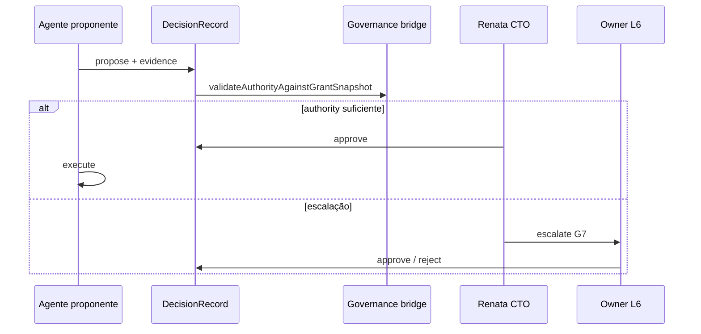

# Decision Engine — framework de orquestração

> **Escopo:** como decisões de **produto e engenharia** são propostas, evidenciadas, aprovadas e executadas na AI Product Company Engine.
>
> **Design detalhado:** `brain/project-docs/specs/anx-governance-decision-engine/design.md` (OKF)
>
> **Contrato wire:** `backend/packages/contracts/src/decisions/` (ANX-265 done)

**Relacionados:** [AI-PRODUCT-COMPANY-ENGINE.md](./AI-PRODUCT-COMPANY-ENGINE.md) §15 · [AUTHORITY-LEVELS.md](./AUTHORITY-LEVELS.md) · [CTO-ACCEPTANCE.md](./CTO-ACCEPTANCE.md)

---

## Princípio

Agente **não executa** mudança de alto impacto silenciosamente. Cria `DecisionRecord`, coleta evidências, define alternativas e obtém aprovações até `requiredAuthority`.

---

## Envelope Decision

```text
Decision
├── decisionId
├── proposer (agent slug / persona)
├── scope: product | engineering
├── proposal + proposalKind
├── evidence[] (uri, checksum — sem secrets em claim)
├── alternatives[] (option, tradeoffs)
├── expectedOutcome
├── risk / cost / confidence (P1+ campos opcionais)
├── affectedEntities[]
├── requiredAuthority: L0–L6
├── authorityReferences[]
├── approvals[]
├── disposition: APPROVED | CHANGES_REQUIRED | REJECTED | PENDING
└── timestamps (ISO datetime wire)
```

---

## Fluxo



---

## Bridge Governance ↔ Grants

**ANX-270 done:** `authority-grant-bridge.ts` mapeia `AuthorityReference` (governance) ↔ grant snapshot com validação de epoch/status.

---

## Escopos

| Scope | Exemplos |
| --- | --- |
| `product` | Priorização de feature, mudança de KPI, experimento A/B |
| `engineering` | Migração de DB, breaking change de API, adoção de lib |

**Não confundir** com `decisionScope` de governance runtime (domínio institucional separado).

---

## Integração Cursor

| Momento | Ação |
| --- | --- |
| Proposta | `orchestration:broadcast --type share` com `--evidence` |
| Aprovação G7 rotina | `orchestration:cto-decide -- --issue ANX-N` |
| Exceção | `escalate` → @Owner |
| Pós-falha | `orchestration:brain -- reflect` |

---

## Exemplo (ilustrativo)

```text
DECISION #8271 — engineering

Proposal: Migrate database engine
Reason: p99 latency degradation (840ms)
Evidence: metrics dashboard, query audit
Alternatives: A optimize indexes | B partition | C migrate
Risk: HIGH | Cost: MEDIUM | Confidence: 94%
Required approval: L4 CTO
```

---

**Issues:** ANX-265 (contract) · ANX-270 (bridge) · **Status:** P0 framework + contract done
