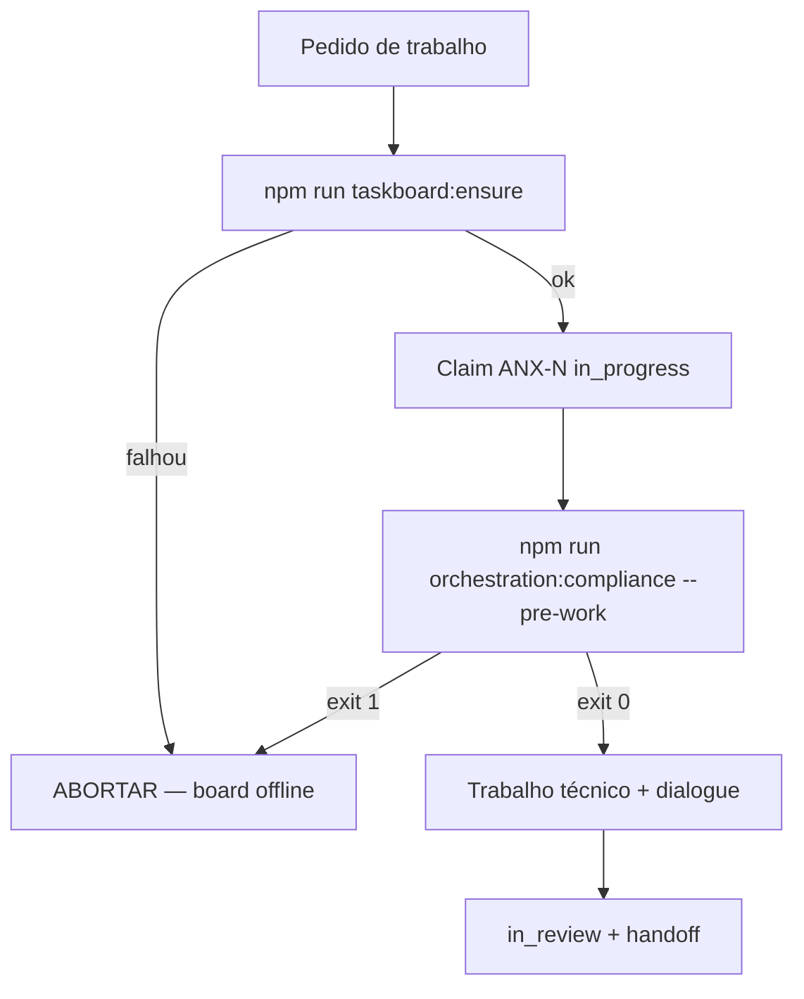

# Delegation Monitoring — Zero trabalho fora do board

Política executável: **nenhuma delegação, broadcast de trabalho ou edição de código** sem issue `ANX-*` claimada no Dashi Taskboard.

Relacionados: [MANDATORY-COMPLIANCE.md](./MANDATORY-COMPLIANCE.md) · [NO-SILENT-WORK.md](./NO-SILENT-WORK.md) · [RUNBOOK.md](./RUNBOOK.md)

---

## Fluxo obrigatório



---

## Enforcement

| Camada | Comando | Bloqueio |
| --- | --- | --- |
| Compliance | `orchestration:compliance --pre-work` / `--pre-commit` | `MISSING_ISSUE_ID`, `ISSUE_NOT_FOUND`, `ISSUE_NOT_IN_PROGRESS`, `TASKBOARD_OFFLINE`, `TASKBOARD_ENSURE_FAILED` |
| Executores | pre-work | `WORK_WITHOUT_BOARD_ISSUE` |
| Delegate monitor | `orchestration:delegate-monitor` | colunas `stale`, `no-issue` |
| Broadcast / session / hire | writes | soft fail com mensagem clara se issue inválida |

### Carve-out documentado

Renata (`orchestrator`) pode usar issue `in_review` **somente** em `--pre-commit` quando o `pending-broadcast.json` indica handoff de gate (`handoff`, `verdict`, `block`, `unblock`, `decision`).

---

## Monitor de delegações

```bash
npm run orchestration:delegate-monitor
npm run orchestration:delegate-monitor -- --issue ANX-N --json
```

| Coluna | Significado |
| --- | --- |
| **active** | Sessão/hire com issue válida e dialogue recente |
| **stale** | >10min sem dialogue na issue claimada |
| **no-issue** | Sessão ou hire sem binding `ANX-*` — **abortar** |

---

## Cache taskboard:ensure

Arquivo: `.cursor/orchestration-runtime/autonomy/taskboard-health.json`

```json
{
  "version": 1,
  "ok": true,
  "checkedAt": "2026-09-09T17:00:00.000Z",
  "url": "http://127.0.0.1:47823",
  "error": null
}
```

Atualizado por `npm run taskboard:ensure` e `taskboardOnline()` no compliance.

---

## Checklist coordenador

1. `npm run taskboard:ensure` — falhou = PARAR
2. Claim `in_progress` com thread binding
3. Todo `Task` prompt inclui `--issue ANX-N` ([SUBAGENT-DELEGATION-PACKAGE.md](./templates/SUBAGENT-DELEGATION-PACKAGE.md))
4. `orchestration:delegate-monitor` antes de delegar em paralelo
5. `orchestration:compliance --pre-commit` ao encerrar turno com diff
