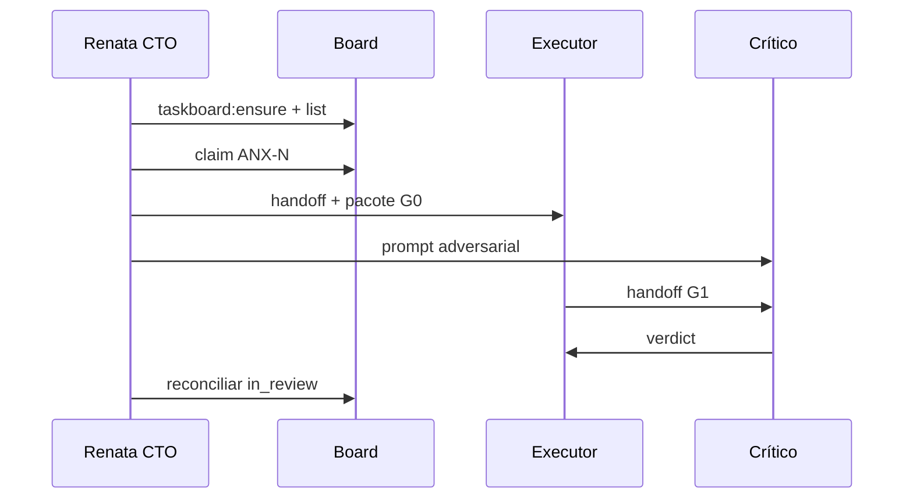
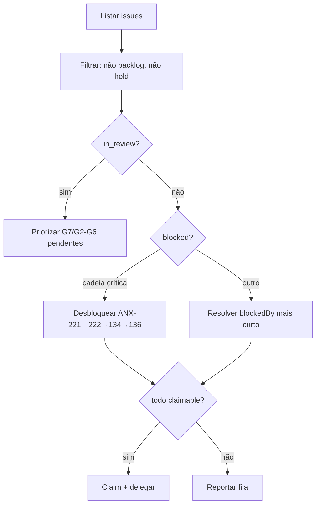

# Delegação do Orquestrador

Como o CTO monitora o board, seleciona issues e despacha subagentes.

**Compliance:** todo dispatch **deve** incluir `Read AGENTS.md` e pacote `brain/` na issue. Ver [COMPLIANCE.md](./COMPLIANCE.md).

---

## 1. Cadência de monitoramento

| Momento | Ação |
| --- | --- |
| Início de sessão | `npm run taskboard:ensure` → `taskboard:context` → `taskboard:list` |
| Início de sessão (proativo) | `node .cursor/hooks/agent-proactive.mjs --persona orchestrator` |
| Cron 10 min | `npm run orchestration:proactive -- check --persona orchestrator` |
| A cada handoff | `get ANX-N` + `comment list` |
| A cada 30–60 min (sessão ativa) | Reconciliar `in_review` (6 issues) e `blocked` |
| Antes de claim | Verificar `threadBinding` — nunca tomar claim alheio |
| Fim de sessão | Status do board atualizado; nenhuma issue órfã em `in_progress` |

### Proatividade

Ver [PROACTIVITY.md](./PROACTIVITY.md):

```bash
npm run orchestration:proactive -- check --persona orchestrator
npm run orchestration:proactive -- suggest --persona orchestrator
npm run orchestration:proactive -- act --persona orchestrator --dry-run
```

Crons: `.cursor/orchestration-runtime/autonomy/registry.json`.

---

## 2. Sequência de delegação



## 3. Algoritmo de seleção de issues



### Prioridade (ordem)

1. **G7 pendente:** ANX-221 (`in_review`) — `cto-accept` ACCEPT (CTO) ou Owner (exceções) desbloqueia ANX-222
2. **Cadeia crítica:** ANX-222 → ANX-134 → ANX-136
3. **in_review sem gate:** completar G2–G6 das 6 issues em review
4. **todo sem blockedBy:** raro (44 todo todos blocked no snapshot)
5. **backlog:** só com autorização explícita

---

## 2b. Hire automático ao delegar

Ao mover issue para `in_progress`, o taskboard dispara auto-hire de specialists sugeridos:

```bash
npm run orchestration:hire -- delegate --issue ANX-N
# ou via move: node scripts/taskboard.mjs move ANX-N in_progress
```

Ao `done`, auto-dismiss: `npm run orchestration:dismiss -- issue-done --issue ANX-N`

Ver [HIERARCHY.md](./HIERARCHY.md).

---

## 4. Thread binding e claims

```bash
export THREAD_ID="${CURSOR_THREAD_ID:-$CODEX_THREAD_ID}"
# Binding 5-partes quando suportado:
# --binding-thread-id --binding-project-id --binding-project-kind local
# --binding-host-id local --binding-workspace-path "$(pwd)"

node scripts/taskboard.mjs get ANX-N   # obter version
node scripts/taskboard.mjs move ANX-N in_progress  # --if-version V --thread-id "$THREAD_ID"
```

**Regras:**
- Uma issue por executor por conversa
- Claim falhou → ler issue de novo; não loop infinito
- Correção autorizada → `in_progress` com versão atual

---

## 5. Templates de dispatch por papel

### Executor Backend

```
Read AGENTS.md (obrigatório — gate G0).
Issue: ANX-134 (identity lifecycle).
Escopo: [copiar da issue].
Pacote G0 (comentário na issue, antes de código):
  source: brain/project-docs/specs/... ou brain/project-docs/decisions/...
  decisionStatus: accepted | proposed
  capability: ...
  owner: modulo
  oracles: [comandos]
OpenKnowledge: search brain/ para spec/ADR; não inventar fatos ausentes.
Regras: ADR0002, application→ports only, zero tolerância.
Verificar: [oráculos da issue].
Crítico independente revisará antes de in_review.
graphify query "<escopo>" antes de Grep em massa.
```

### Executor Infra (ANX-222)

```
Read AGENTS.md. Issue: ANX-222.
Pré-condição: autorização Owner para commits Tier 1/2.
Aceite: cd backend && bun test 40/0; test:boundary 22/0; boundaries 0.
Não commitar sem autorização explícita na issue.
```

### Crítico (paralelo)

```
Read AGENTS.md. Revisar adversarialmente entrega de ANX-N.
Não é o autor. Verificar: escopo, zero tolerância, evidência de comandos.
Emitir: PASS | CHANGES_REQUIRED | BLOCKED com severidade.
```

### Code Review G2

```
Task: code-reviewer. Issue ANX-N. Digest: [sha].
Revisar: contratos, ADR0002, imports, testes.
Disposição formal obrigatória.
```

### QA G3

```
Issue ANX-N. Executar oráculos: [lista].
Registrar ambiente, comandos, resultados, limitações.
```

---

## 5b. Delegação via Task (agentes Cursor)

Renata **deve** usar a ferramenta `Task` do Cursor para trabalho substancial (Multitask Mode quando paralelo).

| Persona | `subagent_type` | Doc |
| --- | --- | --- |
| Lucas (executor) | `generalPurpose` | Não usar `explore` para implementação |
| Marina (crítico) | `code-reviewer` | G1 adversarial |
| Fernanda (G2) | `code-reviewer` | + specialists G2 |
| Edu (G3) | `e2e-runner` / `validation-review` | Oráculos da issue |
| Isa (G4) | `security-review` | Tenancy, secrets |
| Helena (research) | `explore` / `docs-researcher` | P0–P1 |

Pacote obrigatório no prompt: [templates/SUBAGENT-DELEGATION-PACKAGE.md](./templates/SUBAGENT-DELEGATION-PACKAGE.md).

Política completa: [CURSOR-AGENTS-INTEGRATION.md](./CURSOR-AGENTS-INTEGRATION.md) · hire workers: `cursorSubagentType` em `agent-hire/levels.mjs`.


---

## 6. Matriz de skills

| Contexto | Skills primárias | ECC / outros |
| --- | --- | --- |
| Qualquer código | `karpathy-guidelines`, `manage-taskboard` | `graphify` |
| Planejamento multi-step | `superpowers:writing-plans`, `executing-plans` | `architect` |
| Backend TS | `test-driven-development` | `typescript-reviewer`, `database-reviewer` |
| Frontend P07 | `ui-ux-pro-max` | `react-reviewer`, `a11y-architect` |
| CI/infra | `fix-ci`, `verification-before-completion` | `ci-watcher` |
| Review | `requesting-code-review` | `code-reviewer`, `code-reviewer` |
| Debug | `systematic-debugging` | `build-error-resolver` |
| Paralelo | `dispatching-parallel-agents` | um issue por agente |
| Docs brain | `open-knowledge` | `doc-updater` |

**ui-ux-pro-max:** apenas `frontend/` e consoles P07.

**karpathy-guidelines:** simplicidade, mudanças cirúrgicas, critérios verificáveis — aplicar em todos os executores.

---

## 7. Multi-agente

- Cada subagente: issue própria, prompt autocontido, crítico próprio
- Orquestrador integra: conflitos git, suíte completa, pareceres G6
- Revisão auxiliar na issue do coordenador — equipe G2–G5 não toma claim do executor

---

## 8. Autonomia de agentes

Orquestrador e executores podem registrar recursos autônomos via CLI:

```bash
npm run orchestration:autonomy -- list
npm run orchestration:cron -- start          # daemon de crons do sistema
npm run orchestration:goals -- protocol      # CreateGoal/UpdateGoal
```

### Delegação de autonomia

| Recurso | Quem registra | Aprovação |
| --- | --- | --- |
| Hook próprio | Executor/crítico na issue claimada | Automático (validação registry) |
| Loop de verificação | Executor na issue claimada | Requer `--issue ANX-N` |
| Cron sistema | Orquestrador | Pré-registrados em registry |
| Goal multi-turn | Executor | Issue `in_progress` + `CreateGoal` |

**Proibido delegar:** modificação de recursos de outra persona sem `--as-orchestrator`; crons que commitam; loops sem issue.

Ver [AUTONOMY.md](./AUTONOMY.md) e [GOALS-PROTOCOL.md](./GOALS-PROTOCOL.md).


## Aceite G7 (CTO)

Ver [CTO-ACCEPTANCE.md](./CTO-ACCEPTANCE.md). Renata executa `cto-accept` antes de `move done`.
