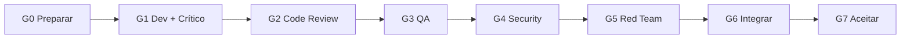

# E2E Runbook — Primeira corrida G0→G7 completa

Checklist auditável para a **primeira issue real** percorrendo todos os gates com evidências no dialogue, taskboard e artefatos.

**Issue de referência:** ANX-222 (commit wave P02 + drift eventing/contracts)  
**Pré-requisito global:** Owner autoriza Tier 1/2 para commits quando aplicável.

---

## Visão geral



| Gate | Persona principal | Tipo dialogue | Evidência mínima |
| --- | --- | --- | --- |
| G0 | Renata + Lucas | `plan`, `ack` | Pacote G0 na issue; `taskboard:ensure` |
| G1 | Lucas + Marina | `status`, `handoff`, `verdict` | Diff + oráculos + PASS crítico |
| G2 | Fernanda (+ hire) | `hire`, `verdict` | Relatório com refs de arquivo |
| G3 | Edu | `verdict` | req→teste→resultado |
| G4 | Isa | `verdict` | Achados classificados |
| G5 | Thiago | `verdict` | Cenários sandbox + cleanup |
| G6 | Renata | `handoff` | Candidato integrado testado |
| G7 | Renata (CTO) | `decision`, `approve` | `cto-accept` ACCEPT + comentário board |

---

## Pré-voo (antes de G0)

```bash
npm run taskboard:ensure
npm run orchestration:verify          # test + diagram-check + personas
npm run orchestration:proactive -- check --persona orchestrator
export CURSOR_THREAD_ID="${CURSOR_THREAD_ID:-cursor-e2e-$(date +%Y%m%d)}"
```

- [ ] `AGENTS.md` lido nesta sessão
- [ ] Issue `ANX-*` existe e escopo fechado
- [ ] Executor + crítico 1:1 identificados ([PERSONAS.md](./PERSONAS.md))
- [ ] Owner autorizou commits (se backend)

---

## G0 — Preparar

**Responsáveis:** Renata (`orchestrator`) + Lucas (`backend-executor`)

```bash
npm run taskboard:context
node scripts/taskboard.mjs get ANX-222
npm run orchestration:session -- start --persona orchestrator --issue ANX-222
npm run orchestration:session -- start --persona backend-executor --issue ANX-222
npm run orchestration:session -- start --persona backend-critic --issue ANX-222
npm run orchestration:workflow -- next --persona backend-executor --issue ANX-222
graphify query "ANX-222 eventing contracts module src drift"
```

**Checklist G0:**

- [ ] Pacote G0 comentado na issue (fonte `brain/`, capability, owner, oráculos)
- [ ] `agentsMdRead: true` · `taskboardEnsure: ok`
- [ ] Claim `in_progress` com thread binding (`taskctl` + `CURSOR_THREAD_ID`)
- [ ] Broadcast `ack` Lucas + Marina no dialogue

```bash
npm run orchestration:broadcast -- \
  --from-persona backend-executor --type ack --issue ANX-222 --gate G0 \
  --body "G0 completo — pacote na issue, escopo ANX-222." \
  --evidence "issue:ANX-222,file:DELEGATION-PACKAGE-ANX-222.md"
```

**Saída G0:** workflow state `complete-g0` · sessões ativas · zero SILENCE no monitor Level C.

---

## G1 — Desenvolver + Crítico

**Responsáveis:** Lucas + Marina

```bash
npm run orchestration:workflow -- monitor --level C
npm run orchestration:workflow -- next --persona backend-executor --issue ANX-222
npm run orchestration:broadcast -- \
  --from-persona backend-executor --type status --issue ANX-222 --gate G1 \
  --body "Candidato r1 — oráculos executados." \
  --evidence "cmd:npm run orchestration:verify"
npm run orchestration:broadcast -- \
  --from-persona backend-executor --to-persona backend-critic \
  --type handoff --issue ANX-222 --gate G1 \
  --body "@marina — candidato para revisão G1." \
  --evidence "diff:ANX-222"
```

**Checklist G1:**

- [ ] Tolerância zero: sem TODO sem ANX, sem mocks em produção
- [ ] Crítico independente revisou diff **exato** do candidato
- [ ] Marina emite `verdict` PASS com evidências

```bash
npm run orchestration:broadcast -- \
  --from-persona backend-critic --type verdict --issue ANX-222 --gate G1 \
  --body "PASS G1 — critérios satisfeitos." \
  --verdict PASS \
  --evidence "issue:ANX-222,gate:G1"
```

---

## G2 — Code Review

**Responsável:** Fernanda (`code-review-lead`)

```bash
npm run orchestration:hire -- --by-persona code-review-lead \
  --persona code-reviewer --issue ANX-222 \
  --reason "G2 independente ANX-222" --evidence "gate:G2,issue:ANX-222"
npm run orchestration:dismiss -- --persona code-reviewer --issue ANX-222 \
  --evidence "G2 PASS emitido"
```

---

## G3 — QA · G4 — Security · G5 — Red Team

Emitir `verdict` PASS por lead com evidência na issue. Retorno a G1 se CHANGES_REQUIRED.

---

## G6 — Integrar

Renata agrega G2–G5 no mesmo digest e posta `handoff` G6.

---

## G7 — Aceitar

```bash
npm run orchestration:cto-accept -- --issue ANX-222
npm run orchestration:session -- end --persona backend-executor
npm run orchestration:session -- end --persona backend-critic
npm run orchestration:session -- end --persona orchestrator
```

- [ ] `cto-accept` → ACCEPT
- [ ] Move `done` somente com autorização Owner/CTO
- [ ] Desbloqueia ANX-134

---

## Prova de pipeline excellence

| Artefato | Comando |
| --- | --- |
| Dialogue | `npm run orchestration:chat -- --issue ANX-222` |
| Verify | `npm run orchestration:verify` |
| Board | `node scripts/taskboard.mjs get ANX-222` |

Ver [PIPELINE.md](./PIPELINE.md) · [GOAL-STATUS.md](./GOAL-STATUS.md)
