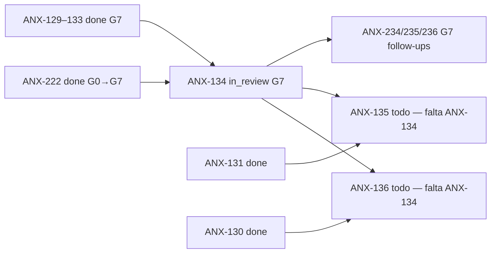

# Status do Goal — Orquestração anxionOS via Dashi Taskboard

**Data da auditoria:** 2026-09-09T16:42Z (ANX-237 **done** G7 PASS — commit `a161f00`; produto BLOCKED)
**Owner greenlight produto:** [PROJECT-GREENLIGHT.md](./PROJECT-GREENLIGHT.md) — `backend/`/`frontend/` **BLOCKED** até @Owner autorizar explicitamente; framework (ANX-230/237) continua.  
**Goal Cursor (produto):** *orchestrate anxionOS development via Dashi Taskboard with complete Google-style team* — **BLOCKED** (produto pausado — aguarda greenlight Owner; ver [examples/project-anxionos/OWNER-GREENLIGHT.anxionos.md](./examples/project-anxionos/OWNER-GREENLIGHT.anxionos.md))  
**Escopo desta auditoria:** `.cursor/orchestration/`, hooks, rules, config, CI — **não** slices P02 produto  
**Completude (framework Cursor v1):** **COMPLETE** — ver [GAP-ANALYSIS.md](./GAP-ANALYSIS.md)

---

## Métricas separadas: framework vs produto

| Dimensão | Completude | Veredito |
| --- | --- | --- |
| **Framework Cursor** (`.cursor/orchestration/`, rules, CLI, CI smoke) | **100%** | **READY** — 73/73 testes; plugins karpathy/ECC/ui-ux documentados; overlay `examples/project-anxionos/` |
| **Produto / pipeline** (issues `ANX-*` G0→G7, P02+) | Em curso | Escopo separado — não conta para % framework v1 |
| **Goal global Cursor** | **BLOCKED (produto)** | Framework READY; produto aguarda @Owner greenlight |

> Não misturar percentuais de framework com métricas de board/produto.

---

## Resumo executivo

| Aspecto | Estado | % |
| --- | --- | --- |
| **Tooling CLI** | ✅ `orchestration:verify` verde — 73/73 testes, diagram 36/36 (18 personas), standup CLI | **100%** |
| **Equipe Google-style** | ✅ 18 personas (núcleo + anéis), pares críticos 1:1 + cto-critic, equipes G2–G5 | **100%** |
| **Pipeline G0–G7 (docs + CLI)** | ✅ Workflows, compliance, phase-check, cto-decide/accept | **100%** |
| **Monitoramento (crons)** | ✅ **7 crons `[on]`, daemon em execução** | **95%** |
| **Dialogue ↔ chat Cursor** | ✅ `dialogue-in-cursor-chat` + `orchestration-dialogue` (alwaysApply) + handoff docs | **98%** |
| **Versionamento git** | ✅ Framework commitado (ANX-230); runtime e `.codewhale/` excluídos | **100%** |
| **Rename codewhale→cursor** | ✅ **CLOSED** (consolidado em ANX-230; ANX-232 canceled) — runtime `.cursor/orchestration-runtime/`; config `.cursor/orchestration.config.json` | **100%** |
| **Veredito do goal (framework)** | **COMPLETE** — tooling + versionamento; F3 global sync pós-commit | **100%** |

---

## Auditoria requisito a requisito

| Requisito do goal | Status | Evidência (2026-09-09 live) |
| --- | --- | --- |
| Equipe completa (executores + críticos + specialist teams) | ✅ **OK** | `npm run orchestration:personas` → 18 slugs; [TEAM.md](./TEAM.md), [PERSONAS.md](./PERSONAS.md) |
| karpathy-guidelines integration | ✅ **OK** | [GUIDELINES-INTEGRATION.md](./GUIDELINES-INTEGRATION.md) §1 |
| ecc-guide integration | ✅ **OK** | [GUIDELINES-INTEGRATION.md](./GUIDELINES-INTEGRATION.md) §2; G2 Fernanda, G4 Isa, G5 Thiago |
| ui-ux-pro-max (frontend only) | ✅ **OK** | [GUIDELINES-INTEGRATION.md](./GUIDELINES-INTEGRATION.md) §3; Camila/Paulo + Chrome DevTools MCP |
| Workflows G0–G7 | ✅ **OK** | 18× `workflows/` (incl. `workflow-cto-critic.md`); [COLLECTIVE-WORKFLOW.md](./COLLECTIVE-WORKFLOW.md) |
| Lifecycle P0–P7 (brainstorm → prod) | ✅ **OK** | [LIFECYCLE.md](./LIFECYCLE.md), `orchestration:phase`, 6 testes phase-check |
| Monitorar board | ✅ **OK** | `npm run taskboard:ensure` → `ok: true`, `http://127.0.0.1:47823` |
| Crons registrados | ✅ **OK** | `npm run orchestration:cron -- list` → 7 crons `[on]` |
| Crons em execução (daemon) | ✅ **ON** | `cron-manager.mjs start` ativo (PID verificado) |
| Delegar tarefas | ✅ **ATIVO** | ANX-134 `in_review` G1–G6 PASS_WITH_CONDITIONS; **G7 pendente @Owner**; filhos G7: ANX-234/235/236; ANX-135 G0 prep; [examples/project-anxionos/delegation-queue/ANX-134.md](./examples/project-anxionos/delegation-queue/ANX-134.md) |
| Pipeline G7 fila P02 | ✅ **OK** | ANX-129–133 `done` (G7 ACCEPT `cto-decide --apply` 2026-09-09T15:40Z; wave G2 0ed9dd63) |
| E2E G0→G7 comprovado | ✅ **OK** | ANX-222 G0→G7 com evidências (commit dc12039, G2–G5 gates 3f85d225 wave) |
| Testes CLI orquestração | ✅ **OK** | `npm run orchestration:verify` → 73/73 + diagram 36/36 + 18 personas (2026-09-09T16:05Z) |
| Rename codewhale→cursor | ✅ **CLOSED** | `orchestration:verify` 58/58; runtime `.cursor/orchestration-runtime/` (gitignored); config `.cursor/orchestration.config.json` tracked; `.codewhale/` deprecated (não removido) |
| Dialogue visibility (`orchestration:chat`) | ✅ **OK** | `dialogue-in-cursor-chat.mdc` (alwaysApply) + [CHAT-PARTICIPATION.md](./CHAT-PARTICIPATION.md) |
| Versionamento git (framework) | ✅ **OK** | Commit ANX-230 — `.cursor/orchestration/` + rules + hooks + CI |
| CI smoke orquestração (offline) | ✅ **OK** | `.github/workflows/orchestration-verify.yml` → `npm run orchestration:verify` |
| delegation-queue índice | ✅ **OK** | [delegation-queue/README.md](./delegation-queue/README.md) |
| ONBOARDING quick start | ✅ **OK** | [ONBOARDING.md](./ONBOARDING.md) § Quick start (5 min) |

---

## Estado do board (snapshot live)

| Métrica | Valor | Fonte |
| --- | --- | --- |
| Total issues | 222 | `taskboard:context` |
| `in_progress` | **0** | — |
| `in_review` | **2** | ANX-134 (G7 pendente @Owner), ANX-230 (framework commit F1) |
| `blocked` | 4+ | inclui ANX-136 (parcial: ANX-130 done) |
| `todo` | 44 | snapshot proactive |
| `done` | **169** | inclui ANX-129–133 (G7 ACCEPT 2026-09-09), ANX-221, ANX-222 |

### Cadeia crítica

---

## Sessões ativas

Fonte: `npm run orchestration:session -- list` (2026-09-09T16:42Z)

| Persona | Issue | Status |
| --- | --- | --- |
| *(nenhuma)* | — | ✅ **0 sessões** — 18 órfãs encerradas com `end --persona SLUG --force` pós-ANX-237 |

---

## Validação do framework

| Check | Resultado |
| --- | --- |
| Relatório de validação | [VALIDATION-REPORT.md](./VALIDATION-REPORT.md) — **READY WITH WARNINGS** |
| Taskboard | ✅ PASS (`npm run taskboard:ensure`) |
| Personas CLI | ✅ PASS (18 slugs) |
| Crons + daemon | ✅ PASS (7 `[on]`, daemon running) |
| Diagram-check | ✅ PASS (36/36 workflows; 67% cobertura global) |
| orchestration:verify | ✅ PASS (73/73 + diagram 36/36 + 18 personas — 2026-09-09T16:05Z) |
| Graphify index | ✅ PASS | `.graphify/out/graph.json` (~97 MB) |
| Global install | ✅ PASS | `~/.cursor/orchestration/VERSION` → 1.0.0 |
| ECC agent-compatibility | ⚠️ BASELINE | Score **43/100** (Functional) — gate opcional; top fixes: CI, linter, formatter ([TOOLING-INTEGRATION.md](./TOOLING-INTEGRATION.md)) |
| TEAM-ACTIVATION | ✅ CRIADO | [examples/project-anxionos/TEAM-ACTIVATION.md](./examples/project-anxionos/TEAM-ACTIVATION.md) |
| Arquivos stageáveis | ⚠️ | **177** (176 untracked framework + `.gitignore` modificado; runtime e `.codewhale/` excluídos) |
| Rename codewhale→cursor | ✅ CLOSED | Consolidado em ANX-230; ANX-232 canceled — paths canônicos `.cursor/orchestration-runtime/` |
| CI orchestration-verify | ✅ ADICIONADO | `.github/workflows/orchestration-verify.yml` |
| workflow monitor Level C | ✅ PASS | `npm run orchestration:workflow -- monitor --level C` — ANX-222 in_review |
| GUIDELINES-INTEGRATION | ✅ CRIADO — [GUIDELINES-INTEGRATION.md](./GUIDELINES-INTEGRATION.md) |
| GAP-ANALYSIS reconciliado | ✅ ATUALIZADO — 24 tipos, gaps remanescentes |

---

## Goal completion audit — podemos marcar COMPLETE?

| Critério | Atende? | Evidência |
| --- | --- | --- |
| Tooling operacional | ✅ Sim | VALIDATION-REPORT READY WITH WARNINGS |
| Equipe completa | ✅ Sim | 18 personas, G2–G5 |
| Crons + daemon | ✅ Sim | 7 crons `[on]`, PID ativo |
| Pipeline **ativo** (`in_progress`/`in_review`) | ✅ Sim | ANX-134 G1 + fila P02 G7 completa |
| E2E G0→G7 com evidências | ✅ **Sim** | ANX-222 G0→G7 (dc12039, wave 3f85d225) |
| Fila G7 P02 processada | ✅ **Sim** | ANX-129–133 `done` (G7 ACCEPT wave 0ed9dd63, 2026-09-09T15:40Z) |
| Testes automatizados CLI | ✅ **Sim** | `npm run orchestration:verify` → verde (2026-09-09T14:00Z) |
| CI smoke em GitHub Actions | ✅ **Sim** | `orchestration-verify.yml` (sem taskboard) |
| delegation-queue README | ✅ **Sim** | ANX-134/135/136 indexados |
| ONBOARDING quick start | ✅ **Sim** | SCOPE → prework → session → sync → ack |
| Owner documentou deferral | ❌ **Não** | nenhum comentário de adiamento |
| Owner autorizou commits ANX-222 | ✅ **Sim** | comment `4829521c` — Owner greenlight Cursor chat 2026-09-09 |
| Template Owner auth criado | ✅ **Sim** | [OWNER-AUTHORIZATION.md](./OWNER-AUTHORIZATION.md) — Templates A/B/C/D (2026-09-09) |
| CTO packages ANX-129–133 | ✅ **Sim** | [examples/project-anxionos/cto-packages/](./examples/project-anxionos/cto-packages/) — 5 summaries read-only |
| **Framework versionado no git** | ❌ **Não** | 177 arquivos stageáveis (runtime e `.codewhale/` excluídos por `.gitignore`) |
| **Rename codewhale→cursor** | ✅ **Sim** | CLOSED em ANX-230; ANX-232 canceled; `.codewhale/` deprecated, não removido |
| Owner autorizou commit framework | ❌ **Não** | pendente — ver ANX-230 |

### Veredito framework: **COMPLETE** · Goal global produto: **PARTIAL**

Framework Cursor v1 concluído e versionado (ANX-230). Goal global de orquestrar desenvolvimento do produto permanece PARTIAL — pipeline ANX-134+ separado.

---

## Dialogue visibility — root cause e fix

| Sintoma | Causa raiz | Fix |
| --- | --- | --- |
| Usuário não vê diálogo no chat | Coordenador não executa `orchestration:chat` nem cola bloco `CURSOR_CHAT_DIALOGUE` | Regra `dialogue-in-cursor-chat.mdc` (alwaysApply) + CHAT-PARTICIPATION § Obrigação do coordenador |
| Mensagens só no JSONL | Broadcast sem espelhamento no chat | Após `broadcast`/`speak` → `orchestration:chat --new-only` |
| Turno ignora mensagens novas | `.pending-chat-display` não verificado | Início de turno → `orchestration:chat --check-pending` |

**Mecanismo:** `chat-feed.mjs` grava `.cursor/orchestration-runtime/dialogue/.pending-chat-display`; agentes devem colar saída completa desde `<!-- CURSOR_CHAT_DIALOGUE: ... -->`.

---

## Escopo de commit preparado (não executado — aguarda Owner)

**Incluir:** `.cursor/orchestration/**`, `.cursor/rules/*`, `.cursor/hooks/**`, `.cursor/commands/`, **`.cursor/orchestration.config.json`** (config de projeto — tracked), `.github/workflows/orchestration-verify.yml`

**Excluir (runtime — `.gitignore` aplicado 2026-09-09, ANX-232):** `.cursor/orchestration-runtime/**` (jsonl, json state; exceto `.gitkeep` em subdirs). **Não incluir `.codewhale/`** (deprecated, ignorado integralmente).

| Métrica | Valor |
| --- | --- |
| `.cursor/orchestration/` | 151 |
| `.cursor/rules/` | 16 |
| `.cursor/hooks/` | 5 |
| `.cursor/commands/` | 2 |
| `.cursor/orchestration.config.json` | 1 |
| `.github/workflows/orchestration-verify.yml` | 1 |
| `.gitignore` (modificado) | 1 |
| **Total stageável** | **177** |

---

## Checklist remanescente (framework)

- [x] **F1 — Commit inicial:** Owner autorizou — framework versionado (ANX-230)
- [x] **F2 — Regra dialogue:** `.cursor/rules/orchestration-dialogue.mdc` alwaysApply ✅ (ANX-231 entregue; consolidado em ANX-230)
- [x] **F3 — Global sync:** `npm run orchestration:install-global` executado pós-commit
- [x] **F4 — Docs stale:** GOAL-STATUS + DEV-KICKOFF reconciliados ✅ (2026-09-09T15:35Z)
- [ ] **F5 — Cobertura visual (opcional):** diagram-check 67% → 80%+ — não bloqueia goal
- [x] **F6 — Hierarquia circular:** núcleo Owner+Renata+Cláudia — HIERARCHY.md + levels.mjs + verify ✅

---

## Issue de tracking framework

| Issue | Status | Escopo |
| --- | --- | --- |
| **ANX-230** | `in_review` | Framework Cursor: completar orquestração e versionar (issue pai consolidada) |
| ~~ANX-231~~ | `canceled` | Duplicata — gaps audit consolidados em ANX-230 (2026-09-09) |
| ~~ANX-232~~ | `canceled` | Duplicata — rename codewhale→cursor entregue e verificado (58/58); consolidado em ANX-230 |

---

## Owner authorization — ANX-222

**Scan 2026-09-09T14:08Z:** Owner greenlight recebido e commit executado.

| Evidência | Resultado |
| --- | --- |
| Comentário `4829521c` | Owner authorized via Cursor chat 2026-09-09 — Tier 1/2 |
| Commit `dc12039` | 565 paths — src modules + eventing/contracts drift |
| Comentário `0011b0f8` | G1 complete — oráculos 126/0, 22/0, boundaries 0 |
| Marina G1 | PASS (dialogue `bb1ca506`) |

## Veredito

### **Framework READY · Produto BLOCKED**

- **Framework:** **READY** — 73/73 verify; karpathy/ECC/ui-ux integrados; overlay anxionOS em `examples/project-anxionos/`.
- **Equipe:** roster Google-style com [GUIDELINES-INTEGRATION.md](./GUIDELINES-INTEGRATION.md).
- **Pipeline:** ativo (ANX-134 G1–G6 PASS_WITH_CONDITIONS @ de7ca50; **G7 pendente @Owner**; filhos ANX-234/235/236); ANX-135 G0 prep; ANX-129–133 `done`; ANX-222 `done`.
- **Monitoramento:** crons **on**, daemon rodando.
- **Completude framework:** **100% READY** · **Produto:** **BLOCKED** até greenlight Owner — G7 ANX-134 ([GAP-ANALYSIS.md](./GAP-ANALYSIS.md)).

### Não marcar goal global como completo

O goal de orquestrar desenvolvimento do **produto** exige pipeline ativo com evidências G0–G7 — separado do framework Cursor v1 (COMPLETE).

---

## Próxima ação

1. ~~Framework commit (ANX-230)~~ ✅ COMPLETE
2. ~~Global sync (`orchestration:install-global`)~~ ✅
3. **Produto (escopo separado):** ANX-134 G7 — ver [delegation-queue/](./delegation-queue/)
4. ~~**Opcional (F5):** `orchestration:progress`~~ ✅ entregue ANX-237

---

## Referências

- [GAP-ANALYSIS.md](./GAP-ANALYSIS.md) — gaps fechados e remanescentes (~98%)
- [CHAT-PARTICIPATION.md](./CHAT-PARTICIPATION.md) — dialogue visibility
- [GLOBAL-INSTALL.md](./GLOBAL-INSTALL.md) — instalação global
- [GUIDELINES-INTEGRATION.md](./GUIDELINES-INTEGRATION.md) — karpathy + ECC + ui-ux-pro-max
- [CTO-ACCEPTANCE.md](./CTO-ACCEPTANCE.md) — aceite G7 por evidências
- [START-WORK.md](./START-WORK.md) — como iniciar trabalho real
- [README.md](./README.md) — índice mestre
- [VALIDATION-REPORT.md](./VALIDATION-REPORT.md)
- [AGENTS.md](../../AGENTS.md) — regras canônicas
