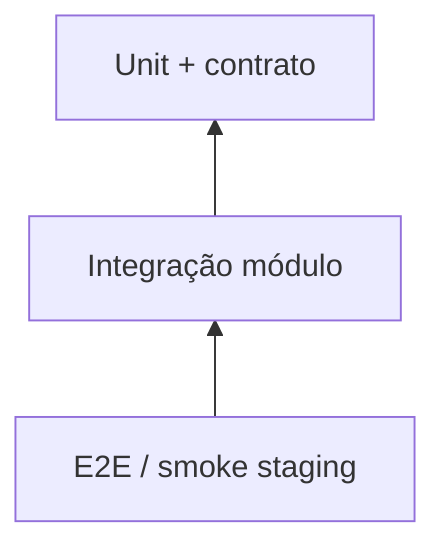

# Práticas Google/Bigtech — Mapeamento anxionOS

Como padrões de engenharia de bigtechs (Google, Meta, etc.) se traduzem na nossa orquestração Cursor. **Não** são regras do runtime do produto.

Referência: [LIFECYCLE.md](./LIFECYCLE.md) · [GOOGLE-PRACTICES.md](./GOOGLE-PRACTICES.md)

---

## Tabela de mapeamento

| Prática Google | Nossa implementação | Fase/Gate | Evidência |
| --- | --- | --- | --- |
| Design doc antes de código | `brain/` + OKF via OpenKnowledge MCP | P1 (G-D) | Spec em `brain/project-docs/specs/` |
| ADR / architecture review | Marcus + Archify | P2 (G-A) | ADR `status: accepted` |
| OKRs → work items | Issues `ANX-*` no Dashi Taskboard | P3 (G-P) | `npm run taskboard:list` |
| Code review culture | Gate G2 — Fernanda (`code-review-lead`) | P4 | Parecer independente no dialogue |
| Testing pyramid | Gate G3 — Camila (`qa-lead`) | P4 | Unit → integration → E2E |
| Security review (SRE) | Gate G4 — Isa (`security-lead`) | P4 + P5 | Parecer + staging review |
| Launch Readiness Review | Gate G-L — Renata + Owner | P6 | Launch checklist |
| Blameless postmortem | skill `write-a-postmortem` | P7 | Nota em `brain/` |
| No silent work | [NO-SILENT-WORK.md](./NO-SILENT-WORK.md) | Todas | Dialogue obrigatório |
| Evidence-based decisions | karpathy-guidelines + `--evidence` | Todas | [GUIDELINES-INTEGRATION.md](./GUIDELINES-INTEGRATION.md) |
| SLOs / observability | Ju + `@anxionos/observability` | P7 | Dashboards pós-deploy |

---

## Catálogo de interações no dialogue

Mapeamento completo standup, LGTM, cross-team consult, design review, incident bridge, etc. → tipos de dialogue:

**[INTERACTIONS.md § Catálogo Google-style](./INTERACTIONS.md#catálogo-google-style--padrões-de-equipe--tipos-de-dialogue)**

CLI standup: `npm run orchestration:standup -- --issue ANX-N`

## Design doc (P1)

**Google:** documento de design antes de implementação, revisado por pares.

**anxionOS:**

1. Escrever em `brain/project-docs/specs/` ou `brain/project-docs/proposals/`
2. Frontmatter OKF: `title`, `description`, `status: draft|proposed|accepted`
3. Renata valida escopo; Marcus valida arquitetura
4. **Proibido** codar `backend/` sem spec mínima (regra [lifecycle-compliance.mdc](../rules/lifecycle-compliance.mdc))

---

## Code review (G2)

**Google:** todo código revisado por alguém que não escreveu o diff.

**anxionOS:**

- Fernanda emite parecer G2 independente
- Executor que corrige passa a ser autor das correções — novo revisor necessário
- PASS invalidado se diff mudar após aprovação

---

## Testing pyramid (G3)

| Camada | Responsável | Comando típico |
| --- | --- | --- |
| Unit/contrato | Executor | `npm test` no módulo |
| Integração | QA | testes `backend/tests/` |
| E2E | Camila | `npm run test:e2e` |

---

## Security review (G4)

**Google:** review de segurança para mudanças que tocam trust boundaries.

**anxionOS:** Isa G4 em P4; revalidação em staging (P5) para superfícies expostas.

---

## Launch Readiness Review (P6)

Checklist em [BRAINSTORM-TO-PROD-RUNBOOK.md](./BRAINSTORM-TO-PROD-RUNBOOK.md) § P6.

Renata coordena; Owner só em exceções ([CTO-ACCEPTANCE.md](./CTO-ACCEPTANCE.md)).

---

## Postmortem blameless (P7)

**Google:** foco em sistema, não em culpados.

**anxionOS:** skill `write-a-postmortem` → nota em `brain/` com timeline, root cause, action items rastreáveis como `ANX-*`.

---

## Karpathy — decisões acionáveis

- Diagramas clarificam decisões, não decoram ([VISUAL-DOCUMENTATION.md](./VISUAL-DOCUMENTATION.md))
- Checklists com comandos copy-paste, não fluff
- Evidência em todo handoff: `command:…`, `file:…`, `brain/…`

---

## Diferenças conscientes

| Google | anxionOS Cursor team |
| --- | --- |
| Monorepo gigante | Repo único + `brain/` local OKF |
| Critique interno formal | Pipeline G0–G7 com personas nomeadas |
| Production SRE 24/7 | P5–P7 documentados; ops real TBD |
| OKR tooling interno | Dashi Taskboard local |
