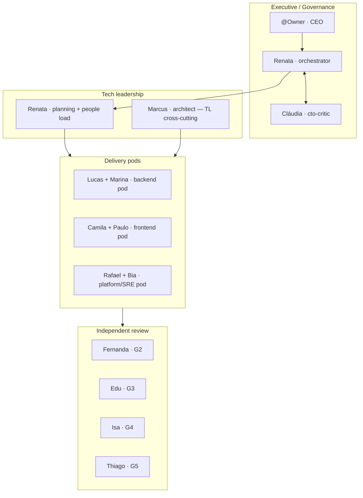
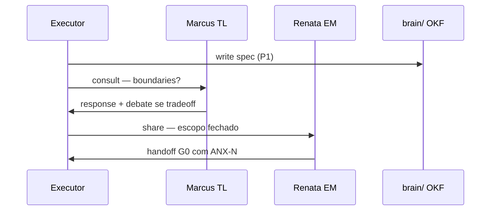

# Google Team Playbook — como times de engenharia Google trabalham (e como replicamos)

> **Escopo:** equipe Cursor em `.cursor/orchestration/`. Não descreve runtime do produto anxionOS.
>
> **Issue:** ANX-274 · complementa [GOOGLE-PRACTICES.md](./GOOGLE-PRACTICES.md) · [INTERACTIONS.md](./INTERACTIONS.md) · [CHAT-PARTICIPATION.md](./CHAT-PARTICIPATION.md)

---

## Princípios culturais (o “como” antes do “o quê”)

| Princípio Google | Na prática | Nossa implementação |
| --- | --- | --- |
| **Psychological safety** | Discordar com evidência sem medo | `debate` + `challenge` — crítico não é inimigo |
| **Blameless** | Postmortem foca sistema, não culpado | skill `write-a-postmortem` · P7 |
| **Data-driven** | Decisões com métricas e reprodução | `--evidence` · `command:` · `file:` |
| **Async-first** | Documento > reunião; contexto escrito | `brain/` OKF · `share` no dialogue |
| **Small batches** | CLs pequenos, integração contínua | Slices `ANX-*` · handoffs frequentes |
| **Ownership** | Quem constrói opera | Executor + crítico 1:1 · dono do módulo ADR0002 |
| **Respect the user** | LGTM só com leitura real | G2 independente · Fernanda não é rubber stamp |

---

## Papéis do time (mapeamento Google → personas)



| Papel Google | Responsabilidade típica | Persona anxionOS | Dialogue |
| --- | --- | --- | --- |
| **Engineering Manager** | Prioridade, capacidade, desbloqueio | Renata | `consult`, `decision`, `unblock` |
| **Tech Lead** | Design, tradeoffs, boundaries | Marcus | `consult`, `debate`, `share` |
| **SWE** | Implementação, testes, handoff | Executores Level C | `status`, `handoff`, `response` |
| **Reviewer** | Code health, readability | Fernanda G2 | `review`, `verdict` |
| **Test Engineer** | Pirâmide, regressão | Edu G3 | `plan`, `verdict` |
| **Security / SRE** | Trust boundaries, staging | Isa G4, Rafael P5–P7 | `consult`, `verdict` |
| **Incident Commander** | Bridge, mitigação | Renata + Rafael | `escalate`, `collab`, `status` |

---

## Rituais do ciclo (calendário de um slice)

| Ritual Google | Frequência | Formato | CLI / tipo dialogue |
| --- | --- | --- | --- |
| **Daily standup** | Início de turno longo | Feito / Fazendo / Bloqueio | `npm run orchestration:standup -- --issue ANX-N --post` |
| **Design doc review** | P1–P2, antes de código | Comentários async + debate | `consult` → `debate` → `response` |
| **Sprint planning** | P3 | Issues + delegation-queue | `plan` · taskboard |
| **Code review** | Cada handoff G1→G2 | Diff + LGTM ou changes | `review` → `verdict` |
| **Launch readiness** | P6 | Checklist + riscos | `plan` · G-L |
| **Blameless postmortem** | P7 / incidente | Timeline + action items | `share` · `write-a-postmortem` |
| **Tech talk / knowledge share** | Ad hoc | Spike → nota brain | `share` · Helena |

---

## Conversa natural de time (obrigatório)

Times Google **não** falam só com o manager. Eles:

1. **@mention direto** — executor pergunta ao TL, crítico questiona executor, QA consulta security.
2. **Thread de decisão visível** — RFC/debate no mesmo canal, não DM imaginário.
3. **Proxy proibido** — Renata roteia (`@lucas`), não responde técnico em nome de outro.
4. **Tom de colega** — PT-BR informal, técnico, humor leve ([PERSONA-VOICE.md](./PERSONA-VOICE.md)).

### Anti-padrões vs padrões

| ❌ Teatro de processo | ✅ Time de verdade |
| --- | --- |
| "Implementação concluída. Próximos passos: 1…" | "@marina — diff no bridge; o journal tá atômico com o UoW?" |
| Só Renata fala com @Owner | Executor + crítico respondem em 1ª pessoa quando @mention |
| Bullets sem persona | Blocos `---` com nome, slug, time |
| LGTM sem ler | `verdict` com `command:` e digest do diff |
| Debate infinito | Máx. 3 ciclos → `escalate` |

Exemplos completos: [templates/GOOGLE-NATURAL-TEAM-EXAMPLES.md](./templates/GOOGLE-NATURAL-TEAM-EXAMPLES.md).

---

## Design doc (antes de código)

**Google:** documento revisado por pares; alternativas e tradeoffs explícitos.

**Fluxo anxionOS:**



| Gate | Critério de saída |
| --- | --- |
| G-D (P1) | Spec em `brain/project-docs/specs/` · `status: proposed` mínimo |
| G-A (P2) | ADR `accepted` · Archify validado |

---

## Code review culture

| Regra Google | Enforcement |
| --- | --- |
| Autor ≠ revisor | G2 Fernanda independente |
| CL pequeno | Slice por `ANX-*`; não mega-PR |
| Readability counts | Fernanda + `thermo-nuclear-code-quality-review` hire |
| LGTM informal ≠ gate | `response` para ack; `verdict` para G2 |
| Correção invalida PASS | Re-review obrigatório |

---

## Testing pyramid (G3)

Ver [GOOGLE-PRACTICES.md](./GOOGLE-PRACTICES.md) § Testing pyramid. Edu valida comportamento reproduzível — não checklist vazio.

---

## SRE & operations (P5–P7)

| Conceito Google | anxionOS |
| --- | --- |
| SLI/SLO | Documentar em handoff P7 · `@anxionos/observability` |
| Error budget | Risco residual no `verdict` G7 |
| Toil reduction | Runbooks em `brain/runbooks/` (ANX-273) |
| Oncall | Rafael + escalação `escalate` |
| Incident bridge | `escalate` + `collab` + `status` a cada 15 min |

---

## OKRs → trabalho executável

| Camada Google | Camada anxionOS |
| --- | --- |
| Objective | Goal Cursor / épico em `brain/` |
| Key Result | Critério de aceite na issue |
| Work item | `ANX-*` no Dashi Taskboard |
| Commit | PR com `ANX-*` no título |

```bash
npm run taskboard:list
npm run orchestration:progress -- --issue ANX-N
```

---

## Product Company × Google rituals

As **12 etapas Product Company** ([PRODUCT-COMPANY-MODEL.md](./PRODUCT-COMPANY-MODEL.md)) mapeiam rituais Google por fase:

| PC# | Etapa | Ritual Google principal |
| ---: | --- | --- |
| 1–3 | Estratégia → Definition | Design doc · OKR |
| 4 | UX | Design review |
| 5–6 | Architecture → Planning | RFC · sprint planning |
| 7–9 | Dev → Review | Standup · CR · QA |
| 10 | Release | Launch readiness |
| 11–12 | Ops → Intelligence | Postmortem · feedback loop |

CLI: `npm run orchestration:phase -- company status --issue ANX-N`

---

## Checklist do turno (qualquer persona)

1. [ ] Ler contexto da issue + dialogue (`orchestration:dialogue -- read`)
2. [ ] Se turno longo ou 2+ personas: **standup** (`orchestration:standup --post`)
3. [ ] Antes de invadir domínio: **`consult`** ao owner do módulo
4. [ ] Durante trabalho: **`status`** >10 min sem post
5. [ ] Fim de marco: **`handoff`** ou **`verdict`** com evidência
6. [ ] No chat: **2+ blocos persona** conversando entre si quando aplicável
7. [ ] Parent: `orchestration:chat --new-only` verbatim

---

## Compliance & warnings

| Código | Quando |
| --- | --- |
| `PERSONA_ROBOTIC` | Bullets genéricos sem @mention nem bloco persona |
| `HIERARCHY_PROXY_ANSWER` | Orquestrador responde técnico sem `@mention` ao dono |
| `COORDINATOR_MONOLOGUE` | Só orchestrator em thread de implementação |
| `MISSING_ACK` | Executor sem ack após handoff |

Ver [COMPLIANCE.md](./COMPLIANCE.md) · [ZERO-POLICIES.md](./ZERO-POLICIES.md).

---

## Referências externas (conceitos, não cópia literal)

- Google Engineering Practices Documentation (design docs, code review)
- Site Reliability Engineering (blameless postmortem, error budgets)
- Working in a team (LGTM, readability, small CLs)

**Diferenças conscientes:** monorepo Google vs repo único + `brain/` local; SRE 24/7 real TBD; OKR tooling = Dashi Taskboard.
