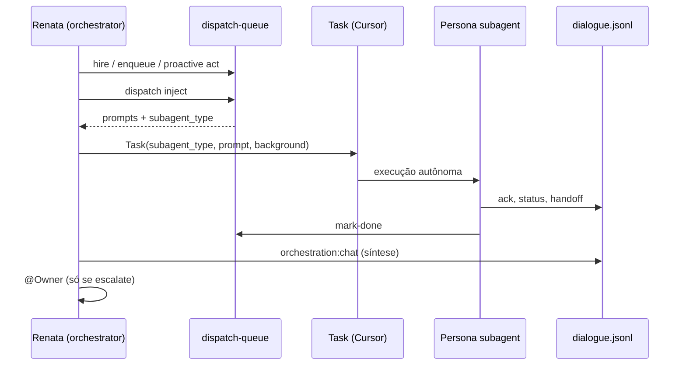

# Paridade Grok Bot — equipe autônoma no Cursor

Mapeamento entre **Grok Bot** (teammates xAI no Cursor) e o framework anxionOS — usando **todos os recursos nativos do Cursor**.

**Relacionados:** [CURSOR-AGENTS-INTEGRATION.md](./CURSOR-AGENTS-INTEGRATION.md) · [DELEGATION.md](./DELEGATION.md) · [agent-delegation/](./agent-delegation/)

---

## Modelo Grok Bot (referência)

| Capacidade Grok | O que faz |
| --- | --- |
| Teammate nomeado | Agente persistente com identidade, memória, estilo |
| Computador na nuvem | Browser, terminal, filesystem, logins persistentes |
| Trabalho paralelo | Vários bots na mesma conta, telas separadas |
| Mensagens entre bots | Passam contexto, ownership, status |
| Só volta para aprovação | Autônomo até senha/2FA/julgamento humano |
| Rotinas | Grava fluxo multi-step e reexecuta on-demand ou cron |

---

## Equivalente Cursor + anxionOS

| Grok Bot | Implementação anxionOS | Comando / ferramenta |
| --- | --- | --- |
| **Teammate nomeado** | Persona (`PERSONAS.md`) + `subagent_type` | `orchestration:personas` |
| **Spawn teammate** | Fila → `Task` Cursor | `orchestration:dispatch -- inject` ou `spawn-plan --json` |
| **Computador** | Workspace local + shell + MCP browser | Shell, Playwright, Chrome DevTools MCP |
| **Memória** | dialogue.jsonl + Supermemory + `brain/` | `orchestration:chat`, open-knowledge MCP |
| **Mensagens entre bots** | 24 tipos dialogue + @mentions | `orchestration:broadcast` / `speak` |
| **Passar ownership** | `handoff` / `verdict` | `--type handoff` com `--evidence` |
| **Paralelo** | `Task` + `run_in_background: true` | Multitask Mode + dispatch queue |
| **Rotinas** | Crons + workflow state | `orchestration:cron`, `registry.json` |
| **Aprovação humana** | `escalate` G7 + compliance | `orchestration:cto-decide` |
| **Monitoramento** | delegate-monitor + proactive | `orchestration:delegate-monitor` |

---

## Fluxo operacional (Grok-style)



---

## Protocolo do orquestrador (obrigatório)

### Início de sessão

```bash
npm run taskboard:ensure
npm run orchestration:proactive -- check --persona orchestrator
npm run orchestration:dispatch -- inject
# Ou JSON batch: npm run orchestration:dispatch -- spawn-plan --json
# Para cada item no bloco CURSOR_DISPATCH_QUEUE → invocar Task AGORA
npm run orchestration:delegate-monitor -- list
```

### Ao contratar (hire)

```bash
npm run orchestration:hire -- --by-persona orchestrator --persona build-error-resolver \
  --issue ANX-N --reason "..." --evidence "..."
# Auto-enfileira dispatch → spawn Task com orchestration:dispatch -- next
```

### Durante trabalho (cada ~10min)

```bash
npm run orchestration:delegate-monitor -- status --json
npm run orchestration:dispatch -- status
```

### Subagente concluiu

```bash
npm run orchestration:dispatch -- mark-done --id UUID --evidence "cmd:test pass"
npm run orchestration:chat -- --new-only
# Sintetizar com blocos persona + colar dialogue verbatim
```

---

## Recursos Cursor — checklist por teammate

Todo subagente despachado **DEVE** usar quando aplicável:

| Recurso | Namespace / CLI |
| --- | --- |
| Task (filhos) | `Task` tool com SUBAGENT-DELEGATION-PACKAGE |
| Skills | Ler SKILL.md (`manage-taskboard`, `orchestrate-work`, TDD, …) |
| graphify | `graphify query` antes de exploração |
| serena | `plugin-serena-serena` |
| open-knowledge | `brain/` somente via MCP |
| Supermemory | `workspaceRoot` absoluto |
| code-review-graph | review G2 / impacto |
| Playwright | E2E G3 |
| Chrome DevTools | inspeção `frontend/` |
| context7 | docs de bibliotecas |
| Shell | testes, lint, build reais |

---

## Diferenças honestas vs Grok Bot nativo

| Aspecto | Grok Bot | anxionOS framework |
| --- | --- | --- |
| VM isolada por bot | Não — VM compartilhada na conta | Workspace git compartilhado |
| Spawn automático | App spawna bot | Parent **deve** invocar `Task` após `dispatch inject` |
| UI mobile | App Grok iOS | Cursor desktop + dialogue no chat |
| Logins persistentes | Cloud browser | Env local + MCP browser na sessão |

O gap restante #1 é **spawn mecânico** — a fila `dispatch` elimina improviso; o parent ainda invoca `Task`, mas com prompt completo e checklist Grok-style.

---

## Verificação

```bash
npm run orchestration:dispatch -- status
npm run orchestration:verify
npm run orchestration:compliance -- --pre-work --issue ANX-N --persona orchestrator
```

**Última atualização:** 2026-09-10 · dispatch queue + paridade Grok Bot
