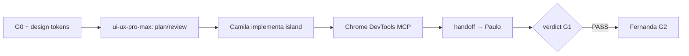

# Integração de Guidelines — Equipe Cursor anxionOS

Como as skills externas **karpathy-guidelines**, **ecc-guide** (subagentes ECC) e **ui-ux-pro-max** se aplicam a cada persona e gate do pipeline G0–G7.

**Relacionados:** [TEAM.md](./TEAM.md) · [DELEGATION.md](./DELEGATION.md) §6 · [COMPLIANCE.md](./COMPLIANCE.md) · [PIPELINE.md](./PIPELINE.md) · [GAP-ANALYSIS.md](./GAP-ANALYSIS.md) · [workflows/](./workflows/)

---

## Tabela resumo — persona → guideline → quando → gate

| Persona (slug) | Guideline | Quando invocar | Gate |
| --- | --- | --- | --- |
| Todos executores + críticos | **karpathy-guidelines** | Escrever, revisar ou refatorar código | G0–G1 |
| Renata (`orchestrator`) | karpathy + ecc-guide | Dispatch com escopo fechado; escolher subagente ECC | G0, G6–G7 |
| Lucas (`backend-executor`) | karpathy | Diff mínimo; oráculos antes de `handoff` | G0–G1 |
| Marina (`backend-critic`) | karpathy + `code-reviewer` | Bloquear over-engineering; `challenge` → `verdict` | G1 |
| Camila (`frontend-executor`) | karpathy + **ui-ux-pro-max** | Toda alteração visual em `frontend/`; Chrome DevTools MCP após diff | G0–G1 |
| Paulo (`frontend-critic`) | karpathy + ui-ux-pro-max | Auditar a11y, touch targets, hierarquia | G1 |
| Rafael, Diego (infra/adapters) | karpathy | Config tipada; sem hardcode não documentado | G0–G1 |
| **Fernanda** (`code-review-lead`) | karpathy + ecc-guide | `code-reviewer`, `typescript-reviewer`, `thermo-nuclear-*` | **G2** |
| Eduardo (`qa-lead`) | karpathy + ecc-guide | `e2e-runner`, `validation-review`, `pr-test-analyzer` | **G3** |
| **Isa** (`security-lead`) | karpathy + ecc-guide | `security-reviewer`, `mantis-threat-model` | **G4** |
| **Thiago** (`red-team-lead`) | karpathy + ecc-guide | `security-reviewer` adversarial, cenários de abuso | **G5** |
| Ju (`github-lead`) | ecc-guide | `ci-watcher`, `fix-ci`, `make-pr-easy-to-review` | CI |
| André (`docs-lead`) | karpathy | Docs concisas; linkar `brain/` em vez de duplicar | G0 |
| Marcus (`architect`) | karpathy | ADR/spec antes de código; `consult`, `debate` | G0 |
| Helena (`researcher`) | karpathy | Spike formal; entrega via `share` | on-demand |

Workflows individuais: [workflows/README.md](./workflows/README.md).

---

## Princípio geral

| Guideline | Escopo | Quando invocar |
| --- | --- | --- |
| **karpathy-guidelines** | Todos os executores e críticos | Sempre que escrever, revisar ou refatorar código |
| **ecc-guide** | Orquestrador + leads G2–G5 | Escolher subagente ECC certo; G4/G5 obrigatório |
| **ui-ux-pro-max** | Camila, Paulo, consoles P07 | Somente `frontend/` — nunca backend |

Nenhuma guideline substitui [AGENTS.md](../../AGENTS.md), tolerância zero ou pacote G0 com fontes `brain/`.

---

## 1. karpathy-guidelines

**Fonte:** skill `karpathy-guidelines` (Andrej Karpathy — pitfalls de coding com LLM).

### Regras operacionais (resumo)

| Regra | Aplicação na orquestração |
| --- | --- |
| Pensar antes de codar | Pacote G0 na issue antes de diff; `consult` se ambíguo |
| Simplicidade primeiro | Sem abstração single-use; sem features não pedidas |
| Mudanças cirúrgicas | Diff mínimo; não “melhorar” código adjacente |
| Execução orientada a meta | Oráculos explícitos no handoff (`bun test`, `boundaries`, etc.) |

### Por persona

| Persona / grupo | Como aplica | Evidência no workflow |
| --- | --- | --- |
| **Lucas** (`backend-executor`) | Delta mínimo por módulo; oráculos antes de `handoff` | [workflow-backend-executor.md](./workflows/workflow-backend-executor.md) |
| **Marina** (`backend-critic`) | Bloqueia over-engineering e TODO sem `ANX-*` | `challenge` → `verdict` G1 |
| **Camila** (`frontend-executor`) | Islands mínimas; sem SPA desnecessária | + ui-ux-pro-max abaixo |
| **Paulo** (`frontend-critic`) | Rejeita UI decorativa sem spec P07 | `verdict` G1 frontend |
| **Rafael, Diego** (infra/adapters) | Config tipada; sem hardcode não documentado | workflows `infra-*`, `adapters-*` |
| **Fernanda** (G2) | Relatório com refs arquivo/linha; sem refactor oportunista | `review` → `verdict` |
| **Renata** (orquestradora) | Dispatch com escopo fechado e critérios verificáveis | `handoff` com `--evidence` |
| **André** (docs) | Docs concisas; linkar `brain/` em vez de duplicar | `share`, `handoff` |
| **Marcus** (architect) | ADR/spec antes de código; sem stack inventada | `consult`, `debate` |

### Checklist rápido (executor)

1. Critério de sucesso declarado no `ack` ou primeiro `status`
2. Plano em 3–5 passos com `verify:` por passo
3. Diff: cada linha rastreável ao escopo da issue
4. Handoff lista comandos executados e resultado numérico

---

## 2. ecc-guide — subagentes ECC por gate

**Fonte:** skill `ecc-guide` + catálogo ECC (`security-reviewer`, `typescript-reviewer`, etc.).

O ecc-guide orienta **qual componente ECC usar**; na prática a equipe invoca **subagentes** via Task tool ou hire documentado.

### Matriz gate → subagentes ECC

| Gate | Lead | Subagentes ECC primários | Foco |
| --- | --- | --- | --- |
| **G1** | Crítico 1:1 | `code-reviewer`, `silent-failure-hunter` | Zero-tolerância, erros engolidos |
| **G2** | Fernanda | `code-reviewer`, `typescript-reviewer`, `thermo-nuclear-code-quality-review` | Contratos, manutenção, blast radius |
| **G3** | Eduardo | `e2e-runner`, `validation-review`, `pr-test-analyzer` | Comportamento reproduzível |
| **G4** | Isabella | `security-reviewer`, `mantis-threat-model` | Trust boundaries, secrets, tenancy |
| **G5** | Thiago | `security-reviewer` (adversarial), cenários de abuso | Sandbox autorizado; sem capital real |
| **CI** | Ju | `ci-watcher`, `fix-ci`, `make-pr-easy-to-review` | PR com `ANX-*`, checks verdes |
| **Debug** | Executor | `build-error-resolver`, `systematic-debugging` | Falha de build/type — hire Level C |

### Padrões G4 (Security)

- Fronteiras de confiança: API, workers, adapters externos
- Secrets: nunca em events/DTOs; `.env.example` + store autorizado
- Autorização multi-tenant: RLS, contexto de agency
- Dependências: CVEs proporcionais ao escopo
- **Evidência:** `verdict` com severidade + path/linha + reprodução ou N/A justificado

### Padrões G5 (Red Team)

- Fixtures/sandbox/staging apenas
- Bypass de autoridade, prompt injection em superfícies de agente, concorrência
- Condição de parada documentada na issue
- **Evidência:** cenário, passos, resultado, cleanup

### Hire ECC (Level C)

```bash
npm run orchestration:hire -- \
  --by-persona backend-executor --persona build-error-resolver \
  --issue ANX-N --reason "..." --evidence "command:..."
```

Máx. 3 on-demand por issue. Dismiss com `--evidence` de entrega.

---

## 3. ui-ux-pro-max — frontend P07

**Fonte:** skill `ui-ux-pro-max` (design intelligence: a11y, layout, tokens, stacks).

### Escopo restrito

| Permitido | Proibido |
| --- | --- |
| `frontend/` consoles Astro + React islands | `backend/`, scripts de orquestração |
| Tokens [design system](../../docs/design-system/README.md) | Inventar paleta fora do MASTER |
| WCAG 2.2 (contraste, focus, labels) | Emoji como ícones em produção |

### Por persona frontend

| Persona | Papel | ui-ux-pro-max |
| --- | --- | --- |
| **Camila** (`frontend-executor`) | Implementa UI; consulta skill antes de componentes novos | **Obrigatório** em toda alteração visual |
| **Paulo** (`frontend-critic`) | Audita a11y, touch targets, hierarquia | Valida prioridades 1–3 da skill (a11y, touch, performance) |
| **Edu** (G3) | E2E + regressão visual | `e2e-runner` + checklist ux da skill |
| **Isa** (G4) | Superfícies com auth/dados sensíveis na UI | XSS, CSP, dados em DOM |

### Workflow integrado (Camila + Paulo)



**Pós-alteração UI:** inspecionar com Chrome DevTools MCP (regra AGENTS.md).

---

## 4. Tooling stack (graphify, serena, archify, MCPs)

**Fonte canônica:** [TOOLING-INTEGRATION.md](./TOOLING-INTEGRATION.md) · regra [tooling-mandatory.mdc](../rules/tooling-mandatory.mdc)

> O Owner pode referir-se a "anchfy" — o nome correto é **Archify**.

| Ferramenta | Quando | Personas | Gate |
| --- | --- | --- | --- |
| **graphify** | Antes de Grep/Glob/Read em massa; após editar código | Todos executores, críticos | G0.8, G0.14 |
| **serena** (MCP) | Edição/refactor em símbolos | Executores, G2 | G0.14, G1–G2 |
| **archify** | Arquitetura, P2, handoffs visuais | Marcus, Renata, André | P2, G0.10 |
| **open-knowledge** | Leitura/escrita `brain/` | Todos; docs/research/architect | G0.6, G0.14 |
| **code-review-graph** | Impacto e review G2 | Fernanda | G2 |
| **Supermemory** | Recall de sessão | Todos (turno substantivo) | G0 |

Subagentes: incluir [SUBAGENT-PROMPT-TOOLING.md](./templates/SUBAGENT-PROMPT-TOOLING.md) em todo Task/delegation.

---

## 5. Integração por workflow individual

Cada `workflow-{slug}.md` deve referenciar esta página na seção **Ferramentas obrigatórias**. Resumo:

| Slug | karpathy | ECC | ui-ux-pro-max |
| --- | --- | --- | --- |
| `orchestrator` | dispatch escopo fechado | `dispatching-parallel-agents` | — |
| `backend-executor` | ✅ obrigatório | `typescript-reviewer`, `database-reviewer` | — |
| `backend-critic` | ✅ bloqueia complexidade | `code-reviewer` | — |
| `frontend-executor` | ✅ | `react-reviewer` | ✅ obrigatório |
| `frontend-critic` | ✅ | `a11y-architect` | ✅ validação |
| `code-review-lead` | ✅ relatório cirúrgico | `code-reviewer`, `thermo-nuclear-*` | — |
| `security-lead` | evidência rastreável | `security-reviewer`, `mantis-threat-model` | — |
| `red-team-lead` | cenários verificáveis | adversarial `security-reviewer` | — |
| `qa-lead` | critérios mensuráveis | `e2e-runner`, `validation-review` | Camila scope only |

Lista completa: [workflows/README.md](./workflows/README.md).

---

## 6. Evidência no dialogue

Ao aplicar guidelines, citar no `--evidence`:

```bash
npm run orchestration:broadcast -- \
  --from-persona backend-executor --type handoff \
  --issue ANX-N --gate G1 \
  --body "Handoff com oráculos verdes." \
  --evidence "skill:karpathy-guidelines,command:cd backend && bun test,file:.cursor/orchestration/GUIDELINES-INTEGRATION.md"
```

| Tipo evidence | Exemplo |
| --- | --- |
| Skill | `skill:karpathy-guidelines` |
| Subagente ECC | `subagent:security-reviewer` |
| UI | `skill:ui-ux-pro-max,domain:accessibility` |
| Comando | `command:cd backend && bun test` |

---

## 7. Verificação

```bash
# Personas e workflows
npm run orchestration:personas
ls .cursor/orchestration/workflows/workflow-*.md | wc -l   # esperado: 17

# Issue ativa — próximo passo
npm run orchestration:workflow -- next --persona backend-executor --issue ANX-222

# Monitor Level C
npm run orchestration:workflow -- monitor --level C
```

---

**Última atualização:** 2026-09-09 · Auditoria goal orquestração anxionOS
