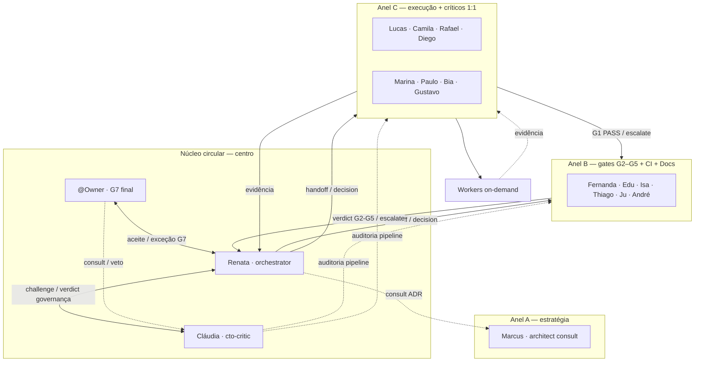
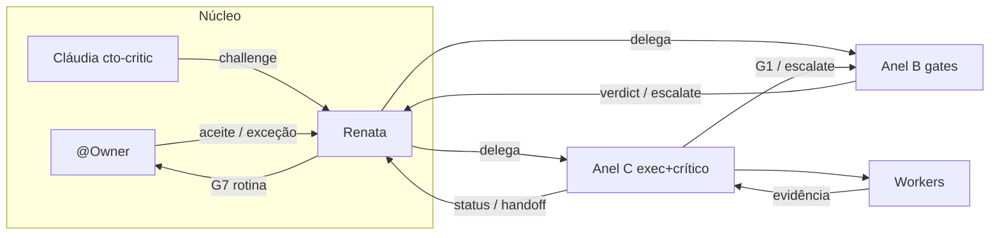
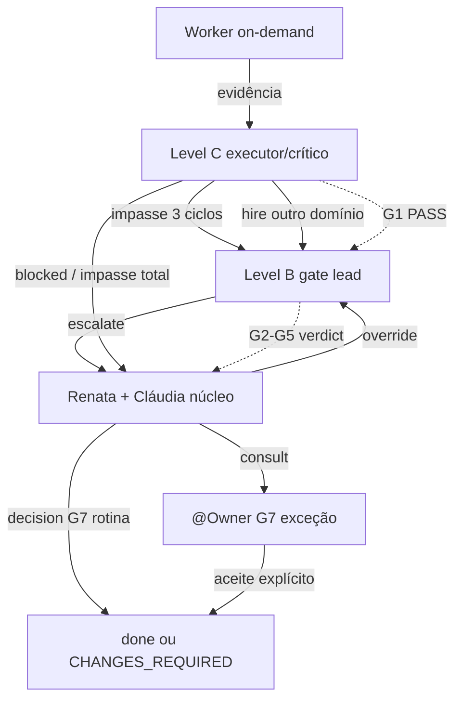

# Hierarquia circular — anxionOS

> **Escopo:** personas e workflows aqui descrevem apenas a **equipe de desenvolvimento no Cursor** — não os agentes institucionais do produto anxionOS. Ver [SCOPE.md](./SCOPE.md).

Modo **HIERARCHY_CIRCULAR** (default): mandato desce do **núcleo** para anéis A→B→C→Workers; evidência, pareceres e escalações **retornam ao centro** — sem hierarquia morta.

**Relacionados:** [HIRE-DELEGATION.md](./HIRE-DELEGATION.md) · [PERSONAS.md](./PERSONAS.md) · [CTO-AUTHORITY.md](./CTO-AUTHORITY.md) · [COLLECTIVE-WORKFLOW.md](./COLLECTIVE-WORKFLOW.md) · [VISUAL-DOCUMENTATION.md](./VISUAL-DOCUMENTATION.md)

---

## Núcleo circular (centro)

O centro não é um nível A/B/C — é o **hub de autoridade** onde mandato e aceite convergem.

| Papel | Quem | Autoridade |
| --- | --- | --- |
| **Owner** | @Owner (humano) | G7 final, exceções, greenlight, veto |
| **Orquestradora** | Renata (`orchestrator`) | Delegação G0–G6, `decision` operacional, hire override, aceite G7 rotina ([CTO-ACCEPTANCE.md](./CTO-ACCEPTANCE.md)) |
| **Crítica de governança** | Cláudia (`cto-critic`) | Par de Renata — challenge de delegação, evidência G6/G7, hires/escalações; **não** implementa nem decide G7 |

**Por que Cláudia e não Marina?** Marina é crítica **de domínio** (G1 backend de Lucas). O núcleo exige crítica **de governança** independente — delegação, hires, roteamento de escalação e completude de evidência G6/G7. Misturar os papéis criaria conflito de interesse.

**Regra circular:** nenhum caminho termina em B ou C sem retorno ao núcleo. Escalações, hires fora de domínio e `decision` passam por Renata (+ Cláudia em colaboração); G7 exige @Owner em exceções.

---

## Níveis (anéis externos ao núcleo)

| Nível | Personas permanentes | Papel |
| --- | --- | --- |
| **Núcleo** | @Owner, Renata (`orchestrator`), Cláudia (`cto-critic`) | Autoridade, orquestração, crítica de governança |
| **A** | Marcus (`architect`) | Consult ADR/boundaries — não implementa |
| **B** | Fernanda, Edu, Isa, Thiago, Ju, André | Gate leads G2–G5 + CI + Docs |
| **C** | Lucas/Camila/Rafael/Diego + críticos pareados | Execução G0–G1 + challenge |
| **On-demand** | Workers e specialists | Contratados por issue ([HIRE-DELEGATION.md](./HIRE-DELEGATION.md)); dismiss ao concluir subtask/gate |

---

## Fluxo circular (mandato ↓ evidência ↑)

---

## Escalação hierárquica (retorno ao centro)

---

## Hire delegado B/C

Level **B** e **C** podem contratar membros **da sua equipe/domínio** sem esperar o núcleo. Renata retém **override**, **reject** e auditoria via `hire-log.jsonl`; Cláudia audita hires com `--evidence` incompleto ou fora de escopo.

**Owner override:** @Owner pode vetar qualquer hire ou `decision` G7 — acima de Renata.

Detalhes: [HIRE-DELEGATION.md](./HIRE-DELEGATION.md) · Monitor Level C: [LEVEL-C-MONITORING.md](./LEVEL-C-MONITORING.md)

---

## Autonomia Level C — melhoria do framework

Pares executor↔crítico (anel C) podem **identificar gaps, erros e melhorias** nos artefatos de orquestração do **seu domínio** e **aplicar correções** sem aguardar Renata — com issue `ANX-*` claimada, colaboração do par, broadcast no dialogue e `orchestration:verify` após mudanças materiais.

**Podem:** workflows próprios, entradas em `PERSONAS.md`, `delegation-queue/` do domínio, docs scoped do time.

**Não podem:** política global (HIERARCHY, MANDATORY-COMPLIANCE, CTO-AUTHORITY, hire levels, roster); workflows de outro domínio sem `consult`.

Detalhes, matriz e exemplo Lucas+Marina: [COMPETENCE-BOUNDARIES.md#autonomia-level-c--melhoria-do-framework](./COMPETENCE-BOUNDARIES.md#autonomia-level-c--melhoria-do-framework)

---

## Interação livre dentro da hierarquia

Qualquer persona pode `@mention` qualquer outra no chat e dialogue — respeitando competências exclusivas ([COMPETENCE-BOUNDARIES.md](./COMPETENCE-BOUNDARIES.md)).

| Nível | Interação |
| --- | --- |
| **Núcleo ↔ anéis** | handoff, decision, escalate, consult — retorno obrigatório ao centro |
| **C ↔ C** | consult, debate, share, pair — sem verdict alheio |
| **C → B** | consult, escalate; B emite verdict do seu gate |
| **C → Núcleo** | escalate / blocked (impasse ou hire cross-domain) |
| **B ↔ B** | coordenação multi-gate |
| **Núcleo → todos** | handoff, decision, vote — Renata delega; Cláudia challenge |

Protocolo: [INTER-AGENT-PROTOCOL.md](./INTER-AGENT-PROTOCOL.md) · Roster: [AGENT-ROSTER.md](./AGENT-ROSTER.md) · CLI: `npm run orchestration:who -- --list`
