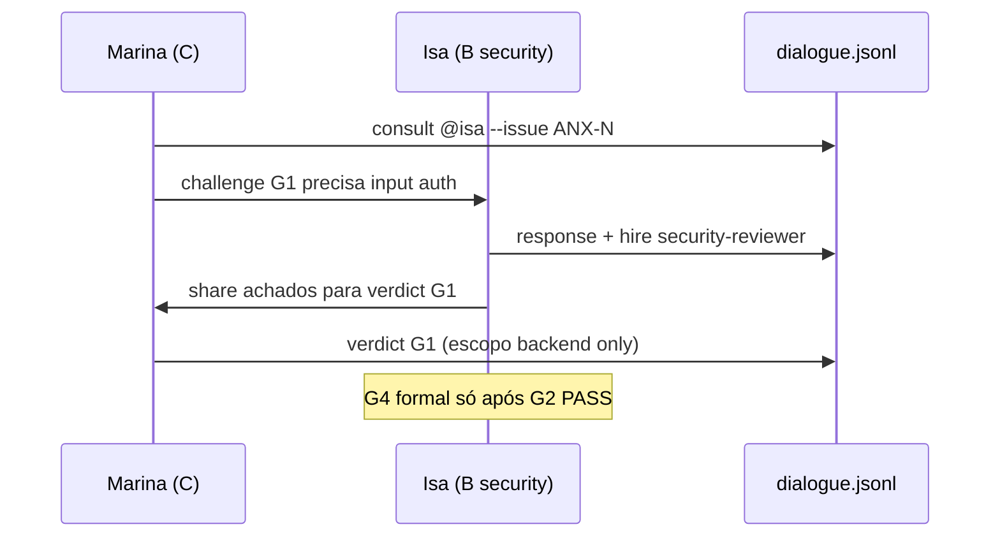
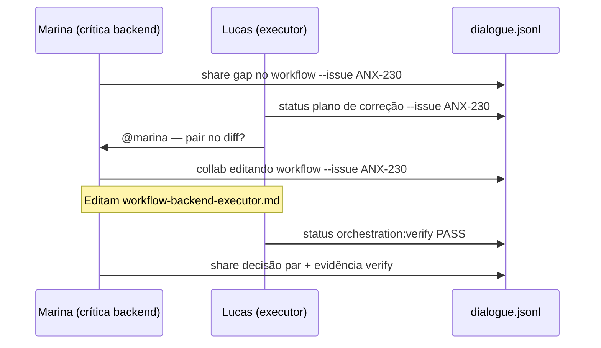

# Protocolo Inter-Agentes — Interação Livre dentro da Hierarquia

Qualquer agente **pode** interagir com qualquer outro via chat e dialogue — respeitando nível A/B/C e **sem invadir competências exclusivas** ([COMPETENCE-BOUNDARIES.md](./COMPETENCE-BOUNDARIES.md)).

**Relacionados:** [AGENT-ROSTER.md](./AGENT-ROSTER.md) · [INTERACTIONS.md](./INTERACTIONS.md) · [CHAT-PARTICIPATION.md](./CHAT-PARTICIPATION.md) · [HIERARCHY.md](./HIERARCHY.md)

---

## Princípios

1. **Conhecimento mutuo** — ler [AGENT-ROSTER.md](./AGENT-ROSTER.md) no onboarding.
2. **@mention livre** — qualquer persona pode mencionar qualquer outra no chat e no dialogue.
3. **Hierarquia circular** — @Owner + Renata + Cláudia no centro; anéis A/B/C retornam ao núcleo em escalações e G7.
4. **Nunca silencioso** — sempre `--issue ANX-N` em `speak`/`broadcast`.
5. **Consult ≠ invasão** — perguntar é sempre OK; editar domínio alheio não.

---

## Regras por nível

| De → Para | Permitido | Restrição |
| --- | --- | --- |
| **C → C** (peer) | `consult`, `debate`, `share`, `pair`, `question`, `status` | Não emitir `verdict` do gate alheio; não editar domínio exclusivo do peer |
| **C → B** | `consult`, `escalate`, `review` (pedido), `handoff` (após G1) | B emite verdict **do seu** gate apenas |
| **C → Núcleo** | `escalate`, `ack`, `blocked` | Retorno ao centro (Renata + Cláudia); @Owner só G7 exceção |
| **B → B** | `consult`, `collab`, `share`, coordenação multi-gate | Cada lead mantém verdict independente do próprio gate |
| **B → C** | `handoff`, `review`, `challenge` (contexto), `question` | Não reimplementar no lugar do executor |
| **B → A** | `escalate`, `status`, `verdict` agregado | G6 preparação |
| **A → qualquer** | `handoff`, `decision`, `vote`, `escalate` inverso | Renata coordena, não monopoliza técnico |
| **qualquer → Marcus** | `consult`, `debate` | Marcus **não** decide G7 nem implementa |
| **qualquer → Helena** | `research`, `consult` | Helena entrega `share`, não código prod |

### Marcus (architect) — consult-only

- Pode: `consult`, `debate`, `share` sobre ADR0002, boundaries, tradeoffs.
- Não pode: `verdict` G1–G7, implementar em `backend/`/`frontend/`, `decision` G7.

### Núcleo circular

- **@Owner** — G7 final, veto, exceções.
- **Renata** (`orchestrator`) — decision operacional e aceite G7 rotina.
- **Cláudia** (`cto-critic`) — par crítico de Renata; challenge de governança.

### Renata (orchestrator) (orchestrator)

- Única `decision` operacional e aceite G7 delegado ([CTO-AUTHORITY.md](./CTO-AUTHORITY.md)).
- Pode `@mention` qualquer um para destravar pipeline.

---

## Matriz de interação (from_level × to_level × tipos)

| from \ to | C | B | A | on-demand |
| --- | --- | --- | --- | --- |
| **C** | consult, debate, share, pair, question, status | consult, escalate, review, handoff | escalate, ack | research, consult |
| **B** | handoff, review, question, consult | consult, collab, share, status | escalate, status, verdict | research, consult |
| **A** | handoff, question, status | handoff, consult, vote | decision, escalate | research, handoff |
| **on-demand** | share, consult | share, consult | share, escalate | share |

**Tipos proibidos cross-level (invasão):**

- C emite `verdict` G2–G7
- C contrata lead B (ver [HIRE-DELEGATION.md](./HIRE-DELEGATION.md))
- B emite `verdict` de gate que não é o seu
- Qualquer um exceto Renata emite `decision` G7

---

## Sequência típica: consult cross-domain

```mermaid
sequenceDiagram
  participant L as Lucas (backend C)
  participant C as Camila (frontend C)
  participant M as Marina (crítica)
  participant D as dialogue.jsonl

  L->>D: consult @camila --issue ANX-N
  L->>C: @camila — contrato API afeta OrderPanel?
  C->>D: response --issue ANX-N
  C->>L: Campos X,Y; sem mudança em frontend/
  Note over L: NÃO edita frontend/
  L->>D: status --issue ANX-N
  L->>M: handoff G1
  M->>D: verdict PASS G1
```

---

## Sequência: crítico → lead B



---

## Obrigatório em toda interação

```bash
npm run orchestration:speak -- \
  --persona <slug-origem> \
  --body "@destino — mensagem" \
  --issue ANX-N \
  --type consult
```

| Requisito | Motivo |
| --- | --- |
| `--issue ANX-N` | Rastreabilidade taskboard + audit |
| Persona real no `from` | Não falar pela outra persona |
| Espelhar no chat | [CHAT-PARTICIPATION.md](./CHAT-PARTICIPATION.md) |
| `orchestration:who` em dúvida | Evitar invasão |

---

## Integração com tipos de INTERACTIONS.md

| Tipo | Competência | Quem inicia | Nível min |
| --- | --- | --- | --- |
| `ack` | Destinatário do handoff | Executor, crítico, B | C |
| `status` | Compartilhada | Qualquer ativo na issue | C |
| `share` | Compartilhada | Qualquer | C |
| `consult` | Compartilhada | Qualquer (→ Marcus comum) | C |
| `question` | Compartilhada | Qualquer | C |
| `response` | Autor consultado | Destinatário de consult/challenge | C |
| `debate` | Compartilhada (max 3 ciclos) | Qualquer | C |
| `collab` / `pair` | Mesmo domínio/escopo | Par executor↔crítico | C |
| `handoff` | Destinatário após ack | A, B, executor C | C |
| `challenge` | Crítico pareado G1 | Críticos C | C |
| `verdict` | Exclusiva por gate | Crítico G1; Leads G2–G5; Renata G6/G7 | C/B/A |
| `review` | Pedido; verdict do gate owner | B ou orquestrador | B |
| `research` | Helena → `share` | A/B | on-demand |
| `vote` | Proposta colegiada | Renata + time | A |
| `decision` | **Exclusiva Renata** | orchestrator | A |
| `approve` | Legado G7 (preferir `decision`) | orchestrator | A |
| `hire` / `dismiss` | Por nível ([HIRE-DELEGATION.md](./HIRE-DELEGATION.md)) | A, B, executor C | C/B/A |
| `block` | Renata ou lead B do gate | orchestrator, gate leads | B/A |
| `unblock` | **Exclusiva Renata** | orchestrator | A |
| `plan` | Dono G0/G3 | Executor, qa-lead | C/B |
| `policy` | **Exclusiva Renata** | orchestrator | A |
| `escalate` | Escala sem decidir | Qualquer | C |

Mapa completo (24 tipos): [INTERACTIONS.md](./INTERACTIONS.md)


---

## Melhoria do framework (Level C)

Pares executor↔crítico podem melhorar artefatos de orquestração do **seu domínio** a qualquer momento ([COMPETENCE-BOUNDARIES.md#autonomia-level-c--melhoria-do-framework](./COMPETENCE-BOUNDARIES.md#autonomia-level-c--melhoria-do-framework)).

### Tipos de dialogue para melhoria de framework

| Fase | Tipo | Quem | Exemplo |
| --- | --- | --- | --- |
| Identificar gap | `share` | Executor ou crítico | "Gap: workflow sem passo verify" |
| Plano de correção | `status` ou `plan` | Executor (claim) | "Adicionar passo 8 ao checklist" |
| Trabalho conjunto | `collab` / `pair` | Par do domínio | "Pair editando workflow-backend-executor.md" |
| Decisão do par | `share` | Crítico ou executor | "DECISÃO PAR: melhoria aplicada; verify PASS" — **não** usar tipo `decision` (exclusivo Renata) |
| Bloqueio global | `escalate` | Qualquer C | "@renata mudança afeta HIERARCHY.md" |
| Cross-team | `consult` | Par origem → par alvo | "@camila — posso referenciar seu handoff no nosso workflow?" |

### Sequência típica: melhoria de workflow



### Regras

1. Sempre `--issue ANX-N` (criar issue de framework se necessário).
2. `MISSING_CRITIC_PAIR` — melhoria de framework exige executor **e** crítico ativos na issue.
3. Após diff material: `npm run orchestration:verify`.
4. Política global → `escalate` a Renata; workflow alheio → `consult` ao par dono.
5. Verificar escopo: `npm run orchestration:who -- --persona <slug> --can-i "edit framework workflow"`.
