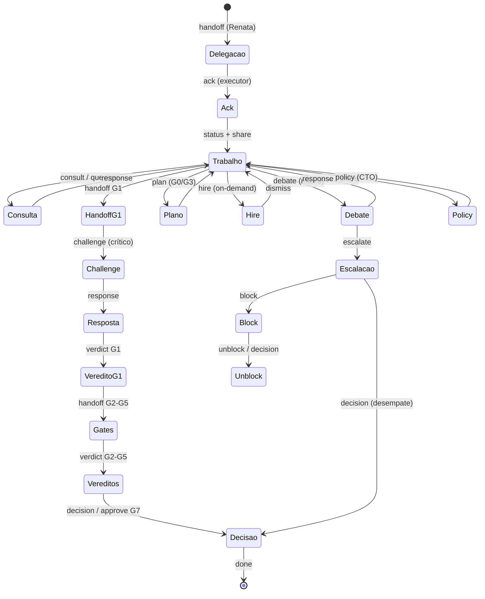

# Taxonomia de Interações — Equipe anxionOS

Lista **canônica** de tipos de mensagem no dialogue (`.cursor/orchestration-runtime/dialogue/dialogue.jsonl`). Cada tipo tem gatilho, condição de saída, campos e competência.

**Relacionados:** [INTER-AGENT-PROTOCOL.md](./INTER-AGENT-PROTOCOL.md) · [COMPETENCE-BOUNDARIES.md](./COMPETENCE-BOUNDARIES.md) · [protocol.mjs](./agent-dialogue/protocol.mjs) · [NO-SILENT-WORK.md](./NO-SILENT-WORK.md) · [HIRE-DELEGATION.md](./HIRE-DELEGATION.md) · [CTO-AUTHORITY.md](./CTO-AUTHORITY.md)

---

## Resumo (24 tipos)

| type | descrição | quem usa | nível min | obrigatório quando | dialogue fields | exemplo CLI | competência |
| --- | --- | --- | --- | --- | --- | --- | --- |
| `ack` | Confirma recebimento de delegação/handoff | Executor, crítico, B | C | Após `handoff` ou delegação Renata | `issueId`, `body`, `to.mention` | `npm run orchestration:broadcast -- --from-persona backend-executor --type ack --issue ANX-N --body "Recebido."` | Compartilhada — destinatário do handoff |
| `status` | Progresso ou heartbeat durante trabalho | Qualquer persona ativa | C | Claim `in_progress`; a cada marco; >10 min silêncio | `issueId`, `body`, `threadId` | `npm run orchestration:broadcast -- --from-persona backend-executor --type status --issue ANX-N --body "Rodando testes."` | Compartilhada |
| `share` | Repasse de contexto sem ação imediata | Qualquer | C | Descoberta relevante (`brain/`, ADR, graphify) | `body`, `evidence[]` | `npm run orchestration:broadcast -- --from-persona researcher --type share --issue ANX-N --body "Links OKF." --evidence file:brain/research/example.md` | Compartilhada |
| `consult` | Pedido de opinião especializada | Qualquer → owner ou B | C | Decisão arquitetural não trivial antes de codar | `issueId`, `body`, `to.mention` | `npm run orchestration:speak -- --persona backend-executor --type consult --issue ANX-N --body "@marcus — UnitOfWork no mesmo tx?"` | Compartilhada — não altera artefato alheio |
| `handoff` | Atribuição formal de trabalho/gate | A, B, executor C | C | G1→crítico; G1→G2–G5; delegação Renata | `issueId`, `gate`, `body`, `evidence[]` | `npm run orchestration:broadcast -- --from-persona backend-executor --type handoff --gate G1 --issue ANX-N --body "@marina candidato r2." --evidence command:bun test` | Exclusiva do destinatário após `ack` |
| `verdict` | Parecer formal de gate | Crítico G1; leads G2–G5; Renata G6/G7 | C/B/A | Fim de revisão G1–G7 | `gate`, `verdict`, `issueId`, `evidence[]` | `npm run orchestration:broadcast -- --from-persona backend-critic --type verdict --gate G1 --verdict PASS --issue ANX-N --body "PASS G1." --evidence file:AGENTS.md` | Exclusiva por gate (ver COMPETENCE-BOUNDARIES) |
| `escalate` | Impasse ou bloqueio ao orquestrador | Qualquer | C | 3 ciclos debate/challenge; blocked >1 ciclo | `issueId`, `body`, `to.mention @renata` | `npm run orchestration:broadcast -- --from-persona backend-critic --type escalate --issue ANX-N --body "@renata impasse 3 ciclos."` | Compartilhada — escala, não decide |
| `debate` | Desacordo de abordagem com evidência | Qualquer (→ Marcus comum) | C | Tradeoff técnico sem consenso | `threadId`, `issueId`, `body`, `evidence[]` | `npm run orchestration:broadcast -- --type debate --issue ANX-N --thread-id ANX-N-uow --body "Prefiro outbox no UoW."` | Compartilhada — máx. 3 ciclos |
| `vote` | Proposta colegiada (CTO ratifica) | Renata + time | A | ≥2 opções antes de `decision` | `vote.options[]`, `vote.votes[]`, `vote.deadline` | `npm run orchestration:broadcast -- --type vote --issue ANX-N --vote-options A,B --body "Votem stack cache."` | Compartilhada proposta; `decision` exclusiva Renata |
| `decision` | Decisão operacional CTO | Renata (`orchestrator`) | A | G7, desempate, claim, override hire, unblock | `decision.*`, `gate`, `verdict`, `evidence[]` | `npm run orchestration:cto-decide -- --issue ANX-N` ou `npm run orchestration:broadcast -- --type decision --gate G7 --decision-subject "G7 ANX-N" --decision-options aceitar,rejeitar --decision-chosen aceitar --decision-rationale "oráculos verdes"` | **Exclusiva Renata** |
| `collab` | Trabalho conjunto no mesmo artefato | Par executor↔crítico ou peers C | C | Sessão mob no mesmo diff | `threadId`, `issueId`, `body` | `npm run orchestration:broadcast -- --type collab --issue ANX-N --body "Pair no componente X."` | Compartilhada — mesmo domínio/escopo |
| `research` | Spike ou investigação delegada | A/B → Helena | on-demand | Spike formal antes de ADR/lib | `issueId`, `body`, prazo no body | `npm run orchestration:broadcast -- --from-persona orchestrator --type research --issue ANX-N --body "@helena spike lib X até sexta."` | Helena entrega via `share` |
| `challenge` | Revisão adversarial crítica G1 | Críticos C | C | Durante G1 — par executor↔crítico | `gate G1`, `issueId`, `body` | `npm run orchestration:broadcast -- --from-persona backend-critic --type challenge --gate G1 --issue ANX-N --body "Idempotência não provada."` | **Exclusiva crítico pareado** |
| `response` | Resposta a challenge/consult/debate | Destinatário da pergunta | C | Após `challenge`, `consult`, `debate` | `replyTo`, `issueId`, `body` | `npm run orchestration:broadcast -- --type response --issue ANX-N --reply-to <uuid> --body "Achado endereçado."` | Compartilhada — autor original |
| `question` | Esclarecimento antes de agir | Qualquer | C | Ambiguidade de escopo/issue | `issueId`, `body`, `to.mention` | `npm run orchestration:speak -- --persona adapters-executor --type question --issue ANX-N --body "@renata escopo inclui SIMULATED?"` | Compartilhada |
| `pair` | Sessão pair/mob ao vivo | Executor + crítico mesmo domínio | C | Pair programing acordado | `threadId`, `issueId`, `body` | `npm run orchestration:broadcast -- --type pair --issue ANX-N --body "Mob com Marina 30min."` | Compartilhada — domínio acordado |
| `review` | Pedido formal de revisão G2+ | B, orquestrador | B | Handoff para gate specialist | `gate`, `issueId`, `body` | `npm run orchestration:broadcast -- --from-persona code-review-lead --type review --gate G2 --issue ANX-N --body "Diff pronto."` | Pedido compartilhado; `verdict` G2 = Fernanda |
| `approve` | Aceite legado G7 (histórico) | Renata | A | Registro pós-`decision` ACCEPT | `gate G7`, `verdict PASS`, `evidence[]` | `npm run orchestration:cto-accept -- --issue ANX-N --apply` | Exclusiva Renata (legado; preferir `decision`) |
| `hire` | Contratação on-demand registrada | A, B, executor C | C/B/A | Após `npm run orchestration:hire` (com `--speak`) | `hire.*`, `evidence[]` | `npm run orchestration:hire -- --by-persona backend-executor --persona build-error-resolver --issue ANX-N --reason "..." --evidence "..." --speak` | Por nível — [HIRE-DELEGATION.md](./HIRE-DELEGATION.md) |
| `dismiss` | Fim de contrato on-demand | Quem contratou; Renata override | C/B/A | Subtask concluída ou gate PASS | `dismiss.*`, `evidence[]` | `npm run orchestration:dismiss -- --by-persona backend-executor --persona build-error-resolver --issue ANX-N --evidence "green" --speak` | Quem contratou ou Renata |
| `block` | Issue/pipeline bloqueado | Renata, leads B | B/A | Move taskboard → `blocked` | `block.reason`, `block.blockedUntil?` | `npm run orchestration:broadcast -- --from-persona orchestrator --type block --issue ANX-N --block-reason "Aguardando ADR" --body "ANX-N blocked."` | Renata ou lead B do gate |
| `unblock` | Remoção de bloqueio | Renata | A | Após `decision` ou dependência resolvida | `block.reason` (motivo da liberação) | `npm run orchestration:broadcast -- --from-persona orchestrator --type unblock --issue ANX-N --block-reason "ADR aceito" --body "Retomando ANX-N."` | **Exclusiva Renata** |
| `plan` | Plano de execução/testes G0/G3 | Executor, qa-lead, Renata G0 | C/B | Pacote G0 ou plano G3 antes de testes | `plan.phase`, `plan.steps[]` | `npm run orchestration:broadcast -- --type plan --issue ANX-N --plan-phase G0 --plan-steps "ler AGENTS,claim,graphify" --body "Plano G0."` | Dono do gate (G0 executor; G3 Edu) |
| `policy` | Anúncio de política operacional | Renata | A | Mudança de política CTO/orquestração | `policy.policyId`, `policy.scope` | `npm run orchestration:broadcast -- --from-persona orchestrator --type policy --policy-id cto-g7-delegated --policy-scope G7 --body "G7 delegado ao CTO com evidências."` | **Exclusiva Renata** |

**Nota:** `answer` não é tipo separado — usar `response`. `announce` coberto por `share`, `status` ou `policy`.

---

## Ciclo de vida (stateDiagram)

---

## Esquema de mensagem (referência)

Persistência: `.cursor/orchestration-runtime/dialogue/dialogue.jsonl` — uma linha JSON por mensagem; `timestamp` ISO-8601 UTC.

Validação: `protocol.mjs` (`MESSAGE_TYPES`, Zod). CLI: `npm run orchestration:dialogue -- --help`

---

## Matriz persona → interações padrão

| Persona | Inicia | Responde a |
| --- | --- | --- |
| Renata | handoff, vote, decision, policy, block/unblock | escalate |
| Executores | status, response, collab, plan (G0), hire/dismiss workers | challenge → ack |
| Críticos | challenge, verdict G1 | handoff G1 |
| Marcus | debate, share | consult |
| Helena | share | research |
| Leads G2–G5 | verdict, review, plan (G3), hire specialists | review |
| Ju / André | handoff documental, policy (escopo docs/CI) | consult |

Detalhes de hierarquia: [INTER-AGENT-PROTOCOL.md](./INTER-AGENT-PROTOCOL.md). Anti-invasão: [COMPETENCE-BOUNDARIES.md](./COMPETENCE-BOUNDARIES.md).

---

## Marcos No Silent Work (obrigatórios)

| Marco | Tipo(s) |
| --- | --- |
| Receber delegação | `ack` |
| Iniciar trabalho | `status` |
| Contexto descoberto | `share` |
| Decisão arquitetural | `consult` |
| G1 crítico | `challenge` / `response` |
| Candidato pronto | `handoff` |
| Parecer gate | `verdict` |
| Impasse | `escalate` |
| Contratação on-demand | `hire` (via `--speak`) |
| Fim worker | `dismiss` (via `--speak`) |
| Aceite/bloqueio CTO | `decision`, `block`, `unblock` |

Ver [NO-SILENT-WORK.md](./NO-SILENT-WORK.md).
