# Monitoramento Level C — Executores e Críticos

Responsabilidade **obrigatória** de todo agente Level C. Alinha `silence-watch` (10min) e [NO-SILENT-WORK.md](./NO-SILENT-WORK.md).

**Personas:** `backend-executor`, `frontend-executor`, `infra-executor`, `adapters-executor`, `backend-critic`, `frontend-critic`, `infra-critic`, `adapters-critic`

**Workflow coletivo:** [COLLECTIVE-WORKFLOW.md](./COLLECTIVE-WORKFLOW.md)

---

## O que monitorar (atualizar on-demand)

| Sinal | Fonte | Ação se stale/incorreto |
| --- | --- | --- |
| Status/version issue | Dashi taskboard | comentário + `move` se transição válida |
| Dialogue | `.cursor/orchestration-runtime/dialogue/dialogue.jsonl` | `ack`, `status` (≤10min), `handoff`, `verdict` |
| Hire-log | `.cursor/orchestration-runtime/hire/active-on-demand.json` | `dismiss` quando subtask done |
| Workflow state | `.cursor/orchestration-runtime/workflows/{persona}-{issue}.json` | `orchestration:workflow sync` |
| Evidências G7 | issue + dialogue `evidence[]` | registrar marco faltante |
| Sessão | `.cursor/orchestration-runtime/autonomy/active-sessions.json` | `orchestration:session start` |

---

## CLI — início de cada sessão Level C

```bash
npm run orchestration:workflow -- monitor --level C
npm run orchestration:workflow -- status --persona backend-executor --issue ANX-N
npm run orchestration:workflow -- next --persona backend-executor --issue ANX-N
```

---

## Árvore de decisão — escalonamento

```mermaid
flowchart TD
  MON[monitor Level C] --> OK{Tudo atual?}
  OK -->|sim| WORK[Continuar step atual]
  OK -->|não| FIX{Tipo gap?}
  FIX -->|dialogue| POST[Post ack/status/handoff]
  FIX -->|taskboard| COMMENT[Comentário + move]
  FIX -->|bloqueio técnico| HIRE{Worker resolve?}
  HIRE -->|sim| H[hire worker + evidência]
  HIRE -->|não| ESC{Escopo?}
  ESC -->|gate G2-G5| BL[escalate → gate lead B]
  ESC -->|G0/G1/impasse| BA[escalate → Renata A]
  ESC -->|ADR/conflito| OWN[escalate → Owner]
  BA --> CTO[cto-decide se hire/reject]
```



Matriz hire/dismiss: [HIRE-DELEGATION.md](./HIRE-DELEGATION.md)

---

## Hire / dismiss (Level C)

**Hire** quando bloqueio verificável e worker on-demand resolve subtask isolada:

```bash
npm run orchestration:hire -- --by-persona backend-executor --persona build-error-resolver \
  --issue ANX-N --reason "..." --evidence "comando/path"
```

**Dismiss** quando subtask entregue:

```bash
npm run orchestration:dismiss -- --by-persona backend-executor --persona build-error-resolver \
  --issue ANX-N --evidence "oráculo green"
```

---

## Checklist por turno

1. [ ] `monitor --level C`
2. [ ] `workflow next` para issue ativa
3. [ ] Dialogue nos marcos (ack → status → handoff/verdict)
4. [ ] Taskboard comment em milestones
5. [ ] `workflow sync` após mudança de step
6. [ ] Dismiss workers concluídos
7. [ ] `session end` só após handoff/verdict

---

## Warnings automáticos (CLI)

| Código | Significado |
| --- | --- |
| `SILENCE` | >10min sem dialogue da persona |
| `MISSING_ACK` | `in_progress` sem `ack` |
| `NO_SESSION` | Sessão não iniciada |
| `MISSING_STATUS` | Nenhum `status` na issue |

---

## Links

- Workflows: [workflows/README.md](./workflows/README.md)
- CLI: [agent-workflow/README.md](./agent-workflow/README.md)
- Pipeline: [PIPELINE.md](./PIPELINE.md)
