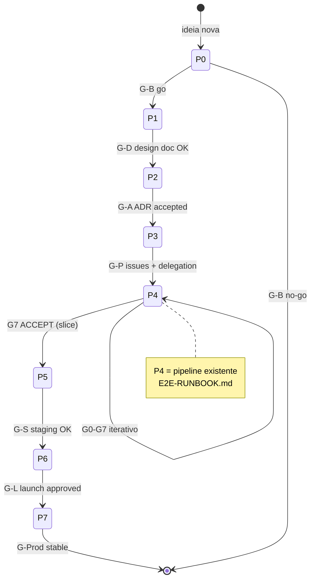
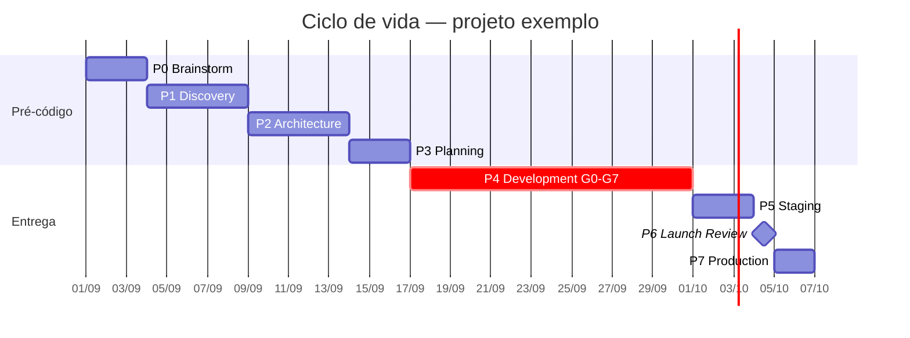

# Ciclo de Vida Produto — P0 (Brainstorm) → P7 (Produção)

> **Escopo:** processo da **equipe Cursor** para levar uma ideia até produção. Não descreve runtime de agentes institucionais do produto anxionOS. Ver [SCOPE.md](./SCOPE.md).

Framework inspirado em práticas Google/bigtech, **estendendo** (não substituindo) o pipeline G0–G7 em [PIPELINE.md](./PIPELINE.md).

**CLI:** `npm run orchestration:phase` · **Runbook:** [BRAINSTORM-TO-PROD-RUNBOOK.md](./BRAINSTORM-TO-PROD-RUNBOOK.md) · **Padrões:** [GOOGLE-PRACTICES.md](./GOOGLE-PRACTICES.md)

---

## Tabela de fases

| Fase | Código | Gate | Owner | Output |
| --- | --- | --- | --- | --- |
| Brainstorm | P0 | G-B | Helena (`researcher`) + Marcus (`architect`) | Problem statement, opções, go/no-go |
| Discovery | P1 | G-D | Marcus + Renata (`orchestrator`) | Design doc / PRD draft, candidatos ADR |
| Architecture | P2 | G-A | Marcus | ADR accepted, specs Archify, mapa de módulos |
| Planning | P3 | G-P | Renata | Issues `ANX-*` no taskboard, pacotes de delegação |
| Development | P4 | G0–G7 | Executores + gates | Código mergeado, E2E comprovado |
| Staging | P5 | G-S | Edu (`infra-executor`) + Isa (`security-lead`) | Deploy staging, testes de integração |
| Launch Review | P6 | G-L | Renata + Owner | Launch checklist, plano de rollback |
| Production | P7 | G-Prod | Ju (`infra-executor`) + Renata | Deploy prod, observabilidade, postmortem |

---

## Diagrama de estados



---

## Template Gantt (projeto novo)



---

## P0 — Brainstorm

**Gate G-B** — saída: decisão go/no-go com problem statement.

| Checklist | Evidência |
| --- | --- |
| Problema definido (quem, dor, impacto) | Nota `brain/notes/` ou `brain/research/` |
| ≥2 opções comparadas | Dialogue `share` com trade-offs |
| Go/no-go registrado | `npm run orchestration:phase -- set --issue ANX-N --phase P1` ou encerrar |

**Workflow:** [workflows/workflow-researcher.md](./workflows/workflow-researcher.md) · skill `frame-a-proposal`

---

## P1 — Discovery

**Gate G-D** — saída: design doc ou PRD draft em OKF.

| Checklist | Evidência |
| --- | --- |
| Spec draft em `brain/project-docs/specs/` | OpenKnowledge MCP `write` |
| Candidatos ADR listados | `status: proposed` |
| Renata valida escopo e riscos | Dialogue `decision` |

---

## P2 — Architecture

**Gate G-A** — saída: ADR accepted + diagramas Archify.

| Checklist | Evidência |
| --- | --- |
| ADR com `status: accepted` | `brain/project-docs/decisions/` |
| `npm run archify:validate` passa | CI local |
| Mapa de módulos alinhado ADR0002 | `brain/notes/anxionos-backend-structure.md` |

**Workflow:** [workflows/workflow-architect.md](./workflows/workflow-architect.md)

---

## P3 — Planning

**Gate G-P** — saída: issues rastreáveis + delegação.

| Checklist | Evidência |
| --- | --- |
| Issues `ANX-*` criadas (sem duplicatas) | `npm run taskboard:list` |
| Pacotes em `delegation-queue/` | Um `.md` por issue executável |
| Executor + crítico nomeados | [PERSONAS.md](./PERSONAS.md) |

**Workflow:** [workflows/workflow-orchestrator.md](./workflows/workflow-orchestrator.md)

---

## P4 — Development

**Gate G0–G7** — **idêntico ao pipeline atual.**

| Mapeamento | Documento |
| --- | --- |
| G0–G7 | [PIPELINE.md](./PIPELINE.md) |
| Comandos E2E | [E2E-RUNBOOK.md](./E2E-RUNBOOK.md) |
| Compliance | [MANDATORY-COMPLIANCE.md](./MANDATORY-COMPLIANCE.md) |

```bash
npm run orchestration:phase -- gate P4 --issue ANX-N
```

---

## P5 — Staging

**Gate G-S** — deploy em ambiente não-prod com integração real.

| Checklist | Evidência |
| --- | --- |
| Deploy staging executado | Log Edu + URL |
| Smoke + integração | QA evidência |
| Security review staging | Isa parecer G4 adaptado |

---

## P6 — Launch Review

**Gate G-L** — equivalente ao Launch Readiness Review (Google).

| Checklist | Evidência |
| --- | --- |
| Launch checklist completo | Comentário issue + dialogue |
| Rollback plan documentado | Path em `brain/` ou `docs/` |
| Owner sign-off (exceções) | Menção `@Owner` no dialogue |

---

## P7 — Production

**Gate G-Prod** — deploy prod + observabilidade.

| Checklist | Evidência |
| --- | --- |
| Deploy prod com feature flags se aplicável | Ju evidência |
| Dashboards/alertas ativos | Observability paths |
| Postmortem template pronto | skill `write-a-postmortem` |

---

## Persistência de fase

Estado por issue: `.cursor/orchestration-runtime/lifecycle/{ANX-N}.json`

```json
{
  "version": 1,
  "issueId": "ANX-134",
  "phase": "P4",
  "phaseSlug": "development",
  "gate": "G0-G7",
  "updatedAt": "2026-09-09T14:30:00.000Z",
  "evidence": [],
  "checklist": {},
  "history": [{ "from": "P3", "to": "P4", "at": "2026-09-09T12:00:00.000Z" }]
}
```

---

## Mapeamento anxionOS (estado atual do repositório)

| Fase | Status anxionOS | Evidência |
| --- | --- | --- |
| P0–P1 | ✅ Concluído | PRD draft, notas `brain/`, specs P01–P09 |
| P2 | ✅ Concluído | ADR0002 accepted, Archify specs, estrutura 23 módulos |
| P3 | ✅ Ativo | 222 issues no taskboard, `delegation-queue/` |
| P4 | ✅ Ativo | ANX-134 `in_progress` G1; ANX-222 G0→G7 comprovado |
| P5–P7 | ⏳ Pendente | Sem deploy staging/prod homologado ainda |

O repositório **já passou P2–P4** para o núcleo da plataforma; novas capabilities seguem o ciclo completo a partir da fase adequada.

---

## Links

| Recurso | Caminho |
| --- | --- |
| Runbook passo a passo | [BRAINSTORM-TO-PROD-RUNBOOK.md](./BRAINSTORM-TO-PROD-RUNBOOK.md) |
| Práticas Google | [GOOGLE-PRACTICES.md](./GOOGLE-PRACTICES.md) |
| CLI phase-check | [agent-lifecycle/phase-check.mjs](./agent-lifecycle/phase-check.mjs) |
| Regra Cursor | [lifecycle-compliance.mdc](../rules/lifecycle-compliance.mdc) |
