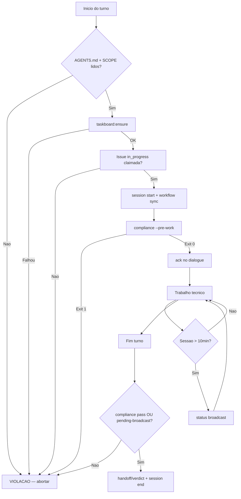

# Compliance Obrigatorio — Enforcement Layer

Documento mestre de **enforcement** da orquestracao anxionOS. Regras aqui sao **mandatorias e verificaveis** — nao documentacao opcional.

**Violacao = trabalho invalido** (mesma severidade que zero-trabalho-fora-do-board em AGENTS.md).

Relacionados: [COMPLIANCE.md](./COMPLIANCE.md) · [NO-SILENT-WORK.md](./NO-SILENT-WORK.md) · [PIPELINE.md](./PIPELINE.md) · regra `mandatory-orchestration.mdc`

---

## Sequencia obrigatoria (sempre, sem atalhos)

| # | Gate | Comando / acao |
| --- | --- | --- |
| 1 | AGENTS.md | Ler integralmente na sessao (G0) |
| 2 | SCOPE.md | Ler fronteira equipe Cursor vs produto (G0.1) |
| 3 | Taskboard | `npm run taskboard:ensure` — falhou = **PARAR** |
| 4 | Claim | Issue `ANX-*` em `in_progress` com thread binding |
| 5 | Sessao | `npm run orchestration:session -- start --persona SLUG --issue ANX-N` |
| 6 | Workflow | `npm run orchestration:workflow -- sync --persona SLUG --issue ANX-N` |
| 7 | Compliance G0 | `npm run orchestration:compliance -- --pre-work --issue ANX-N --persona SLUG` |
| 8 | Ack | Broadcast `ack` **antes** de qualquer edicao de codigo |
| 9 | Status | A cada 10 min de sessao ativa — broadcast `status` |
| 10 | Critico | Executor sempre pareado com `criticSlug` na mesma issue |
| 11 | Gates G0-G7 | Pipeline completo conforme [PIPELINE.md](./PIPELINE.md) |
| 12 | Tooling G0.14 | graphify/serena/archify/MCPs — [TOOLING-INTEGRATION.md](./TOOLING-INTEGRATION.md) |
| 13 | Fim | `handoff`/`verdict` + `orchestration:session end` |

---

## Verificacao executavel

```bash
# Gate G0 antes de codar
npm run orchestration:compliance -- --pre-work --issue ANX-N --persona SLUG

# Checagem completa durante trabalho
npm run orchestration:compliance -- --persona SLUG --issue ANX-N

# Antes de encerrar turno com alteracoes
npm run orchestration:compliance -- --pre-commit --issue ANX-N --persona SLUG
```

- **Exit 0** = compliant — pode prosseguir
- **Exit 1** = violacoes listadas com comandos `fix:`

---

## Proibido (enforcement)

1. Codar sem issue `in_progress` claimada
2. Codar sem `ack` no dialogue apos delegacao
3. Executor Level C sem crítico pareado — violação `MISSING_CRITIC_PAIR` (`criticSlug` + sessão do crítico + ack no dialogue)
4. Trabalho cross-domain sem `consult`/`handoff` ao owner
5. Silent work — >10 min sem broadcast; turno com codigo sem `pending-broadcast.json`
6. Ignorar warnings `SILENCE` / `MISSING_ACK` / `NO_SESSION` do monitor Level C
7. Pular gates G0-G7 ou declarar `done` sem aceite G7

---

## Fluxo de compliance gate



---

## Escalacao

| Detector | Acao |
| --- | --- |
| `orchestration:workflow -- monitor --level C` | Warnings SILENCE / MISSING_ACK / NO_SESSION |
| `orchestration:silence-watch` (cron 5m) | >10 min sem broadcast |
| Hook `stop` | Sessao ativa sem broadcast no turno |
| `orchestration:compliance` exit 1 | Lista violacoes + fix commands |
| `pending-escalate.json` | Renata (CTO) decide — block / dismiss / corrigir |

Path de escalacao: **monitor detecta → silence-watch → decisao Renata** via `orchestration:proactive -- act`.

---

## Integracao hooks Cursor

| Hook | Enforcement |
| --- | --- |
| `beforeSubmitPrompt` | Pre-check leve — aviso se sessao ativa sem issue |
| `stop` | Exige `compliance --pre-commit` pass **OU** `pending-broadcast.json` escrito |

Ver [.cursor/hooks/README.md](../hooks/README.md).

---

## Escopo

Aplica-se **somente** a equipe Cursor de orquestracao ([SCOPE.md](./SCOPE.md)) — nao confundir com agentes institucionais do produto (`backend/modules/agents/`).

Violacoes → `npm run orchestration:compliance`
