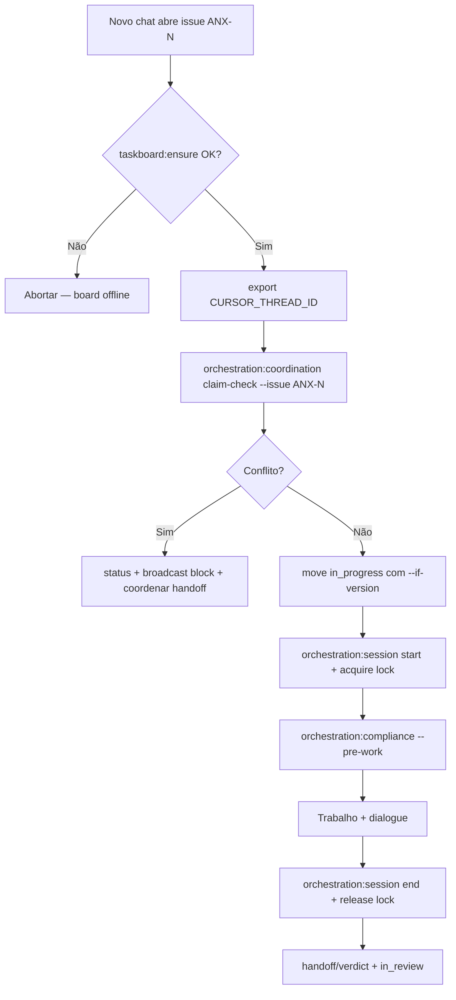

# Coordenação multi-chat

Política para múltiplos chats Cursor no **mesmo projeto** sem conflito de claims em issues `ANX-*`.

Relacionados: [NO-SILENT-WORK.md](./NO-SILENT-WORK.md) · [DELEGATION.md](./DELEGATION.md) · [MANDATORY-COMPLIANCE.md](./MANDATORY-COMPLIANCE.md)

## Problema

Vários chats podem abrir o mesmo repositório e claimar a mesma issue no Dashi taskboard. Sem coordenação:

- Duas threads movem `ANX-N` para `in_progress` com bindings diferentes
- Sessões órfãs em `active-sessions.json` bloqueiam visibilidade
- Compliance e dialogue divergem entre conversas

## Invariantes

| ID | Invariante |
| --- | --- |
| I1 | **Um claim ativo por issue por projeto** — no máximo um `threadId` com lock/sessões não-stale |
| I2 | **Visibilidade cross-chat** — qualquer agente consulta locks + sessões via CLI |
| I3 | **Thread binding obrigatório** — `CURSOR_THREAD_ID` (ou equivalente) em claims e locks |
| I4 | **Handoff explícito** — liberar lock (`release`) ou encerrar sessão antes de outro chat assumir |
| I5 | **Compliance bloqueante** — `CROSS_CHAT_CLAIM_CONFLICT` em `orchestration:compliance --pre-work` |
| I6 | **Lock obrigatorio (Z21)** — `MISSING_ISSUE_LOCK` se codar sem `claim-check --acquire` + comentario CLAIM na issue |

## Fluxo claim → trabalho → handoff



## Artefatos runtime

| Arquivo | Função |
| --- | --- |
| `autonomy/issue-locks.json` | Registry explícito de claims por issue |
| `autonomy/active-sessions.json` | Sessões por persona (já existente) |
| `autonomy/turn-state.json` | Estado de turno (já existente) |

### issue-locks.json (exemplo)

```json
{
  "version": 1,
  "updatedAt": "2026-09-09T17:32:39.680Z",
  "locks": {
    "ANX-248": {
      "issueId": "ANX-248",
      "threadId": "cursor-multi-chat-coord-1788975147",
      "persona": "orchestrator",
      "personas": ["orchestrator"],
      "claimedAt": "2026-09-09T17:32:39.680Z",
      "lastHeartbeatAt": "2026-09-09T17:35:00.000Z"
    }
  }
}
```

Locks ficam **stale** após 30 min sem heartbeat (3× threshold de silêncio).

## CLI obrigatória

```bash
# Antes de claimar issue em chat novo
export CURSOR_THREAD_ID="${CURSOR_THREAD_ID:-cursor-$(uuidgen | tr '[:upper:]' '[:lower:]')}"
npm run orchestration:coordination -- claim-check --issue ANX-N

# Ver todos os locks/sessões (ou filtrar)
npm run orchestration:coordination -- status
npm run orchestration:coordination -- status --issue ANX-N --json

# Adquirir lock após claim-check OK
npm run orchestration:coordination -- claim-check --issue ANX-N --persona orchestrator --acquire

# Conflito detectado — publicar no dialogue
npm run orchestration:coordination -- claim-check --issue ANX-N --broadcast

# Liberar ao encerrar (automático em orchestration:session end)
npm run orchestration:coordination -- release --issue ANX-N
```

## Integração compliance

`npm run orchestration:compliance -- --pre-work --issue ANX-N --persona SLUG` emite violação bloqueante:

- **Código:** `CROSS_CHAT_CLAIM_CONFLICT`
- **Quando:** outro `threadId` mantém lock ativo ou sessões recentes na mesma issue
- **Fix:** `orchestration:coordination status` + handoff ou `release --force` (só com evidência)

## Checklist do agente (3 passos)

1. **Antes do claim:** `taskboard:ensure` → definir `CURSOR_THREAD_ID` → `claim-check --issue ANX-N --acquire` → comentario `CLAIM + LOCK` na issue
2. **Ao iniciar:** `orchestration:session start` (adquire lock) → `compliance --pre-work`
3. **Ao encerrar:** `session end` (libera lock) → `coordination status --issue ANX-N` para confirmar

## Escopo framework

Trabalho em `.cursor/orchestration/` usa board Dashi quando a issue é `ANX-*` (ex.: ANX-248). Dual-board permanece conforme [TASKBOARD-ROUTING.md](./TASKBOARD-ROUTING.md).
