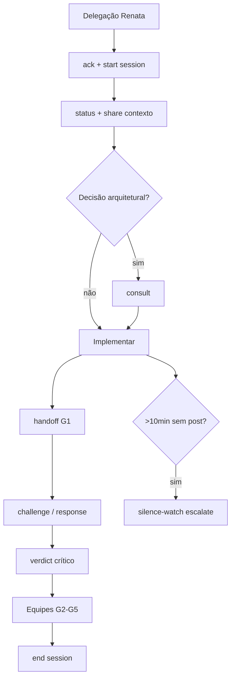

# Política No Silent Work — Nunca Sozinho, Nunca em Silêncio

**Nenhum agente trabalha sozinho ou em silêncio.** Toda ação técnica deve ser visível no diálogo, pareada com crítico quando executor, e rastreável no taskboard.

**Relacionados:** [COMPLIANCE.md](./COMPLIANCE.md) · [TEAM-COLLABORATION.md](./TEAM-COLLABORATION.md) · [PERSONAS.md](./PERSONAS.md) · [RUNBOOK.md](./RUNBOOK.md)

---

## Declaração de política

| Princípio | Regra |
| --- | --- |
| **Nunca sozinho** | Executor sempre tem crítico pareado na thread; orquestrador sabe quem está ativo |
| **Nunca em silêncio** | Broadcast obrigatório nos marcos abaixo; sem post = trabalho inválido |
| **Cadência mínima** | 10 min de trabalho ativo sem diálogo → `status` ou `escalate` automático |
| **Visibilidade** | Tudo em `.cursor/orchestration-runtime/dialogue/dialogue.jsonl` + espelho opcional na issue |

---

## Checklist de broadcast obrigatório

Marque cada ponto antes de avançar de fase:

- [ ] **`ack`** ao receber delegação (orquestrador → executor)
- [ ] **`status`** ao iniciar trabalho (claim `in_progress` + primeira ação)
- [ ] **`share`** ao descobrir contexto relevante (`brain/`, `graphify`, ADR)
- [ ] **`consult`** antes de decisões arquiteturais não triviais
- [ ] **`challenge` / `response`** entre executor e crítico (G1)
- [ ] **`handoff`** ao completar G1 (candidato para crítico)
- [ ] **`verdict`** do crítico e das equipes especialistas (G2–G5)
- [ ] **`escalate`** se bloqueado > 1 ciclo sem convergência
- [ ] **`hire` / `dismiss`** ao contratar/dispensar on-demand (`--speak` ou broadcast explícito)
- [ ] **`decision` / `block` / `unblock`** quando CTO altera status ou aceite G7
- [ ] **`plan`** ao publicar pacote G0 ou plano G3 formal

---

## Regras de pareamento

1. **Executor sem crítico na thread = sessão inválida.** Ver par em [PERSONAS.md](./PERSONAS.md) (`criticSlug`).
2. **Orquestrador** não substitui crítico nem especialistas — apenas coordena e escala.
3. **Especialistas (G2–G5)** publicam `verdict` visível; não corrigem código em silêncio.
4. Ao iniciar sessão: `npm run orchestration:session -- start --persona <slug> --issue ANX-N`.

---

## Anti-padrões (proibidos)

| Anti-padrão | Consequência |
| --- | --- |
| Codar sem `ack` após delegação | Crítico e orquestrador não sabem que o escopo foi aceito |
| `in_progress` no board sem `status` no dialogue | Trabalho invisível — violação de compliance |
| Encerrar turno sem `handoff`/`verdict` quando houve código | Hook `stop` emite aviso + `pending-escalate` |
| Handoff/verdict sem colar `orchestration:chat` no chat Cursor | Coordinators devem colar saída completa na mesma resposta (regra `orchestration-dialogue.mdc`) |
| Sessão ativa após issue `done`/`in_review` ou persona inativa | `npm run orchestration:session -- list` → `end --force` para órfãs |
| > 10 min sem broadcast com sessão ativa | Cron `silence-watch` posta `status` ou `escalate` |
| Executor declara PASS sem crítico | Inválido — só crítico emite `verdict` G1 |

---

## Ferramentas de enforcement

| Ferramenta | Função |
| --- | --- |
| `session-tracker.mjs` | Registra sessões ativas (`active-sessions.json`) |
| `silence-detector.mjs` | Cron 5 min — detecta silêncio > 10 min |
| `agent-orchestration.mjs` (hook `stop`) | Bloqueia fim silencioso; processa `pending-broadcast` |
| `broadcast.mjs` | Auto-inicia sessão no primeiro post com `--issue` |
| `terminal-panel.mjs` | Painel live colorido no terminal (`orchestration:terminal`) |
| `tail-formatted.mjs` | Snapshot formatado (`orchestration:tail`) |

### Estrutura `active-sessions.json`

```json
{
  "version": 1,
  "updatedAt": "2026-09-09T13:00:00.000Z",
  "sessions": {
    "backend-executor": {
      "persona": "backend-executor",
      "issueId": "ANX-134",
      "criticSlug": "backend-critic",
      "threadId": "cursor-thread-abc",
      "startedAt": "2026-09-09T12:30:00.000Z",
      "lastActivityAt": "2026-09-09T12:45:00.000Z",
      "lastDialogueAt": "2026-09-09T12:45:00.000Z",
      "dialogueCount": 2,
      "lastMessageId": "dlg-uuid-001"
    }
  }
}
```

Datas em **ISO-8601 UTC**.

---

## Comandos

```bash
# Iniciar sessão (ou auto no primeiro broadcast)
npm run orchestration:session -- start --persona backend-executor --issue ANX-134

# Publicar (atualiza lastDialogueAt)
npm run orchestration:broadcast -- \
  --from-persona backend-executor --type ack --issue ANX-134 \
  --body "Recebido. Próximo marco: testes de idempotência."

# Heartbeat durante trabalho longo
npm run orchestration:session -- heartbeat --persona backend-executor

# Encerrar (requer handoff/verdict ou --force para órfãs)
npm run orchestration:session -- end --persona backend-executor

# Listar sessões órfãs antes de encerrar turno de coordenação
npm run orchestration:session -- list

# Terminal dedicado (deixar rodando)
npm run orchestration:terminal
npm run orchestration:terminal -- --issue ANX-134

# Snapshot formatado
npm run orchestration:tail -- --lines 15

# Registrar cron silence-watch (uma vez)
npm run orchestration:cron -- register silence-watch \
  --every 5m \
  --command "node .cursor/orchestration/agent-autonomy/scripts/silence-detector.mjs" \
  --persona orchestrator
```

---

## Fluxo resumido



---

## Integração com pipeline G0–G7

Esta política **complementa** [COMPLIANCE.md](./COMPLIANCE.md) e [PIPELINE.md](./PIPELINE.md). Não relaxa taskboard, OpenKnowledge nem tolerância zero — adiciona **visibilidade obrigatória** em cada transição.

Guia terminal: [TERMINAL.md](./TERMINAL.md)

Regra Cursor: [.cursor/rules/no-silent-work.mdc](../rules/no-silent-work.mdc) (`alwaysApply: true`).
