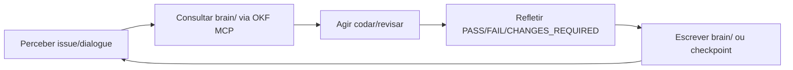

# OpenKnowledge como cérebro dos agentes

Política: **`brain/` (OpenKnowledge) é a memória institucional** dos agentes de orquestração. Supermemory complementa recall de sessão, mas **não substitui** `brain/` para specs, ADRs, postmortems e lições duráveis.

Relacionados: [COMPLIANCE.md](./COMPLIANCE.md) · [TOOLING-INTEGRATION.md](./TOOLING-INTEGRATION.md) · [TASKBOARD-ROUTING.md](./TASKBOARD-ROUTING.md) · [PIPELINE.md](./PIPELINE.md) · skill [open-knowledge](../skills/open-knowledge/SKILL.md) · CLI `npm run orchestration:brain`

---

## Loop contínuo — perceber → consultar → agir → refletir → escrever



| Fase | O quê | Ferramenta | Evidência |
| --- | --- | --- | --- |
| **Perceber** | Issue `ANX-*`, dialogue, gate | taskboard + `orchestration:chat` | claim + thread binding |
| **Consultar** | Spec, ADR, postmortem, lição | `search`, `exec("cat …")` via MCP | path `brain/…` no pacote G0 |
| **Agir** | Implementação/review proporcional | graphify, serena, código | diff + comandos |
| **Refletir** | Root cause ou padrão novo | `orchestration:brain reflect` | staging JSONL |
| **Escrever** | Lição material no KB | `write`/`edit`/`checkpoint` MCP | doc OKF com frontmatter |

---

## Regras obrigatórias

### Antes de trabalho técnico

1. **`search({ query })`** no domínio da issue (spec, ADR, postmortem, lesson learned).
2. **`exec("cat brain/…")`** para fonte canônica aplicável — citar **path + seção** no comentário da issue (pacote G0).
3. **Não contradizer** `brain/` sem registrar conflito e resolver requisito afetado.
4. Compliance emite warning **`BRAIN_NOT_CONSULTED`** (soft) se executores iniciam pre-work sem referência `brain/` na issue.

### Depois de gate verdict ou erro

| Situação | Ação |
| --- | --- |
| `CHANGES_REQUIRED`, test fail, compliance fail | `checkpoint` ou nota postmortem em `brain/` com root cause + fix |
| PASS com padrão novo reutilizável | `brain/notes/` lesson (o que funcionou, comando, path) |
| Handoff G7 que altera comportamento institucional | nota/handoff em `brain/` via André ou executor autorizado |

CLI staging (obrigatório registrar; promover quando material):

```bash
npm run orchestration:brain -- reflect --issue ANX-N --outcome fail --lesson "root cause + fix"
npm run orchestration:brain -- lessons --issue ANX-N
```

### Auto-correção e auto-aperfeiçoamento

- **Auto-corrigir:** todo ciclo `CHANGES_REQUIRED` → reflexão staged + checkpoint OKF com causa raiz.
- **Auto-aperfeiçoar:** todo PASS com técnica nova → lesson opcional em `brain/notes/` (comando verificável).
- **Evoluir:** postmortems e decision logs alimentam G0 das issues seguintes — não repetir erro documentado.

### Proibido

| Proibido | Fazer |
| --- | --- |
| `Read`/`Write`/`Grep` nativos em `brain/` com MCP OK disponível | `user-open-knowledge` MCP |
| Supermemory como única fonte institucional | `brain/` para specs/ADRs/decisões |
| Lição só no JSONL staging | Promover material via MCP |
| Inventar stack/comportamento ausente de `brain/` | Registrar lacuna na issue |

---

## Hooks no lifecycle (G0–G7)

| Gate | Hook brain |
| --- | --- |
| **G0** | Busca OKF + link spec/ADR no comentário da issue (`source: brain/…`) |
| **G1 fim** | Executor + crítico co-escrevem reflexão se aprendizado material (`orchestration:brain reflect` → promote) |
| **G7** | Handoff note em `brain/` se slice altera comportamento institucional |

Ver [PIPELINE.md](./PIPELINE.md) · warning opcional **`REFLECTION_PENDING`** se `in_review` após `CHANGES_REQUIRED` sem reflexão staged.

---

## Dual-board (framework vs produto)

| Scope | Board | Brain |
| --- | --- | --- |
| **Project** (`backend/`, slices `ANX-*`) | Dashi | specs/ADRs de produto em `brain/project-docs/` |
| **Framework** (`.cursor/orchestration/`) | Cursor goal | notas de orquestração + lições operacionais em `brain/notes/` |

Nunca misturar boards na mesma unidade — ver [TASKBOARD-ROUTING.md](./TASKBOARD-ROUTING.md).

---

## BAD vs GOOD

### BAD — brain ignorado

```text
Executor abre backend/modules/foo e codifica convite sem buscar spec.
Issue sem path brain/ no pacote G0.
Erro de teste corrigido no diff sem postmortem nem reflect.
Read nativo em brain/index.md com MCP OK ativo.
```

### GOOD — brain consultado e evoluído

```text
G0: search "org onboarding" → exec cat brain/project-docs/specs/… + comentario source: brain/…
CHANGES_REQUIRED: reflect --outcome fail --lesson "race convite: idempotency key + journal"
Promote: write brain/notes/anxionos-orgs-lesson-anx135.md com comando bun test …
G7: handoff note se API pública mudou contrato institucional.
```

---

## Comandos

```bash
npm run orchestration:brain -- search --query "organizations membership"
npm run orchestration:brain -- reflect --issue ANX-135 --outcome pass --lesson "…"
npm run orchestration:brain -- lessons --issue ANX-135 --json
```

Evidência no dialogue:

```bash
npm run orchestration:broadcast -- --from-persona backend-executor --type share \
  --issue ANX-N --body "Lição promovida ao brain/" \
  --evidence "file:brain/notes/….md,mcp:open-knowledge:write"
```
