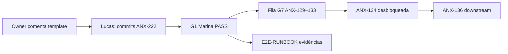

# Autorização do Owner — Commits Tier 1 / Tier 2 (ANX-222)

**Propósito:** template de comentário que o **Owner** pode colar na issue **ANX-222** no Dashi Taskboard para autorizar commits de backend sem ambiguidade.

**Regra:** agentes **não** inferem autorização. Sem este comentário (ou equivalente explícito), apenas prep/documentação é permitida.

**Referências:**

- [DELEGATION-PACKAGE-ANX-222.md](./DELEGATION-PACKAGE-ANX-222.md)
- [E2E-RUNBOOK.md](./E2E-RUNBOOK.md)
- [GOAL-STATUS.md](./GOAL-STATUS.md)

---

## Escopos Tier 1 e Tier 2

| Tier | Conteúdo | Paths típicos |
| --- | --- | --- |
| **Tier 1** | `src/` restante dos módulos backend (sem `dist/`) | `backend/modules/*/src/**` |
| **Tier 2** | Drift em pacotes compartilhados P02 | `backend/packages/eventing/**`, `backend/packages/contracts/**` |

Oráculos obrigatórios após commit (HEAD limpo):

```bash
cd backend && bun test
cd backend && bun run test:boundary
npm run boundaries
```

---

## Template A — Autorização completa (Tier 1 + Tier 2)

Copie o bloco abaixo **integralmente** como comentário em **ANX-222**:

```
## Autorização Owner — ANX-222 (Tier 1 + Tier 2)

Autorizo commits na issue ANX-222 conforme DELEGATION-PACKAGE-ANX-222.md.

**Escopo autorizado:**
- [x] Tier 1 — `backend/modules/*/src/**` (sem `dist/`)
- [x] Tier 2 — drift `backend/packages/eventing/**` e `backend/packages/contracts/**`

**Restrições:**
- Sem segredos, peppers ou credenciais no diff
- Sem `dist/` versionado
- HEAD limpo deve passar: `bun test`, `bun run test:boundary`, `npm run boundaries`

**Validade:** esta issue (ANX-222) até `done` ou revogação explícita.

**Data:** YYYY-MM-DD
**Owner:** @jcafeitosa
```

---

## Template B — Somente Tier 1

```
## Autorização Owner — ANX-222 (Tier 1 apenas)

Autorizo commits **somente Tier 1** (módulos `src/`, sem `dist/`).

**NÃO autorizado:** Tier 2 (eventing/contracts) — aguardar comentário separado.

Oráculos obrigatórios em HEAD limpo: `bun test`, `test:boundary`, `boundaries`.

**Data:** YYYY-MM-DD
**Owner:** @jcafeitosa
```

---

## Template C — Somente Tier 2

```
## Autorização Owner — ANX-222 (Tier 2 apenas)

Autorizo commits **somente Tier 2** (drift `eventing` + `contracts`).

**NÃO autorizado:** Tier 1 (módulos `src/`) — aguardar comentário separado.

Oráculos obrigatórios em HEAD limpo: `bun test`, `test:boundary`, `boundaries`.

**Data:** YYYY-MM-DD
**Owner:** @jcafeitosa
```

---

## Template D — Revogação ou adiamento

```
## Owner — ANX-222 adiado / revogado

NÃO autorizo commits em ANX-222 neste momento.

**Motivo:** [descrever]

**Próximo passo:** [ex.: revisar diff / nova data / escopo reduzido]

**Data:** YYYY-MM-DD
**Owner:** @jcafeitosa
```

---

## O que desbloqueia após autorização



| Desbloqueio | Dependência |
| --- | --- |
| Commits backend ANX-222 | Template A/B/C nesta issue |
| G1 verdict Marina | HEAD limpo + oráculos verdes |
| `cto-decide` PASS em ANX-129–133 | Commits staged + gates G2–G6 resolvidos |
| ANX-134 identity gate | ANX-222 `done` |
| Goal orquestração → COMPLETE | E2E G0→G7 com evidências auditáveis |

---

## Verificação (CTO / orquestrador)

```bash
node scripts/taskboard.mjs get ANX-222
# Buscar comentário Owner com "Autorizo commits" + tier marcado

npm run orchestration:cto-decide -- --issue ANX-222
```

**Não executar `git commit` em `backend/` até o comentário estar visível no board.**
