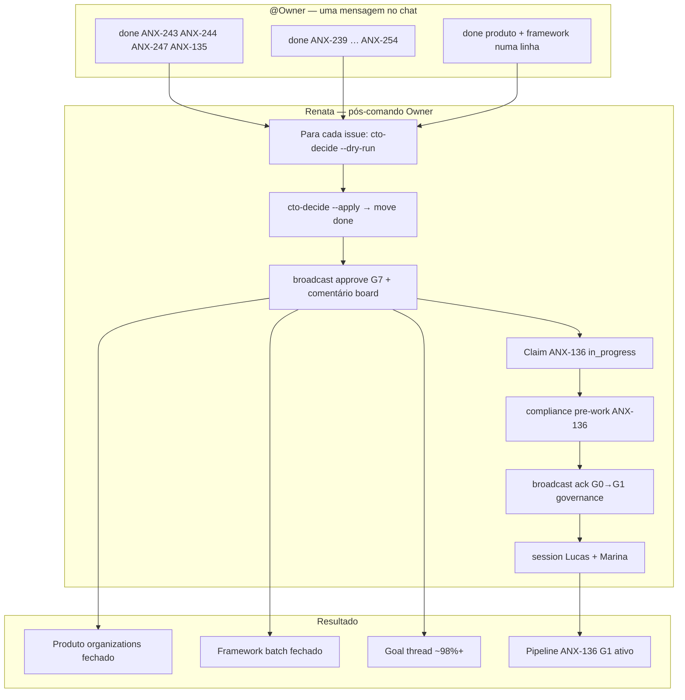

# Owner G7 Handoff — desbloqueio do pipeline completo

## @Owner — card de decisão (3 linhas)

| | Comando / ação |
| --- | --- |
| **Produto** | `done ANX-244 ANX-247 ANX-135` *(ANX-243 já `done`)* |
| **Framework** | `done ANX-239 ANX-240 ANX-241 ANX-242 ANX-245 ANX-246 ANX-248 ANX-249 ANX-250 ANX-251 ANX-252 ANX-253 ANX-254` |
| **Depois** | Renata aplica `cto-decide --apply`, move issues, claim **ANX-136** Governance — **não** `UpdateGoal complete` |

**P1 Product Company (paralelo, não bloqueia ANX-136):** após G7, confirme se contrata os 5 agentes P1 propostos — Product Discovery, Product Manager, Requirements, UX Research e Product Designer — para workflows Discovery/Definition em `brain/` conforme [PRODUCT-COMPANY-MODEL.md](./PRODUCT-COMPANY-MODEL.md). Responda `aprovo Product Company P1` ou `não aprovo Product Company P1`.

---

**Data:** 2026-09-09T18:50Z  
**Goal thread:** **~98%** — bloqueado em G7 @Owner (sync Cursor↔Dashi E2E ✅)  
**Status:** G0–G6 ✅ em produto e framework · G7 ⏳ aguardando aceite @Owner  
**Complementa:** [OWNER-HANDOFF-ANX-237.md](./OWNER-HANDOFF-ANX-237.md) (framework ANX-230 já `done`)

---

## Resumo executivo

| Dimensão | Veredito |
| --- | --- |
| **Produto ANX-135** | **READY G7** — Organizations G0–G6 PASS; ANX-243 `done`; ANX-244/247 `in_review` ACCEPT |
| **Framework batch ANX-239–254** | **READY G7** — 12 issues `in_review`; goals Cursor verificados |
| **Próximo slice produto** | **ANX-136** Governance — G0 preparado; claim imediato após G7 ANX-135 |
| **Oráculos** | `orchestration:verify` **157/157** · `taskboard:ensure` online · sync E2E ANX-253 ✅ |

**Uma mensagem @Owner desbloqueia todo o pipeline.** Copie um dos comandos abaixo no chat — Renata executa G7, move issues e inicia ANX-136.

---

## O que acontece após cada `done`



> **Ordem recomendada:** filhos ANX-243/244/247 **antes** de ANX-135 (zero ressalvas). Renata aplica `cto-decide` na ordem filhos → pai.

---

## Tabela — batch produto

| Issue | Entregável (1 linha) | Gate | Status |
| --- | --- | --- | --- |
| **ANX-243** | Rate-limit invite accept Postgres distribuído (fix Z2) | G7 ✅ | `done` |
| **ANX-244** | transferOwnership + outbox `ownership_transferred.v1` (fix Z2) | G6 ✅ | `in_review` |
| **ANX-247** | Fail-closed membership antes de grants NATS (fix Z2) | G6 ✅ | `in_review` |
| **ANX-135** | Organizations: onboarding, memberships, integração governance | G0–G6 ✅ | `in_review` |

**Dependência:** ANX-135 G7 exige filhos 243/244/247 aceitos (MEDIUM resolvidos).

---

## Tabela — batch framework

| Issue | Entregável (1 linha) | Verify | Status |
| --- | --- | --- | --- |
| **ANX-239** | Participação nativa no chat Cursor (`CHAT-PARTICIPATION.md` + rules) | 4 testes compliance | `in_review` |
| **ANX-240** | Camada Slack (channels, threads, reactions, search, presence) | 9/9 slack-layer | `in_review` |
| **ANX-241** | Persona voice & tone PT-BR (`PERSONA-VOICE.md`) | 4 testes robotic warnings | `in_review` |
| **ANX-242** | Personalidades distintas 18/18 (`PERSONALITIES.md`) | diagram 36/36 | `in_review` |
| **ANX-245** | Delegate-monitor + feedback (`DELEGATION-MONITORING.md`) | 10/10 delegate-monitor | `in_review` |
| **ANX-246** | Taskboard-as-gate enforcement (zero fora do board) | 11/11 gate+routing | `in_review` |
| **ANX-248** | Coordenação multi-chat (`MULTI-CHAT-COORDINATION.md` + locks) | 5/5 issue-coordination | `in_review` |
| **ANX-249** | Capacidades completas (`AGENT-CAPABILITIES.md` + Z19) | capabilities-gate | `in_review` |
| **ANX-250** | AI Product Company 12 etapas + Product Graph (`PRODUCT-COMPANY-MODEL.md`) | archify:validate | `in_review` |
| **ANX-251** | Hire→board automático (`HIRE-TASKBOARD-SYNC.md`) | 8/8 hire-taskboard-sync | `in_review` |
| **ANX-252** | Personas assinam comentários/moves (`AGENT-TASKBOARD-SIGNATURE.md`) | taskboard identity | `in_review` |
| **ANX-253** | Integração nativa Cursor ↔ Dashi (`CURSOR-TASKBOARD-INTEGRATION.md` + `taskboard:cursor-start`) | identity + write tests | `in_review` |
| **ANX-254** | 9Router OpenAI-compatible (`9ROUTER-INTEGRATION.md` + `llm-router.mjs`) | 4/4 llm-router | `in_review` |

**Goals Cursor (sem issue Dashi separada):** `zero-policies-doc`, `fw-openknowledge-brain-loop`, `fw-orchestrator-question-hierarchy`, `taskboard-routing-policy` — fechados junto com o batch framework via G7 das issues acima.

---

## Comandos copy-paste @Owner

Cole **uma** linha no chat Cursor. Renata interpreta como autorização G7 explícita.

### Produto (organizations + follow-ups)

```
done ANX-244 ANX-247 ANX-135
```

### Framework (orquestração batch)

```
done ANX-239 ANX-240 ANX-241 ANX-242 ANX-245 ANX-246 ANX-248 ANX-249 ANX-250 ANX-251 ANX-252 ANX-253 ANX-254
```

### Ambos numa linha (desbloqueio total)

```
done ANX-244 ANX-247 ANX-135 ANX-239 ANX-240 ANX-241 ANX-242 ANX-245 ANX-246 ANX-248 ANX-249 ANX-250 ANX-251 ANX-252 ANX-253 ANX-254
```

> **Não** usar `UpdateGoal complete` nem marcar goal 100% — produto continua em ANX-136+ após estes aceites.

---

## Sequência pós-G7 — Renata (automática após comando Owner)

Renata executa **sem pedir confirmação adicional** quando @Owner cola um dos comandos acima.

### 1. G7 por issue (ordem filhos → pai → framework)

```bash
cd /Users/jcafeitosa/Development/anxionOS
npm run taskboard:ensure

# Produto — filhos primeiro (ANX-243 já done)
for ISSUE in ANX-244 ANX-247 ANX-135; do
  npm run orchestration:cto-decide -- --issue "$ISSUE" --dry-run
  npm run orchestration:cto-decide -- --issue "$ISSUE" --apply
done

# Framework batch
for ISSUE in ANX-239 ANX-240 ANX-241 ANX-242 ANX-245 ANX-246 ANX-248 ANX-249 ANX-250 ANX-251 ANX-252 ANX-253 ANX-254; do
  npm run orchestration:cto-decide -- --issue "$ISSUE" --dry-run
  npm run orchestration:cto-decide -- --issue "$ISSUE" --apply
done
```

### 2. Claim ANX-136 Governance (imediato após G7 ANX-135)

```bash
export CURSOR_THREAD_ID="${CURSOR_THREAD_ID:-cursor-g7-handoff-$(date +%Y%m%d)}"
node scripts/taskboard.mjs move ANX-136 in_progress
npm run orchestration:compliance -- --pre-work --issue ANX-136 --persona orchestrator
npm run orchestration:broadcast -- \
  --from-persona orchestrator --type ack --issue ANX-136 \
  --body "G0→G1 governance; par Lucas+Marina — desbloqueado pós G7 ANX-135" \
  --evidence "file:.cursor/orchestration/OWNER-G7-HANDOFF.md"
npm run orchestration:session -- start --persona backend-executor --issue ANX-136
npm run orchestration:session -- start --persona backend-critic --issue ANX-136
```

Checklist completo: [GOAL-THREAD-STATUS.md § ANX-136 unlock](./GOAL-THREAD-STATUS.md#anx-136-unlock-checklist-pós-g7-anx-135) · pacote [ANX-136.md](./examples/project-anxionos/delegation-queue/ANX-136.md).

### 3. Verificação pós-moves

```bash
npm run orchestration:verify
npm run orchestration:progress -- --issue ANX-136
npm run orchestration:chat -- --issue ANX-135
```

---

## Lembrete — rebuild Dashi (personas no board)

Comentários e moves devem exibir **nome da persona** (ex. `Lucas Mendes · backend-executor`), não "Codex Agent".

**Obrigatório uma vez** após aceitar ANX-252/ANX-253 (sync manual só se drift persistir):

```bash
cd ~/Development/dashi-taskboard && npm install && npm run build:web
launchctl kickstart -k gui/$(id -u)/com.dashi.taskboard
cd /Users/jcafeitosa/Development/anxionOS
export CURSOR_THREAD_ID="${CURSOR_THREAD_ID:-cursor-$(uuidgen)}"
npm run taskboard:cursor-start
```

Dados em `~/dev/dashi-taskboard/.data` (`CODEX_TASKBOARD_DATA_DIR`). Não `npm start` manual no path legado.

Detalhes: [AGENT-TASKBOARD-SIGNATURE.md](./AGENT-TASKBOARD-SIGNATURE.md) · [CURSOR-TASKBOARD-INTEGRATION.md](./CURSOR-TASKBOARD-INTEGRATION.md) · issues **ANX-252**, **ANX-253**.

---

## Decisão P1 — Product Company Model

ANX-250 entregou **P0 documentação** ([PRODUCT-COMPANY-MODEL.md](./PRODUCT-COMPANY-MODEL.md) — 12 etapas + Product Graph + mapeamento das 18 personas).

**@Owner — após G7 batch, responda no chat:**

| Opção | Comando / frase | Efeito |
| --- | --- | --- |
| **Aprovar P1** | `aprovo Product Company P1` | Renata abre issues P1 Discovery (Chief Product, Market Intelligence, etc.) em [AGENT-ROSTER.md](./AGENT-ROSTER.md#product-company-proposed-expansion); hire templates + gates G-UX/G-D |
| **Não aprovar agora** | `não aprovo Product Company P1` | P0 permanece documentação; gaps `proposed` no roster; foco ANX-136+ produto |
| **Adiar** | *(silêncio ou "decido depois")* | Renata não cria issues P1; registra pendência no dialogue |

> P1 **não** bloqueia ANX-136 Governance. É decisão estratégica paralela.

---

## O que NÃO fazer neste handoff

| Proibido | Motivo |
| --- | --- |
| Mover issues para `done` sem comando @Owner | G7 exige aceite explícito |
| `UpdateGoal complete` | Goal permanece ~96% até ANX-136+ avançar |
| Pular filhos 243/244/247 antes de ANX-135 | [ZERO-RESERVATIONS-DONE.md](./ZERO-RESERVATIONS-DONE.md) |
| Commit/push não solicitado | Escopo deste doc é handoff apenas |

---

## Oráculos (snapshot handoff)

| Comando | Resultado esperado |
| --- | --- |
| `npm run orchestration:verify` | ✅ **157/157** (snapshot 2026-09-09T18:50Z) |
| `npm run taskboard:ensure` | ✅ online `http://127.0.0.1:47823` (LaunchAgent) |
| `npm run taskboard:cursor-start` | ✅ sync 18 personas + registry |
| `node scripts/taskboard.mjs get ANX-135` | `in_review` G0–G6 PASS |
| `node scripts/taskboard.mjs get ANX-239..254` | 12/12 `in_review` (incl. ANX-253) |

---

## Referências

- [GOAL-THREAD-STATUS.md](./GOAL-THREAD-STATUS.md) — matriz completude ~98%
- [CTO-ACCEPTANCE.md](./CTO-ACCEPTANCE.md) — protocolo G7 Renata
- [ZERO-RESERVATIONS-DONE.md](./ZERO-RESERVATIONS-DONE.md) — zero ressalvas
- [TEAM-ACTIVATION.md](./examples/project-anxionos/TEAM-ACTIVATION.md) — ativação pós-greenlight
- [AGENT-TASKBOARD-SIGNATURE.md](./AGENT-TASKBOARD-SIGNATURE.md) — rebuild Dashi

---

**Handoff preparado por:** Renata (orchestrator) · evidência `orchestration:verify` · aguardando @Owner G7
