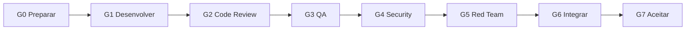
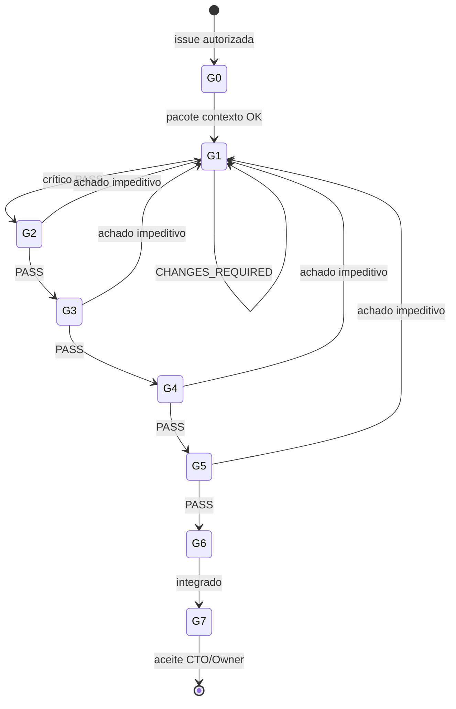

# Pipeline G0–G7

Mapeamento canônico de [AGENTS.md](../../AGENTS.md). Estados internos em comentários — não inventar gates.

---

## Fluxo



**Sequência formal:** G0→G1→G2→G3→G4→G5→G6→G7. Análises preliminares podem ser paralelas; gates formais são sequenciais.

### Estado dos gates (stateDiagram)



Ver [VISUAL-DOCUMENTATION.md](./VISUAL-DOCUMENTATION.md).


---

## Tabela de gates

| Gate | Responsável | Entrada | Saída | Evidência |
| --- | --- | --- | --- | --- |
| G0 | Orquestrador + Executor | Issue autorizada; AGENTS.md lido; `taskboard:ensure` OK; contexto `brain/` via OKF | Pacote G0; executor+crítico nomeados | Fonte `brain/…`, capability, owner, oráculos, `graphify query` |
| G1 | Executor + Crítico | G0; claim | Implementação + crítico PASS | Diff; comandos; parecer |
| G2 | Code Review | G1 PASS | Contratos/arquitetura OK | Relatório com refs |
| G3 | QA | G2 PASS | Oráculos passam | req→teste→resultado |
| G4 | Security | G3 PASS | Trust boundaries OK | Achados classificados |
| G5 | Red Team | G4 PASS; sandbox | Cenários adversariais | Reprodução + cleanup |
| G6 | Orquestrador | G2–G5 mesmo digest | Integrado testado | Handoff consolidado |
| G7 | **CTO (Renata)** · Owner em exceções | G6 PASS | Aceite baseado em evidências | Dialogue `approve` + comentário taskboard + `cto-accept` ACCEPT |

**G7 — aceite delegado:** Renata Oliveira (orchestrator) aceita quando o pacote de evidências está completo ([CTO-ACCEPTANCE.md](./CTO-ACCEPTANCE.md)). Owner só para exceções (Security/Red Team BLOCKED, conflito ADR, escopo, tolerância zero). Avaliação: `npm run orchestration:cto-accept -- --issue ANX-N`.

---

## G0 template

Gate G0 exige leitura de [AGENTS.md](../../AGENTS.md), `npm run taskboard:ensure`, busca OpenKnowledge em `brain/` e pacote abaixo **comentado na issue** antes de código.

```yaml
issue: ANX-XXX
agentsMdRead: true                    # gate G0
taskboardEnsure: npm run taskboard:ensure  # gate G0.5
source: brain/... ou docs/...         # path canônico via OKF MCP
decisionStatus: accepted | proposed | draft
capability: nome
owner: modulo
layer: application | domain | infrastructure
filesPlanned: [caminhos]
oracles: [comandos]
graphifyQuery: "pergunta sobre escopo"  # gate G0.8
critic: id
executor: id
```

Ver [COMPLIANCE.md](./COMPLIANCE.md) · [ONBOARDING.md](./ONBOARDING.md).

---

## Revalidação

Qualquer alteração invalida PASS anteriores. Repetir gates afetados ou revalidação explícita com análise de impacto. Após 3 ciclos → impasse.

---

## Cadeia crítica

| Issue | Estado gates |
| --- | --- |
| ANX-221 | G0–G6 documentados; **G7 pendente** — `cto-accept` avalia evidências |
| ANX-222 | Aguarda ANX-221 done (CTO ou Owner) + commit autorizado |
| ANX-134 | blocked — ANX-127, ANX-128 |
| ANX-136 | blocked — ANX-130, ANX-134 |
