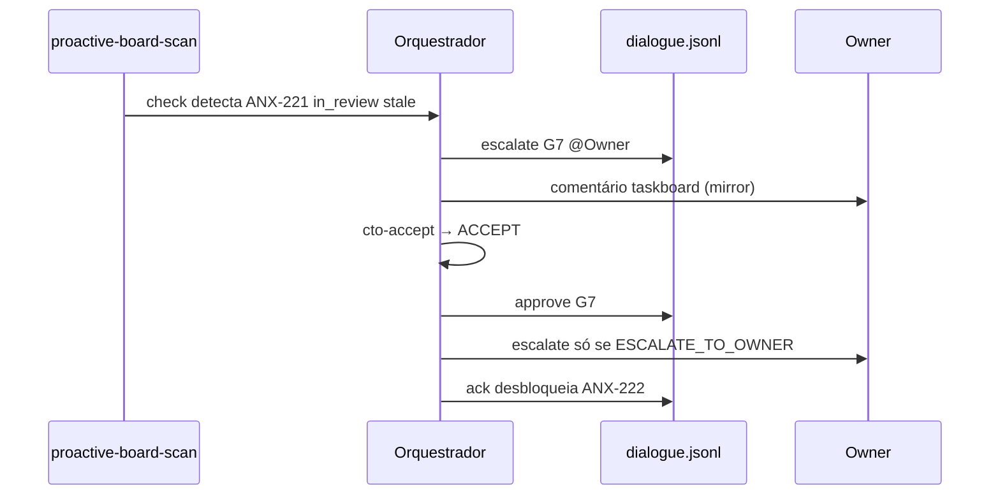

# Proatividade de Agentes — anxionOS

Define comportamento **proativo** (iniciativa dentro de limites) vs **reativo** (só após prompt do usuário).

**Relacionados:** [AUTONOMY.md](./AUTONOMY.md) · [PROACTIVE-PLAYBOOK.md](./PROACTIVE-PLAYBOOK.md) · [DELEGATION.md](./DELEGATION.md) · [PERSONAS.md](./PERSONAS.md)

---

## Proativo vs reativo

| Modo | Comportamento | Exemplo |
| --- | --- | --- |
| **Reativo** | Espera instrução explícita | Usuário pede "implemente X" → agente codifica |
| **Proativo** | Monitora, sugere e age em ações seguras | Cron detecta ANX-221 in_review 48h → escalate G7 no dialogue |

Proatividade **não** substitui governança ([AGENTS.md](../../AGENTS.md), [COMPLIANCE.md](./COMPLIANCE.md)):

- Proativo **≠** trabalho sem ler AGENTS.md na sessão (gate G0)
- Proativo **≠** trabalho sem issue `ANX-*` claimada (`in_progress` + thread binding)
- Proativo **≠** `taskboard:ensure` ignorado — board offline = PARAR
- Proativo **≠** inventar fatos ausentes de `brain/` — usar OpenKnowledge MCP
- Proativo **≠** commit, push ou `move done` sem aceite G7 (CTO `cto-accept` ACCEPT ou Owner)
- Proativo **≠** claim automático (exceto match de domínio + issue desbloqueada + delegação do orquestrador)

---

## Níveis por papel

| Papel | Nível | Cadência típica |
| --- | --- | --- |
| **Orquestrador** (Renata) | **Alto** | Scan board 10 min; `cto-accept` em in_review; escalate Owner só exceções |
| **Executores** (Lucas, Camila, Rafael, Diego) | **Médio** | Pré-claim research; handoff sem esperar ping |
| **Críticos** (Marina, Paulo, Bia, Gustavo) | **Médio** | Challenge cedo em `in_progress` silencioso |
| **Especialistas G2–G5** | **On-trigger** | Voluntariar quando issue entra `in_review` |
| **GitHub Lead** (Ju) | **On-trigger + CI** | Verdict CHANGES_REQUIRED em CI fail |
| **Research / Architect** | **Baixo** | Spikes quando orquestrador sinaliza lacuna |

---

## Triggers proativos

| Trigger | Quem age | Ação |
| --- | --- | --- |
| Issue unblocked | Executor de domínio | Claim + announce via dialogue (após delegação) |
| `in_review` > 48h sem comentário | Orquestrador | `cto-accept`; se CHANGES_REQUIRED delegar; se ESCALATE → Owner |
| `in_progress` > 24h silencioso | Crítico do par | Challenge / status request |
| `taskboard:ensure` falha | Qualquer agente | PARAR + broadcast blocked |
| Nova menção `@` no dialogue | Persona alvo | Responder no próximo turno |
| CI fail na branch | GitHub Lead | Post verdict `CHANGES_REQUIRED` |
| Dependência resolvida | Executor downstream | Ack + preparar claim |
| 0 `in_progress` | Orquestrador | Reconciliar fila `in_review` / `todo` |
| G7 candidato em `in_review` | Orquestrador | `npm run orchestration:cto-accept`; aceitar se ACCEPT |

Implementação: `.cursor/orchestration/agent-proactive/triggers.mjs`

---

## Comandos

```bash
npm run orchestration:proactive -- check [--persona orchestrator] [--json]
npm run orchestration:proactive -- suggest [--persona orchestrator]
npm run orchestration:proactive -- act [--persona orchestrator] [--dry-run]
npm run orchestration:monitor [--once] [--interval 600]
npm run orchestration:cto-accept -- --issue ANX-N [--apply]
node .cursor/hooks/agent-proactive.mjs --persona orchestrator
```

Log: `.cursor/orchestration-runtime/proactive/proactive.jsonl`

---

## Auto-ações seguras (`act`)

Permitido **sem** prompt humano:

- Post dialogue (`status`, `blocked`, `escalate`, `challenge`, `verdict`)
- Registrar evento em `proactive.jsonl`
- `npm run taskboard:ensure` e reportar

**Proibido** em `act`:

- Claim de issue (requer delegação explícita)
- Alteração de código, commits, `move done`

---

## Fluxo exemplo — ANX-221 G7



Smoke test:

```bash
npm run orchestration:proactive -- check --persona orchestrator
npm run orchestration:proactive -- act --persona orchestrator --dry-run
```


## Aceite G7 CTO

Renata avalia evidências antes de escalar ao Owner:

```bash
npm run orchestration:cto-accept -- --issue ANX-221
npm run orchestration:cto-accept -- --issue ANX-221 --apply  # se ACCEPT
```

Ver [CTO-ACCEPTANCE.md](./CTO-ACCEPTANCE.md).
