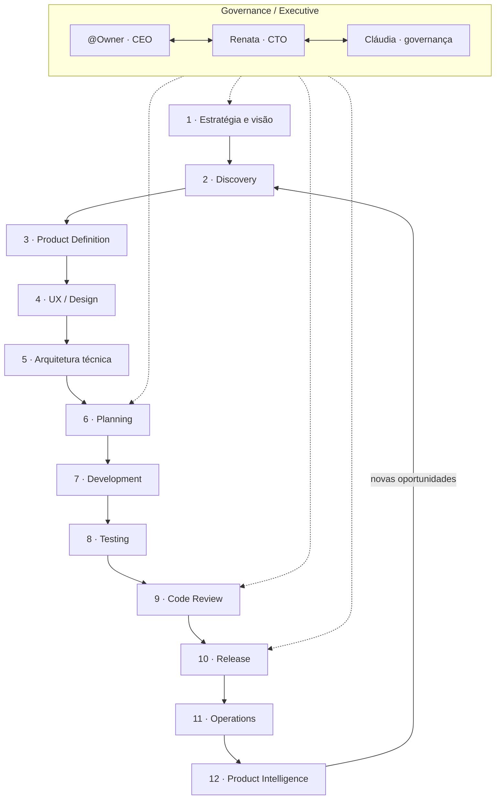
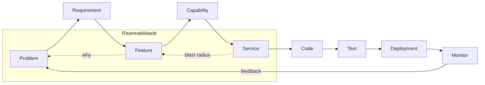
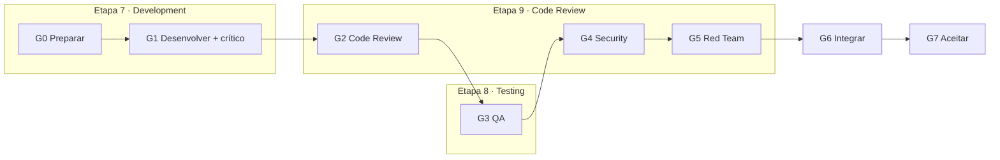
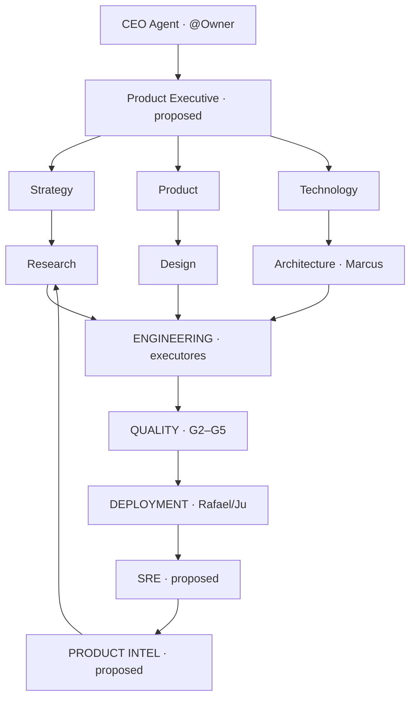

# Product Company Model — AI Product Company (12 etapas)

> **Escopo:** modelo conceitual e mapeamento para a **equipe Cursor** em `.cursor/orchestration/`. Não descreve runtime de agentes institucionais do produto anxionOS (`backend/modules/agents/`). Ver [SCOPE.md](./SCOPE.md).
>
> **Fase atual:** **P0 — documentação apenas** (issue `ANX-250`). Personas permanentes novas **não** entram em [PERSONAS.md](./PERSONAS.md) nesta fase — apenas registro `proposed` em [AGENT-ROSTER.md](./AGENT-ROSTER.md#product-company-proposed-expansion).

**Documento mestre (26 seções Owner):** [AI-PRODUCT-COMPANY-ENGINE.md](./AI-PRODUCT-COMPANY-ENGINE.md)

**Relacionados:** [PRODUCT-GRAPH-SCHEMA.md](./PRODUCT-GRAPH-SCHEMA.md) · [AGENT-GRAPH-SCHEMA.md](./AGENT-GRAPH-SCHEMA.md) · [AUTHORITY-LEVELS.md](./AUTHORITY-LEVELS.md) · [DECISION-ENGINE-FRAMEWORK.md](./DECISION-ENGINE-FRAMEWORK.md) · [PIPELINE.md](./PIPELINE.md) · [LIFECYCLE.md](./LIFECYCLE.md) · [HIERARCHY.md](./HIERARCHY.md) · [TASKBOARD-ROUTING.md](./TASKBOARD-ROUTING.md)

**CLI etapa por issue:** `npm run orchestration:phase -- company status --issue ANX-N`

---

## Visão

O Owner propôs modelar o ciclo completo de criação de produto — da estratégia à inteligência em produção — como uma **empresa de tecnologia virtual** cujos agentes compartilham um **Product Graph** (Problem → Requirement → Feature → Code → Test → Deploy → Monitor).

Este documento:

1. Define as **12 etapas** e os agentes da taxonomia do Owner (marcando gaps como `proposed`).
2. Mapeia as **18 personas permanentes** atuais para etapas cobertas hoje.
3. Preserva o pipeline **G0–G7** (etapas 7–9 ≈ G1–G5 + integração).
4. Estende (não substitui) o ciclo **P0–P7** em [LIFECYCLE.md](./LIFECYCLE.md).
5. Ponte conceitual com o **grafo institucional Neo4j** do produto anxionOS.

---

## Camada Governance / Executive

Equivalente ao conselho executivo da organização virtual — **acima** das 12 etapas.

| Papel (taxonomia Owner) | Persona Cursor atual | Nível | Responsabilidade |
| --- | --- | --- | --- |
| **CEO Agent** — visão e decisões críticas | **@Owner** (humano) | veto G7 | Greenlight estratégico, exceções, orçamento |
| **CTO Agent** — tecnologia e orquestração | **Renata Oliveira** (`orchestrator`) | núcleo A | G0–G7, planning (etapa 6), integração G6, aceite G7 rotina |
| Crítica de governança | **Cláudia Nunes** (`cto-critic`) | núcleo A | Challenge G0/G6/G7, hires, anti-teatro de processo |
| **Risk Agent** (estratégico) | Cláudia + Isa (consult) | parcial | Risco institucional G4/G5; estratégia → `consult` Isa |

**Regra:** decisões `decision` no dialogue permanecem com Renata; G7 exceção escala para @Owner ([CTO-ACCEPTANCE.md](./CTO-ACCEPTANCE.md)).

---

## As 12 etapas

Cada etapa lista agentes da **taxonomia do Owner**. Status:

- **covered** — persona permanente ou gate existente cobre o papel principal.
- **partial** — cobertura indireta (hire on-demand, skill, subagent Cursor).
- **proposed** — gap; entrada no registro P1+ em [AGENT-ROSTER.md](./AGENT-ROSTER.md).

### 1. Estratégia e visão

**Objetivo:** decidir *o que vale a pena construir e por quê*.

| Agente (Owner) | Status | Cobertura atual |
| --- | --- | --- |
| CEO Agent | covered | @Owner |
| Chief Product Agent | proposed | — |
| Market Intelligence Agent | proposed | Helena (`researcher`) parcial em spikes |
| Customer Intelligence Agent | proposed | — |
| Business Strategy Agent | proposed | — |
| Risk Agent | partial | Cláudia + Isa |
| Portfolio Agent | partial | Renata + taskboard priorização |

**Outputs:** Vision → Business Opportunity → Strategic Objective → Product Opportunity (OKF `brain/` em P0–P1).

**Fase LIFECYCLE:** antecede **P0 Brainstorm**; overlap com gate **G-B**.

---

### 2. Discovery

**Pergunta central:** *Qual problema devemos resolver?*

| Agente (Owner) | Status | Cobertura atual |
| --- | --- | --- |
| Product Discovery Agent | proposed | Marcus + Helena em P1 |
| User Research Agent | proposed | — |
| UX Research Agent | proposed | — |
| Market Research Agent | partial | Helena (`researcher`) |
| Data Analyst Agent | proposed | — |
| Competitive Intelligence Agent | partial | Helena |
| Problem Analyst Agent | partial | Marcus (`architect`) consult |
| Trend Analyst Agent | partial | Helena |

**Outputs:** Problem Definition, Personas, JTBD, Pain Points, Opportunity Map.

**Fase LIFECYCLE:** **P1 Discovery** (G-D) — Marcus + Renata.

---

### 3. Product Definition

**Objetivo:** decidir exatamente *o que será construído*.

| Agente (Owner) | Status | Cobertura atual |
| --- | --- | --- |
| Product Manager Agent | proposed | Renata coordena; sem PM dedicado |
| Product Strategist Agent | proposed | — |
| Requirements Agent | partial | `write-a-spec` + OKF |
| Business Analyst Agent | proposed | — |
| Domain Expert Agent | partial | Marcus + `brain/` specs |
| Product Economist Agent | proposed | — |

**Outputs:** PRD, Requirements, User Stories, Acceptance Criteria, KPIs, North Star.

**Product Graph:** esta etapa **materializa nós** Problem, Requirement, Feature, Capability (ver [PRODUCT-GRAPH-SCHEMA.md](./PRODUCT-GRAPH-SCHEMA.md)).

**Fase LIFECYCLE:** fim de **P1** → início **P2**; specs em `brain/project-docs/specs/`.

---

### 4. UX / Design

**Objetivo:** experiência antes do código.

| Agente (Owner) | Status | Cobertura atual |
| --- | --- | --- |
| UX Research Agent | proposed | — |
| UX Architect Agent | proposed | — |
| Product Designer Agent | proposed | — |
| UI Designer Agent | partial | Camila (implementação P07, não design upstream) |
| Design System Agent | partial | `docs/design-system/`, Camila |
| Interaction Designer Agent | proposed | — |
| Accessibility Agent | partial | Camila + `a11y-architect` hire |
| Content Designer Agent | proposed | André (`docs-lead`) parcial |
| Design Critic Agent | partial | Paulo (`frontend-critic`) em G1 UI |

**Ciclo:** Design → Critique → Simulation → User Testing → Redesign.

**Fase LIFECYCLE:** entre **P2** e **P3**; gate explícito `proposed` (G-UX).

---

### 5. Technical Architecture

**Objetivo:** transformar produto em sistema.

| Agente (Owner) | Status | Cobertura atual |
| --- | --- | --- |
| CTO Agent | covered | Renata |
| Software Architect Agent | covered | Marcus (`architect`) |
| Solution Architect Agent | partial | Marcus + `code-architect` hire |
| Distributed Systems Agent | proposed | — |
| Database Architect Agent | partial | Lucas + `database-reviewer` hire |
| Security Architect Agent | partial | Isa (`security-lead`) |
| AI Architect Agent | proposed | — |
| Infrastructure Architect Agent | partial | Rafael (`infra-executor`) |
| API Architect Agent | partial | Lucas / Diego |
| Data Architect Agent | proposed | — |
| **Graph Architect Agent** | partial | Marcus + módulo `graph` (produto) |

**Outputs:** ADRs, Archify, mapa de módulos ADR0002.

**Fase LIFECYCLE:** **P2 Architecture** (G-A).

---

### 6. Planning / Engineering Breakdown

**Objetivo:** arquitetura → trabalho executável (`ANX-*`).

| Agente (Owner) | Status | Cobertura atual |
| --- | --- | --- |
| Engineering Manager Agent | partial | Renata |
| Technical Project Manager Agent | partial | Renata + taskboard |
| Technical Lead Agent | partial | Executores Level C |
| Planner Agent | partial | `orchestrate-work`, delegation-queue |
| Dependency Analyst Agent | proposed | — |
| Estimation Agent | proposed | — |
| Resource Planner Agent | proposed | — |

**Outputs:** Epics → Features → Tasks no Dashi; pacotes `delegation-queue/`.

**Fase LIFECYCLE:** **P3 Planning** (G-P).

**Dual-board:** trabalho de produto → Dashi `ANX-*`; meta framework → Cursor goals ([TASKBOARD-ROUTING.md](./TASKBOARD-ROUTING.md)).

---

### 7. Development

**Objetivo:** implementação verificável.

| Agente (Owner) | Status | Cobertura atual |
| --- | --- | --- |
| Engineering Director | partial | Renata despacha |
| Backend Team | covered | Lucas + Marina |
| Frontend Team | covered | Camila + Paulo |
| Data Team | proposed | — |
| AI Team | proposed | — |
| Platform Team | covered | Rafael + Bia |

**Pipeline:** **G0 → G1** (executor + crítico 1:1) dentro de **P4 Development**.

**Mapeamento G0–G7 nesta etapa:**

| Gate | Etapa Product Company | Personas |
| --- | --- | --- |
| G0 | Preparar slice | Renata + executor |
| G1 | Development (entrega) | Executor + crítico |
| — | *(handoff para etapas 8–9)* | — |

---

### 8. Testing / Verification

**Objetivo:** código escrito ≠ código aprovado.

| Agente (Owner) | Status | Cobertura atual |
| --- | --- | --- |
| QA Agent | covered | Edu (`qa-lead`) |
| Test Architect Agent | partial | Edu + `pr-test-analyzer` |
| Unit / Integration / E2E Test Agent | partial | hires `e2e-runner`, TDD skill |
| Performance Test Agent | proposed | — |
| Security Test Agent | partial | Isa G4 |
| Chaos Test Agent | partial | Thiago G5 |
| Regression Test Agent | partial | Edu G3 |
| Accessibility Test Agent | partial | Camila hire `a11y-architect` |
| AI Evaluation Agent | proposed | — |

**Pipeline:** **G3 QA** (+ pré-G2 testes do executor).

---

### 9. Code Review

**Objetivo:** camada independente de revisão.

| Agente (Owner) | Status | Cobertura atual |
| --- | --- | --- |
| Code Reviewer | covered | Fernanda (`code-review-lead`) G2 |
| Security Reviewer | covered | Isa G4 |
| Architecture Reviewer | partial | Fernanda + Marcus consult |
| Performance Reviewer | proposed | — |
| Reliability Reviewer | proposed | — |
| Maintainability Reviewer | partial | Fernanda + `thermo-nuclear-code-quality-review` |
| Decision Agent | partial | Fernanda `verdict` G2 |

**Nota:** G2–G5 são **sequenciais** no pipeline existente; a taxonomia Owner agrupa “Code Review” (G2) separado de Security (G4) e testes adversariais (G5) — **não substituir** [PIPELINE.md](./PIPELINE.md).

| Gate | Etapa Owner | Persona |
| --- | --- | --- |
| G2 | Code Review | Fernanda |
| G4 | Security Review | Isa |
| G5 | Red Team / Chaos | Thiago |

---

### 10. Release / Deployment

**Objetivo:** staging → produção com rollback.

| Agente (Owner) | Status | Cobertura atual |
| --- | --- | --- |
| Release Manager Agent | partial | Renata G6/G7 |
| DevOps Agent | covered | Rafael |
| SRE Agent | partial | Rafael + Bia |
| Infrastructure Agent | covered | Rafael |
| Deployment Agent | partial | Rafael P5–P7 |
| Configuration Agent | proposed | — |
| Migration Agent | partial | Lucas (migrations domínio) |
| Rollback Agent | proposed | — |

**Fase LIFECYCLE:** **P5 Staging**, **P6 Launch Review**, início **P7**.

---

### 11. Production / Operations

**Objetivo:** produto vivo — observabilidade e incidentes.

| Agente (Owner) | Status | Cobertura atual |
| --- | --- | --- |
| SRE Agent | partial | Rafael |
| Observability Agent | proposed | — |
| Incident Response Agent | proposed | — |
| Performance Agent | proposed | — |
| Cost Optimization Agent | proposed | — |
| Security Operations Agent | partial | Isa consult |
| Reliability Agent | proposed | — |
| Capacity Planning Agent | proposed | — |

**Fase LIFECYCLE:** **P7 Production** (G-Prod).

**Produto anxionOS:** módulo `operations` (runtime) — fora do escopo Cursor; esta etapa documenta **como a equipe dev responde** a incidentes de slice entregue.

---

### 12. Product Intelligence / Evolution

**Objetivo:** telemetria → insights → nova Discovery.

| Agente (Owner) | Status | Cobertura atual |
| --- | --- | --- |
| Product Analytics Agent | proposed | — |
| Growth Agent | proposed | — |
| Customer Success Agent | proposed | — |
| Feedback Agent | proposed | — |
| Experimentation Agent | proposed | — |
| A/B Testing Agent | proposed | — |
| Optimization Agent | proposed | — |
| Innovation Agent | partial | Helena spikes |
| Product Strategist | proposed | — |

**Loop:** fecha o ciclo → **etapa 2 Discovery** (P0/P1).

---

## Ciclo completo (Mermaid)



---

## Product Graph (visão)



Schema formal: [PRODUCT-GRAPH-SCHEMA.md](./PRODUCT-GRAPH-SCHEMA.md). Diagrama Archify: [.archify/specs/anxionos-product-company.workflow.json](../../.archify/specs/anxionos-product-company.workflow.json).

---

## Mapeamento: 18 personas → etapas

| # | Persona (slug) | Etapas cobertas hoje | Papel principal |
| --- | --- | --- | --- |
| 1 | `orchestrator` (Renata) | 1, 6, 7, 9, 10, G6–G7 | CTO, planning, integração, aceite |
| 2 | `cto-critic` (Cláudia) | Governance (todas) | Challenge, governança, risco processo |
| 3 | `architect` (Marcus) | 2, 3, 5 | Discovery, ADR, arquitetura |
| 4 | `researcher` (Helena) | 1, 2, 12 | Pesquisa, mercado, spikes |
| 5 | `backend-executor` (Lucas) | 7 | Implementação backend |
| 6 | `frontend-executor` (Camila) | 4, 7 | UI P07, implementação frontend |
| 7 | `infra-executor` (Rafael) | 7, 10, 11 | CI, deploy, plataforma |
| 8 | `adapters-executor` (Diego) | 7 | Adapters / connections |
| 9 | `backend-critic` (Marina) | 7 | G1 backend |
| 10 | `frontend-critic` (Paulo) | 4, 7 | G1 frontend, critique design |
| 11 | `infra-critic` (Bia) | 7, 10, 11 | G1 infra / pipeline |
| 12 | `adapters-critic` (Gustavo) | 7 | G1 adapters |
| 13 | `code-review-lead` (Fernanda) | 9 | G2 |
| 14 | `qa-lead` (Edu) | 8 | G3 |
| 15 | `security-lead` (Isa) | 5, 8, 9 | G4, arquitetura segurança |
| 16 | `red-team-lead` (Thiago) | 8, 9 | G5 |
| 17 | `github-lead` (Ju) | 10 | PR policy, merge |
| 18 | `docs-lead` (André) | 3, 4, 12 | Docs públicas, handoffs |

**@Owner** cobre CEO Agent (etapa 1) e veto G7.

---

## Gap analysis (resumo)

| Categoria | covered | partial | proposed |
| --- | ---: | ---: | ---: |
| Etapa 1 Estratégia | 1 | 2 | 4 |
| Etapa 2 Discovery | 0 | 4 | 4 |
| Etapa 3 Definition | 0 | 3 | 3 |
| Etapa 4 UX | 0 | 4 | 5 |
| Etapa 5 Architecture | 2 | 6 | 3 |
| Etapa 6 Planning | 0 | 4 | 3 |
| Etapa 7 Development | 4 | 1 | 2 equipes |
| Etapa 8 Testing | 1 | 6 | 2 |
| Etapa 9 Code Review | 2 | 3 | 2 |
| Etapa 10 Release | 2 | 4 | 2 |
| Etapa 11 Operations | 0 | 2 | 6 |
| Etapa 12 Intelligence | 0 | 1 | 8 |

**Total agentes na taxonomia Owner:** ~90 rótulos · **personas permanentes hoje:** 18 · **gaps P1 prioritários:** ver roster § Product Company.

---

## Relação com LIFECYCLE P0–P7

| LIFECYCLE (existente) | Etapas Product Company (12) |
| --- | --- |
| P0 Brainstorm | 1 Estratégia (+ início 2) |
| P1 Discovery | 2 Discovery (+ 3 draft) |
| P2 Architecture | 5 Architecture |
| P3 Planning | 6 Planning |
| P4 Development G0–G7 | 7 Development + 8 Testing + 9 Code Review |
| P5 Staging | 10 Release |
| P6 Launch Review | 10 Release |
| P7 Production | 11 Operations |
| *(novo)* | 4 UX (entre P1 e P2 ou paralelo P2) |
| *(novo)* | 12 Intelligence (loop pós-P7) |

**Preservação:** P4 continua sendo o container do pipeline G0–G7 sem alteração de gates.

---

## Mapeamento G0–G7 ↔ etapas 7–9



| Gate | Etapa Product Company | Não confundir com |
| --- | --- | --- |
| G0 | 7 (antes de codar) | Etapa 6 planning |
| G1 | 7 | Etapa 9 (crítico ≠ code review formal) |
| G2 | 9 | — |
| G3 | 8 | — |
| G4 | 9 (security review) | Etapa 8 security **test** |
| G5 | 8–9 (adversarial) | — |
| G6–G7 | 10 (handoff release) | Etapa 11 ops |

---

## Ponte: Product Graph ↔ grafo institucional anxionOS

| Camada | Onde vive | Propósito |
| --- | --- | --- |
| **Product Graph** (este modelo) | OKF `brain/` + projeção futura P3 | Rastrear *por que* uma feature existe; ligar requisito → código → teste |
| **Grafo institucional** (produto) | Neo4j via `backend/modules/graph/` | Agências, agentes runtime, capital, autoridade |
| **Graphify / code-review-graph** | Dev tooling | AST, impacto de símbolos no repo |

**Bridge conceitual (sem código nesta fase):**

```text
Product Graph (Cursor/OKF)          Institutional Graph (Neo4j)
─────────────────────────          ─────────────────────────────
Problem                             BusinessObjective (proposed node)
Requirement                         InstitutionalRequirement
Feature                             Capability / Strategy
Code (file symbol)                  Service / Module (ownerDomain)
Test                                VerificationArtifact
Deployment                          Environment / Release
Monitor                             OperationalSignal
```

Sincronização futura (P3): eventos de domínio com `ownerDomain` + projeção read-only — **nunca** escrever ledger/capital a partir do Product Graph Cursor.

---

## Dual-board e compliance

| Tipo de trabalho | Board | Issue / goal |
| --- | --- | --- |
| Spec Product Company (este doc) | Dashi framework | `ANX-250` |
| Slices de produto (organizations, graph, …) | Dashi | `ANX-*` produto |
| Meta-tooling puro `.cursor/rules` | Cursor goals | `CURSOR_GOAL_ID` |

`npm run orchestration:compliance -- --pre-work --issue ANX-250 --persona orchestrator`

---

## Rollout faseado

| Fase | Escopo | Entregável |
| --- | --- | --- |
| **P0** (atual) | Documentação | Este arquivo, schema, Archify stub, roster § proposed |
| **P1** | Discovery/Definition agents → workflows OKF | Hire templates; gates G-UX, G-D estendidos |
| **P2** | Research/Design on-demand | `orchestration:hire` workers UX/PM |
| **P3** | Projeção no módulo produto | Graph projection `product:*` no Neo4j |

Detalhes: [AGENT-ROSTER.md#product-company-proposed-expansion](./AGENT-ROSTER.md#product-company-proposed-expansion).

---

## AI Product Company Engine (visão Owner)



**P0:** apenas documentar — não instanciar CEO/PE como personas Cursor separadas de @Owner/Renata.

---

**Issue:** ANX-250 · **Autor:** framework executor · **Status:** P0 spec
