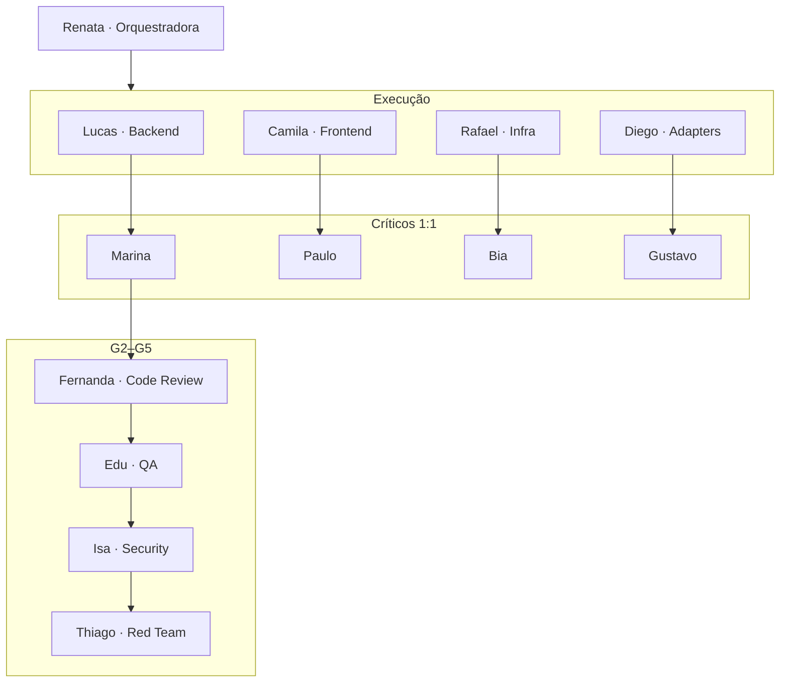
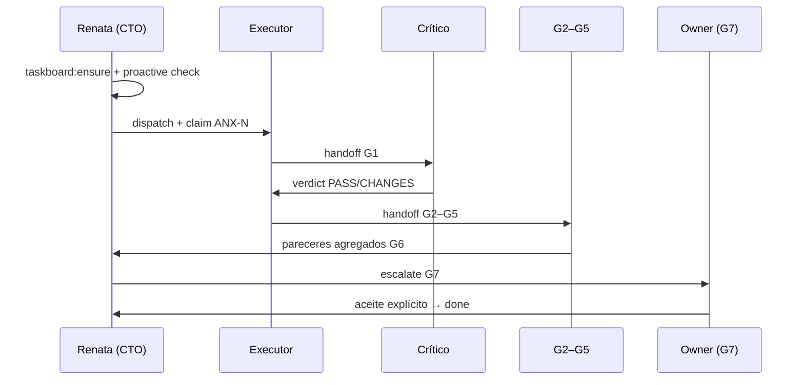

**Autoridade CTO:** [CTO-AUTHORITY.md](./CTO-AUTHORITY.md)

# Orquestração — Índice Mestre (framework agnóstico)

> **Este framework é tooling Cursor** — governança de desenvolvimento no IDE (personas, pipeline G0–G7, dialogue, taskboard). **Não** é o módulo `backend/modules/agents/` do produto anxionOS, nem agentes institucionais em runtime. Ver [SCOPE.md](./SCOPE.md).
>
> **Framework agnóstico:** portable entre repositórios — ver [AGNOSTIC-DESIGN.md](./AGNOSTIC-DESIGN.md). **Instância anxionOS:** prefixo `ANX`, config em [`.cursor/orchestration.config.json`](../../.cursor/orchestration.config.json).

Framework de orquestração multi-agente estilo Google para **desenvolver repositórios** via **Dashi Taskboard**, ciclo de vida **P0–P7** (brainstorm → produção), pipeline **G0–G7** e diálogo entre personas.

**Status do framework:** [GOAL-STATUS.md](./GOAL-STATUS.md) — **COMPLETE** (tooling v1; produto anxionOS é escopo separado — ex.: ANX-134).

**Guidelines:** [GUIDELINES-INTEGRATION.md](./GUIDELINES-INTEGRATION.md) — karpathy + ECC + ui-ux-pro-max por persona/gate.

**Gap analysis:** [GAP-ANALYSIS.md](./GAP-ANALYSIS.md) — 24 tipos, gaps fechados e remanescentes.

**Iniciar trabalho real (Owner + claim):** [START-WORK.md](./START-WORK.md).

---

## Quick start — Renata (orquestradora)

```bash
# 1. Gates obrigatórios
npm run taskboard:ensure          # abortar se falhar
npm run taskboard:context
npm run taskboard:list

# 2. Proatividade (início de sessão)
npm run orchestration:proactive -- check --persona orchestrator
npm run orchestration:proactive -- act --persona orchestrator --dry-run

# 3. Sessão ativa
export CURSOR_THREAD_ID="${CURSOR_THREAD_ID:-$(uuidgen | tr '[:upper:]' '[:lower:]')}"
npm run orchestration:who -- --list   # roster + competências
npm run orchestration:session -- start --persona orchestrator --issue ANX-N

# 4. Escalar pendências G7
npm run orchestration:broadcast -- \
  --from-persona orchestrator --to-mention @Owner \
  --issue ANX-221 --gate G7 --type escalate \
  --body "@Owner — ANX-221 aguarda aceite G7." \
  --evidence issue:ANX-221,file:AGENTS.md \
  --mirror-taskboard

# 5. Fim de sessão
npm run orchestration:session -- end --persona orchestrator

# Workflow individual
npm run orchestration:workflow -- status --persona backend-executor --issue ANX-N
npm run orchestration:workflow -- next --persona backend-executor --issue ANX-N
npm run orchestration:workflow -- monitor --level C
```

**Leitura obrigatória na sessão:** [AGENTS.md](../../AGENTS.md) → [COMPLIANCE.md](./COMPLIANCE.md) → [ONBOARDING.md](./ONBOARDING.md).

---

## Mapa de documentos

### Governança e pipeline

| Documento | Conteúdo |
| --- | --- |
| [LIFECYCLE.md](./LIFECYCLE.md) | Ciclo de vida P0–P7 — brainstorm → produção |
| [BRAINSTORM-TO-PROD-RUNBOOK.md](./BRAINSTORM-TO-PROD-RUNBOOK.md) | Runbook passo a passo ideia → prod |
| [GOOGLE-PRACTICES.md](./GOOGLE-PRACTICES.md) | Práticas bigtech mapeadas ao tooling |
| [GOAL-STATUS.md](./GOAL-STATUS.md) | Auditoria do goal Cursor — ~95% framework, PARTIAL, crons on |
| [E2E-RUNBOOK.md](./E2E-RUNBOOK.md) | Checklist G0→G7 com comandos (ANX-222 referência) |
| [delegation-queue/](./delegation-queue/) | Pacotes pré-G0 para issues desbloqueáveis pós-ANX-222 |
| [GAP-ANALYSIS.md](./GAP-ANALYSIS.md) | Lacunas fechadas vs remanescentes (24 tipos) |
| [GUIDELINES-INTEGRATION.md](./GUIDELINES-INTEGRATION.md) | karpathy + ECC + ui-ux-pro-max por persona/gate |
| [COMPLIANCE.md](./COMPLIANCE.md) | Gates G0–G0.8, OpenKnowledge, zero-trabalho-fora-do-board |
| [PIPELINE.md](./PIPELINE.md) | Gates G0–G7, critérios de saída, independência de revisores |
| [VISUAL-DOCUMENTATION.md](./VISUAL-DOCUMENTATION.md) | Política obrigatória de diagramas Mermaid/Archify |
| [COLLECTIVE-WORKFLOW.md](./COLLECTIVE-WORKFLOW.md) | Workflow coletivo + gantt wave |
| [COLLECTIVE-WORKFLOW.md](./COLLECTIVE-WORKFLOW.md) | Pipeline coletivo G0–G7 + plug-in workflows |
| [workflows/](./workflows/) | 17 workflows individuais por persona |
| [LEVEL-C-MONITORING.md](./LEVEL-C-MONITORING.md) | Monitoramento on-demand Level C |
| [WORKFLOWS.md](./WORKFLOWS.md) | Fluxos legados por fase P01–P09 |
| [GOALS-PROTOCOL.md](./GOALS-PROTOCOL.md) | Protocolo de goals Cursor + taskboard |
| [VALIDATION-REPORT.md](./VALIDATION-REPORT.md) | Relatório de validação — READY WITH WARNINGS |

### Equipe e comunicação

| Documento | Conteúdo |
| --- | --- |
| [TEAM.md](./TEAM.md) | Roster Google-style, skills karpathy + ECC |
| [AGENT-ROSTER.md](./AGENT-ROSTER.md) | Roster mutuo + matriz de competências |
| [COMPETENCE-BOUNDARIES.md](./COMPETENCE-BOUNDARIES.md) | Anti-invasão de competência |
| [INTER-AGENT-PROTOCOL.md](./INTER-AGENT-PROTOCOL.md) | Interação livre na hierarquia |
| [PERSONAS.md](./PERSONAS.md) | 17 personas nomeadas, pares críticos 1:1 |
| [TEAM-COLLABORATION.md](./TEAM-COLLABORATION.md) | Colaboração entre personas |
| [COMMUNICATION.md](./COMMUNICATION.md) | Protocolo de mensagens |
| [INTERACTIONS.md](./INTERACTIONS.md) | **24 tipos** de interação — lista canônica + lifecycle |
| [INTER-AGENT-PROTOCOL.md](./INTER-AGENT-PROTOCOL.md) | Matriz hierárquica A/B/C por tipo |
| [COMPETENCE-BOUNDARIES.md](./COMPETENCE-BOUNDARIES.md) | Anti-invasão + competência por tipo |
| [AGENT-ROSTER.md](./AGENT-ROSTER.md) | Roster operacional slug → competências |
| [EXAMPLE-THREADS.md](./EXAMPLE-THREADS.md) | Exemplos de threads de diálogo |
| [NO-SILENT-WORK.md](./NO-SILENT-WORK.md) | Broadcast obrigatório, sessões, silence-watch |
| [TERMINAL.md](./TERMINAL.md) | Painel live colorido no terminal |

### Operação

| Documento | Conteúdo |
| --- | --- |
| [DELEGATION.md](./DELEGATION.md) | Como monitorar board e despachar subagentes |
| [DELEGATION-PACKAGE-ANX-222.md](./DELEGATION-PACKAGE-ANX-222.md) | Pacote G0 pronto para ANX-222 (pós-G7) |
| [RUNBOOK.md](./RUNBOOK.md) | Comandos de diálogo, sessão, proatividade |
| [ONBOARDING.md](./ONBOARDING.md) | Primeiro dia de uma persona |
| [PROACTIVITY.md](./PROACTIVITY.md) | Triggers, suggest, act |
| [PROACTIVE-PLAYBOOK.md](./PROACTIVE-PLAYBOOK.md) | Playbook de ações proativas |
| [AUTONOMY.md](./AUTONOMY.md) | Crons, loops, hooks autônomos |

### Subsistemas (CLI)

| Pasta | README | Função |
| --- | --- | --- |
| [agent-dialogue/](./agent-dialogue/) | [README](./agent-dialogue/README.md) | Broadcast, terminal live, tail, personas, sessão |
| [agent-proactive/](./agent-proactive/) | [README](./agent-proactive/README.md) | Check, suggest, act, monitor |
| [agent-workflow/](./agent-workflow/) | [README](./agent-workflow/README.md) | Estado workflow + decision-tree CLI |
| [agent-autonomy/](./agent-autonomy/) | [README](./agent-autonomy/README.md) | Crons, hooks, loops, goals |

### Regras Cursor

| Arquivo | Escopo |
| --- | --- |
| `.cursor/rules/orchestration-compliance.mdc` | Gates AGENTS.md + board + OKF |
| `.cursor/rules/no-silent-work.mdc` | Broadcast e sessão obrigatórios |
| `.cursor/rules/workflow-compliance.mdc` | Workflow individual + decision-tree antes de codar |
| `.cursor/rules/dialogue-in-conversation.mdc` | Exibir diálogo no chat quando solicitado |
| `.cursor/rules/visual-documentation.mdc` | Diagramas Mermaid obrigatórios em planning/handoffs |

---

## Cheat sheet de comandos

### Taskboard

```bash
npm run taskboard:ensure
npm run taskboard:context
npm run taskboard:list
npm run taskboard:prework
node scripts/taskboard.mjs get ANX-N
node scripts/taskboard.mjs move ANX-N in_progress   # requer taskctl + thread id
```

### Diálogo

```bash
npm run orchestration:personas                          # listar 17 personas
npm run orchestration:personas -- get orchestrator      # detalhe Renata
npm run orchestration:broadcast -- [post opts]          # publicar mensagem
npm run orchestration:show-dialogue -- read --issue ANX-N
npm run orchestration:terminal                          # painel live colorido (tab dedicado)
npm run orchestration:tail                              # snapshot formatado
npm run orchestration:watch                             # watch legado (texto)
npm run orchestration:session -- start|heartbeat|end|list
npm run orchestration:silence-watch
```

### Proatividade e autonomia

```bash
npm run orchestration:proactive -- check [--persona orchestrator] [--json]
npm run orchestration:proactive -- suggest --persona orchestrator
npm run orchestration:proactive -- act --persona orchestrator [--dry-run]
npm run orchestration:monitor [--once] [--interval 600]
npm run orchestration:autonomy -- list
npm run orchestration:cron -- start
npm run orchestration:goals -- list
```

### Verificação do framework

```bash
npm run orchestration:verify    # test (19) + diagram-check (34/34) + personas (17)
npm run orchestration:test      # suite unitária apenas
npm run orchestration:diagram-check
```

Rodar `orchestration:verify` antes de claimar issue ou ao fechar sessão de orquestração.

### Hooks Cursor

```bash
# sessionStart → agent-proactive.mjs (automático via hooks.json)
# stop → agent-orchestration.mjs (pending-broadcast + No Silent Work)
node .cursor/hooks/agent-proactive.mjs --persona orchestrator
node .cursor/hooks/agent-orchestration.mjs
```

---

## Equipe resumida



**Skills integradas:**

| Skill | Escopo |
| --- | --- |
| `karpathy-guidelines` | Todos os executores — simplicidade, diffs cirúrgicos |
| Subagentes ECC | Por domínio — ver [TEAM.md](./TEAM.md) |
| `ui-ux-pro-max` | **Somente** Camila / `frontend/` P07 |

---

## Estado atual do board

| Métrica | Valor |
| --- | --- |
| Framework Cursor | **COMPLETE** (ANX-230) — versionado no git |
| Produto (pipeline) | **Separado** — ex. ANX-134 `in_review` G7 |
| Crons | 7 `[on]`, daemon ativo |

Ver snapshot completo: [GOAL-STATUS.md](./GOAL-STATUS.md).

---

## Fluxo típico de uma issue



---

## Links externos

- [AGENTS.md](../../AGENTS.md) — instruções canônicas do repositório
- [brain/notes/anxionos-team-personas.md](../../brain/notes/anxionos-team-personas.md) — posturas (local OKF)
- Skills: `manage-taskboard`, `orchestrate-work` (globais do usuário)
