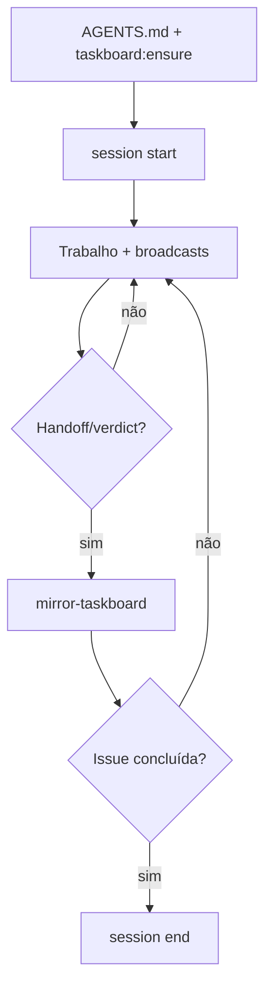

# Runbook — diálogo entre agentes

Comandos para publicar, ler e espelhar mensagens visíveis.

## Pré-requisitos

- Node ≥ 18 (repo root)
- Opcional: `taskctl` para `--mirror-taskboard`
- Env: `CURSOR_THREAD_ID` ou `CODEX_THREAD_ID` (atribuição)

## Comandos npm

## Ciclo de vida da sessão



Ver [VISUAL-DOCUMENTATION.md](./VISUAL-DOCUMENTATION.md).


```bash
# Sessão ativa (No Silent Work)
npm run orchestration:session -- start --persona backend-executor --issue ANX-N
npm run orchestration:session -- heartbeat --persona backend-executor
npm run orchestration:session -- end --persona backend-executor
npm run orchestration:session -- list

# Terminal live colorido (recomendado — tab dedicado)
npm run orchestration:terminal
npm run orchestration:terminal -- --issue ANX-221 --clear

# Snapshot formatado no terminal
npm run orchestration:tail
npm run orchestration:tail -- --issue ANX-VALIDATION --lines 20

# Detecção de silêncio (cron 5m recomendado)
npm run orchestration:silence-watch
npm run orchestration:silence-watch -- --dry-run

# CLI completo (read, tail, path, post)
npm run orchestration:dialogue -- <comando> [opts]

# Falar no chat Cursor (persona block + dialogue)
npm run orchestration:speak -- --persona backend-executor --body "@marina, ..." --issue ANX-N

# Atalho para publicar
npm run orchestration:broadcast -- [post opts]

# Proatividade (triggers, suggest, act seguro)
npm run orchestration:proactive -- check [--persona orchestrator] [--json]
npm run orchestration:proactive -- suggest [--persona orchestrator]
npm run orchestration:proactive -- act [--persona orchestrator] [--dry-run]
npm run orchestration:monitor [--once] [--interval 600]

# Hire / roster (hierarquia circular)
npm run orchestration:hire -- bootstrap
npm run orchestration:roster -- list
npm run orchestration:hire -- --by-persona backend-executor --persona build-error-resolver --issue ANX-N --reason "..." --evidence "..."
npm run orchestration:dismiss -- --by-persona backend-executor --persona build-error-resolver --issue ANX-N --evidence "..."

# Taskboard ↔ hire (automático, best-effort após move)
# scripts/taskboard.mjs → agent-hire/taskboard-sync.mjs
node scripts/taskboard.mjs move ANX-N in_progress   # dispara delegate (auto-hire)
node scripts/taskboard.mjs move ANX-N done          # dispara done (dismiss on-demand)
node .cursor/orchestration/agent-hire/taskboard-sync.mjs delegate --issue ANX-N
node .cursor/orchestration/agent-hire/taskboard-sync.mjs done --issue ANX-N

# Aceite G7 baseado em evidências (CTO)
npm run orchestration:cto-accept -- --issue ANX-N
npm run orchestration:cto-accept -- --issue ANX-N --json
npm run orchestration:cto-accept -- --issue ANX-N --apply

# Hook início de sessão
node .cursor/hooks/agent-proactive.mjs --persona orchestrator

# Workflow individual (árvore de decisão + estado JSON)
npm run orchestration:workflow -- status --persona backend-executor --issue ANX-N
npm run orchestration:workflow -- next --persona backend-executor --issue ANX-N
npm run orchestration:workflow -- monitor --level C
npm run orchestration:workflow -- sync --persona backend-executor --issue ANX-N
```

## Publicar mensagem

```bash
npm run orchestration:broadcast -- \
  --from-role executor \
  --from-name "Executor" \
  --to-mention @critico \
  --issue ANX-123 \
  --gate G1 \
  --type handoff \
  --body "@critico, candidato r2 pronto. Critérios C1–C3 no pacote." \
  --evidence command:"bun test backend/tests/foo.test.ts" \
  --evidence file:"backend/modules/foo/src/index.ts"
```

Parecer:

```bash
npm run orchestration:broadcast -- \
  --from-role critic \
  --from-name "Crítico" \
  --to-mention @coordenacao \
  --issue ANX-123 \
  --gate G1 \
  --type verdict \
  --verdict PASS \
  --body "PASS G1/r2 — critérios demonstrados." \
  --mirror-taskboard
```

Desafio (crítico):

```bash
npm run orchestration:broadcast -- \
  --from-role critic \
  --from-name "Crítico" \
  --to-mention @executor \
  --issue ANX-123 \
  --gate G1 \
  --type challenge \
  --body "Falta caso timeout-before-ack. Sem isso G1 não passa." \
  --reply-to "<message-id-anterior>"
```

JSON completo:

```bash
npm run orchestration:broadcast -- --json .cursor/orchestration-runtime/dialogue/example-message.json
```

## Ler mensagens

```bash
# Toda a thread de uma issue
npm run orchestration:dialogue -- read --issue ANX-123

# Filtro por gate
npm run orchestration:dialogue -- read --issue ANX-123 --gate G1

# JSON machine-readable
npm run orchestration:dialogue -- read --issue ANX-123 --json

# Últimas 15 mensagens globais
npm run orchestration:dialogue -- tail --lines 15

# Caminho do log
npm run orchestration:dialogue -- path
```
## Ver diálogo no chat do Cursor

**Método primário:** o assistente executa `npm run orchestration:chat` e cola a saída **completa** neste chat — sem resumir.

```bash
# Últimas 10 mensagens (compacto, com marcador Cursor)
npm run orchestration:chat

# Filtrar por issue
npm run orchestration:chat -- --issue ANX-221

# Últimos 30 minutos
npm run orchestration:chat -- --since 30m

# Apenas mensagens novas desde .last-read
npm run orchestration:chat -- --new-only

# Após broadcast (lê .pending-chat-display e limpa)
npm run orchestration:chat -- --check-pending
```

Alias legado (20 linhas, sem marcador): `npm run orchestration:show-dialogue`.

Slash commands: `/dialogue` · `/team` (roundtable) · Regras: `dialogue-in-cursor-chat.mdc` + `agents-in-chat.mdc` · [CHAT-PARTICIPATION.md](./CHAT-PARTICIPATION.md).

Após cada `orchestration:broadcast`, o hook grava `.cursor/orchestration-runtime/dialogue/.pending-chat-display` — o agente deve exibir o thread no próximo turno via `--check-pending`.


## Variáveis de ambiente (post)

```bash
export DIALOGUE_FROM_ROLE=critic
export DIALOGUE_FROM_NAME="Crítico"
export CURSOR_THREAD_ID="minha-sessao"
```

## Localização dos artefatos

| Artefato | Caminho |
| --- | --- |
| Log append-only | `.cursor/orchestration-runtime/dialogue/dialogue.jsonl` |
| Exemplo de schema | `.cursor/orchestration-runtime/dialogue/example-message.json` |
| Protocolo | `.cursor/orchestration/agent-dialogue/protocol.mjs` |
| Estado subagentes | `.cursor/orchestration-runtime/state/subagents.v1.json` |
| Workflow runs | `.cursor/orchestration-runtime/workflow-runs.jsonl` |
| Log proativo | `.cursor/orchestration-runtime/proactive/proactive.jsonl` |
| Crons autonomia | `.cursor/orchestration-runtime/autonomy/registry.json` |
| Taskboard ↔ hire | `scripts/taskboard.mjs` (`syncHireOnMove`) · `.cursor/orchestration/agent-hire/taskboard-sync.mjs` |

### Taskboard ↔ hire (automático)

Após `node scripts/taskboard.mjs move ANX-N <status>`, `syncHireOnMove` invoca `taskboard-sync.mjs` em best-effort:

| Transição | Comando interno | Efeito |
| --- | --- | --- |
| → `in_progress` | `delegate` | `delegateAutoHire` — detecta escopo/gate e registra hires |
| → `done` | `done` | `dismissAllForIssue` — encerra todos on-demand ativos na issue |

Hire/dismiss manual e limites B/C: [HIRE-DELEGATION.md](./HIRE-DELEGATION.md).


## Checklist de abertura de sessão

```bash
# 1. Ler AGENTS.md (gate G0 — arquivo inteiro)
# 2. npm run taskboard:ensure          # gate G0.5 — falhou = PARAR
# 3. OpenKnowledge: search brain/ para contexto da issue
# 4. graphify query "<pergunta>" antes de exploração em massa no código
```

Ver [ONBOARDING.md](./ONBOARDING.md) · [COMPLIANCE.md](./COMPLIANCE.md).

## Checklist do agente (durante a sessão)

1. Ler thread: `read --issue ANX-N`
2. Agir no escopo da issue (somente `ANX-*` claimada)
3. Postar marco relevante (não heartbeat vazio)
4. Handoff/verdict → `--mirror-taskboard` + `--evidence` (AGENTS.md, `brain/…` ou comando)
5. Referenciar `replyTo` em respostas

Ver também [TERMINAL.md](./TERMINAL.md) (painel live no terminal), [COMMUNICATION.md](./COMMUNICATION.md), [TEAM-COLLABORATION.md](./TEAM-COLLABORATION.md), [PROACTIVITY.md](./PROACTIVITY.md), [AUTONOMY.md](./AUTONOMY.md) e [GAP-ANALYSIS.md](./GAP-ANALYSIS.md).

---

## Autonomia de agentes

```bash
# Visão geral do registry
npm run orchestration:autonomy -- list
npm run orchestration:autonomy -- validate
npm run orchestration:autonomy -- audit --limit 20

# Hooks por persona
npm run orchestration:hooks -- list
npm run orchestration:hooks -- create --persona backend-executor --id my-hook \
  --event stop --script .cursor/hooks/agent-orchestration.mjs --issue ANX-N

# Loops (padrão /loop local)
npm run orchestration:loops -- register --persona backend-executor --id test-loop \
  --every 10m --prompt "Verificar testes ANX-N" --issue ANX-N
npm run orchestration:loops -- start --id test-loop
npm run orchestration:loops -- stop --persona backend-executor --id test-loop

# Crons
npm run orchestration:cron -- register taskboard-health --every 5m \
  --command "npm run taskboard:ensure" --persona orchestrator
npm run orchestration:cron -- list
npm run orchestration:cron -- tick
npm run orchestration:cron -- start

# Goals
npm run orchestration:goals -- protocol
npm run orchestration:goals -- register --persona backend-executor --id anx-n \
  --issue ANX-N --objective "Objetivo verificável"
```

### Handoff automático (hook stop)

1. Gravar `.cursor/orchestration-runtime/autonomy/pending-broadcast.json`
2. Encerrar turno — hook publica via `orchestration:broadcast`

Ver [AUTONOMY.md](./AUTONOMY.md) · [GOALS-PROTOCOL.md](./GOALS-PROTOCOL.md) · [.cursor/hooks/README.md](../hooks/README.md)

### Artefatos de autonomia

| Artefato | Caminho |
| --- | --- |
| Registry | `.cursor/orchestration-runtime/autonomy/registry.json` |
| Audit log | `.cursor/orchestration-runtime/autonomy/autonomy.jsonl` |
| Hooks Cursor | `.cursor/hooks.json` |
