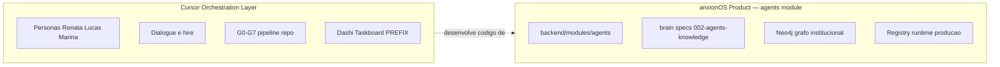

# Escopo — Equipe Cursor vs Agentes do Produto

Este documento delimita o que **é** e o que **não é** a pasta `.cursor/orchestration/`.

> **Separação obrigatória:** concluir o framework de orquestração Cursor (**ANX-230**, tooling em `.cursor/orchestration/`) **não** conclui o produto anxionOS. Pipeline de produto (P02+, `backend/`, `frontend/`, agentes institucionais) segue issues próprias — ex. **ANX-134** — e specs em `brain/`.
>
> **Framework agnóstico:** o código em `.cursor/orchestration/` é **portable** entre repositórios. Esta instância (anxionOS) configura prefixo `ANX`, `brain/` e roster via [`.cursor/orchestration.config.json`](../../.cursor/orchestration.config.json). Ver [AGNOSTIC-DESIGN.md](./AGNOSTIC-DESIGN.md).

---

## O que ESTÁ no escopo (Equipe Cursor)

A orquestração em `.cursor/orchestration/` descreve **como a equipe de desenvolvimento trabalha no Cursor IDE**:

| Área | Exemplos |
| --- | --- |
| Personas de dev | Renata, Lucas, Marina, Fernanda… ([PERSONAS.md](./PERSONAS.md)) |
| Diálogo e broadcast | `dialogue.jsonl`, `orchestration:chat`, `orchestration:speak` |
| Hire e hierarquia | Level A/B/C, workers on-demand ([HIERARCHY.md](./HIERARCHY.md)) |
| Pipeline de entrega | Gates G0–G7 para trabalho no repositório ([PIPELINE.md](./PIPELINE.md)) |
| Taskboard | Dashi/Codex — issues `{{ISSUE_PREFIX}}-*` (anxionOS: `ANX-*`), claims, status |
| Workflows por persona | `.cursor/orchestration/workflows/` |

**Objetivo:** governar desenvolvimento, revisão e documentação do código **neste repositório** — não executar agentes em produção.

---

## O que NÃO está no escopo (Agentes do Produto)

**Não** confundir personas Cursor com agentes institucionais do anxionOS:

| Fora do escopo | Onde vive |
| --- | --- |
| Execução runtime de agentes autônomos | `backend/modules/agents/` |
| Grafo institucional (Neo4j) | Spec de graph, projeções, governança |
| Registry de agentes em produção | Módulo `agents`, eventos, quotas |
| Modelos, estratégias, capital governado | Specs de domínio em `brain/` |

**Fonte canônica dos agentes do produto:** [brain/project-docs/specs/002-agents-knowledge/spec.md](../../brain/project-docs/specs/002-agents-knowledge/spec.md)

Quando a issue tratar de **implementar ou operar** agentes institucionais, ler a spec acima e o módulo `backend/modules/agents/` — **não** aplicar regras de hire/dialogue Cursor como comportamento de runtime.

---

## Diagrama de fronteira

A camada Cursor **desenvolve** o produto; não **é** o produto.

---

## Regra prática

| Pergunta | Resposta |
| --- | --- |
| "Quem é o crítico do Lucas?" | Equipe Cursor → [PERSONAS.md](./PERSONAS.md) (`backend-critic` = Marina) |
| "Como um agente institucional é registrado no grafo?" | Produto → spec 002 + módulo `agents` |
| "Renata pode contratar Marina?" | Sim — hire Cursor para trabalho na issue |
| "Renata executa trades no mercado?" | Não — isso é domínio de agentes do produto |

---

**Relacionados:** [README.md](./README.md) · [COMPLIANCE.md](./COMPLIANCE.md) · [ONBOARDING.md](./ONBOARDING.md) · [VISUAL-DOCUMENTATION.md](./VISUAL-DOCUMENTATION.md)
