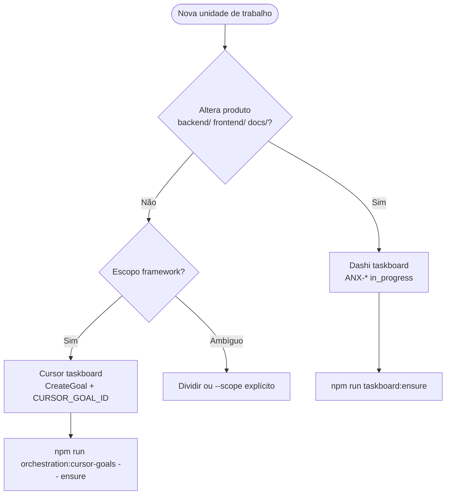

# Taskboard Routing — Dashi vs Cursor

Política dual-board para o orquestrador anxionOS. **Nunca misturar boards** na mesma unidade de trabalho.

Relacionados: [AGENTS.md](../../AGENTS.md) · [GOALS-PROTOCOL.md](./GOALS-PROTOCOL.md) · [SCOPE.md](./SCOPE.md)

## Decision tree



## Definições

| Classificação | Board | Identificador | Ensure |
| --- | --- | --- | --- |
| **Project** | Dashi | `ANX-*` claimada | `npm run taskboard:ensure` |
| **Framework** | Cursor | `CURSOR_GOAL_ID` / registry | `npm run orchestration:cursor-goals -- ensure` |

### Project

`backend/`, `frontend/`, `docs/` públicas, `brain/` (OKF local), slices de produto (ex.: ANX-135).

### Framework / non-project

`.cursor/orchestration/`, `.cursor/rules/`, hooks/skills/commands, `.cursor/orchestration-runtime/`, meta-tooling, issues ANX-230/237/240/242 (configurável).

## Exemplos

| Tarefa | Scope | Board | ID |
| --- | --- | --- | --- |
| Organizations API slice | project | dashi | ANX-135 |
| Workflow executor | framework | cursor | goal |
| ANX-240 orquestração | framework | cursor | goal + ref ANX-240 |

## Cursor taskboard — nativo vs shim

| Camada | Mecanismo |
| --- | --- |
| Nativo | `CreateGoal` / `UpdateGoal` / `/goal` |
| Shim | `.cursor/orchestration-runtime/goals/registry.json` |
| CLI | `npm run orchestration:cursor-goals` |
| Env | `CURSOR_GOAL_ID` |

## Checklist orquestrador

1. Classificar scope
2. Escolher board (`dashi` **ou** `cursor`)
3. Project: ensure + claim ANX
4. Framework: register goal + CreateGoal + env
5. Delegar com board no pacote
6. `npm run orchestration:delegate-monitor` — coluna **Board**

## Compliance

```bash
npm run orchestration:compliance -- --pre-work --scope auto --issue ANX-N --persona orchestrator
```

| Scope | Dashi in_progress | Cursor goal |
| --- | --- | --- |
| project | Obrigatório | N/A |
| framework | Ignorado | Obrigatório |
