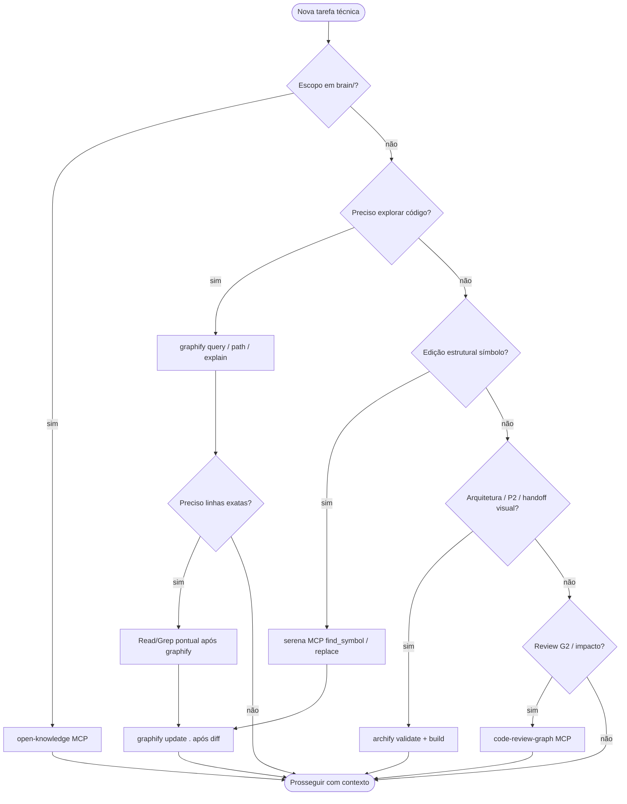

# Integração de ferramentas — orquestração anxionOS

Documento mestre: **quando** cada ferramenta habilitada no workspace é obrigatória, **quem** deve usá-la e **como** registrar evidência nos gates G0–G7.

> **Nota:** o Owner citou "anchfy" — o nome correto é **Archify** (diagramas de arquitetura). Este documento usa Archify em todo o texto.

**Relacionados:** [CURSOR-AGENTS-INTEGRATION.md](./CURSOR-AGENTS-INTEGRATION.md) · [SKILLS-TOOLS-MCP-REGISTRY.md](./SKILLS-TOOLS-MCP-REGISTRY.md) · [GUIDELINES-INTEGRATION.md](./GUIDELINES-INTEGRATION.md) · [COMPLIANCE.md](./COMPLIANCE.md) · [AGNOSTIC-DESIGN.md](./AGNOSTIC-DESIGN.md) · [MANDATORY-COMPLIANCE.md](./MANDATORY-COMPLIANCE.md) · regra [tooling-mandatory.mdc](../rules/tooling-mandatory.mdc) · template [SUBAGENT-PROMPT-TOOLING.md](./templates/SUBAGENT-PROMPT-TOOLING.md)

---

## Matriz ferramenta × quando × persona × gate × comando

| Ferramenta | Quando (obrigatório) | Persona(s) | Gate | Comando / MCP |
| --- | --- | --- | --- | --- |
| **graphify** | Antes de Grep/Glob/Read em massa no código; após editar código | Todos executores, críticos, G2 | G0.8, G0.14, G1 | `graphify query "…"`, `graphify path A B`, `graphify explain "…"`, `npm run graphify:index`, `graphify update .` |
| **serena** (MCP) | Edição em nível de símbolo, rename, find references | Executores, G2 | G0.14, G1–G2 | `find_symbol`, `find_referencing_symbols`, `replace_symbol_body`, `rename_symbol` |
| **archify** | Comunicação de arquitetura, fase P2, handoffs visuais | Marcus, Renata, André | P2, G0.10 | `npm run archify:validate`, `npm run archify:build` |
| **open-knowledge** | Qualquer leitura/escrita em `brain/` | Todos; André, Helena, Marcus | G0.6, G0.14 | MCP `search`, `exec`, `write`, `edit` — **nunca** Read/Grep/Write nativos em `brain/` |
| **code-review-graph** | Análise de impacto, review G2 | Fernanda, críticos | G2 | `semantic_search_nodes_tool`, `get_impact_radius_tool`, `detect_changes_tool`, `get_review_context_tool` |
| **orchestration:compliance** | Antes de codar; fim de turno | Todos | G0.12 | `npm run orchestration:compliance -- --pre-work --issue ANX-N --persona SLUG` |
| **orchestration:who** | Antes de trabalho cross-domain | Todos | G0.11 | `npm run orchestration:who -- --persona SLUG --can-i "ação"` |
| **Supermemory** | Recall de contexto de sessões anteriores | Todos (início de turno substantivo) | G0 | `supermemory_search` com `workspaceRoot` absoluto |
| **Chrome DevTools MCP** | Após alteração em `frontend/` | Camila, Paulo, Edu | G1, G3 | MCP chrome-devtools |

---

## Árvore de decisão — qual ferramenta usar?



**Regra de ouro:** se a pergunta é "onde está X no código?" ou "quem chama Y?" → **graphify primeiro**. Grep/Glob/Read em massa **sem** graphify = violação G0.14.

---

## Gate G0.14 — checklist tooling

| # | Item | Evidência |
| --- | --- | --- |
| 1 | `graphify query` antes de exploração em massa (se índice existe) | `command:graphify query "…"` |
| 2 | serena para edições estruturais (se MCP ativo) | `mcp:serena:find_symbol` ou nota de fallback |
| 3 | open-knowledge para `brain/` | path `brain/…` no pacote G0 |
| 4 | archify em entregas P2 / diagramas institucionais | `command:npm run archify:validate` |
| 5 | Subagentes recebem SUBAGENT-PROMPT-TOOLING.md | Prompt Task/delegation |
| 6 | `orchestration:compliance --pre-work` exit 0 | CLI |
| 7 | Supermemory em retomada de sessão | `supermemory_search` quando aplicável |

Detalhes em [COMPLIANCE.md](./COMPLIANCE.md).

---

## Evidência no dialogue

```bash
npm run orchestration:broadcast -- \
  --from-persona backend-executor --type handoff \
  --issue ANX-N --gate G1 \
  --body "Handoff com tooling documentado." \
  --evidence "tool:graphify,command:graphify query \"checkout flow\",tool:serena,mcp:find_symbol,file:.cursor/orchestration/TOOLING-INTEGRATION.md"
```

---

## Verificação

```bash
npm run orchestration:compliance -- --pre-work --issue ANX-N --persona SLUG
npm run graphify:check
npm run archify:validate
npm run orchestration:test
```

Ver [AGNOSTIC-DESIGN.md](./AGNOSTIC-DESIGN.md) para instalação global do framework.

**Última atualização:** 2026-09-09 · Issue ANX-134 · política tooling obrigatório (Renata/CTO)
