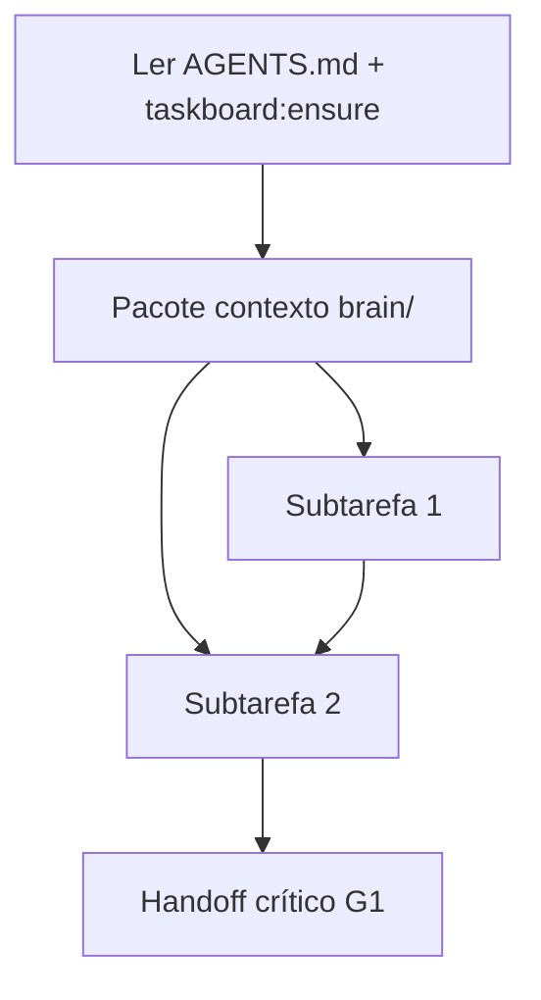
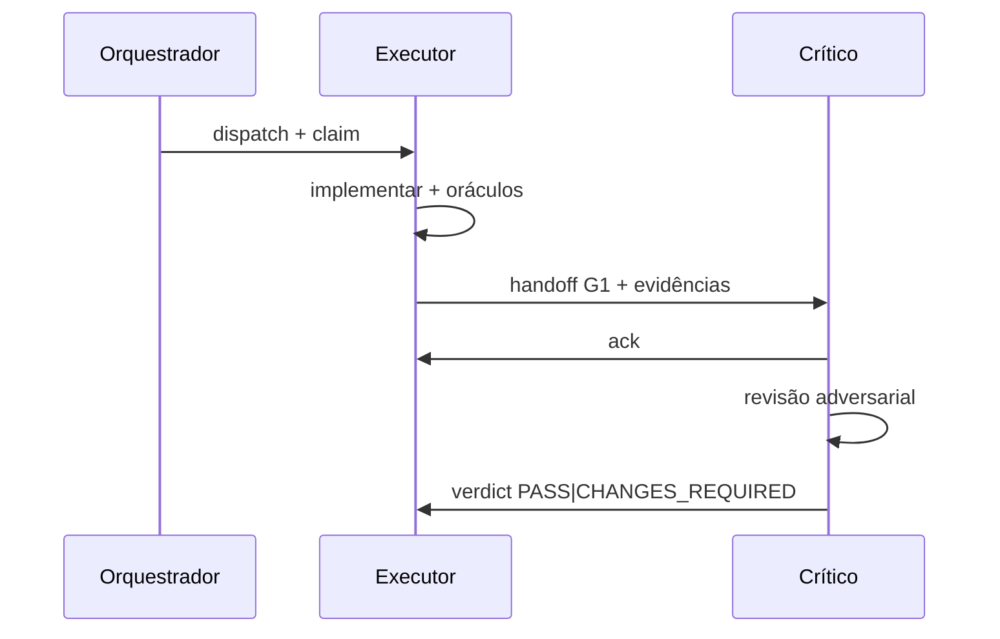
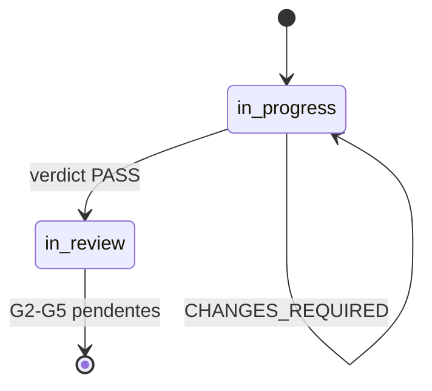
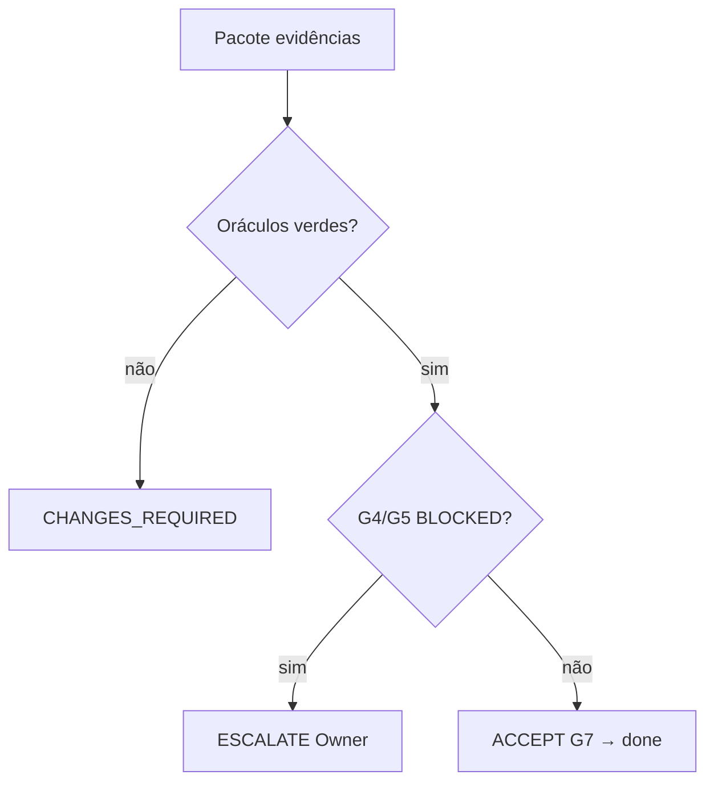

# Documentação Visual — Política Obrigatória

**Status:** ativo · **Última atualização:** 2026-09-09

Todo agente da orquestração anxionOS **deve** usar diagramas para clarificar decisões, handoffs e estado — não como decoração. Cada visual mapeia a uma decisão, transição ou evidência rastreável (princípio Karpathy).

**Relacionados:** [INTERACTIONS.md](./INTERACTIONS.md) · [PIPELINE.md](./PIPELINE.md) · [WORKFLOWS.md](./WORKFLOWS.md) · [COLLECTIVE-WORKFLOW.md](./COLLECTIVE-WORKFLOW.md)

---

## Formatos suportados

| Formato | Quando usar | Ferramenta |
| --- | --- | --- |
| **Mermaid** | Fluxos, sequências, estados, cronogramas | Bloco ` ```mermaid ` no markdown |
| **ASCII** | Terminal, fallback sem render | Bloco ` ``` ` ou indentação fixa |
| **Archify** | Arquitetura institucional, workflows P01–P09 | `.archify/specs/*.json` → `npm run archify:build` |
| **Tabelas** | Dados quantitativos, matrizes de gate | Markdown table com métricas |

### Tipos Mermaid por contexto

| Tipo Mermaid | Contexto |
| --- | --- |
| `flowchart` | Planos, árvores de decisão, delegação |
| `sequenceDiagram` | Handoffs, consultas, escalações |
| `stateDiagram` | Gates G0–G7, ciclo de vida da issue |
| `gantt` | Pipeline multi-issue, marcos Level A |
| `pie` / `quadrantChart` | Distribuição de esforço, priorização |
| `timeline` | Histórico de decisões CTO |
| `mindmap` | Decomposição de escopo (planning G0) |

---

## Mínimo por tipo de interação

Mapeamento a [INTERACTIONS.md](./INTERACTIONS.md):

| Tipo | Visual obrigatório | Formato recomendado |
| --- | --- | --- |
| `ack` | Nenhum | — |
| `status` | Opcional (mini) | flowchart 3–5 nós se escopo > trivial |
| `share` | Opcional | link Archify ou path `brain/` |
| `question` | Opcional | — |
| `consult` | Recomendado | sequenceDiagram (pergunta → resposta) |
| `debate` | Recomendado | sequenceDiagram com ramo `escalate` |
| `collab` | Opcional | flowchart de artefatos compartilhados |
| `handoff` | **Obrigatório** | sequenceDiagram (origem → destino → ack) |
| `challenge` / `response` | Recomendado | sequenceDiagram |
| `verdict` | **Obrigatório** | stateDiagram (estado antes → depois) |
| `decision` | **Obrigatório** | flowchart (opções → escolha) |
| `escalate` | **Obrigatório** | flowchart (impasse → CTO) |
| `vote` | Recomendado | flowchart ou pie |
| `plan` (G0) | **Obrigatório** | flowchart (subtarefas + dependências) |
| `review` (G2–G5) | Recomendado | flowchart (achados → disposição) |

**Regra geral:** escopo trivial (fix de typo, comando único) → visual opcional. Qualquer planejamento, handoff formal ou decisão de gate → visual **obrigatório**.

---

## Requisitos por nível hierárquico

Ver [HIERARCHY.md](./HIERARCHY.md):

| Nível | Diagramas obrigatórios |
| --- | --- |
| **Level A (CTO)** | Árvore de decisão + gantt do pipeline por wave |
| **Level B (gate leads)** | Flowchart de gate flow por revisão G2–G5 |
| **Level C (executor/crítico)** | Atualizar stateDiagram do workflow no marco (G1 PASS, handoff) |

---

## Onde incluir visuals

### No chat Cursor

Colar Mermaid em bloco markdown — o Cursor renderiza nativamente.

### No dialogue (`broadcast`)

Campo `diagram` no JSON ou flag `--diagram` / `--diagram-file`:

```bash
npm run orchestration:broadcast -- \
  --from-persona backend-executor \
  --to-mention @marina --issue ANX-134 --gate G1 --type handoff \
  --body "@marina, candidato r2 pronto." \
  --diagram-file .cursor/orchestration/workflows/handoff-g1.mmd \
  --evidence command:"bun test backend/tests/identity.test.ts"
```

Seção `<!-- diagram -->` no body também é válida.

---

## Templates copy-paste

Ver seções em [COLLECTIVE-WORKFLOW.md](./COLLECTIVE-WORKFLOW.md) e [WORKFLOWS.md](./WORKFLOWS.md).

### Plano G0 (flowchart)



### Handoff (sequenceDiagram)



### Verdict G1 (stateDiagram)



### Decisão CTO (flowchart)



---

## Verificação de cobertura

```bash
npm run orchestration:diagram-check
grep -r '```mermaid' .cursor/orchestration --count
```

Meta: **100%** dos arquivos em `workflows/` com ≥1 flowchart + ≥1 sequence/stateDiagram.

---

## Archify

```bash
npm run archify:validate
npm run archify:build
```

Specs: `.archify/specs/anxionos-platform.architecture.json`, `anxionos-delivery-p01-p09.workflow.json`.

---

## Anti-padrões (proibido)

1. Diagrama genérico sem nós ligados a decisões reais da issue.
2. Substituir evidência (`--evidence`) por diagrama — ambos são complementares.
3. Bloat: >3 diagramas por mensagem `status` de rotina.

---

## Integração com regras Cursor

| Regra | Escopo |
| --- | --- |
| `.cursor/rules/visual-documentation.mdc` | alwaysApply |
| `.cursor/rules/agents-in-chat.mdc` | Persona blocks com mermaid |
| `.cursor/rules/no-silent-work.mdc` | Handoff com diagrama = marco visível |
