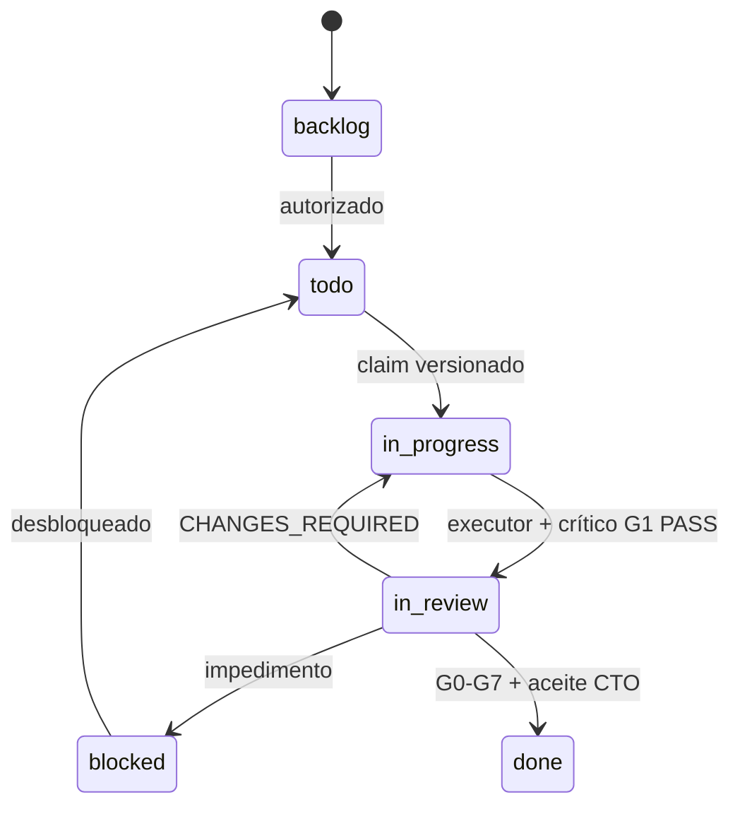
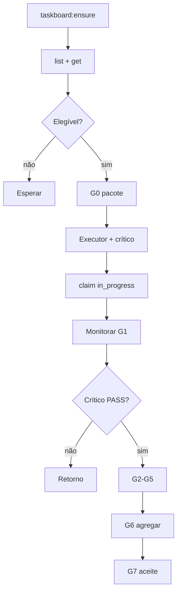
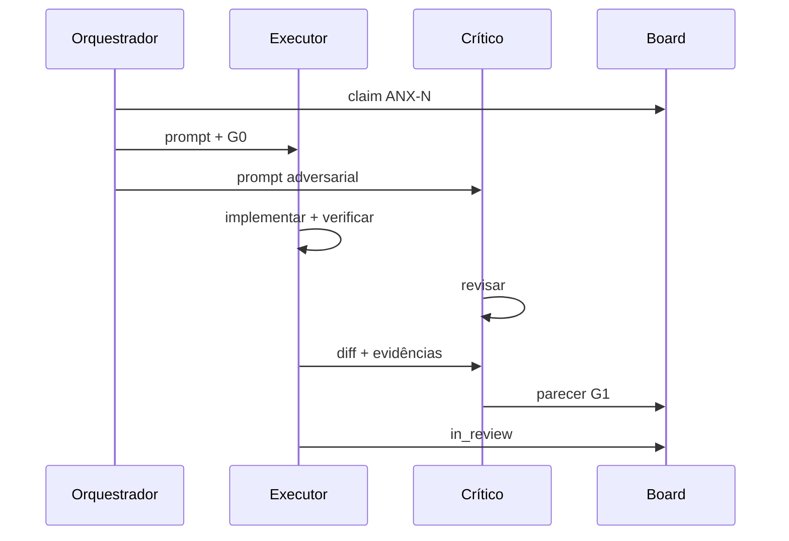
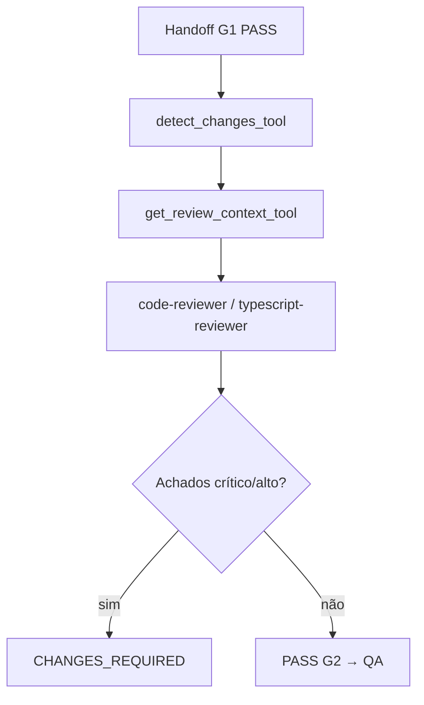
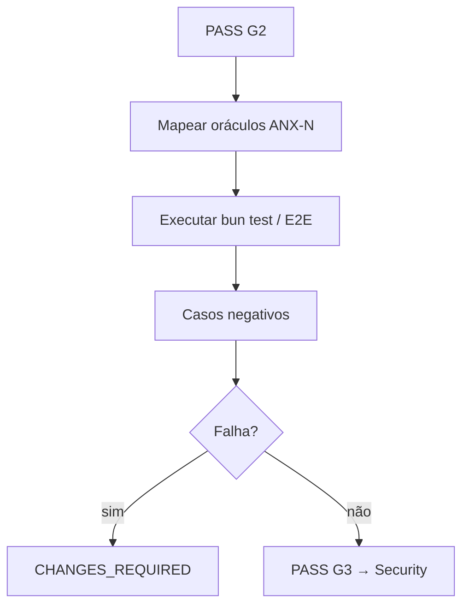
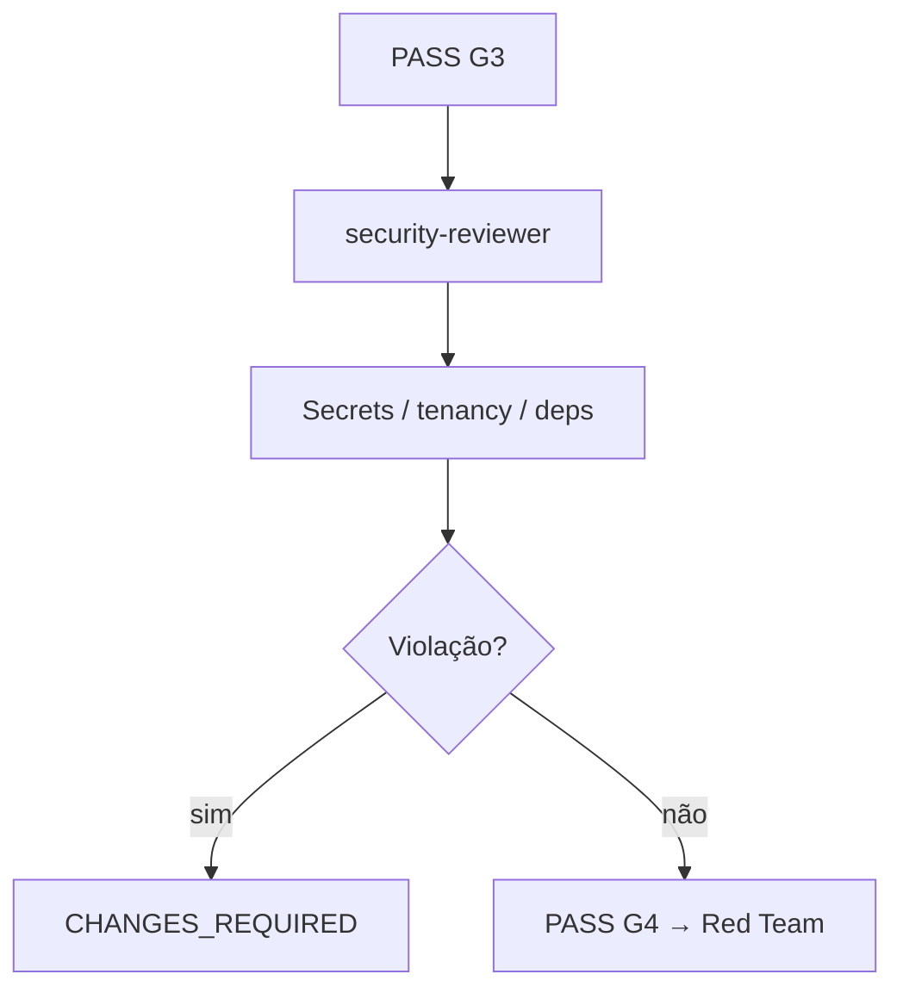
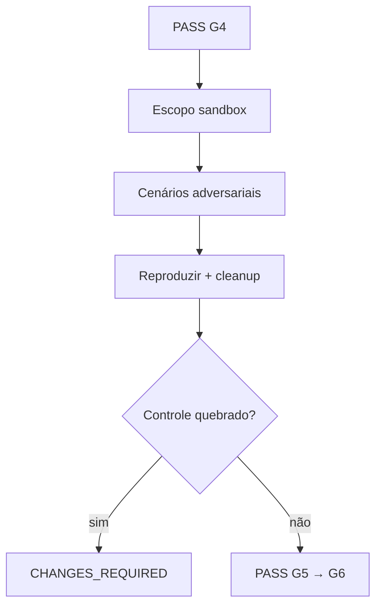
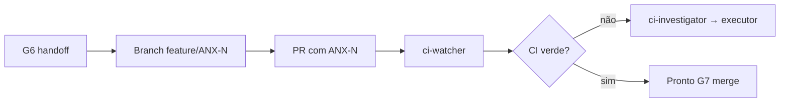
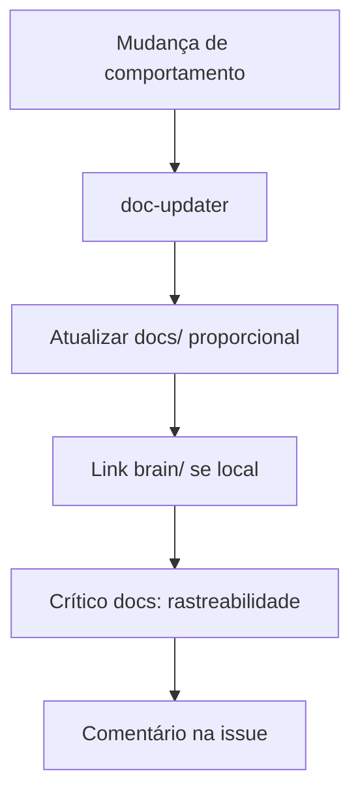
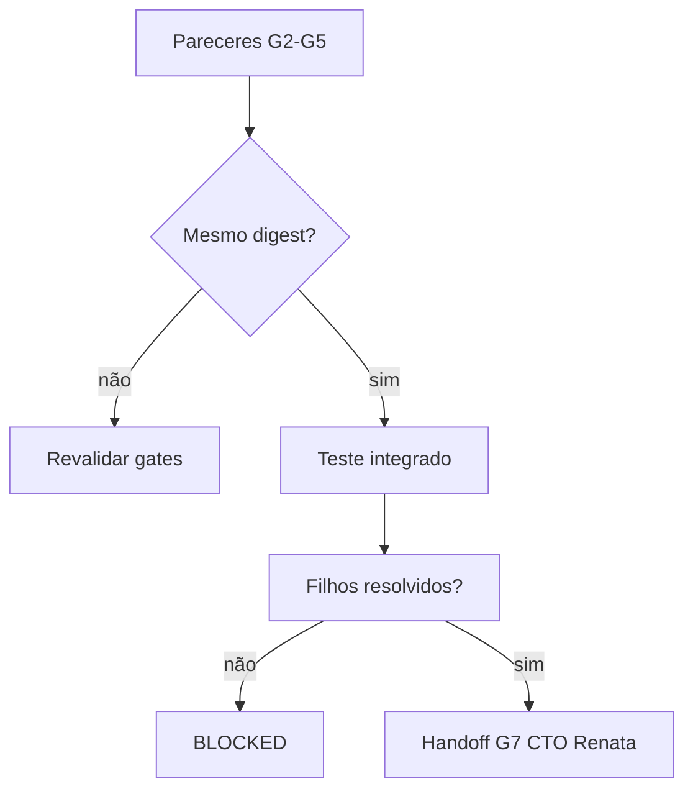

# Workflows de Orquestração (legado)

**Canônico:** [COLLECTIVE-WORKFLOW.md](./COLLECTIVE-WORKFLOW.md) · [workflows/README.md](./workflows/README.md) · `npm run orchestration:workflow`

Fluxos alinhados a [AGENTS.md](../../AGENTS.md) e skills `orchestrate-work` / `manage-taskboard`.

---

## 1. Ciclo de vida da issue

**`in_review` nunca significa aprovado.**

---

## 2. Workflow Orquestrador

---

## 3. Executor + Crítico (G1)

---

## 4. Workflow Code Review (G2)

## 5. Workflow QA (G3)

## 6. Workflow Security (G4)

## 7. Workflow Red Team (G5)

## 8. Workflow GitHub/CI

## 9. Workflow Documentação

## 10. Workflow Integração G6

---

## 11. Handoff mínimo

**Executor → Crítico:** diff, comandos+saída, checklist zero tolerância.

**Orquestrador → G2–G5:** issue, digest, ambiente, critérios, retorno.

**G6 → G7:** pareceres consolidados, riscos, PR, solicitação aceite CTO ([CTO-AUTHORITY.md](./CTO-AUTHORITY.md)).

---

## 12. Escalonamento

### blocked
Comentário com causa + issue bloqueadora → `move blocked`.

### CHANGES_REQUIRED
`in_progress` → corrigir → revalidar G1 → repetir gates afetados.

### Impasse (3 ciclos)
Escalar Renata (CTO); Owner só ADR/conflito crítico — não relaxar critérios.

---

## 13. Cadeia crítica (board)

| Issue | Status | Papel |
| --- | --- | --- |
| ANX-221 | in_review | P01 versionamento — G7 pendente |
| ANX-222 | blocked | Commit drift — após ANX-221 |
| ANX-134 | blocked | Identity P02 |
| ANX-136 | todo (deps) | Governance — após ANX-134 |

Snapshot: 222 issues, 0 in_progress, 6 in_review, 44 todo (todos blocked).

---

## 14. Hire on-demand (Level B/C)

Matriz, exemplos e CLI `orchestration:hire` / `dismiss`: [HIRE-DELEGATION.md](./HIRE-DELEGATION.md) · [HIERARCHY.md](./HIERARCHY.md).
