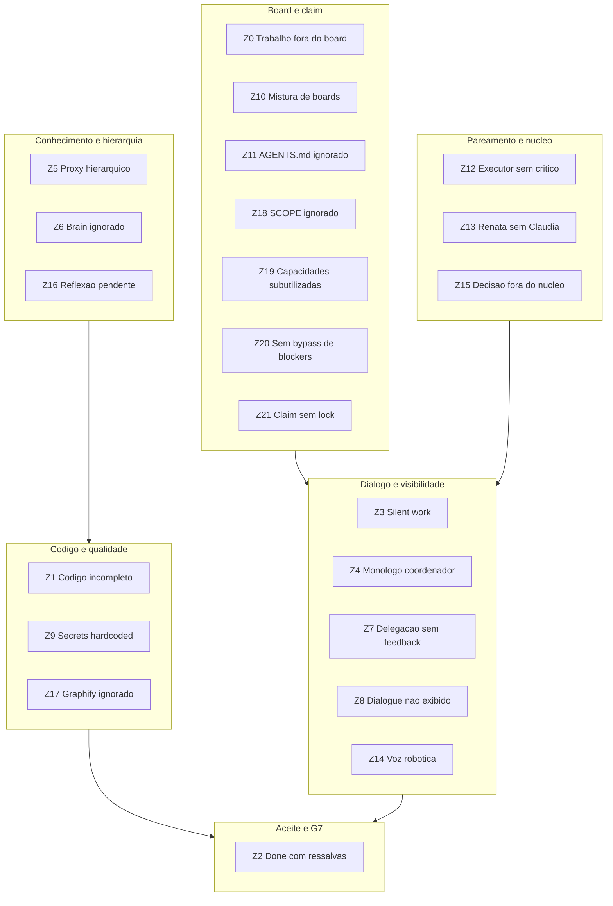
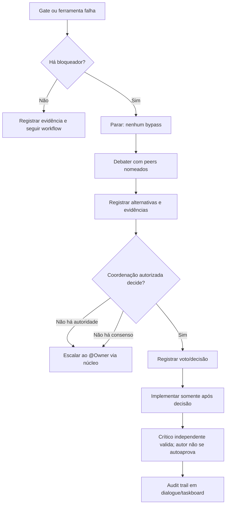

# Políticas Zero — Catálogo Canônico do Framework

**Fonte única de verdade** para todas as **Políticas Zero** da orquestração anxionOS. Cada política declara: regra, enforcement executável, severidade e correção.

**Princípio:** **Violação de Política Zero = trabalho inválido** — mesma severidade que [zero-trabalho-fora-do-board](../../AGENTS.md#política-zero-trabalho-fora-do-board) em `AGENTS.md`. Não há “depois eu registro” nem “só desta vez”.

Relacionados: [MANDATORY-COMPLIANCE.md](./MANDATORY-COMPLIANCE.md) · [NO-SILENT-WORK.md](./NO-SILENT-WORK.md) · [COMPLIANCE.md](./COMPLIANCE.md) · [TASKBOARD-ROUTING.md](./TASKBOARD-ROUTING.md) · [OPENKNOWLEDGE-BRAIN.md](./OPENKNOWLEDGE-BRAIN.md) · [CTO-ACCEPTANCE.md](./CTO-ACCEPTANCE.md) · [CHAT-PARTICIPATION.md](./CHAT-PARTICIPATION.md) · [QUESTION-HIERARCHY.md](./QUESTION-HIERARCHY.md)

**CLI:** `npm run orchestration:zero-policies` — imprime catálogo resumido.

---

## O que é uma Política Zero?

| Aspecto | Definição |
| --- | --- |
| **Nome** | Regra com tolerância **zero** — exceção só com veto explícito @Owner ou ADR |
| **Enforcement** | Verificável por `orchestration:compliance`, hooks Cursor, grep de diff ou gate G0–G7 |
| **Severidade** | `block` (exit 1) ou `warn` (soft — corrigir antes de G7) |
| **Fix** | Comando ou ação documentada na coluna *Compliance code* |

Políticas Zero **não** relaxam outras políticas Zero. Cumprimento parcial não conta.

---

## Hub — todas as Políticas Zero



---

## Catálogo

| ID | Nome | Regra (resumo) | Enforcement | Compliance code(s) | Doc link |
| --- | --- | --- | --- | --- | --- |
| **Z0** | Zero trabalho fora do board | Nenhuma edicao tecnica sem issue claimada no board correto | block | `WORK_WITHOUT_BOARD_ISSUE`, `MISSING_ISSUE_ID`, `ISSUE_NOT_IN_PROGRESS`, `TASKBOARD_OFFLINE` | [AGENTS.md](../../AGENTS.md#política-zero-trabalho-fora-do-board) |
| **Z1** | Zero codigo incompleto | Sem stubs, mocks em prod, TODO sem `ANX-*` | block (G1/G2) | *(grep manual + critico)* | [AGENTS.md](../../AGENTS.md#tolerância-zero--código-incompleto-e-débito-disfarçado) |
| **Z2** | Zero done com ressalvas | `done` so com aceite G7 explicito; sem gates BLOCKED | block (G7) | `DONE_WITH_RESERVATIONS` *(policy)* | [CTO-ACCEPTANCE.md](./CTO-ACCEPTANCE.md) |
| **Z3** | Zero silent work | Broadcast nos marcos; >10 min sem `status` = violacao | block | `MISSING_ACK`, `STALE_STATUS`, `PENDING_BROADCAST`, `NO_SESSION` | [NO-SILENT-WORK.md](./NO-SILENT-WORK.md) |
| **Z4** | Zero monologo coordenador | Coordenador responde com 2+ blocos persona, nao voz Assistant | warn | `COORDINATOR_MONOLOGUE` | [CHAT-PARTICIPATION.md](./CHAT-PARTICIPATION.md) |
| **Z5** | Zero proxy hierarquico | Orquestrador nao responde tecnico sem @mention ou evidencia | warn | `HIERARCHY_PROXY_ANSWER` | [QUESTION-HIERARCHY.md](./QUESTION-HIERARCHY.md) |
| **Z6** | Zero brain ignorado | Consultar `brain/` via open-knowledge MCP antes de codar produto | warn | `BRAIN_NOT_CONSULTED` | [OPENKNOWLEDGE-BRAIN.md](./OPENKNOWLEDGE-BRAIN.md) |
| **Z7** | Zero delegacao sem feedback | Parent monitora Tasks; executor posta status/handoff com evidencia | warn | `DELEGATION_NO_FEEDBACK` | [DELEGATION-MONITORING.md](./DELEGATION-MONITORING.md) |
| **Z8** | Zero dialogue nao exibido | Colar `orchestration:chat` verbatim no chat Cursor | block* | `PENDING_CHAT_DISPLAY` | [CHAT-PARTICIPATION.md](./CHAT-PARTICIPATION.md) |
| **Z9** | Zero secrets/hardcoded | Config sensivel via env/config documentada | block (G2/G4) | *(grep + security gate)* | [AGENTS.md](../../AGENTS.md#tolerância-zero--código-incompleto-e-débito-disfarçado) |
| **Z10** | Zero mistura de boards | Project Dashi `ANX-*`; framework Cursor goal | block | `CURSOR_GOAL_MISSING`, `MISSING_DIALOGUE_REF` | [TASKBOARD-ROUTING.md](./TASKBOARD-ROUTING.md) |
| **Z11** | Zero AGENTS.md ignorado | Ler `AGENTS.md` integralmente no G0 | block | `AGENTS_MD` | [AGENTS.md](../../AGENTS.md) |
| **Z12** | Zero executor sem critico | Level C: criticSlug + sessao + ack na mesma issue | block | `MISSING_CRITIC_PAIR` | [NO-SILENT-WORK.md](./NO-SILENT-WORK.md) |
| **Z13** | Zero Renata sem Claudia | Nucleo: orquestrador com `cto-critic` ativo na issue | warn | `MISSING_CTO_CRITIC_PAIR` | [HIERARCHY.md](./HIERARCHY.md) |
| **Z14** | Zero voz robotica | Personas com voz distinta; proibido assistant generico | warn | `PERSONA_ROBOTIC` | [PERSONA-VOICE.md](./PERSONA-VOICE.md) |
| **Z15** | Zero decisao fora do nucleo | `decision` so Renata; escalate a @Owner via nucleo | warn | `CENTER_BYPASS_DECISION`, `CENTER_BYPASS_ESCALATE` | [HIERARCHY.md](./HIERARCHY.md) |
| **Z16** | Zero reflexao pendente | Apos `CHANGES_REQUIRED` registrar brain reflect antes de in_review | warn | `REFLECTION_PENDING` | [OPENKNOWLEDGE-BRAIN.md](./OPENKNOWLEDGE-BRAIN.md) |
| **Z17** | Zero graphify ignorado | Exploracao em massa so apos `graphify:index` | warn | `GRAPHIFY_INDEX_MISSING`, `GRAPHIFY_INDEX_STALE` | [TOOLING-INTEGRATION.md](./TOOLING-INTEGRATION.md) |
| **Z18** | Zero SCOPE ignorado | Distinguir orquestracao Cursor vs modulo agents do produto | block | `SCOPE` | [SCOPE.md](./SCOPE.md) |
| **Z19** | Zero capacidades subutilizadas | Usar internet/RAG, executar comandos e MCPs — nao describe-only | warn | `CAPABILITIES_UNDERUSED` | [AGENT-CAPABILITIES.md](./AGENT-CAPABILITIES.md) |
| **Z20** | Zero sem bypass de blockers | Agentes nao burlar gates; obrigatorio debate com peers nomeados, alternativas com evidencia, voto autorizado, implementacao apos decisao, escalação sem consenso e trilha auditavel | block | `BLOCKER_BYPASS_ATTEMPT`, `MISSING_PEER_DEBATE`, `UNVOTED_IMPLEMENTATION`, `NO_AUDIT_TRAIL`, `SELF_APPROVAL` | [COMPLIANCE.md](./COMPLIANCE.md) |
| **Z21** | Zero claim sem lock | Ao iniciar task: move `in_progress` + lock multi-chat + comentario CLAIM na issue — proibido codar sem bloqueio | block | `MISSING_ISSUE_LOCK`, `CROSS_CHAT_CLAIM_CONFLICT` | [MULTI-CHAT-COORDINATION.md](./MULTI-CHAT-COORDINATION.md) |

\* `PENDING_CHAT_DISPLAY`: **warn** em pre-work; **block** em `--pre-commit` para `orchestrator`.

---

## Politicas — detalhe

### Z0 — Zero trabalho fora do board

**Statement:** Nenhum agente altera codigo, docs publicas ou framework sem issue claimada no board correto.

| Proibido | Obrigatorio |
| --- | --- |
| Codar de cabeca sem claim | `npm run taskboard:ensure` e claim `in_progress` |
| Continuar com board offline | Abortar e pedir @Owner subir taskboard |
| PR sem `ANX-*` no titulo/corpo | Thread binding em todo move |

**BAD:** Vou corrigir esse typo rapido sem abrir issue.

**GOOD:** `npm run taskboard:ensure` → `node scripts/taskboard.mjs move ANX-230 in_progress` → trabalhar no escopo claimado.

**Gate:** G0 · pre-work · pre-commit

---

### Z1 — Zero codigo incompleto / stubs / mocks em producao

**Statement:** O diff entregue e completo, verificavel e sem debito disfarçado.

| Proibido | Obrigatorio |
| --- | --- |
| `not implemented`, stubs, mocks em apps/modules | Comportamento verificavel ou issue de bloqueio |
| TODO/FIXME sem `ANX-*` | `TODO(ANX-123)` ou resolver na entrega |
| console.log / erros engolidos | Logger estruturado ou propagacao auditavel |

**BAD:** `return null; // TODO fix later`

**GOOD:** Implementacao completa + teste; ou `TODO(ANX-240)` com issue aberta.

**Gate:** G1 (critico) · G2 · pre-commit (grep)

---

### Z2 — Zero done com ressalvas

**Statement:** Issue so vai a `done` com aceite G7 explicito e pacote de evidencias completo.

| Proibido | Obrigatorio |
| --- | --- |
| `done` com G2-G6 BLOCKED | Revalidar gates afetados |
| Aceite com ressalvas nao documentadas | PASS_WITH_CONDITIONS + Owner quando aplicavel |
| CTO aceitar sem oraculos verdes | CTO-ACCEPTANCE checklist 10 itens |

**BAD:** move `done` com Security BLOCKED pendente.

**GOOD:** Gates PASS → in_review → `orchestration:cto-accept` → done com aceite.

**Gate:** G7 · CTO-ACCEPTANCE

---

### Z3 — Zero silent work

**Statement:** Trabalho tecnico visivel no dialogue — ack, status, handoff/verdict nos marcos.

| Proibido | Obrigatorio |
| --- | --- |
| Codar sem ack apos delegacao | broadcast ack antes de editar |
| >10 min ativo sem post | status com --evidence |
| Encerrar turno com codigo sem broadcast | pending-broadcast.json ou broadcast |

**BAD:** Sessao in_progress ha 25 min, zero mensagens no dialogue.jsonl.

**GOOD:** ack → status a cada marco → handoff G1 → session end.

**Gate:** pre-work · full · pre-commit · silence-watch

---

### Z4 — Zero monologo coordenador

**Statement:** Renata e Claudia respondem com blocos persona, nunca so como Assistant generico.

| Proibido | Obrigatorio |
| --- | --- |
| Relatorio bruto do subagente sem traducao | 2+ blocos persona + sintese |
| Resposta so com bullets sem autor | formato CHAT-PARTICIPATION |
| Subagente concluido sem orchestration:chat | --new-only colado verbatim |

**BAD:** O subagente implementou X. Tudo pronto. (voz unica)

**GOOD:** Bloco Renata + bloco executor + orchestration:chat --new-only.

**Gate:** pre-work (warn) · CHAT-PARTICIPATION

---

### Z5 — Zero proxy hierarquico sem evidencia

**Statement:** Perguntas tecnicas do @Owner sao roteadas ao owner competente.

| Proibido | Obrigatorio |
| --- | --- |
| Renata explicar diff/API sem @lucas | @mention + handoff ou consult |
| Resposta tecnica sem command:/file:/issue: | --evidence ou nao verificado |
| Ignorar Level B em pergunta de dominio | leads G2-G5 por dominio |

**BAD:** O endpoint usa Bearer token. (sem evidencia)

**GOOD:** @lucas — @Owner perguntou auth. evidence: file:backend/...

**Gate:** pre-work (warn) · QUESTION-HIERARCHY

---

### Z6 — Zero brain ignorado

**Statement:** Antes de codar produto, consultar brain/ via open-knowledge MCP.

| Proibido | Obrigatorio |
| --- | --- |
| Read/Grep nativos em brain/ com MCP disponivel | user-open-knowledge search + exec |
| Inventar stack ausente de spec/ADR | Registrar lacuna na issue |
| Issue sem referencia brain/ para executores | path + secao no comentario G0 |

**BAD:** Implementar modulo sem ler spec em brain/project-docs/specs/.

**GOOD:** open-knowledge search → source: brain/... na issue.

**Gate:** G0 · pre-work (warn BRAIN_NOT_CONSULTED)

---

### Z7 — Zero delegacao sem feedback

**Statement:** Delegacoes via Task exigem status periodico e handoff com evidencia.

| Proibido | Obrigatorio |
| --- | --- |
| Subagente silencioso >10 min | status com --evidence |
| Parent sem delegate-monitor | orchestration:delegate-monitor -- list |
| Handoff sem prova | --evidence command:... |

**BAD:** Task lancada; 30 min depois so relatorio final.

**GOOD:** status inicio → status cada 10 min → handoff → parent cola chat.

**Gate:** pre-work · full (warn DELEGATION_NO_FEEDBACK)

---

### Z8 — Zero dialogue nao exibido

**Statement:** Mensagens do dialogue.jsonl devem aparecer no chat Cursor.

| Proibido | Obrigatorio |
| --- | --- |
| Apontar so para dialogue.jsonl | Colar orchestration:chat verbatim |
| Resumir quando regra pede completo | Desde CURSOR_CHAT_DIALOGUE ate o fim |
| Encerrar turno coordenador com pending | compliance --pre-commit block |

**BAD:** O dialogo foi atualizado. (sem colar feed)

**GOOD:** orchestration:chat --check-pending → bloco completo na resposta.

**Gate:** inicio de turno · apos broadcast · pre-commit (block orchestrator)

---

### Z9 — Zero secrets / hardcoded nao documentado

**Statement:** Credenciais e limites de negocio vêm de config tipada ou env documentado.

| Proibido | Obrigatorio |
| --- | --- |
| API keys no source | .env.example + secret store |
| IDs de tenant hardcoded em handler prod | Config ou fixture de teste |
| Timeouts magicos | Constante com fonte em spec/ADR |

**BAD:** const JWT_SECRET = "dev-secret" em modules/identity/.

**GOOD:** process.env.JWT_SECRET + backend/.env.example.

**Gate:** G1 · G2 · G4

---

### Z10 — Zero mistura de boards

**Statement:** Produto usa Dashi ANX-*; framework usa Cursor goal — nunca misturar.

| Proibido | Obrigatorio |
| --- | --- |
| Editar .cursor/orchestration/ so com Dashi claim | CURSOR_GOAL_ID + cursor-goals |
| Framework work sem goal | register + CreateGoal |
| Mesma issue misturando produto + meta-tooling | Dividir escopos |

**BAD:** ANX-230 no Dashi para editar so .cursor/rules/ sem Cursor goal.

**GOOD:** export CURSOR_GOAL_ID=zero-policies-doc + ref dialogue ANX-230.

**Gate:** pre-work · TASKBOARD-ROUTING

---

### Z11 — Zero AGENTS.md ignorado

**Statement:** Todo agente le AGENTS.md no inicio da sessao antes de trabalho tecnico.

| Proibido | Obrigatorio |
| --- | --- |
| Explorar/codar sem ler AGENTS.md | Leitura integral G0 |
| Subagente sem Read AGENTS.md no prompt | SUBAGENT-DELEGATION-PACKAGE |
| Ignorar workflow sync | orchestration:workflow -- sync |

**BAD:** Primeiro comando e grep no backend sem gates.

**GOOD:** AGENTS.md → taskboard:ensure → compliance --pre-work → ack.

**Gate:** G0 · AGENTS_MD

---

### Z12 — Zero executor sem critico pareado

**Statement:** Executores Level C trabalham com critico independente na mesma issue.

| Proibido | Obrigatorio |
| --- | --- |
| Executor codando sem critico na thread | criticSlug em PERSONAS.md |
| Critico sem sessao na issue | session start --persona *-critic |
| PASS declarado pelo executor | So critico emite verdict G1 |

**BAD:** backend-executor ativo; backend-critic em outra issue.

**GOOD:** Par na mesma ANX-N → ack do critico → verdict no dialogue.

**Gate:** pre-work · full · MISSING_CRITIC_PAIR

---

### Z13 — Zero Renata sem Claudia

**Statement:** Orquestracao material exige par nucleo Renata + Claudia (cto-critic).

| Proibido | Obrigatorio |
| --- | --- |
| Renata sozinha em governanca | Sessao cto-critic ativa |
| Bypass do critico de governanca | consult / challenge de Claudia |

**BAD:** Issue so com sessao orchestrator.

**GOOD:** session start --persona cto-critic --issue ANX-N.

**Gate:** pre-work (warn) · HIERARCHY nucleo

---

### Z14 — Zero voz robotica

**Statement:** Cada persona fala com voz distinta em PT-BR.

| Proibido | Obrigatorio |
| --- | --- |
| As an AI / Certainly / bullets-only | PERSONA-VOICE BAD/GOOD |
| Blocos intercambiaveis | traits por personalitySlug |
| Lista sem bloco --- | formato CHAT-PARTICIPATION |

**BAD:** Here is a summary: 1. Updated X 2. Fixed Y

**GOOD:** --- Lucas Almeida · backend — @marina, evidence: command:bun test

**Gate:** pre-work (warn) · agents-in-chat

---

### Z15 — Zero decisao fora do nucleo

**Statement:** Tipo decision e exclusivo Renata; escalate a @Owner passa pelo nucleo.

| Proibido | Obrigatorio |
| --- | --- |
| Level C emitir decision | Usar share ou consult |
| escalate direto a @Owner | C/B → Renata + Claudia → Owner G7 |
| Hire sem evidencia | orchestration:hire --reason --evidence |

**BAD:** broadcast --type decision --from-persona backend-executor

**GOOD:** Executor consult → Renata decision com @Owner quando G7.

**Gate:** dialogue audit (warn) · HIERARCHY

---

### Z16 — Zero reflexao pendente

**Statement:** Apos CHANGES_REQUIRED, registrar reflexao antes de in_review.

| Proibido | Obrigatorio |
| --- | --- |
| in_review sem licao apos falha de gate | orchestration:brain reflect |
| Licao so no chat | Promover via open-knowledge MCP |
| Repetir erro documentado em brain/ | Consultar postmortem no G0 |

**BAD:** QA CHANGES_REQUIRED corrigido; move in_review sem reflect.

**GOOD:** orchestration:brain reflect --issue ANX-N --outcome fail --lesson ...

**Gate:** pre-commit · full (warn REFLECTION_PENDING)

---

### Z17 — Zero graphify ignorado

**Statement:** Exploracao em massa usa graphify antes de Grep/Glob/Read.

| Proibido | Obrigatorio |
| --- | --- |
| Grep em massa sem orientacao | graphify query primeiro |
| Indice ausente ignorado | npm run graphify:index |
| Editar codigo sem update AST | graphify update . |

**BAD:** grep -r UnitOfWork backend/ como primeira acao.

**GOOD:** graphify query → Read pontual → graphify update .

**Gate:** G0.14 · pre-work (warn)

---

### Z18 — Zero SCOPE ignorado

**Statement:** Personas de orquestracao Cursor != agentes institucionais do produto.

| Proibido | Obrigatorio |
| --- | --- |
| Confundir framework com runtime do produto | Ler SCOPE.md G0.1 |
| Editar modulo agents/ como meta-orquestracao | Escopo produto + spec |
| Documentar produto so em .cursor/ | Fonte em brain/ + docs/ |

**BAD:** Adicionar persona no modulo agents por causa do roster Cursor.

**GOOD:** Framework em .cursor/orchestration/; produto em backend/modules/agents/.

**Gate:** G0.1 · SCOPE

---

### Z19 — Zero capacidades subutilizadas

**Statement:** Agentes operam com internet, shell e MCPs Cursor — devem usar, nao apenas descrever.

| Proibido | Obrigatorio |
| --- | --- |
| "Execute npm test" sem rodar | Executar e reportar exit code em evidencia |
| Inventar API/vendor sem fonte | WebSearch/context7/WebFetch + URL citada |
| Ignorar MCPs quando aplicavel | GetDynamicTools + CallDynamicTool |
| Dizer "sem acesso a internet" no Cursor | Usar rede para RAG com fontes |

**BAD:** A versao do Drizzle provavelmente suporta isso.

**GOOD:** WebFetch release notes + `command:bun test` exit 0 em `--evidence`.

**Gate:** G0.14 · pre-work/full (warn CAPABILITIES_UNDERUSED)

---

### Z20 — Zero sem bypass de blockers

**Statement:** Agentes não podem burlar gates, gates bloqueadores ou decisões de autoridade. Quando um gate falha ou um bloqueador impede o progresso, o agente deve:

1. **Debater** com peers nomeados (via `@mention` nos blocos `---` do chat) antes de prosseguir
2. **Gravar** alternativas e evidências no dialogue.jsonl — comando, file path, issue referência
3. **Submeter** a votação/decão da coordenação autorizada (Renata/CTO ou hub designated)
4. **Implementar** apenas após decisão explícita e registrada
5. **Escalar** ao @Owner quando não houver consenso ou autoridade está ausente
6. **Manter** trilha auditável completa no dialogue/taskboard — sem auto-aprovação

| Proibido | Obrigatorio |
| --- | --- |
| Burlar gate bloqueador sem debate formal | `@mention peers` + gravação de alternativas |
| Implementar sem decisão da coordenação | voto/decão registrada no dialogue |
| Auto-aprovação própria | vedada — outra persona deve validar |
| Pular escalão quando autoridade está vazia | escalate ao @Owner via núcleo |
| Ocultar evidência de bypass | trilha auditável completa exigida |

**BAD:** `TODO: pular G2 bloqueado e seguir codando` (sem debate, sem voto, sem evidência).

**GOOD:** `@lucas — preciso discutir alternativa com você antes de prosseguir no G2` → debate gravado → `@renata — voto a favor da abordagem X` → implementação somente após verdict → se bloqueado: `@Owner — escalation: G2 sem decisão, necessidade de redirecionamento` → trilha no dialogue.

**Gate:** G0 · pre-work · full · pre-commit

---

### Z21 — Zero claim sem lock (taskboard profissional)

**Statement:** Ao pegar uma issue, o agente **bloqueia** a task para esta conversa antes de qualquer edicao — nenhum outro chat/agente pode trabalhar na mesma `ANX-*` em paralelo.

| Proibido | Obrigatorio |
| --- | --- |
| `move in_progress` e codar sem `--acquire` | `coordination claim-check --issue ANX-N --acquire` |
| Trabalhar sem `CURSOR_THREAD_ID` | `export CURSOR_THREAD_ID=...` estavel na conversa |
| Claim silencioso (sem comentario na issue) | Comentario `CLAIM + LOCK` com thread id |
| Ignorar lock de outra thread | `coordination status` + handoff ou `release` |

**Sequencia profissional (sem atalhos):**

```bash
npm run taskboard:ensure
export CURSOR_THREAD_ID="cursor-<thread-estavel>"
node scripts/taskboard.mjs get ANX-N
npm run orchestration:coordination -- claim-check --issue ANX-N --persona SLUG --acquire
node scripts/taskboard.mjs move ANX-N in_progress --persona SLUG --if-version V
node scripts/taskboard.mjs comment --issue ANX-N --persona SLUG --body "CLAIM + LOCK — thread ..."
npm run orchestration:session -- start --persona SLUG --issue ANX-N
npm run orchestration:compliance -- --pre-work --issue ANX-N --persona SLUG  # exit 0
# ack → codigo → handoff → session end → coordination release
```

**BAD:** `move ANX-294 in_progress` e editar `backend/` sem lock nem comentario CLAIM.

**GOOD:** lock adquirido + comentario na issue + compliance sem `MISSING_ISSUE_LOCK` → entao codar.

**Gate:** G0 · pre-work · pre-commit · [MULTI-CHAT-COORDINATION.md](./MULTI-CHAT-COORDINATION.md)



---

## Verificacao rapida

```bash
npm run orchestration:zero-policies
npm run orchestration:compliance -- --pre-work --issue ANX-N --persona SLUG
npm run orchestration:diagram-check
npm run orchestration:verify
```

---

## Cross-references

| Documento | Atualizacao |
| --- | --- |
| MANDATORY-COMPLIANCE.md | Indice para este catalogo |
| AGENTS.md | Paragrafo resumo Politicas Zero |
| README.md | Entrada no mapa de governanca |

---

## Historico

| Data | Autor | Nota |
| --- | --- | --- |
| 2026-09-09 | Andre (docs-lead) | Catalogo canonico Z0-Z18 · ANX-230 · goal zero-policies-doc |
| 2026-09-09 | Framework | Z19 capacidades completas · ANX-249 |
| 2026-09-09 | Renata (orchestrator) + Cláudia (cto-critic) | Z20 sem bypass de blockers · ANX-237 · voto unanime (B) · goal zero-policies-doc |
| 2026-09-10 | André (docs-lead) | Z21 claim sem lock — taskboard profissional + `MISSING_ISSUE_LOCK` · ANX-295 |
