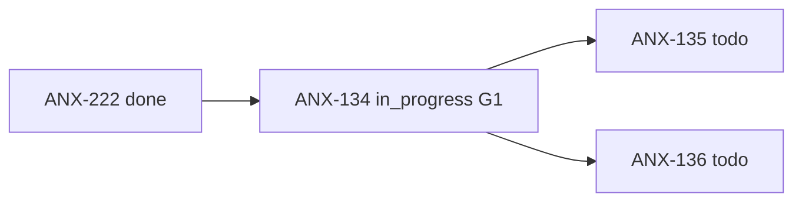

# Fila de delegação — ANX-134

**Status board:** `in_progress` (G1 Slice 1 PASS 2026-09-09)  
**Preparado por:** Renata Oliveira (orchestrator)  
**Claim:** Lucas Mendes · thread `cursor-anx134-wave-20260909`

---

## Resumo

| Campo | Valor |
| --- | --- |
| **Issue** | ANX-134 — Identity: concluir lifecycle e corrigir dependências application |
| **Owner persona** | Lucas Mendes · `backend-executor` |
| **Crítico 1:1** | Marina Ferreira · `backend-critic` |
| **Gate atual** | G1 (Slice 1 PASS — A1 boundary; Slices 2–5 pendentes) |
| **Prioridade** | medium |
| **Labels** | `continuation`, `anx126` |

---

## Dependências

| Tipo | Issue | Estado |
| --- | --- | --- |
| **blockedBy** | ANX-222 | `done` — dc12039 G7 ACCEPT |
| **blocks** | ANX-135, ANX-136 | `todo` / `blocked` |



---

## Escopo (delta)

- Revalidar achados A1 do módulo `identity`
- Remover persistência concreta da `application` via ports/UoW
- Concluir sessões, identidades de serviço, revogação e recovery com contratos institucionais
- Aceite: suspensão invalida sessão; recovery auditado; zero import SQL/Drizzle em `application`

---

## Pré-leitura obrigatória (`brain/`)

| Documento | Uso |
| --- | --- |
| `brain/notes/anxionos-backend-structure.md` | Ownership módulo `identity` |
| `brain/project-docs/decisions/0002-adopt-modular-backend-layout.md` | ADR0002 — camadas |
| `brain/notes/anxionos-backend-conformance-2026-09-08.md` | Gap ANX-118, matriz conformidade |
| `brain/project-docs/specs/001-institutional-contract/spec.md` | SDD P01–P09 |
| `docs/orchestration/module-contract-matrix-23.md` §6.12 | Capability `identity-lifecycle` |

---

## Oráculos previstos

```bash
npm run taskboard:ensure
graphify query "identity module application ports unit of work"
# G3-IDN-01..06 quando existirem na issue
```

---

## Handoff sugerido (pós ANX-222 done)

1. Owner autoriza claim → `node scripts/taskboard.mjs move ANX-134 in_progress`
2. Renata: `orchestration:session start --persona backend-executor --issue ANX-134`
3. Lucas: pacote G0 na issue + `ack` no dialogue
4. Marina: pareamento crítico desde G0

**Referência:** [DELEGATION-PACKAGE-ANX-222.md](../DELEGATION-PACKAGE-ANX-222.md) · [E2E-RUNBOOK.md](../E2E-RUNBOOK.md)
