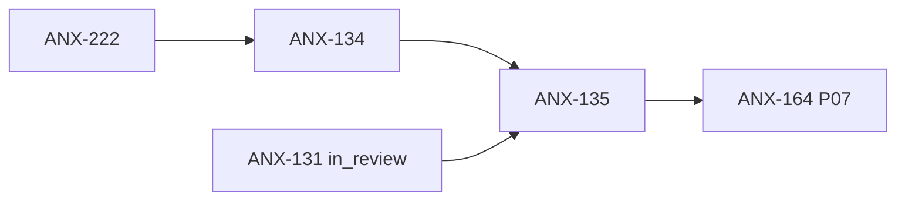

# Fila de delegação — ANX-135

**Status board:** `todo` (blockedBy ANX-134)  
**Preparado por:** Renata Oliveira (orchestrator)  
**Não claimar** sem ANX-134 `done` + autorização Owner.

---

## Resumo

| Campo | Valor |
| --- | --- |
| **Issue** | ANX-135 — Organizations: concluir onboarding, memberships e integração |
| **Owner persona** | Lucas Mendes · `backend-executor` |
| **Crítico 1:1** | Marina Ferreira · `backend-critic` |
| **Gate inicial** | G0 |
| **Prioridade** | medium |
| **Labels** | `continuation`, `anx126` |

---

## Dependências

| Tipo | Issue | Estado |
| --- | --- | --- |
| **blockedBy** | ANX-134 | `blocked` |
| **blockedBy** | ANX-131 | `in_review` (fila G7 CTO — RLS multi-tenant) |
| **blocks** | ANX-164 | Owner Console P07 |



---

## Escopo (delta)

- Onboarding de organizações e memberships
- Integração com identity (sessões, tenancy) e contratos institucionais
- Sem mocks em produção; RLS/tenant context alinhado a ANX-131 quando aceito

---

## Pré-leitura obrigatória (`brain/`)

| Documento | Uso |
| --- | --- |
| `brain/notes/anxionos-backend-structure.md` | Owner `organizations` |
| `brain/project-docs/decisions/0002-adopt-modular-backend-layout.md` | ADR0002 |
| `brain/project-docs/specs/001-institutional-contract/spec.md` | Multi-tenant institucional |
| `brain/notes/anxionos-storage-ownership.md` | PostgreSQL autoritativo |
| `docs/orchestration/module-contract-matrix-23.md` | Matriz § organizations |

---

## Oráculos previstos

```bash
npm run taskboard:ensure
graphify query "organizations onboarding memberships tenant"
# Paridade com gates G3-IDN quando identity estiver verde
```

---

## Handoff sugerido

1. ANX-134 `done` com identity lifecycle verde
2. Revisar disposição ANX-131 (RLS) antes de G3
3. Claim paralelo **somente** se Owner autorizar paralelismo com ANX-136 (default: sequencial identity → organizations)
4. Camila (`frontend-executor`) entra em G6 se houver superfície Owner Console (ANX-164 downstream)

**Referência:** [DELEGATION.md](../DELEGATION.md) · [E2E-RUNBOOK.md](../E2E-RUNBOOK.md)
