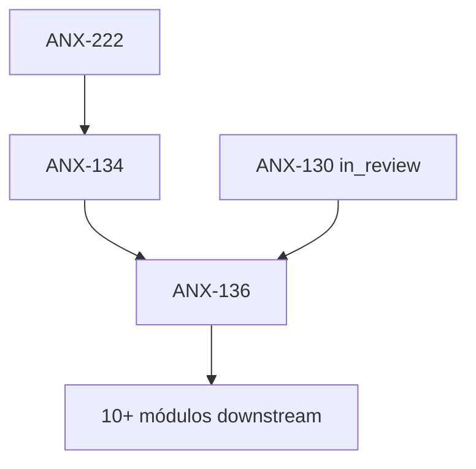

# Fila de delegação — ANX-136

**Status board:** `todo` (blockedBy ANX-134)  
**Preparado por:** Renata Oliveira (orchestrator)  
**Não claimar** sem ANX-134 `done` + autorização Owner.

---

## Resumo

| Campo | Valor |
| --- | --- |
| **Issue** | ANX-136 — Governance: autoridade temporal, aprovação e break-glass |
| **Owner persona** | Lucas Mendes · `backend-executor` |
| **Crítico 1:1** | Marina Ferreira · `backend-critic` |
| **Gate inicial** | G0 |
| **Prioridade** | medium |
| **Labels** | `continuation`, `anx126` |

---

## Dependências

| Tipo | Issue | Estado |
| --- | --- | --- |
| **blockedBy** | ANX-134 | `blocked` → desbloqueia após ANX-222 |
| **blockedBy** | ANX-130 | `in_review` (fila G7 CTO) |
| **blocks** | ANX-137, ANX-138, ANX-139, ANX-140, ANX-141, ANX-148, ANX-150, ANX-157, ANX-158, ANX-168, ANX-171 | cadeia P03+ |



---

## Escopo (delta)

- Autoridade temporal governada (quem pode agir quando)
- Fluxos de aprovação institucional e break-glass auditável
- Integração com identity/organizations sem violar ADR0002

---

## Pré-leitura obrigatória (`brain/`)

| Documento | Uso |
| --- | --- |
| `brain/project-docs/specs/004-institutional-evolution/spec.md` | Evolução e governança |
| `brain/project-docs/specs/001-institutional-contract/spec.md` | Contrato institucional |
| `brain/notes/anxionos-backend-structure.md` | Owner `governance` |
| `brain/project-docs/decisions/0001-graph-operational-domain-authority.md` | Grafo operacional (proposed) |
| `docs/orchestration/module-contract-matrix-23.md` | Matriz § governance |

---

## Oráculos previstos

```bash
npm run taskboard:ensure
graphify query "governance temporal authority break-glass"
npm run orchestration:who -- --persona backend-executor --can-i "implement governance"
```

---

## Handoff sugerido

1. Confirmar ANX-134 `done` + ANX-130 G7 aceito (ou disposição documentada)
2. Claim ANX-136 com thread binding novo
3. G0 com capability `governance-temporal` registrada na issue
4. G4 (Isa) e G5 (Thiago) proporcionais — fluxos break-glass são superfície de ataque

**Referência:** [PIPELINE.md](../PIPELINE.md) · [E2E-RUNBOOK.md](../E2E-RUNBOOK.md)
