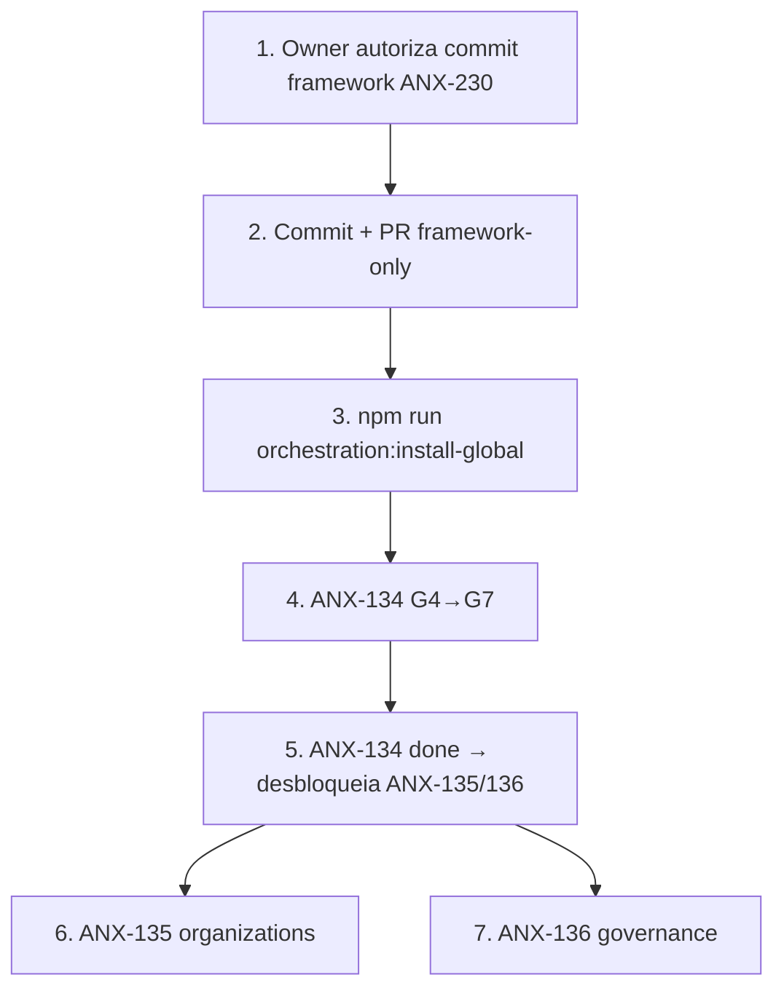

# anxionOS — Pacote de kickoff de desenvolvimento

**Preparado:** 2026-09-09T15:35Z · **Issue framework:** ANX-230 · **Issue produto ativa:** ANX-134 (G7 pendente)  
**Responsável:** Renata Oliveira (`orchestrator`) + Cláudia Nunes (`cto-critic`)

---

## Pré-requisitos (G0 — antes de qualquer slice produto)

| # | Pré-requisito | Comando / verificação | Bloqueio se falhar |
| --- | --- | --- | --- |
| 1 | Taskboard online | `npm run taskboard:ensure` | **ABORTAR** — não codar |
| 2 | Issue claimada `in_progress` | `node scripts/taskboard.mjs get ANX-N` + claim com thread binding | Trabalho inválido |
| 3 | Graphify indexado | `npm run graphify:doctor` ou `npm run graphify:index` | Exploração sem grafo |
| 4 | `brain/` local presente | MCP open-knowledge ou `brain/index.md` | Specs/ADRs indisponíveis |
| 5 | Env dev | `cp .env.example .env` + deps (`npm install`, `bun install` em `backend/`) | Build falha |
| 6 | Framework verify verde | `npm run orchestration:verify` | CI/compliance bloqueado |
| 7 | Compliance pre-work | `npm run orchestration:compliance -- --pre-work --issue ANX-N --persona <slug>` | Edição bloqueada |
| 8 | Sessão + pareamento | Executor + crítico na mesma issue (`orchestration:session start` ×2) | `MISSING_CRITIC_PAIR` |
| 9 | Núcleo circular ativo | Renata + Cláudia em issues de orquestração; @Owner para G7 exceções | Escalação sem hub |

---

## Sequência recomendada pós-commit framework (ANX-230)



---

## Onda 1 — fechar ANX-134 (identity-lifecycle)

| Gate | Estado (2026-09-09) | Próximo passo |
| --- | --- | --- |
| G0 | ✅ PASS | — |
| G1 | ✅ PASS (Slices 1–5, HEAD de7ca50) | — |
| G2 | ✅ PASS_WITH_CONDITIONS (Fernanda) | Condições G3 atendidas |
| G3 | ✅ PASS_WITH_CONDITIONS (Edu) | PG concurrency L1 residual documentado |
| G4 | ✅ PASS_WITH_CONDITIONS (Isa) | Condições G7 → ANX-235 (sync revoke) + ANX-236 (DeliverPolicy) |
| G5 | ✅ PASS_WITH_CONDITIONS (Thiago) | Condições G7 → ANX-234 (beforeSignIn) + ANX-235 |
| G6 | ✅ PASS_WITH_CONDITIONS (Renata) | Candidato de7ca50 integrado — aguarda G7 |
| G7 | ⏳ **Pendente @Owner** | Aceite explícito ou `cto-decide --apply` **não autorizado**; filhos ANX-234/235/236 |

**Personas:** Lucas (`backend-executor`) + Marina (`backend-critic`) — mesma issue/thread.

---

## Onda 2 — após ANX-134 `done`

| Issue | Módulo | Depende de | Persona |
| --- | --- | --- | --- |
| [ANX-135](./ANX-135.md) | organizations | ANX-134 `done` + ANX-131 `done` | Lucas + Marina — **G0 prep postado** (sem claim) |
| [ANX-136](./ANX-136.md) | governance | ANX-134 `done` + ANX-130 `done` | Lucas + Marina |

Ambas em `todo` — **não claimar** até ANX-134 fechada e dependências satisfeitas.

---

## Pipeline G0–G7 ativo (regra permanente)

1. **G0:** pacote de contexto na issue (`brain/` + matriz + oráculos)
2. **G1:** executor + crítico pareado; tolerância zero a stubs/mocks
3. **G2–G5:** equipes independentes (Fernanda, Edu, Isa, Thiago)
4. **G6:** orquestrador integra candidato
5. **G7:** @Owner (exceções) ou Renata com evidências ([CTO-ACCEPTANCE.md](../CTO-ACCEPTANCE.md))

**Hierarquia circular:** mandato ↓ do núcleo (@Owner + Renata + Cláudia); evidência ↑ de volta. Ver [HIERARCHY.md](../HIERARCHY.md).

---

## Separação de commits

| Escopo | Paths | Issue |
| --- | --- | --- |
| **Framework** | `.cursor/orchestration/**`, `.cursor/rules/**`, `.cursor/hooks/**`, `.cursor/commands/**`, `.cursor/orchestration.config.json`, `.github/workflows/orchestration-verify.yml`, `.gitignore` | ANX-230 |
| **Produto** | `backend/**`, `frontend/**`, `docs/**` (não orquestração) | ANX-134, ANX-135, … |
| **Excluir** | `.cursor/orchestration-runtime/**`, `.codewhale/**` | — (gitignored) |

**Não misturar** framework e produto no mesmo PR.

---

## Comandos rápidos (start work)

```bash
npm run taskboard:prework
npm run orchestration:session -- start --persona backend-executor --issue ANX-134
npm run orchestration:session -- start --persona backend-critic --issue ANX-134
npm run orchestration:compliance -- --pre-work --issue ANX-134 --persona backend-executor
npm run orchestration:broadcast -- --from-persona backend-executor --type ack --issue ANX-134 --body "ack G4" --evidence "cmd:prework"
```

---

## Referências

- [GOAL-STATUS.md](../GOAL-STATUS.md) — % framework vs produto
- [delegation-queue/README.md](./README.md) — fila ANX-134/135/136
- [START-WORK.md](../START-WORK.md) — fluxo completo
- [AGENTS.md](../../../AGENTS.md) — regras canônicas
