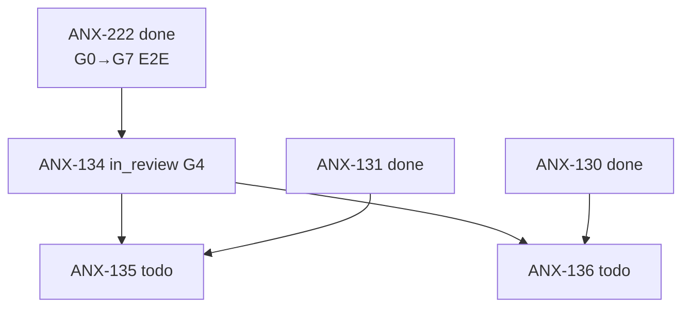

# Fila de delegação — índice

Pacotes de contexto preparados para issues **não claimáveis ainda**. Cada arquivo descreve escopo, dependências, persona e critérios de claim.

**Regra:** não mover para `in_progress` sem dependências resolvidas **e** autorização explícita do Owner quando indicado.

---

## Índice

| Issue | Título (resumo) | Status board | Persona | Crítico | Depende de | Quando claimar |
| --- | --- | --- | --- | --- | --- | --- |
| [ANX-134](./ANX-134.md) | Identity: lifecycle + deps application | `in_review` G1–G3 PASS | `backend-executor` | `backend-critic` | **ANX-222** `done` | **G1–G3 PASS** (de7ca50); G4–G7 pendente — ver [DEV-KICKOFF.md](./DEV-KICKOFF.md) |
| [ANX-135](./ANX-135.md) | Organizations: onboarding + memberships | `todo` | `backend-executor` | `backend-critic` | **ANX-134** `done`; **ANX-131** G7 | Após ANX-134 `done` + RLS multi-tenant (ANX-131) aceito |
| [ANX-136](./ANX-136.md) | Governance: autoridade temporal + break-glass | `todo` | `backend-executor` | `backend-critic` | **ANX-134** `done`; **ANX-130** G7 | Após ANX-134 `done` + outbox/inbox (ANX-130) aceito |

---

## Cadeia de dependências

---

## Como usar

1. Verificar board: `npm run taskboard:ensure` + `node scripts/taskboard.mjs get ANX-N`
2. Confirmar dependências na tabela acima e no pacote da issue
3. Ler pacote completo (`ANX-NNN.md`) — escopo, oráculos, handoff
4. Claim só quando **todas** as linhas "Quando claimar" estiverem satisfeitas
5. G0: pacote de contexto na issue + `npm run orchestration:session -- start --persona <slug> --issue ANX-N`
6. Primeiro broadcast: `ack` com evidência ([INTERACTIONS.md](../INTERACTIONS.md))

---

## Relacionados

- [DELEGATION.md](../DELEGATION.md) — política de delegação
- [DELEGATION-PACKAGE-ANX-222.md](../DELEGATION-PACKAGE-ANX-222.md) — issue ativa na cadeia
- [GOAL-STATUS.md](../GOAL-STATUS.md) — veredito do goal de orquestração
- [START-WORK.md](../START-WORK.md) — como iniciar trabalho real
