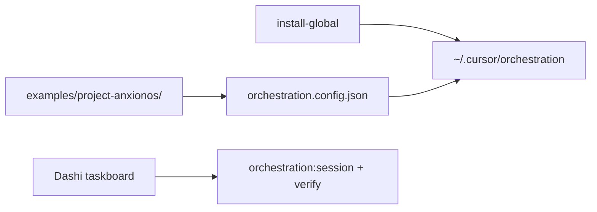

# Exemplo — instância anxionOS

Overlay **específico do projeto anxionOS** sobre o framework agnóstico Cursor. Não é copiado integralmente para `~/.cursor/orchestration` no `install-global` — apenas referenciado via `orchestration.config.json`.

## Como o anxionOS consome o framework agnóstico

| Camada | Onde vive | O que faz |
| --- | --- | --- |
| **Framework core** | `~/.cursor/orchestration` (global) ou `.cursor/orchestration/` (dev) | Personas, CLI, compliance G0–G7, workflows genéricos |
| **Config projeto** | [`.cursor/orchestration.config.json`](../../../orchestration.config.json) | Prefixo `ANX-*`, `codeRoots`, paths de runtime, roster overlay |
| **Overlay anxionOS** | Este diretório `examples/project-anxionos/` | Roster, delegation queue, CTO packages, greenlight, ativação equipe |
| **Regras workspace** | `.cursor/rules/*.mdc` | Enforcement local (taskboard, graphify, dialogue) |
| **Runtime** | `.cursor/orchestration-runtime/` (gitignored) | dialogue.jsonl, sessões, hire log — por workspace |

### Fluxo de bootstrap

1. `npm run orchestration:install-global` — publica framework em `~/.cursor/orchestration`
2. Config do repo aponta overlay e prefixo de issues
3. `npm run orchestration:verify` — 73/73 testes no workspace
4. Produto **BLOCKED** até [OWNER-GREENLIGHT.anxionos.md](./OWNER-GREENLIGHT.anxionos.md)
5. Pós-greenlight: [TEAM-ACTIVATION.md](./TEAM-ACTIVATION.md)

## Artefatos do overlay

| Artefato | Path |
| --- | --- |
| Roster | [roster.anxionos.json](./roster.anxionos.json) |
| Delegation queue | [delegation-queue/](./delegation-queue/) |
| CTO packages | [cto-packages/](./cto-packages/) |
| Greenlight produto | [OWNER-GREENLIGHT.anxionos.md](./OWNER-GREENLIGHT.anxionos.md) |
| Ativação equipe G0–G7 | [TEAM-ACTIVATION.md](./TEAM-ACTIVATION.md) |

Política global: [PROJECT-GREENLIGHT.md](../../PROJECT-GREENLIGHT.md) · status: [GOAL-STATUS.md](../../GOAL-STATUS.md)

**Última atualização:** 2026-09-09 · ANX-237
