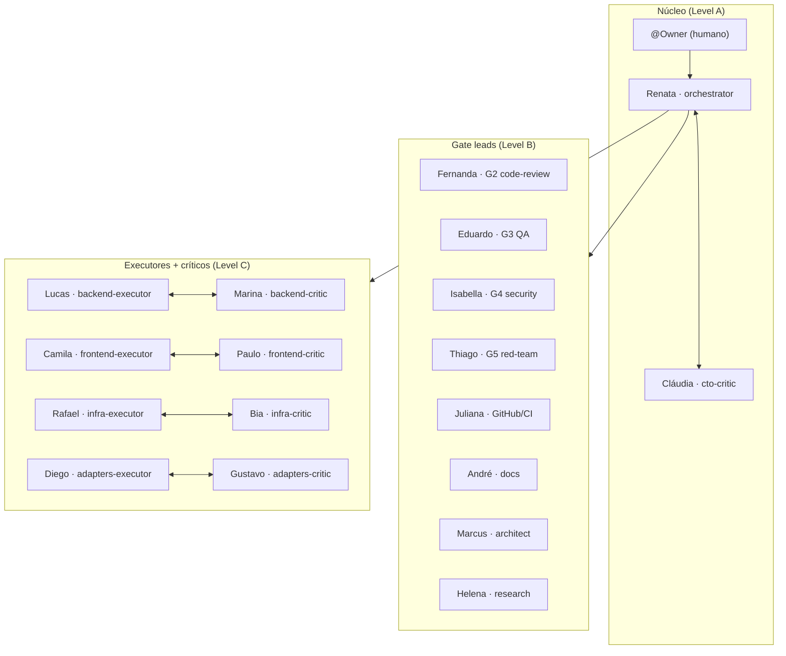
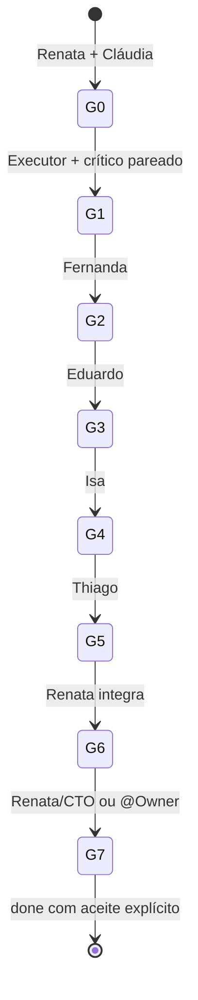

# Ativação da equipe anxionOS — pós-greenlight Owner

Guia **documental** para spawn da equipe completa quando o @Owner autorizar trabalho de **produto** anxionOS. Não executar código de produto antes do greenlight — ver [OWNER-GREENLIGHT.anxionos.md](./OWNER-GREENLIGHT.anxionos.md).

**Framework agnóstico:** personas, CLI e pipeline vivem em `~/.cursor/orchestration` (ou `.cursor/orchestration/` no repo). Este overlay em `examples/project-anxionos/` liga o framework ao projeto anxionOS.

---

## Pré-requisitos (G0)

| Check | Comando / artefato |
| --- | --- |
| Taskboard online | `npm run taskboard:ensure` |
| Framework verify | `npm run orchestration:verify` (esperado 73/73) |
| Greenlight Owner | Comentário explícito na issue — ver [OWNER-GREENLIGHT.anxionos.md](./OWNER-GREENLIGHT.anxionos.md) |
| Config projeto | [`.cursor/orchestration.config.json`](../../../orchestration.config.json) |
| Roster anxionOS | [roster.anxionos.json](./roster.anxionos.json) |
| Compliance pre-work | `npm run orchestration:compliance -- --pre-work --issue ANX-N --persona orchestrator` |

---

## Equipe — 18 personas



Lista completa: `npm run orchestration:personas` · [TEAM.md](../../TEAM.md) · [PERSONAS.md](../../PERSONAS.md).

---

## Pipeline G0→G7 com assignments



| Gate | Responsável | Guidelines / plugins |
| --- | --- | --- |
| **G0** Preparar | Renata + Cláudia | taskboard, compliance, pacote G0 `brain/`; ECC scan opcional (`agent-compatibility`) |
| **G1** Desenvolver | Executor + crítico 1:1 | **karpathy-guidelines** (todos); **ui-ux-pro-max** (Camila/Paulo); graphify + serena |
| **G2** Code review | Fernanda | karpathy + ECC `code-reviewer`, `typescript-reviewer` |
| **G3** QA | Eduardo | karpathy + ECC `e2e-runner`, `validation-review`; Chrome DevTools (frontend) |
| **G4** Security | Isa | karpathy + ECC `security-reviewer`, `mantis-threat-model` |
| **G5** Red Team | Thiago | karpathy + ECC adversarial `security-reviewer` |
| **G6** Integrar | Renata | Agregar pareceres; candidato integrado |
| **G7** Aceitar | Renata (rotina) / @Owner (exceção) | [CTO-ACCEPTANCE.md](../../CTO-ACCEPTANCE.md) |

Detalhes: [GUIDELINES-INTEGRATION.md](../../GUIDELINES-INTEGRATION.md) · [TOOLING-INTEGRATION.md](../../TOOLING-INTEGRATION.md).

---

## Como spawnar a equipe (Cursor Task)

### 1. Orquestrador inicia sessão

```bash
npm run orchestration:session -- start --persona orchestrator --issue ANX-N
npm run orchestration:broadcast -- --from-persona orchestrator --type ack --issue ANX-N \
  --body "@Owner greenlight recebido — ativando equipe G0→G7." \
  --evidence "file:examples/project-anxionos/OWNER-GREENLIGHT.anxionos.md"
```

### 2. Claim da issue de produto

```bash
npm run taskboard:ensure
node scripts/taskboard.mjs move ANX-N in_progress
```

### 3. Despacho Level C (executor + crítico)

| Domínio | Executor (Task) | Crítico (Task) |
| --- | --- | --- |
| Backend | `generalPurpose` (Lucas) | `critic-reviewer` (Marina) |
| Frontend | `generalPurpose` (Camila) | `critic-reviewer` (Paulo) |
| Infra | `generalPurpose` (Rafael) | `critic-reviewer` (Bia) |
| Adapters | `generalPurpose` (Diego) | `critic-reviewer` (Gustavo) |

Incluir: Read AGENTS.md, graphify, [SUBAGENT-PROMPT-TOOLING.md](../../templates/SUBAGENT-PROMPT-TOOLING.md).

### 4. Despacho gates G2–G5 (após G1 PASS)

| Gate | subagent_type |
| --- | --- |
| G2 | `code-reviewer` |
| G3 | `e2e-runner` ou `validation-review` |
| G4 | `security-review` |
| G5 | `security-review` (adversarial) |

### 5. Standup e progresso

```bash
npm run orchestration:standup -- --issue ANX-N --post
npm run orchestration:progress -- --issue ANX-N
npm run orchestration:chat -- --issue ANX-N
```

---

## Integração karpathy / ECC / ui-ux por gate

| Gate | karpathy-guidelines | ECC | ui-ux-pro-max |
| --- | --- | --- | --- |
| G0 | Escopo fechado, plano com verify | Scan opcional (baseline 43/100) | — |
| G1 backend | Diff cirúrgico | critic-reviewer | — |
| G1 frontend | Islands mínimas | critic-reviewer, a11y-architect | Obrigatório |
| G2–G5 | Evidência rastreável | Subagentes por gate | G3 frontend only |
| G6–G7 | Sem promessas sem prova | — | — |

Diagramas: [VISUAL-DOCUMENTATION.md](../../VISUAL-DOCUMENTATION.md).

---

## Delegation queue

| Issue | Path |
| --- | --- |
| ANX-134 | [delegation-queue/ANX-134.md](./delegation-queue/ANX-134.md) |
| ANX-135 | [delegation-queue/ANX-135.md](./delegation-queue/ANX-135.md) |
| ANX-136 | [delegation-queue/ANX-136.md](./delegation-queue/ANX-136.md) |

Kickoff: [delegation-queue/DEV-KICKOFF.md](./delegation-queue/DEV-KICKOFF.md).

---

## Bloqueios sem greenlight

- `backend/`, `frontend/`, docs públicas de produto
- Claim de slice sem autorização Owner

Framework (ANX-237) permanece ALLOWED — [PROJECT-GREENLIGHT.md](../../PROJECT-GREENLIGHT.md).

---

**Última atualização:** 2026-09-09 · ANX-237
