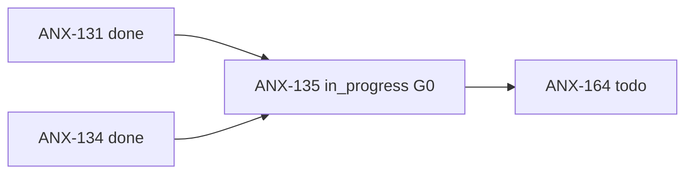
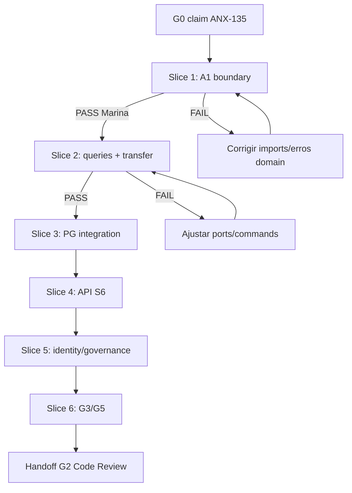

# Fila de delegação — ANX-135

**Status board:** `in_progress` (G0 claim 2026-09-09)  
**Preparado por:** Renata Oliveira (orchestrator)  
**Claim:** thread `cursor-anx135-20260909` · version 8

---

## Resumo

| Campo | Valor |
| --- | --- |
| **Issue** | ANX-135 — Organizations: concluir onboarding, memberships e integração |
| **Owner persona** | Lucas Mendes · `backend-executor` |
| **Crítico 1:1** | Marina Ferreira · `backend-critic` |
| **Gate atual** | G1 completo (slices 1-6 ✅ PASS) → handoff G2 |
| **Prioridade** | medium |
| **Labels** | `continuation`, `anx126` |
| **Capability** | `org-onboarding` |
| **Módulo** | `backend/modules/organizations` |

---

## Dependências

| Tipo | Issue | Estado |
| --- | --- | --- |
| **blockedBy** | ANX-131 | `done` — RLS multi-tenant |
| **blockedBy** | ANX-134 | `done` — identity lifecycle |
| **blocks** | ANX-164 | Owner Console P07 |



---

## Estado do código (revalidação 2026-09-09)

| Área | Estado | Evidência |
| --- | --- | --- |
| Contratos `@anxionos/contracts/organizations` | ✅ | types, commands, events, errors |
| Schema PG + migrations | ✅ | `infrastructure/persistence/schema.ts`, migrate |
| Domain entities/ports | ✅ | agency, owner, membership + 8 ports |
| Comandos application | ✅ parcial | create-agency, invite, activate, revoke, accept-invite, update-markets, advance-onboarding |
| Queries application | ✅ Slice 2 | get-agency-by-id, list-agencies-for-principal, list-memberships-by-agency, get-membership |
| Transfer ownership | ✅ Slice 2 | transfer-ownership.ts; ORG_OWNER_REQUIRED; Marina PASS 2026-09-09 |
| Erro repository em application | ✅ | `MembershipRevisionConflictError` em `domain/errors/`; A1 revalidado Slice 1 |
| API HTTP (`apps/api/src/organizations`) | ✅ Slice 4 | plugin `/v1/organizations`, middleware scope/idempotency, bootstrap wired |
| Bootstrap API | ✅ Slice 5 | eventing → identity → organizations → governance; fail-fast pepper; consumers NATS |
| Testes unitários | ✅ 48 pass org + 5 governance | `bun test tests/organizations` + `tests/governance/organizations-membership-consumer` |
| Integração identity/governance | ✅ Slice 5 | `createIdentityPrincipalLookup` real; consumer `governance:organizations:v1` em apps/api |
| Integração UoW P-R5-06 | ✅ | `integration/uow-journal-outbox.test.ts` 2/2 com RUN_PG_INTEGRATION_TESTS=true |
| Matriz G3/G5 | ✅ Slice 6 | G3-01..10, G5-01..04 PASS (`g3-g5-oracles.test.ts` + fixture) |
| Hierarquia Organization/Department | ⏸ defer | D-ORG-043 fora v1 (matriz §6.13) |

---

## Pacote G0 — contexto

| Campo | Valor |
| --- | --- |
| **Fonte** | `docs/orchestration/module-contract-matrix-23.md` §6.13 |
| **Status decisório** | draft (matriz); ADR0002 accepted |
| **Capability** | `org-onboarding` |
| **Owner módulo** | `organizations` |
| **Camadas** | application → ports; infra → repos/UoW/adapters; apps/api → composition |
| **Storage** | PostgreSQL `organizations_*` autoritativo; journal+outbox via `@anxionos/eventing` |
| **Eventos** | `agency.*`, `membership.*` v1 (`organization-events.ts`) |
| **Integração** | identity `PrincipalLookup` (ANX-134 done); governance consumer membership |
| **Oráculos** | convite concorrente + membership; G3-01..10; G5-01..04 |

### Arquivos previstos (delta)

- `backend/modules/organizations/src/application/queries/*.ts` (4 queries R09)
- `backend/modules/organizations/src/application/commands/transfer-ownership.ts`
- `backend/apps/api/src/organizations/{plugin,middleware,handlers}/*.ts`
- `backend/tests/organizations/integration/uow-journal-outbox.test.ts`
- `backend/tests/fixtures/orgs-two-agencies.json`

---

## Slices (6 — delta R09, não repetir S1–S5 aceitos)

| # | Slice | Escopo | Aceite / oráculo |
| --- | --- | --- | --- |
| **1** ✅ | A1 + domain errors | Revalidar boundary application; confirmar erro em domain; sem import infra/ORM em application | `bun test tests/organizations/application-boundary.test.ts` verde (9/9) · Marina PASS 2026-09-09 |
| **2** ✅ | Queries + transfer ownership | 4 queries R09; `TransferOwnership` com invariante `ORG_OWNER_REQUIRED` | `bun test tests/organizations` 28/28 verde (+10) · Marina PASS 2026-09-09 |
| **3** ✅ | Integração PG P-R5-06 | UoW journal+outbox mesma TX; fixture isolada | `integration/uow-journal-outbox.test.ts` 2/2 · Marina PASS 2026-09-09 |
| **4** ✅ | API S6 + bootstrap | Plugin `/v1/organizations`, middleware scope, idempotency, `ensureOrganizationsSchema` no startup | rotas R04 montadas; fail-fast pepper · Marina PASS 2026-09-09 |
| **5** ✅ | Identity/governance wiring | `IdentityPrincipalLookup` real; consumer governance membership parity | integração identity lookup; eventos consumidos · Marina PASS 2026-09-09 |
| **6** ✅ | G3/G5 oracles | Executar G3-01..10, G5-01..04 com fixture `orgs-two-agencies.json` | 15/15 oracles PASS · Marina PASS 2026-09-09 |

---

## Árvore de decisão G1



---

## Pré-leitura obrigatória

| Documento | Uso |
| --- | --- |
| `brain/notes/anxionos-backend-structure.md` | Owner `organizations` |
| `brain/project-docs/decisions/0002-adopt-modular-backend-layout.md` | ADR0002 |
| `brain/project-docs/specs/001-institutional-contract/spec.md` | Multi-tenant institucional |
| `brain/notes/anxionos-storage-ownership.md` | PostgreSQL autoritativo |
| `docs/orchestration/modules/organizations/R09-dev-plan.md` | Plano 6 slices baseline |
| `docs/orchestration/module-contract-matrix-23.md` §6.13 | D-ORG-001..044 |

---

## Oráculos

```bash
npm run taskboard:ensure
graphify query "organizations module backend"
bun test tests/organizations
# Slice 6: matriz G3-01..10, G5-01..04 (R09-dev-plan.md)
```

---

## Handoff G0 → G1

1. ✅ Claim `in_progress` thread `cursor-anx135-20260909`
2. ✅ Compliance pre-work PASS (orchestrator + cto-critic)
3. ✅ Sessões: orchestrator, cto-critic, backend-executor, backend-critic
4. → Lucas: iniciar **Slice 1** com Marina em pareamento Level C
5. Marina: revisar boundary + plano antes de código em Slice 2+

**Referência:** [DELEGATION.md](../DELEGATION.md) · [ANX-134](./ANX-134.md)
