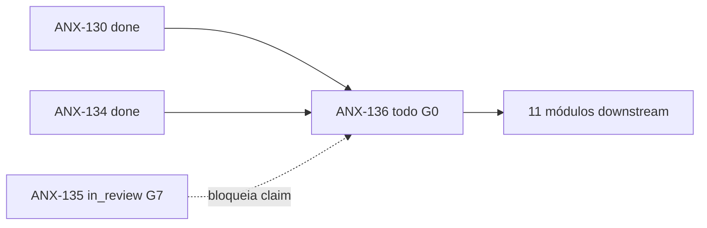
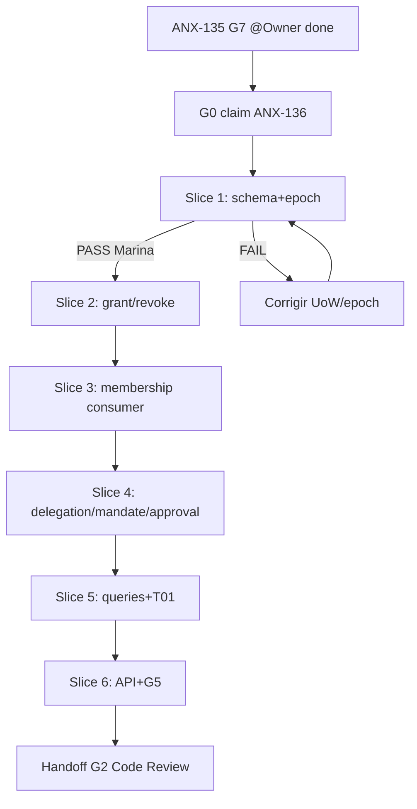

# Fila de delegação — ANX-136

**Status board:** `todo` (G0 **~98%** — baseline verde 2026-09-09T18:45Z)  
**Preparado por:** Renata Oliveira (orchestrator)  
**Não claimar** sem G7 @Owner em ANX-135 (`done` explícito).

---

## Resumo

| Campo | Valor |
| --- | --- |
| **Issue** | ANX-136 — Governance: autoridade temporal, aprovação e break-glass |
| **Owner persona** | Lucas Mendes · `backend-executor` |
| **Crítico 1:1** | Marina Ferreira · `backend-critic` |
| **Gate inicial** | G0 (preparado) → G1 após ANX-135 G7 |
| **Prioridade** | medium |
| **Labels** | `continuation`, `anx126` |
| **Capability** | `grant-mandate` |
| **Módulo** | `backend/modules/governance` |

---

## Dependências

| Tipo | Issue | Estado |
| --- | --- | --- |
| **blockedBy** | ANX-130 | `done` — outbox/inbox durável |
| **blockedBy** | ANX-134 | `done` — identity lifecycle |
| **gate externo** | ANX-135 | `in_review` — G7 @Owner pendente |
| **blocks** | ANX-137, ANX-138, ANX-139, ANX-140, ANX-141, ANX-148, ANX-150, ANX-157, ANX-158, ANX-168, ANX-171 | cadeia P03+ |



---

## Estado do código (revalidação 2026-09-09)

| Área | Estado | Evidência |
| --- | --- | --- |
| Schema PG + migrations | ✅ parcial | `infrastructure/persistence/schema.ts`, 0000/0001 |
| Domain entities | ✅ parcial | grant, approval, change-proposal |
| IssueGrant / RevokeGrant | ✅ parcial | commands presentes; corrida não verificada |
| Consumer membership | ✅ parcial | `organizations-membership-consumer.ts` |
| CreateDelegation / Mandate | ⏳ delta | schemas contratuais; command não demonstrado |
| Approval expiry / break-glass | ⏳ delta | escopo ANX-136 |
| TraversalEvaluator adapter | ✅ parcial | graph-t01 adapter; T01 real pendente ANX-138 |
| API REST grants | ⏳ não verificado | R09 S6 |
| Testes baseline G0 | ✅ **23/23 pass** | `tests/governance/*.test.ts` (2026-09-09T18:45Z) |
| Testes contracts governance | ⚠️ doc drift | `governance-contracts.test.ts` **não existe** no repo |
| Oráculos slice 2–5 | ⏳ delta G1 | `grant-commands`, `t01-traversal-evaluator`, `delegation-mandate-breakglass` ausentes (escopo slices) |
| Kill switch | ⏸ fora escopo | owner `risk` (ANX-150) |

---

## Evidência G0 — baseline + brain (2026-09-09T18:45Z)

**Executor:** orquestração goal thread (~98%) · **sem claim** ANX-136.

### Consulta brain/ (OpenKnowledge MCP)

| Path | Uso G0 |
| --- | --- |
| `brain/index.md` | Índice OKF; confirma specs de produto e estrutura backend |
| `brain/project-docs/specs/001-institutional-contract/spec.md` | SDD P02 grants/epochs; leis GK03 revogação entre leitura e efeito |
| `brain/project-docs/specs/004-institutional-evolution/spec.md` | ChangeProposal/aprovação; governance owner de grants/aprovações |
| `brain/notes/anxionos-backend-structure.md` | Owner `governance` — grants, delegação, mandatos e aprovações (accepted) |
| `brain/notes/anxionos-storage-ownership.md` | PostgreSQL autoritativo para `governance_*` (pré-leitura) |
| `brain/project-docs/decisions/0002-adopt-modular-backend-layout.md` | ADR0002 layout modular (pré-leitura) |

### Baseline tests (`cd backend && bun test tests/governance`)

| Arquivo | Pass | Fail | Oráculo |
| --- | ---: | ---: | --- |
| `issue-grant.test.ts` | 3 | 0 | G3-GOV-01 |
| `revoke-grant.test.ts` | 3 | 0 | G3-GOV-01 |
| `organizations-membership-consumer.test.ts` | 12 | 0 | G3-GOV-03 |
| `resolve-approval.test.ts` | 3 | 0 | change-proposal |
| `submit-change-proposal.test.ts` | 2 | 0 | change-proposal |
| **Total** | **23** | **0** | 46 expect() · 239 ms |

**Comando:** `cd backend && bun test tests/governance` · exit **0**.

### Arquivos referenciados nos oráculos mas ausentes (delta G1 — não bloqueiam G0)

| Arquivo | Oráculo | Nota |
| --- | --- | --- |
| `tests/contracts/governance-contracts.test.ts` | oráculo geral | doc drift — usar `tests/contracts/smoke.test.ts` et al. para contracts genéricos |
| `tests/governance/grant-commands.test.ts` | G3-GOV-02 | criar no Slice 2 |
| `tests/governance/delegation-mandate-breakglass.test.ts` | G3-GOV-04 | criar no Slice 4 |
| `tests/governance/t01-traversal-evaluator.test.ts` | G3-GOV-05 | criar no Slice 5 (T01 real ANX-138) |

### Bloqueio remanescente

| Bloqueador | Status |
| --- | --- |
| **ANX-135 G7 @Owner** | `in_review` — claim ANX-136 proibido até `done` explícito |
| Slices 2–6 delta | Escopo G1+; baseline existente verde |

---

## Pacote G0 — contexto

| Campo | Valor |
| --- | --- |
| **Fonte** | `docs/orchestration/module-contract-matrix-23.md` §6.14 + §6.14.1 |
| **Status decisório** | draft (matriz); ADR0002 accepted |
| **Capability** | `grant-mandate` |
| **Owner módulo** | `governance` |
| **Camadas** | application → ports; infra → repos/UoW/adapters; apps compõem |
| **Storage** | PostgreSQL `governance_*` autoritativo; journal+outbox via `@anxionos/eventing` |
| **Eventos** | `grant.*`, `approval.*`, `mandate.*` v1 (`governance-events.ts`) |
| **Integração** | identity PrincipalLookup (ANX-134); organizations membership (ANX-135); graph T01 (ANX-138) |
| **Oráculos** | revogação entre consulta e efeito; G3-GOV-01..05 |

### Arquivos previstos (delta)

- `backend/modules/governance/src/application/commands/create-delegation.ts`
- `backend/modules/governance/src/application/commands/issue-mandate.ts`
- `backend/modules/governance/src/application/commands/activate-break-glass.ts`
- `backend/modules/governance/src/application/queries/list-effective-grants.ts`
- `backend/modules/governance/src/application/queries/get-authority-epoch.ts`
- `backend/tests/governance/delegation-mandate-breakglass.test.ts`
- `backend/apps/api/src/governance/` (rotas S6, se aplicável)

---

## Slices (6 — delta R09)

| # | Slice | Escopo | Aceite / oráculo |
| --- | --- | --- | --- |
| **1** | Schema + epoch + UoW | Revalidar PG schema, journal+outbox atômicos, AuthorityEpochStore | schema/epoch tests verdes |
| **2** | IssueGrant / RevokeGrant | Idempotência, GK03 epoch bump, revogação entre leitura e efeito | G3-GOV-01, G3-GOV-02 |
| **3** | Consumer membership | activated→grant baseline; revoked→close grants; inbox atômico | G3-GOV-03 |
| **4** | Delegation + Mandate + Approval | CreateDelegation (409 se excede parent), mandate lifecycle, approval expiry | G3-GOV-04 + change-proposal |
| **5** | Queries + TraversalEvaluator | ListEffectiveGrants, GetAuthorityEpoch; adapter T01 fail-closed | G3-GOV-05 |
| **6** | API + G5 | REST grants/change-proposals, AR01 boundary | HTTP + boundary tests |

---

## Árvore de decisão G0→G1



---

## Pré-leitura obrigatória

| Documento | Uso |
| --- | --- |
| `brain/project-docs/specs/001-institutional-contract/spec.md` | Contrato institucional |
| `brain/project-docs/specs/004-institutional-evolution/spec.md` | Evolução e governança |
| `brain/notes/anxionos-backend-structure.md` | Owner `governance` |
| `brain/notes/anxionos-storage-ownership.md` | PostgreSQL autoritativo |
| `brain/project-docs/decisions/0002-adopt-modular-backend-layout.md` | ADR0002 |
| `docs/orchestration/modules/governance/R09-dev-plan.md` | Plano 6 slices |
| `docs/orchestration/modules/governance/R10-g0-handoff.md` | PC-G0-01..10 |
| `docs/orchestration/module-contract-matrix-23.md` §6.14 | D-GOV-001..010 |

---

## Oráculos

```bash
npm run taskboard:ensure
graphify query "governance grants delegation epoch break-glass"
cd backend && bun test tests/governance
cd backend && bun test tests/contracts/governance-contracts.test.ts
cd backend && bun test tests/governance/t01-traversal-evaluator.test.ts
npm run orchestration:who -- --persona backend-executor --can-i "implement governance"
```

| Oráculo | Arquivo de teste | Slice |
| --- | --- | --- |
| G3-GOV-01 | `backend/tests/governance/issue-grant.test.ts + revoke-grant.test.ts` | 2 |
| G3-GOV-02 | `backend/tests/governance/grant-commands.test.ts` + epoch store | 2 |
| G3-GOV-03 | `backend/tests/governance/organizations-membership-consumer.test.ts` | 3 |
| G3-GOV-04 | `backend/tests/governance/delegation-mandate-breakglass.test.ts` (criar) | 4 |
| G3-GOV-05 | `backend/tests/governance/t01-traversal-evaluator.test.ts` | 5 |

---

## Handoff G0 → G1

1. ⏳ Aguardar ANX-135 G7 @Owner (`done` explícito)
2. → Claim `in_progress` com thread binding novo
3. → Compliance pre-work PASS (executor + crítico)
4. → Sessões: backend-executor + backend-critic
5. → Lucas: iniciar **Slice 1** com Marina em pareamento Level C
6. Marina: revisar boundary + plano antes de código em Slice 2+
7. G4 (Isa) e G5 (Thiago) proporcionais — break-glass é superfície de ataque

**Referência:** [ANX-135](./ANX-135.md) · [PIPELINE.md](../PIPELINE.md)
