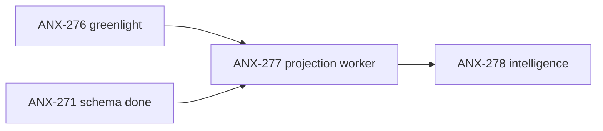

# Fila de delegação — ANX-277

**Status board:** `backlog` (aguarda ANX-276 Owner greenlight)  
**Preparado por:** Renata Oliveira (orchestrator)  
**Pronto para claim:** após comentário Owner em ANX-276

**Contexto:** Pacote de delegação para subagentes Cursor quando ANX-276 for aceito. Referencia `governance-projector.ts` e `governance-projection-worker.ts` como padrão inbox/Neo4j. Eventos v1 em `backend/packages/contracts/src/graph/events/`. Instrução do goal: implementar AI Product Company Engine após documentação aprovada.

---

## Resumo

| Campo | Valor |
| --- | --- |
| **Issue** | ANX-277 — Neo4j Product Graph projection worker (sandbox) |
| **Owner persona** | Lucas Mendes · `backend-executor` |
| **Crítico 1:1** | Marina Ferreira · `backend-critic` |
| **Gate atual** | G0 (bloqueado greenlight) → G1 → G2 → G3 |
| **Módulo** | `backend/modules/graph` |
| **Capability** | Product/Agent Graph projection (ADR0005 P3) |

---

## Dependências

| Tipo | Issue | Estado |
| --- | --- | --- |
| **blockedBy** | ANX-276 | `todo` — Owner greenlight ADR0005 + spec 006 |
| **blockedBy** | ANX-271 | `done` — schema registry |
| **blocks** | ANX-278 | Product Intelligence runtime |



---

## Fontes canônicas (ler antes de codar)

| Doc | Path |
| --- | --- |
| Design P2 | `brain/project-docs/specs/006-product-agent-graph/projection-worker-p2-design.md` |
| Critérios aceite | `brain/notes/anxionos-p2-slices-acceptance-criteria.md` |
| ADR0005 | `brain/project-docs/decisions/0005-product-graph-neo4j-projection.md` |
| Spec 006 | `brain/project-docs/specs/006-product-agent-graph/spec.md` |
| Referência código | `governance-projector.ts`, `governance-projection-worker.ts` |

---

## Escopo implementação (pós-greenlight)

### Arquivos novos

| Arquivo | Referência |
| --- | --- |
| `backend/modules/graph/src/application/projections/product/product-graph-projector.ts` | `governance-projector.ts` |
| `backend/modules/graph/src/application/projections/agents/agent-graph-projector.ts` | `organizations-projector.ts` |
| `backend/apps/workers/src/graph/product-graph-projection-worker.ts` | `governance-projection-worker.ts` |
| `backend/packages/contracts/src/graph/events/` | eventos v1 Zod |
| `backend/tests/graph/product-graph-projector.test.ts` | inbox idempotency |

### Constantes

```typescript
GRAPH_PRODUCT_CONSUMER_NAME = "graph:product:v1"
GRAPH_AGENTS_CONSUMER_NAME = "graph:agents:v1"
```

### Eventos v1

| Evento | Nó projetado |
| --- | --- |
| `work_item.status_changed` | WorkItem + TRACKED_IN |
| `decision.recorded` | Decision + APPROVED |
| `agent.role_assigned` | AgentRole + ASSIGNED_TO |

### Env / sandbox

- `ENABLE_PRODUCT_GRAPH_PROJECTION=true` em `backend/.env.example`
- Docker profile `graph-sandbox` para Neo4j local

---

## Critérios de aceite (todos obrigatórios)

- [ ] Sandbox Neo4j sobe via docker profile `graph-sandbox`
- [ ] 1 evento → 1 nó idempotente (reprocess não duplica)
- [ ] Rebuild from inbox passa
- [ ] Labels `ProductGraph_*` / `AgentGraph_*` separados do institucional
- [ ] `bun test backend/tests/graph` green
- [ ] G2 Fernanda PASS
- [ ] Zero escrita direta sem evento versionado

---

## Sequência G0–G3

```bash
npm run taskboard:ensure
npm run orchestration:compliance -- --pre-work --issue ANX-277 --persona backend-executor
npm run orchestration:session -- start --persona backend-executor --issue ANX-277
npm run orchestration:broadcast -- --from-persona backend-executor --type ack --issue ANX-277 --body "..."
# implementar → bun test → Marina PASS → G2 dispatch
```

---

## Proibido sem greenlight

- Claim ANX-277 antes de Owner comentar em ANX-276
- Código em `backend/` sem ADR0005 `decision_status: accepted`
- Mocks em caminhos de produção
