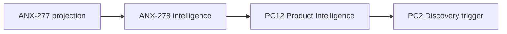

# Fila de delegação — ANX-278

**Contexto goal:** Implementar AI Product Company Engine após doc aprovada. Runtime PC12 `FEEDS_BACK` edge no Product Graph; consumers: orchestration phase hooks + graph projection. Schema: edge `FEEDS_BACK` em `product-graph-schema.ts`. API: eventos graph module, não HTTP novo.

**Status board:** `backlog` (aguarda ANX-277 done)  
**Preparado por:** Renata Oliveira (orchestrator)

---

## Resumo

| Campo | Valor |
| --- | --- |
| **Issue** | ANX-278 — Product Intelligence runtime FEEDS_BACK |
| **Owner persona** | Lucas Mendes · `backend-executor` |
| **Crítico 1:1** | Marina Ferreira · `backend-critic` |
| **Gate atual** | G3 (após ANX-277 G2) |
| **Módulo** | `backend/modules/graph` + orchestration hooks |

---

## Dependências

| Tipo | Issue | Estado |
| --- | --- | --- |
| **blockedBy** | ANX-277 | `backlog` |
| **blockedBy** | ANX-276 | `todo` — Owner greenlight |

---

## Fontes canônicas

| Doc | Path |
| --- | --- |
| Intelligence loop | `brain/notes/anxionos-product-intelligence-loop.md` |
| Critérios | `brain/notes/anxionos-p2-slices-acceptance-criteria.md` |
| Spec 006 | `brain/project-docs/specs/006-product-agent-graph/spec.md` |

---

## Critérios de aceite

- [ ] Edge `FEEDS_BACK` projetado via evento versionado
- [ ] 1 ciclo sandbox: métrica → insight → Discovery trigger
- [ ] Doc runtime em `brain/notes/anxionos-product-intelligence-loop.md`
- [ ] G3 Edu PASS

---

## Proibido

- Claim antes de ANX-277 done
- Mocks em produção
