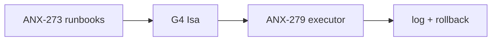

# Fila de delegação — ANX-279

**Contexto goal:** Self-healing runbook executor staging. Consumers: orchestration CLI + dialogue. Sem API HTTP nova; executa runbooks P1 de `brain/notes/anxionos-self-healing-runbooks.md`. Schema: logs estruturados observability.

**Status board:** `backlog` (aguarda G4 Isa)  
**Preparado por:** Renata Oliveira (orchestrator)

---

## Resumo

| Campo | Valor |
| --- | --- |
| **Issue** | ANX-279 — Self-healing runbook executor (staging) |
| **Owner persona** | Rafael Costa · `infra-executor` |
| **Crítico 1:1** | Beatriz Lima · `infra-critic` |
| **Gate atual** | G4 Isa → G3 |
| **Módulo** | orchestration runtime + staging |

---

## Dependências

| Tipo | Issue | Estado |
| --- | --- | --- |
| **blockedBy** | ANX-273 | `done` |
| **blockedBy** | ANX-276 | `todo` |
| **requires** | G4 Isa | Security review |

---

## Fontes canônicas

| Doc | Path |
| --- | --- |
| Runbooks | `brain/notes/anxionos-self-healing-runbooks.md` |
| Framework | `.cursor/orchestration/SELF-HEALING-RUNBOOKS.md` |
| Critérios | `brain/notes/anxionos-p2-slices-acceptance-criteria.md` |

---

## Critérios de aceite

- [ ] G4 Isa PASS antes de ativar
- [ ] 1 runbook P1 em staging com evidência
- [ ] Rollback documentado
- [ ] G3 Edu PASS

---

## Proibido

- Produção sem autorização
- Claim antes de G4 Isa
